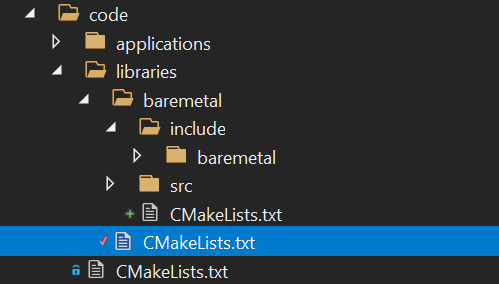

# First application - using the console - UART1

Now that we have set up our project structure, integrated with Visual Studio, and are able to configure, build, run and debug our projects, let's start some actual development.

This will again be a length story, as we will have to lay quite some groundwork.

One of the simplest things to start with is the serial console. This is also practical, as using the serial console enables us to write output from the application, and also get input.

There are two serial consoles possible, UART0 and UART1, which can be used in parallel, however it is most common to use one of the two, as they normally use the same GPIO pins (14 and 15).
See also [here](setting-up-for-development.md###Attaching-a-serial-console). For this application, we will use UART1, which is the easiest to set up. It has less functionality, but for a simple serial console both are equally suitable.

## Creating the baremetal library structure

We will first start to create a library named baremetal, which will contain all our basic functionality.

In `code/libraries`, there is a `CMakeLists.txt` file, that currently only holds the following contents:

```cmake
message(STATUS "\n**********************************************************************************\n")
message(STATUS "\n## In directory: ${CMAKE_CURRENT_SOURCE_DIR}")

```

- We will create a new folder underneath `code/libraries` named baremetal. 
- We will add subdirectories underneath named `include` and `src`, which will hold header (.h) files and source files (.cpp) respectively. 
- Underneath code/libraries/baremetal/include we will create another directory named baremetal again. The reason for this will be explained shortly.
- We will create a new `CMakeLists.txt` file in `code/libraries/baremetal` with the following contents:

```cmake
message(STATUS "\n**********************************************************************************\n")
message(STATUS "\n## In directory: ${CMAKE_CURRENT_SOURCE_DIR}")

```

Note that all this can be done from within Visual Studio, of if desired directly on the command line, whatever you prefer.

The file `code/libraries/CMakeLists.txt` will be extended to include our new folder `code/libraries/baremetal`:

```cmake
message(STATUS "\n**********************************************************************************\n")
message(STATUS "\n## In directory: ${CMAKE_CURRENT_SOURCE_DIR}")

add_subdirectory(baremetal)
```

The resulting structure will look like this:



The reason for adding an extra directory with the same name as the library underneath `code/libraries/baremetal/include` is the following.
It is common practice to export the directory containing the header files to applications, so they can include the header files.
If we would have two libraries, let's say `lib-one` and `lib-two`, which both define a header file `inc.h`, and we export `lib-one/include` as well as `lib-two/include` as directories, if the the application wanted to include `inc.h`:

```cpp
#include "inc.h"
```

Which one would it include? The answer is, it's undefined.

By adding an extra directory underneath, so `lib-one/include/lib-one`, and `lib-two/include/lib-two`, the application could include either:

```cpp
#include "lib-one/inc.h"
#include "lib-two/inc.h"
```

The name of the subirectory does not matter much, but clearly it is more readable in code to use the name of the library.

## Some groundwork

In order for CMake projects to work smoothly, it is convenient to do some groundwork for them.

### CMake function display_list

We will add a function to the `cmake/functions.cmake` file:

```cmake
# Converts a CMake list to a CMake string and displays this in a status message along with the text specified.
function(display_list text)
    set(list_str "")
    foreach(item ${ARGN})
        string(CONCAT list_str "${list_str} ${item}")
    endforeach()
    message(STATUS ${text} ${list_str})
endfunction()
```

This function prints a text followed by a list of values, separated by spaces. This can be used for single values, but also for a list of compiler definitions.

### CMake function show_target_properties

We will add a another function to the `cmake/functions.cmake` file:

```cmake
function(show_target_properties target)
    if (CMAKE_VERBOSE_MAKEFILE)
        message(STATUS "")
        message(STATUS "Properties for ${target}")

        get_target_property(TARGET_TYPE ${target} TYPE)
        display_list("Target type                       : " ${TARGET_TYPE})
        if (NOT TARGET_TYPE STREQUAL "INTERFACE_LIBRARY")
            get_target_property(DEFINES ${target} COMPILE_DEFINITIONS)
            display_list("Target defines                    : " ${DEFINES})
            get_target_property(OPTIONS ${target} COMPILE_OPTIONS)
            display_list("Target options                    : " ${OPTIONS})
        endif ()

        get_target_property(INCLUDES ${target} INTERFACE_INCLUDE_DIRECTORIES)
        display_list("Target include dirs public        : " ${INCLUDES})

        if (NOT TARGET_TYPE STREQUAL "INTERFACE_LIBRARY")
            get_target_property(INCLUDES ${target} INCLUDE_DIRECTORIES)
            display_list("Target include dirs private       : " ${INCLUDES})

            get_target_property(LIBRARIES ${target} LINK_LIBRARIES)
            display_list("Target link libraries             : " ${LIBRARIES})

            get_target_property(LINK_OPTIONS ${target} LINK_FLAGS)
            display_list("Target link options               : " ${LINK_OPTIONS})
        endif ()

        get_target_property(DEFINES_EXPORTS ${target} INTERFACE_COMPILE_DEFINITIONS)
        display_list("Target exported defines           : " ${DEFINES_EXPORTS})

        get_target_property(OPTIONS_EXPORTS ${target} INTERFACE_COMPILE_OPTIONS)
        display_list("Target exported options           : " ${OPTIONS_EXPORTS})

        get_target_property(INCLUDE_DIRS_EXPORTS ${target} INTERFACE_INCLUDE_DIRECTORIES)
        display_list("Target exported include dirs      : " ${INCLUDE_DIRS_EXPORTS})

        get_target_property(LIBRARIES_EXPORTS ${target} INTERFACE_LINK_LIBRARIES)
        display_list("Target exported link libraries    : " ${LIBRARIES_EXPORTS})

        get_test_property(IMPORT_DEPENDENCIES ${target} IMPORTED_LINK_DEPENDENT_LIBRARIES)
        display_list("Target imported dependencies      : " ${IMPORT_DEPENDENCIES})

        get_test_property(IMPORT_LIBRARIES ${target} IMPORTED_LINK_INTERFACE_LIBRARIES)
        display_list("Target imported link libraries    : " ${IMPORT_LIBRARIES})

        if (NOT TARGET_TYPE STREQUAL "INTERFACE_LIBRARY")
            get_target_property(LINK_DEPENDENCIES ${target} LINK_DEPENDS)
            display_list("Target link dependencies          : " ${LINK_DEPENDENCIES})

            get_target_property(EXPLICIT_DEPENDENCIES ${target} MANUALLY_ADDED_DEPENDENCIES)
            display_list("Target manual dependencies        : " ${EXPLICIT_DEPENDENCIES})
        endif ()

        if (NOT TARGET_TYPE STREQUAL "INTERFACE_LIBRARY")
            get_target_property(ARCHIVE_LOCATION ${target} ARCHIVE_OUTPUT_DIRECTORY)
            display_list("Target static library location    : " ${ARCHIVE_LOCATION})

            get_target_property(LIBRARY_LOCATION ${target} LIBRARY_OUTPUT_DIRECTORY)
            display_list("Target dynamic library location   : " ${LIBRARY_LOCATION})

            get_target_property(RUNTIME_LOCATION ${target} RUNTIME_OUTPUT_DIRECTORY)
            display_list("Target binary location            : " ${RUNTIME_LOCATION})

            get_target_property(TARGET_LINK_FLAGS ${target} LINK_FLAGS)
            display_list("Target link flags                 : " ${TARGET_LINK_FLAGS})

            get_target_property(TARGET_VERSION ${target} VERSION)
            display_list("Target version                    : " ${TARGET_VERSION})

            get_target_property(TARGET_SOVERSION ${target} SOVERSION)
            display_list("Target so-version                 : " ${TARGET_SOVERSION})

            get_target_property(TARGET_OUTPUT_NAME ${target} OUTPUT_NAME)
            display_list("Target output name                : " ${TARGET_OUTPUT_NAME})
        endif ()
    endif()
endfunction()
```

Without going into too much detail, this function prints for a specific target:

- the type of target (executable, library, interface library)
- compiler definitions and options
- include directories
- standard libraries to be linked to
- linker options
- interface library compiler definitions and options
- interface library include directories
- interface library standard libraries to be linked to
- imported dependencies
- imported libraries to be linked to
- dependencies
- output directories for static libraries, shared libraries, and executables
- linker options
- the target version
- the target so version in case of a shared library
- the target output name

### Common compiler directives

As most compiler definitions and compiler options will have some commonality, it is convenient to define these common parts in variables, and use them in out project configuration.

So we will update the main `CMakeLists.txt` file to set these variables. We will revisit this part a number of times.

Just before `add_subdirectory(code)` in the main CMake file, insert the following:

#### Common definitions and options

```cmake
    if (BAREMETAL_RPI_TARGET EQUAL 3)
        set(BAREMETAL_ARCH_CPU_OPTIONS -mcpu=cortex-a53 -mlittle-endian -mcmodel=small)
        set(BAREMETAL_TARGET_KERNEL kernel8)
    elseif (BAREMETAL_RPI_TARGET EQUAL 4)
        set(BAREMETAL_ARCH_CPU_OPTIONS -mcpu=cortex-a72 -mlittle-endian -mcmodel=small)
        set(BAREMETAL_TARGET_KERNEL kernel8-rpi4)
    else()
        message(FATAL_ERROR "Incorrect RPI target ${BAREMETAL_RPI_TARGET} specified, must be 3 or 4")
    endif()
    set(BAREMETAL_LOAD_ADDRESS 0x80000)

    set(DEFINES_C 
        PLATFORM_BAREMETAL
        RPI_TARGET=${BAREMETAL_RPI_TARGET}
        )
    set(DEFINES_C_DEBUG _DEBUG)
    set(DEFINES_C_RELEASE NDEBUG)
    set(DEFINES_C_MINSIZEREL NDEBUG)
    set(DEFINES_C_RELWITHDEBINFO NDEBUG)
    set(DEFINES_ASM
        PLATFORM_BAREMETAL
        RPI_TARGET=${BAREMETAL_RPI_TARGET}
        )

    set(FLAGS_C
        ${BAREMETAL_ARCH_CPU_OPTIONS}
        -Wall 
        -Wextra
        -Werror
        -Wno-parentheses
        -ffreestanding
        -fsigned-char
        -nostartfiles 
        -std=gnu99 
        -mno-outline-atomics
        -nostdinc 
        -nostdlib 
    )
    set(FLAGS_C_DEBUG -O0 -g -Wno-unused-variable -Wno-unused-parameter)
    set(FLAGS_C_RELEASE -O2 -D__USE_STRING_INLINES)
    set(FLAGS_C_MINSIZEREL -O3)
    set(FLAGS_C_RELWITHDEBINFO -O2 -g)

    set(FLAGS_CXX
        ${BAREMETAL_ARCH_CPU_OPTIONS}
        -Wall
        -Wextra
        -Werror
        -Wno-missing-field-initializers
        -Wno-unused-value
        -Wno-aligned-new
        -ffreestanding 
        -fsigned-char 
        -nostartfiles
        -mno-outline-atomics
        -nostdinc
        -nostdlib
        -nostdinc++
        -fno-exceptions
        -fno-rtti
        )

    set(FLAGS_CXX_DEBUG -O0 -g -Wno-unused-variable -Wno-unused-parameter)
    set(FLAGS_CXX_RELEASE -O2 -D__USE_STRING_INLINES)
    set(FLAGS_CXX_MINSIZEREL -O3)
    set(FLAGS_CXX_RELWITHDEBINFO -O2 -g)

    set(LINK_FLAGS
        -Wl,--section-start=.init=${BAREMETAL_LOAD_ADDRESS}
        -T ${CMAKE_SOURCE_DIR}/baremetal.ld
        -nostdlib
        -nostartfiles 
        )

    set(FLAGS_ASM ${BAREMETAL_ARCH_CPU_OPTIONS})
    set(FLAGS_ASM_DEBUG -O2)
    set(FLAGS_ASM_RELEASE -O2)
    set(FLAGS_ASM_MINSIZEREL -O2)
    set(FLAGS_ASM_RELWITHDEBINFO -O2)

    list(APPEND LINK_LIBRARIES )
    list(APPEND LINK_DIRECTORIES )

```

#### Compiler versions and standard supported

```cmake
    set(SUPPORTED_CPP_STANDARD 17)

    message(STATUS "C++ compiler version:    ${CMAKE_CXX_COMPILER_VERSION}")
    message(STATUS "C compiler version:      ${CMAKE_C_COMPILER_VERSION}")
    message(STATUS "C++ supported standard:  ${SUPPORTED_CPP_STANDARD}")
```

#### Mapping options for each build type

```cmake
    set(COMPILE_DEFINITIONS_C_DEBUG ${DEFINES_C} ${DEFINES_C_DEBUG})
    set(COMPILE_DEFINITIONS_C_RELEASE ${DEFINES_C} ${DEFINES_C_RELEASE})
    set(COMPILE_DEFINITIONS_C_MINSIZEREL ${DEFINES_C} ${DEFINES_C_MINSIZEREL})
    set(COMPILE_DEFINITIONS_C_RELWITHDEBINFO ${DEFINES_C} ${DEFINES_C_RELWITHDEBINFO})

    set(COMPILE_DEFINITIONS_ASM_DEBUG ${DEFINES_ASM} ${DEFINES_ASM_DEBUG})
    set(COMPILE_DEFINITIONS_ASM_RELEASE ${DEFINES_ASM} ${DEFINES_ASM_RELEASE})
    set(COMPILE_DEFINITIONS_ASM_MINSIZEREL ${DEFINES_ASM} ${DEFINES_ASM_MINSIZEREL})
    set(COMPILE_DEFINITIONS_ASM_RELWITHDEBINFO ${DEFINES_ASM} ${DEFINES_ASM_RELWITHDEBINFO})

    set(COMPILE_OPTIONS_C_DEBUG ${FLAGS_C} ${FLAGS_C_DEBUG})
    set(COMPILE_OPTIONS_C_RELEASE ${FLAGS_C} ${FLAGS_C_RELEASE})
    set(COMPILE_OPTIONS_C_MINSIZEREL ${FLAGS_C} ${FLAGS_C_MINSIZEREL})
    set(COMPILE_OPTIONS_C_RELWITHDEBINFO ${FLAGS_C} ${FLAGS_C_RELWITHDEBINFO})

    set(COMPILE_OPTIONS_CXX_DEBUG ${FLAGS_CXX} ${FLAGS_CXX_DEBUG})
    set(COMPILE_OPTIONS_CXX_RELEASE ${FLAGS_CXX} ${FLAGS_CXX_RELEASE})
    set(COMPILE_OPTIONS_CXX_MINSIZEREL ${FLAGS_CXX} ${FLAGS_CXX_MINSIZEREL})
    set(COMPILE_OPTIONS_CXX_RELWITHDEBINFO ${FLAGS_CXX} ${FLAGS_CXX_RELWITHDEBINFO})

    set(COMPILE_OPTIONS_ASM_DEBUG ${FLAGS_ASM} ${FLAGS_ASM_DEBUG})
    set(COMPILE_OPTIONS_ASM_RELEASE ${FLAGS_ASM} ${FLAGS_ASM_RELEASE})
    set(COMPILE_OPTIONS_ASM_MINSIZEREL ${FLAGS_ASM} ${FLAGS_ASM_MINSIZEREL})
    set(COMPILE_OPTIONS_ASM_RELWITHDEBINFO ${FLAGS_ASM} ${FLAGS_ASM_RELWITHDEBINFO})

    set(LINKER_OPTIONS_DEBUG ${LINK_FLAGS} ${LINK_FLAGS_DEBUG})
    set(LINKER_OPTIONS_RELEASE ${LINK_FLAGS} ${LINK_FLAGS_RELEASE})
    set(LINKER_OPTIONS_MINSIZEREL ${LINK_FLAGS} ${LINK_FLAGS_MINSIZEREL})
    set(LINKER_OPTIONS_RELWITHDEBINFO ${LINK_FLAGS} ${LINK_FLAGS_RELWITHDEBINFO})

    set(LINKER_LIBRARIES ${LINK_LIBRARIES})
```

#### Mapping options to the selected build type

```cmake
    if(${CMAKE_BUILD_TYPE} STREQUAL "Debug")
        set(COMPILE_DEFINITIONS_C ${COMPILE_DEFINITIONS_C_DEBUG})
        set(COMPILE_DEFINITIONS_ASM ${COMPILE_DEFINITIONS_ASM_DEBUG})
        set(COMPILE_OPTIONS_C ${COMPILE_OPTIONS_C_DEBUG})
        set(COMPILE_OPTIONS_CXX ${COMPILE_OPTIONS_CXX_DEBUG})
        set(COMPILE_OPTIONS_ASM ${COMPILE_OPTIONS_ASM_DEBUG})
        set(LINKER_OPTIONS ${LINKER_OPTIONS_DEBUG})
    elseif(${CMAKE_BUILD_TYPE} STREQUAL "Release")
        set(COMPILE_DEFINITIONS_C ${COMPILE_DEFINITIONS_C_RELEASE})
        set(COMPILE_DEFINITIONS_ASM ${COMPILE_DEFINITIONS_ASM_RELEASE})
        set(COMPILE_OPTIONS_C ${COMPILE_OPTIONS_C_RELEASE})
        set(COMPILE_OPTIONS_CXX ${COMPILE_OPTIONS_CXX_RELEASE})
        set(COMPILE_OPTIONS_ASM ${COMPILE_OPTIONS_ASM_RELEASE})
        set(LINKER_OPTIONS ${LINKER_OPTIONS_RELEASE})
    elseif(${CMAKE_BUILD_TYPE} STREQUAL "MinSizeRel")
        set(COMPILE_DEFINITIONS_C ${COMPILE_DEFINITIONS_C_MINSIZEREL})
        set(COMPILE_DEFINITIONS_ASM ${COMPILE_DEFINITIONS_ASM_MINSIZEREL})
        set(COMPILE_OPTIONS_C ${COMPILE_OPTIONS_C_MINSIZEREL})
        set(COMPILE_OPTIONS_CXX ${COMPILE_OPTIONS_CXX_MINSIZEREL})
        set(COMPILE_OPTIONS_ASM ${COMPILE_OPTIONS_ASM_MINSIZEREL})
        set(LINKER_OPTIONS ${LINKER_OPTIONS_MINSIZEREL})
    elseif(${CMAKE_BUILD_TYPE} STREQUAL "RelWithDebInfo")
        set(COMPILE_DEFINITIONS_C ${COMPILE_DEFINITIONS_C_RELWITHDEBINFO})
        set(COMPILE_DEFINITIONS_ASM ${COMPILE_DEFINITIONS_ASM_RELWITHDEBINFO})
        set(COMPILE_OPTIONS_C ${COMPILE_OPTIONS_C_RELWITHDEBINFO})
        set(COMPILE_OPTIONS_CXX ${COMPILE_OPTIONS_CXX_RELWITHDEBINFO})
        set(COMPILE_OPTIONS_ASM ${COMPILE_OPTIONS_ASM_RELWITHDEBINFO})
        set(LINKER_OPTIONS ${LINKER_OPTIONS_RELWITHDEBINFO})
    else()
        message(FATAL_ERROR "Invalid build type: " ${CMAKE_BUILD_TYPE})
    endif()
```

### Setting additional CMake variables

We will be adding some new variables for convenience:

- In order to enable setting verbose output, which will print more information on the CMake configuration, we will need to set `CMAKE_VERBOSE_MAKEFILE`.
We use another variable, `VERBOSE_BUILD` which can be set in `CMakeSettings.json` to set this variable.
- We will need to set the target system we're building for, which was using the variable `BAREMETAL_RPI_TARGET`.
- We will add a standard CMake variable `CMAKE_EXPORT_COMPILE_COMMANDS`, which makes CMake generate a JSON file with settings for each source file it compiles, which can be used by Visual Studio for inspection.
- We will also add a variable `CMAKE_COLOR_MAKEFILE` which can be used for color output when configuring and building with CMake.

In the main CMake file, just before defining the main project, inser the following:

```cmake
...
set(DEPLOYMENT_DIR "${CMAKE_SOURCE_DIR}/deploy" CACHE STRING "Deployment directory")
set(OUTPUT_BASE_DIR "${CMAKE_SOURCE_DIR}/output" CACHE STRING "Output directory")
set(OUTPUT_BIN_DIR "${OUTPUT_BASE_DIR}/${CONFIG_DIR}/bin")
set(OUTPUT_LIB_DIR "${OUTPUT_BASE_DIR}/${CONFIG_DIR}/lib")

option(VERBOSE_BUILD "Verbose build" ON)

if (VERBOSE_BUILD)
    set(CMAKE_VERBOSE_MAKEFILE ON CACHE STRING "Verbose build" FORCE)
else()
    set(CMAKE_VERBOSE_MAKEFILE OFF CACHE STRING "Verbose build" FORCE)
endif()
set(CMAKE_EXPORT_COMPILE_COMMANDS ON)
set(CMAKE_COLOR_MAKEFILE ON)

if("${BAREMETAL_RPI_TARGET}" STREQUAL "")
    set(BAREMETAL_RPI_TARGET 3) # RPI board type (3/4)
endif()

message(STATUS "\n** Setting up project **\n--")

message(STATUS "\n##################################################################################")
message(STATUS "\n** Setting up toolchain **\n--")

project(baremetal-main
    DESCRIPTION "Baremetal overall project")
...
```

## Creating the library code

So let's start adding some code for the library, and set up the project for this library.

The code beneath is clearly also in this repository, and will look slightly different, for copyright / licensing reasons. Please refer to [readme](../README.md##License).
This code contains documentation in Doxygen format. Later on we'll add scripting to generate Doxygen documentation from this code. The examples below leave this out for reasons of brevity.

### Types.h

First we define some standard types. Add the file `code/libraries/baremetal/include/baremetal/Types.h`:

```cpp
//------------------------------------------------------------------------------
// Copyright   : Copyright(c) 2023 Rene Barto
//
// File        : Types.h
//
// Namespace   : -
//
// Class       : -
//
// Description : Common types, platform dependent
//
//------------------------------------------------------------------------------

#pragma once

typedef unsigned char uint8;
typedef unsigned short uint16;
typedef unsigned int uint32;

typedef signed char int8;
typedef signed short int16;
typedef signed int int32;

typedef unsigned long uint64;
typedef signed long int64;
typedef int64 intptr;
typedef uint64 uintptr;
typedef uint64 size_type;
typedef int64 ssize_type;

typedef size_type size_t;
typedef ssize_type ssize_t;
```

This header defines types for 8/16/32/64 bit integer types, both signed an unsigned, pointer like types, again both signed and unsigned, as well as size types, again both signed and unsigned.

### CharDevice.h

We then add an abstract class for character devices. Add the file `code/libraries/baremetal/include/baremetal/CharDevice.h`:

```cpp
//------------------------------------------------------------------------------
// Copyright   : Copyright(c) 2023 Rene Barto
//
// File        : CharDevice.h
//
// Namespace   : baremetal
//
// Class       : CharDevice
//
// Description : Generic character read / write device interface
//
//------------------------------------------------------------------------------

#pragma once

namespace baremetal {

class CharDevice
{
public:
    virtual ~CharDevice() = default;

    virtual char Read() = 0;
    virtual void Write(char c) = 0;
};

} // namespace baremetal
```

This header declares an abstract class `CharDevice`, in the `baremetal` namespace, that provides the means to read and write characters. Our serial console will derive from this, effectively implementing the interface `CharDevice`.

### IMemoryAccess.h

Next we'll add an interface for memory read/write access. Add the file `code/libraries/baremetal/include/baremetal/IMemoryAccess.h`:

```cpp
//------------------------------------------------------------------------------
// Copyright   : Copyright(c) 2023 Rene Barto
//
// File        : IMemoryAccess.h
//
// Namespace   : baremetal
//
// Class       : IMemoryAccess
//
// Description : Memory read/write abstract interface
//
//------------------------------------------------------------------------------

#pragma once

#include <baremetal/Types.h>

namespace baremetal {

class IMemoryAccess
{
public:
    virtual ~IMemoryAccess() = default;

    virtual uint8  Read8(uintptr address)                                                    = 0;
    virtual void   Write8(uintptr address, uint8 data)                                       = 0;
    virtual void   ReadModifyWrite8(uintptr address, uint8 mask, uint8 data, uint8 shift)    = 0;
    virtual uint16 Read16(uintptr address)                                                   = 0;
    virtual void   Write16(uintptr address, uint16 data)                                     = 0;
    virtual void   ReadModifyWrite16(uintptr address, uint16 mask, uint16 data, uint8 shift) = 0;
    virtual uint32 Read32(uintptr address)                                                   = 0;
    virtual void   Write32(uintptr address, uint32 data)                                     = 0;
    virtual void   ReadModifyWrite32(uintptr address, uint32 mask, uint32 data, uint8 shift) = 0;
};

} // namespace baremetal
```

This header declares an abstract class `IMemoryAccess`, in the `baremetal` namespace, that provides read / write access to memory, in size of 1, 2 and 4 bytes.

### MemoryAccess.h

We will then add a class that implements the `IMemoryAccess` interface. Add the file `code/libraries/baremetal/include/baremetal/MemoryAccess.h`:

```cpp
//------------------------------------------------------------------------------
// Copyright   : Copyright(c) 2023 Rene Barto
//
// File        : MemoryAccess.h
//
// Namespace   : baremetal
//
// Class       : MemoryAccess
//
// Description : Memory read/write
//
//------------------------------------------------------------------------------

#pragma once

#include <baremetal/IMemoryAccess.h>

namespace baremetal {

class MemoryAccess : public IMemoryAccess
{
public:
    uint8  Read8(uintptr address) override;
    void   Write8(uintptr address, uint8 data) override;
    void   ReadModifyWrite8(uintptr address, uint8 mask, uint8 data, uint8 shift) override;
    uint16 Read16(uintptr address) override;
    void   Write16(uintptr address, uint16 data) override;
    void   ReadModifyWrite16(uintptr address, uint16 mask, uint16 data, uint8 shift) override;
    uint32 Read32(uintptr address) override;
    void   Write32(uintptr address, uint32 data) override;
    void   ReadModifyWrite32(uintptr address, uint32 mask, uint32 data, uint8 shift) override;
};

} // namespace baremetal
```

This header declares a class `MemoryAccess`, in the `baremetal` namespace, which implements `IMemoryAccess`.

### UART1.h

We add the class for the serial console. Add the file `code/libraries/baremetal/include/baremetal/UART1.h`:

```cpp
//------------------------------------------------------------------------------
// Copyright   : Copyright(c) 2023 Rene Barto
//
// File        : UART1.h
//
// Namespace   : baremetal
//
// Class       : UART1
//
// Description : UART1 class
//
//------------------------------------------------------------------------------

#pragma once

#include <baremetal/CharDevice.h>

namespace baremetal {

class IMemoryAccess;

class UART1 : public CharDevice
{
private:
    bool           m_initialized;
    IMemoryAccess &m_memoryAccess;

public:
    UART1(IMemoryAccess &memoryAccess);
    void Initialize();
    char Read() override;
    void Write(char c) override;
    void WriteString(const char *str);
};

} // namespace baremetal
```

This header declares a class `UART1`, in the `baremetal` namespace, which implements `CharDevice`.

- The constructor used a `IMemoryAccess` interface to read and write to memory
- The class has an `Initialize` method to initialize the class. Once initialized, `m_initialized` will be set to `true`
- The `Read` and `Write` method implement the `CharDevice` interface methods, which allow reading and writing a single character
- The `WriteString` method extends the functionality by supporting writing a null-terminated string

Then we add the implementation of the classes just declared.
The `Types.h` header does not need implementation as it just declares some types.
The classes `CharDevice` and `IMemoryAccess` are abstract interfaces, so do not need implementation.

### ARMInstructions.h

We add ARM instructions. Add the file `code/libraries/baremetal/include/baremetal/ARMInstructions.h`:

```cpp
//------------------------------------------------------------------------------
// Copyright   : Copyright(c) 2023 Rene Barto
//
// File        : ArmInstructions.h
//
// Namespace   : -
//
// Class       : -
//
// Description : Common instructions for ARM for e.g. synchronization
//
//------------------------------------------------------------------------------

#pragma once

#include <baremetal/Macros.h>

/// @file
/// ARM instructions represented as macros for ease of use.
///
/// For specific registers, we also define the fields and their possible values.

/// @brief NOP instruction
#define NOP()                           asm volatile("nop")
```

This header declares a number of standard ARM instructions. More will be added later.

### BCMRegisters.h

We add registers of the Broadcom SoC in the Raspberry Pi. Add the file `code/libraries/baremetal/include/baremetal/BCMRegisters.h`:

```cpp
//------------------------------------------------------------------------------
// Copyright   : Copyright(c) 2023 Rene Barto
//
// File        : BCMRegisters.h
//
// Namespace   : -
//
// Class       : -
//
// Description : Locations and definitions for Raspberry Pi registers in the Broadcomm SoC
//
//------------------------------------------------------------------------------

#pragma once

#include <baremetal/Macros.h>

#if RPI_TARGET == 3
/// @brief Base address for Raspberry PI BCM I/O
#define RPI_BCM_IO_BASE 0x3F000000
#else
/// @brief Base address for Raspberry PI BCM I/O
#define RPI_BCM_IO_BASE 0xFE000000
#endif
/// @brief End address for Raspberry PI BCM I/O
#define RPI_BCM_IO_END                  (RPI_BCM_IO_BASE + 0xFFFFFF)

/// @brief Base address for Raspberry PI GPU I/O
#define RPI_GPU_IO_BASE                 0x7E000000

/// @brief Base address for Raspberry PI GPU memory (cached)
#define RPI_GPU_CACHED_BASE             0x40000000
/// @brief Base address for Raspberry PI GPU memory (uncached)
#define RPI_GPU_UNCACHED_BASE           0xC0000000

/// @brief Base address for Raspberry PI GPU memory
#define RPI_GPU_MEM_BASE                RPI_GPU_UNCACHED_BASE

/// Convert ARM I/O address to GPU bus address (also works for aliases)
#define RPI_ARM_TO_GPU(addr)            (((addr) & ~0xC0000000) | GPU_MEM_BASE)
/// Convert GPU bus address to ARM I/O address (also works for aliases)
#define RPI_GPU_TO_ARM(addr)            ((addr) & ~0xC0000000)

// Raspberry Pi GPIO

/// @brief Raspberry Pi GPIO registers base address
#define RPI_GPIO_BASE                   RPI_BCM_IO_BASE + 0x00200000
/// @brief Raspberry Pi GPIO function select register 0 (GPIO 0..9) (3 bits / GPIO) (R/W)
#define RPI_GPIO_GPFSEL0                static_cast<uintptr>(RPI_GPIO_BASE + 0x00000000)
/// @brief Raspberry Pi GPIO function select register 1 (GPIO 10..19) (3 bits / GPIO) (R/W)
#define RPI_GPIO_GPFSEL1                static_cast<uintptr>(RPI_GPIO_BASE + 0x00000004)
/// @brief Raspberry Pi GPIO function select register 2 (GPIO 20..29) (3 bits / GPIO) (R/W)
#define RPI_GPIO_GPFSEL2                static_cast<uintptr>(RPI_GPIO_BASE + 0x00000008)
/// @brief Raspberry Pi GPIO function select register 3 (GPIO 30..39) (3 bits / GPIO) (R/W)
#define RPI_GPIO_GPFSEL3                static_cast<uintptr>(RPI_GPIO_BASE + 0x0000000C)
/// @brief Raspberry Pi GPIO function select register 4 (GPIO 40..49) (3 bits / GPIO) (R/W)
#define RPI_GPIO_GPFSEL4                static_cast<uintptr>(RPI_GPIO_BASE + 0x00000010)
/// @brief Raspberry Pi GPIO function select register 5 (GPIO 50..53) (3 bits / GPIO) (R/W)
#define RPI_GPIO_GPFSEL5                static_cast<uintptr>(RPI_GPIO_BASE + 0x00000014)
/// @brief Raspberry Pi GPIO set register 0 (GPIO 0..31) (1 bit / GPIO) (R/W)
#define RPI_GPIO_GPSET0                 static_cast<uintptr>(RPI_GPIO_BASE + 0x0000001C)
/// @brief Raspberry Pi GPIO set register 1 (GPIO 32..53) (1 bit / GPIO) (R/W)
#define RPI_GPIO_GPSET1                 static_cast<uintptr>(RPI_GPIO_BASE + 0x00000020)
/// @brief Raspberry Pi GPIO clear register 0 (GPIO 0..31) (1 bit / GPIO) (R/W)
#define RPI_GPIO_GPCLR0                 static_cast<uintptr>(RPI_GPIO_BASE + 0x00000028)
/// @brief Raspberry Pi GPIO clear register 1 (GPIO 32..53) (1 bit / GPIO) (R/W)
#define RPI_GPIO_GPCLR1                 static_cast<uintptr>(RPI_GPIO_BASE + 0x0000002C)
/// @brief Raspberry Pi GPIO level register 0 (GPIO 0..31) (1 bit / GPIO) (R/W)
#define RPI_GPIO_GPLEV0                 static_cast<uintptr>(RPI_GPIO_BASE + 0x00000034)
/// @brief Raspberry Pi GPIO level register 1 (GPIO 32..53) (1 bit / GPIO) (R/W)
#define RPI_GPIO_GPLEV1                 static_cast<uintptr>(RPI_GPIO_BASE + 0x00000038)
/// @brief Raspberry Pi GPIO event detected register 0 (GPIO 0..31) (1 bit / GPIO) (R)
#define RPI_GPIO_GPEDS0                 static_cast<uintptr>(RPI_GPIO_BASE + 0x00000040)
/// @brief Raspberry Pi GPIO event detected register 1 (GPIO 32..53) (1 bit / GPIO) (R)
#define RPI_GPIO_GPEDS1                 static_cast<uintptr>(RPI_GPIO_BASE + 0x00000044)
/// @brief Raspberry Pi GPIO rising edge detect enable register 0 (GPIO 0..31) (1 bit / GPIO) (R/W)
#define RPI_GPIO_GPREN0                 static_cast<uintptr>(RPI_GPIO_BASE + 0x0000004C)
/// @brief Raspberry Pi GPIO rising edge detect enable register 1 (GPIO 32..53) (1 bit / GPIO) (R/W)
#define RPI_GPIO_GPREN1                 static_cast<uintptr>(RPI_GPIO_BASE + 0x00000050)
/// @brief Raspberry Pi GPIO falling edge detect enable register 0 (GPIO 0..31) (1 bit / GPIO) (R/W)
#define RPI_GPIO_GPFEN0                 static_cast<uintptr>(RPI_GPIO_BASE + 0x00000058)
/// @brief Raspberry Pi GPIO falling edge detect enable register 1 (GPIO 32..53) (1 bit / GPIO) (R/W)
#define RPI_GPIO_GPFEN1                 static_cast<uintptr>(RPI_GPIO_BASE + 0x0000005C)
/// @brief Raspberry Pi GPIO high level detect enable register 0 (GPIO 0..31) (1 bit / GPIO) (R/W)
#define RPI_GPIO_GPHEN0                 static_cast<uintptr>(RPI_GPIO_BASE + 0x00000064)
/// @brief Raspberry Pi GPIO high level detect enable register 1 (GPIO 32..53) (1 bit / GPIO) (R/W)
#define RPI_GPIO_GPHEN1                 static_cast<uintptr>(RPI_GPIO_BASE + 0x00000068)
/// @brief Raspberry Pi GPIO low level detect enable register 0 (GPIO 0..31) (1 bit / GPIO) (R/W)
#define RPI_GPIO_GPLEN0                 static_cast<uintptr>(RPI_GPIO_BASE + 0x00000070)
/// @brief Raspberry Pi GPIO low level detect enable register 1 (GPIO 32..53) (1 bit / GPIO) (R/W)
#define RPI_GPIO_GPLEN1                 static_cast<uintptr>(RPI_GPIO_BASE + 0x00000074)
/// @brief Raspberry Pi GPIO asynchronous rising edge detect enable register 0 (GPIO 0..31) (1 bit / GPIO) (R/W)
#define RPI_GPIO_GPAREN0                static_cast<uintptr>(RPI_GPIO_BASE + 0x0000007C)
/// @brief Raspberry Pi GPIO asynchronous rising edge detect enable register 1 (GPIO 32..53) (1 bit / GPIO) (R/W)
#define RPI_GPIO_GPAREN1                static_cast<uintptr>(RPI_GPIO_BASE + 0x00000080)
/// @brief Raspberry Pi GPIO asynchronous falling edge detect enable register 0 (GPIO 0..31) (1 bit / GPIO) (R/W)
#define RPI_GPIO_GPAFEN0                static_cast<uintptr>(RPI_GPIO_BASE + 0x00000088)
/// @brief Raspberry Pi GPIO asynchronous fallign edge detect enable register 1 (GPIO 32..53) (1 bit / GPIO) (R/W)
#define RPI_GPIO_GPAFEN1                static_cast<uintptr>(RPI_GPIO_BASE + 0x0000008C)
#if RPI_TARGET <= 3
/// @brief Raspberry Pi GPIO pull up/down mode register (2 bits) (R/W)
#define RPI_GPIO_GPPUD     static_cast<uintptr>(RPI_GPIO_BASE + 0x00000094)
/// @brief Raspberry Pi GPIO pull up/down clock register 0 (GPIO 0..31) (1 bit / GPIO) (R/W)
#define RPI_GPIO_GPPUDCLK0 static_cast<uintptr>(RPI_GPIO_BASE + 0x00000098)
/// @brief Raspberry Pi GPIO pull up/down clock register 1 (GPIO 32..53) (1 bit / GPIO) (R/W)
#define RPI_GPIO_GPPUDCLK1 static_cast<uintptr>(RPI_GPIO_BASE + 0x0000009C)
#else // RPI target 4 or 5
#define RPI_GPIO_GPPINMUXSD static_cast<uintptr>(RPI_GPIO_BASE + 0x000000D0)
#define RPI_GPIO_GPPUPPDN0  static_cast<uintptr>(RPI_GPIO_BASE + 0x000000E4)
#define RPI_GPIO_GPPUPPDN1  static_cast<uintptr>(RPI_GPIO_BASE + 0x000000E8)
#define RPI_GPIO_GPPUPPDN2  static_cast<uintptr>(RPI_GPIO_BASE + 0x000000EC)
#define RPI_GPIO_GPPUPPDN3  static_cast<uintptr>(RPI_GPIO_BASE + 0x000000F0)
#endif

// Raspberry Pi auxilary registers (SPI1 / SPI2 / UART1)

/// @brief Raspberry Pi Auxilary registers base address
#define RPI_AUX_BASE                  RPI_BCM_IO_BASE + 0x00215000
/// @brief Raspberry Pi Auxiliary IRQ register
#define RPI_AUX_IRQ                   static_cast<uintptr>(RPI_AUX_BASE + 0x00000000) // AUXIRQ
/// @brief Raspberry Pi Auxiliary Enable register
#define RPI_AUX_ENABLE                static_cast<uintptr>(RPI_AUX_BASE + 0x00000004) // AUXENB

// Raspberry Pi auxilary mini UART registers (UART1)

/// @brief Raspberry Pi Mini UART (UART1) I/O register
#define RPI_AUX_MU_IO                 static_cast<uintptr>(RPI_AUX_BASE + 0x00000040)
/// @brief Raspberry Pi Mini UART (UART1) Interrupt Enable register
#define RPI_AUX_MU_IER                static_cast<uintptr>(RPI_AUX_BASE + 0x00000044)
/// @brief Raspberry Pi Mini UART (UART1) Interrupt Identify register
#define RPI_AUX_MU_IIR                static_cast<uintptr>(RPI_AUX_BASE + 0x00000048)
/// @brief Raspberry Pi Mini UART (UART1) Line Control register
#define RPI_AUX_MU_LCR                static_cast<uintptr>(RPI_AUX_BASE + 0x0000004C)
/// @brief Raspberry Pi Mini UART (UART1) Modem Control register
#define RPI_AUX_MU_MCR                static_cast<uintptr>(RPI_AUX_BASE + 0x00000050)
/// @brief Raspberry Pi Mini UART (UART1) Line Status register
#define RPI_AUX_MU_LSR                static_cast<uintptr>(RPI_AUX_BASE + 0x00000054)
/// @brief Raspberry Pi Mini UART (UART1) Modem Status register
#define RPI_AUX_MU_MSR                static_cast<uintptr>(RPI_AUX_BASE + 0x00000058)
/// @brief Raspberry Pi Mini UART (UART1) Scratch register
#define RPI_AUX_MU_SCRATCH            static_cast<uintptr>(RPI_AUX_BASE + 0x0000005C)
/// @brief Raspberry Pi Mini UART (UART1) Extra Control register
#define RPI_AUX_MU_CNTL               static_cast<uintptr>(RPI_AUX_BASE + 0x00000060)
/// @brief Raspberry Pi Mini UART (UART1) Extra Status register
#define RPI_AUX_MU_STAT               static_cast<uintptr>(RPI_AUX_BASE + 0x00000064)
/// @brief Raspberry Pi Mini UART (UART1) Baudrate register
#define RPI_AUX_MU_BAUD               static_cast<uintptr>(RPI_AUX_BASE + 0x00000068)

/// @brief Raspberry Pi Auxiliary Enable register values
/// @brief Raspberry Pi Auxiliary Enable register Enable SPI2
#define RPI_AUX_ENABLE_SPI2           BIT(2)
/// @brief Raspberry Pi Auxiliary Enable register Enable SPI1
#define RPI_AUX_ENABLE_SPI1           BIT(1)
/// @brief Raspberry Pi Auxiliary Enable register Enable UART1
#define RPI_AUX_ENABLE_UART1          BIT(0)

/// @brief Raspberry Pi Mini UART (UART1) Interrupt Enable register values
/// @brief Raspberry Pi Mini UART (UART1) Interrupt Enable register enable transmit interrupts
#define RPI_AUX_MU_IER_TX_IRQ_ENABLE  BIT(1)
/// @brief Raspberry Pi Mini UART (UART1) Interrupt Enable register enable receive interrupts
#define RPI_AUX_MU_IER_RX_IRQ_ENABLE  BIT(0)

/// @brief Raspberry Pi Mini UART (UART1) Interrupt Identify register values
/// @brief Raspberry Pi Mini UART (UART1) Interrupt Identify register transmit FIFO enabled (R)
#define RPI_AUX_MU_IIR_TX_FIFO_ENABLE BIT(7)
/// @brief Raspberry Pi Mini UART (UART1) Interrupt Identify register receive FIFO enabled (R)
#define RPI_AUX_MU_IIR_RX_FIFO_ENABLE BIT(6)
/// @brief Raspberry Pi Mini UART (UART1) Interrupt Identify register transmit FIFO clear (W)
#define RPI_AUX_MU_IIR_TX_FIFO_CLEAR  BIT(2)
/// @brief Raspberry Pi Mini UART (UART1) Interrupt Identify register receive FIFO clear (W)
#define RPI_AUX_MU_IIR_RX_FIFO_CLEAR  BIT(1)

/// @brief Raspberry Pi Mini UART (UART1) Line Control register values
/// @brief Raspberry Pi Mini UART (UART1) Line Control register 7 bit characters
#define RPI_AUX_MU_LCR_DATA_SIZE_7    0
/// @brief Raspberry Pi Mini UART (UART1) Line Control register 8 bit characters
#define RPI_AUX_MU_LCR_DATA_SIZE_8    BIT(0) | BIT(1)

/// @brief Raspberry Pi Mini UART (UART1) Modem Control register values
/// @brief Raspberry Pi Mini UART (UART1) Modem Control register set RTS low
#define RPI_AUX_MU_MCR_RTS_LOW        BIT(1)
/// @brief Raspberry Pi Mini UART (UART1) Modem Control register set RTS high
#define RPI_AUX_MU_MCR_RTS_HIGH       0

/// @brief Raspberry Pi Mini UART (UART1) Line Status register values
/// @brief Raspberry Pi Mini UART (UART1) Line Status register transmit idle
#define RPI_AUX_MU_LST_TX_IDLE        BIT(6)
/// @brief Raspberry Pi Mini UART (UART1) Line Status register transmit empty
#define RPI_AUX_MU_LST_TX_EMPTY       BIT(5)
/// @brief Raspberry Pi Mini UART (UART1) Line Status register receive overrun
#define RPI_AUX_MU_LST_RX_OVERRUN     BIT(1)
/// @brief Raspberry Pi Mini UART (UART1) Line Status register receive ready
#define RPI_AUX_MU_LST_RX_READY       BIT(0)

/// @brief Raspberry Pi Mini UART (UART1) Extra Control register values
/// @brief Raspberry Pi Mini UART (UART1) Extra Control register enable CTS
#define RPI_AUX_MU_CNTL_ENABLE_CTS    BIT(3)
/// @brief Raspberry Pi Mini UART (UART1) Extra Control register enable RTS
#define RPI_AUX_MU_CNTL_ENABLE_RTS    BIT(2)
/// @brief Raspberry Pi Mini UART (UART1) Extra Control register enable transmit
#define RPI_AUX_MU_CNTL_ENABLE_TX     BIT(1)
/// @brief Raspberry Pi Mini UART (UART1) Extra Control register enable receive
#define RPI_AUX_MU_CNTL_ENABLE_RX     BIT(0)

```

This header declares a number of memory addresses, more specifically for the GPIO pins control and for UART1. More will be added later.

### Macros.h

We add some standard definitions. Add the file `code/libraries/baremetal/include/baremetal/Macros.h`:

```cpp
//------------------------------------------------------------------------------
// Copyright   : Copyright(c) 2023 Rene Barto
//
// File        : Macros.h
//
// Namespace   : -
//
// Class       : -
//
// Description : Common defines
//
//------------------------------------------------------------------------------

#pragma once

/// @file
/// Generic macros

/// @defgroup Macros
/// @{

/// @brief Convert bit index into integer
/// @param n Bit index
#define BIT(n)              (1U << (n))

/// @}
```

This header defines a number of standard macros. More will be added later.

### IGPIOPin.h

We add an abstract GPIO pin interface class `IGPIOPin`. Add the file `code/libraries/baremetal/include/baremetal/IGPIOPin.h`:

```cpp
//------------------------------------------------------------------------------
// Copyright   : Copyright(c) 2023 Rene Barto
//
// File        : IGPIOPin.h
//
// Namespace   : baremetal
//
// Class       : IGPIOPin
//
// Description : GPIO pin abstraction
//
//------------------------------------------------------------------------------

#pragma once

#include <baremetal/Types.h>

/// @file
/// Abstract GPIO pin. Could be either a virtual or physical pin

namespace baremetal {

/// @brief GPIO mode
enum class GPIOMode
{
    /// @brief GPIO used as input
    Input,
    /// @brief GPIO used as output
    Output,
    /// @brief GPIO used as input, using pull-up
    InputPullUp,
    /// @brief GPIO used as input, using pull-down
    InputPullDown,
    /// @brief GPIO used as Alternate Function 0. See \ref BCM_GPIO_ALTERNATIVE_FUNCTIONS
    AlternateFunction0,
    /// @brief GPIO used as Alternate Function 1. See \ref BCM_GPIO_ALTERNATIVE_FUNCTIONS
    AlternateFunction1,
    /// @brief GPIO used as Alternate Function 2. See \ref BCM_GPIO_ALTERNATIVE_FUNCTIONS
    AlternateFunction2,
    /// @brief GPIO used as Alternate Function 3. See \ref BCM_GPIO_ALTERNATIVE_FUNCTIONS
    AlternateFunction3,
    /// @brief GPIO used as Alternate Function 4. See \ref BCM_GPIO_ALTERNATIVE_FUNCTIONS
    AlternateFunction4,
    /// @brief GPIO used as Alternate Function 5. See \ref BCM_GPIO_ALTERNATIVE_FUNCTIONS
    AlternateFunction5,
    Unknown = 10,
};

/// @brief GPIO function
enum class GPIOFunction
{
    /// @brief GPIO used as input
    Input,
    /// @brief GPIO used as output
    Output,
    /// @brief GPIO used as Alternate Function 0. See \ref BCM_GPIO_ALTERNATIVE_FUNCTIONS
    AlternateFunction0,
    /// @brief GPIO used as Alternate Function 1. See \ref BCM_GPIO_ALTERNATIVE_FUNCTIONS
    AlternateFunction1,
    /// @brief GPIO used as Alternate Function 2. See \ref BCM_GPIO_ALTERNATIVE_FUNCTIONS
    AlternateFunction2,
    /// @brief GPIO used as Alternate Function 3. See \ref BCM_GPIO_ALTERNATIVE_FUNCTIONS
    AlternateFunction3,
    /// @brief GPIO used as Alternate Function 4. See \ref BCM_GPIO_ALTERNATIVE_FUNCTIONS
    AlternateFunction4,
    /// @brief GPIO used as Alternate Function 5. See \ref BCM_GPIO_ALTERNATIVE_FUNCTIONS
    AlternateFunction5,
    Unknown = 8,
};

/// @brief GPIO pull mode
enum class GPIOPullMode
{
    /// @brief GPIO pull mode off (no pull-up or pull-down). See \ref BCM_GPIO_PULL_UP_DOWN
    Off,
    /// @brief GPIO pull mode pull-down. See \ref BCM_GPIO_PULL_UP_DOWN
    PullDown,
    /// @brief GPIO pull mode pull-up. See \ref BCM_GPIO_PULL_UP_DOWN
    PullUp,
    /// @brief GPIO pull mode reserved. See \ref BCM_GPIO_PULL_UP_DOWN
    Unknown,
};

/// @brief Abstraction of a GPIO pin
class IGPIOPin
{
public:
    virtual ~IGPIOPin() = default;

    /// @brief Return pin number (high bit = 0 for a phsical pin, 1 for a virtual pin)
    /// @return Pin number
    virtual uint8 GetPinNumber() const = 0;
    /// @brief Assign a GPIO pin
    /// @param pin      Pin number
    /// @return true if successful, false otherwise
    virtual bool AssignPin(uint8 pinNumber) = 0;

    virtual bool AutoAckInterrupt() const = 0;

    virtual void AutoAcknowledgeInterrupt() = 0;

    virtual void InterruptHandler() = 0;

    /// @brief Switch GPIO on
    virtual void On() = 0;
    /// @brief Switch GPIO off
    virtual void Off() = 0;
    /// @brief Get GPIO value
    virtual bool Get() = 0;
    /// @brief Set GPIO on (true) or off (false)
    virtual void Set(bool on) = 0;
    /// @brief Invert GPIO value on->off off->on
    virtual void Invert() = 0;
};

class String;

} // namespace baremetal

namespace serialization {

baremetal::String Serialize(const baremetal::GPIOMode &value);
baremetal::String Serialize(const baremetal::GPIOFunction &value);
baremetal::String Serialize(const baremetal::GPIOPullMode &value);

} // namespace serialization
```

This header defines a number of standard macros. More will be added later.


### PhysicalGPIOPin.h

We add a class to handle GPIO pins. Add the file `code/libraries/baremetal/include/baremetal/Macros.h`:

```cpp
//------------------------------------------------------------------------------
// Copyright   : Copyright(c) 2023 Rene Barto
//
// File        : PhysicalGPIOPin.h
//
// Namespace   : baremetal
//
// Class       : PhysicalGPIOPin
//
// Description : Physical GPIO pin
//
//------------------------------------------------------------------------------

#pragma once

//#include <baremetal/GPIOControl.h>
#include <baremetal/IGPIOPin.h>
#include <baremetal/MemoryAccess.h>

/// @file
/// Physical GPIO pin

namespace baremetal {

enum class GPIOInterrupt
{
    RisingEdge,
    FallingEdge,
    HighLevel,
    LowLevel,
    AsyncRisingEdge,
    OnAsyncFallingEdge,
    Unknown
};

using GPIOInterruptHandler = void(void *param);

/// @brief Physical GPIO pin (i.e. available on GPIO header)
class PhysicalGPIOPin : public IGPIOPin
{
private:
    uint8                 m_pinNumber;
    unsigned              m_regOffset;
    uint32                m_regMask;
    GPIOMode              m_mode;
    GPIOFunction          m_function;
    GPIOPullMode          m_pullMode;
    bool                  m_value;

    GPIOInterruptHandler *m_handler;
    void                 *m_param;
    bool                  m_autoAck;
    GPIOInterrupt         m_interrupt;
    GPIOInterrupt         m_interrupt2;
    IMemoryAccess        &m_memoryAccess;

public:
    /// @brief Creates a virtual GPIO pin
    PhysicalGPIOPin(IMemoryAccess &memoryAccess = GetMemoryAccess());
    // PhysicalGPIOPin(const PhysicalGPIOPin &other);

    /// @brief Creates a virtual GPIO pin
    PhysicalGPIOPin(uint8 pinNumber, GPIOMode mode, IMemoryAccess &memoryAccess = GetMemoryAccess());

    uint8 GetPinNumber() const override;
    /// @brief Assign a GPIO pin
    /// @param pin      Pin number
    /// @return true if successful, false otherwise
    bool AssignPin(uint8 pinNumber) override;
    /// @brief Get the mode for the GPIO pin
    /// @return mode GPIO mode. See \ref GPIOMode
    GPIOMode GetMode();
    /// @brief Set the mode for the GPIO pin
    /// @param mode GPIO mode to be selected. See \ref GPIOMode
    /// @return true if successful, false otherwise
    bool SetMode(GPIOMode mode);
    /// @brief Get GPIO pin function
    /// @return GPIO pin function used. See \ref GPIOFunction
    GPIOFunction GetFunction();
    /// @brief Get GPIO pin pull mode
    /// @return GPIO pull mode used. See \ref GPIOPullMode
    GPIOPullMode GetPullMode();
    /// @brief Set GPIO pin pull mode
    /// @param pullMode GPIO pull mode to be used. See \ref GPIOPullMode
    void SetPullMode(GPIOPullMode pullMode);

    void ConnectInterrupt(GPIOInterruptHandler *handler, void *param, bool autoAck = true);
    void DisconnectInterrupt();
    bool AutoAckInterrupt() const override;

    void EnableInterrupt(GPIOInterrupt interrupt);
    void DisableInterrupt();

    void EnableInterrupt2(GPIOInterrupt interrupt);
    void DisableInterrupt2();

    void AcknowledgeInterrupt();
    void AutoAcknowledgeInterrupt() override;

    void InterruptHandler() override;
    void DisableAllInterrupts();

    /// @brief Switch GPIO on
    void On() override;
    /// @brief Switch GPIO off
    void Off() override;
    /// @brief Get GPIO value
    bool Get() override;
    /// @brief Set GPIO on (true) or off (false)
    void Set(bool on) override;
    /// @brief Invert GPIO value on->off off->on
    void Invert() override;

private:
    /// @brief Set GPIO pin function
    /// @param function GPIO function to be selected. See \ref GPIOFunction, \ref BCM_GPIO_ALTERNATIVE_FUNCTIONS
    void SetFunction(GPIOFunction function);
};

} // namespace baremetal
```

This header defines a number of standard macros. More will be added later.

### MemoryAccess.cpp

We need to implement `MemoryAccess`. Add the file `code/libraries/baremetal/src/MemoryAccess.cpp`:

```cpp
//------------------------------------------------------------------------------
// Copyright   : Copyright(c) 2023 Rene Barto
//
// File        : MemoryAccess.cpp
//
// Namespace   : baremetal
//
// Class       : MemoryAccess
//
// Description : Memory read/write
//
//------------------------------------------------------------------------------

#include <baremetal/MemoryAccess.h>

using namespace baremetal;

uint8 MemoryAccess::Read8(uintptr address)
{
    return *reinterpret_cast<uint8 volatile *>(address);
}

void MemoryAccess::Write8(uintptr address, uint8 data)
{
    *reinterpret_cast<uint8 volatile *>(address) = data;
}

void MemoryAccess::ReadModifyWrite8(uintptr address, uint8 mask, uint8 data, uint8 shift)
{
    auto value = Read8(address);
    value &= mask;
    value |= ((data << shift) & ~mask);
    Write8(address, value);
}

uint16 MemoryAccess::Read16(uintptr address)
{
    return *reinterpret_cast<uint16 volatile *>(address);
}

void MemoryAccess::Write16(uintptr address, uint16 data)
{
    *reinterpret_cast<uint16 volatile *>(address) = data;
}

void MemoryAccess::ReadModifyWrite16(uintptr address, uint16 mask, uint16 data, uint8 shift)
{
    auto value = Read16(address);
    value &= mask;
    value |= ((data << shift) & ~mask);
    Write16(address, value);
}

uint32 MemoryAccess::Read32(uintptr address)
{
    return *reinterpret_cast<uint32 volatile *>(address);
}

void MemoryAccess::Write32(uintptr address, uint32 data)
{
    *reinterpret_cast<uint32 volatile *>(address) = data;
}

void MemoryAccess::ReadModifyWrite32(uintptr address, uint32 mask, uint32 data, uint8 shift)
{
    auto value = Read32(address);
    value &= mask;
    value |= ((data << shift) & ~mask);
    Write32(address, value);
}
```

### UART1.cpp

Finally we need to implement `UART1`. Add the file `code/libraries/baremetal/src/UART1.cpp`:

```cpp
//------------------------------------------------------------------------------
// Copyright   : Copyright(c) 2023 Rene Barto
//
// File        : UART1.cpp
//
// Namespace   : baremetal
//
// Class       : UART1
//
// Description : RPI UART1 class
//
//------------------------------------------------------------------------------

#include <baremetal/UART1.h>

namespace baremetal {

UART1::UART1(IMemoryAccess &memoryAccess)
    : m_initialized{}
    , m_memoryAccess{memoryAccess}
{
}

// Set baud rate and characteristics (115200 8N1) and map to GPIO
void UART1::Initialize()
{
    if (m_initialized)
        return;

    // initialize UART

    // TODO
    m_initialized = true;
}

// Write a character

void UART1::Write(char c)
{
    // TODO
}

// Receive a character

char UART1::Read()
{
    // TODO
    return {};
}

void UART1::WriteString(const char *str)
{
    while (*str)
    {
        // convert newline to carriage return + newline
        if (*str == '\n')
            Write('\r');
        Write(*str++);
    }
}

} // namespace baremetal
```

You will notice that we did not actually implement the UART1 functionality yet. For that we will need some more code, we will get to that shortly.

## Project setup for baremetal

First let's set up the project for the library:

`code/libraries/baremetal/CMakeLists.txt`
```cmake
message(STATUS "\n**********************************************************************************\n")
message(STATUS "\n## In directory: ${CMAKE_CURRENT_SOURCE_DIR}")

project(baremetal
	DESCRIPTION "Bare metal library"
	LANGUAGES CXX ASM)

set(PROJECT_TARGET_NAME ${PROJECT_NAME})

set(PROJECT_COMPILE_DEFINITIONS_CXX_PRIVATE ${COMPILE_DEFINITIONS_C})
set(PROJECT_COMPILE_DEFINITIONS_CXX_PUBLIC )
set(PROJECT_COMPILE_DEFINITIONS_ASM_PRIVATE ${COMPILE_DEFINITIONS_ASM})
set(PROJECT_COMPILE_OPTIONS_CXX_PRIVATE ${COMPILE_OPTIONS_CXX})
set(PROJECT_COMPILE_OPTIONS_CXX_PUBLIC )
set(PROJECT_COMPILE_OPTIONS_ASM_PRIVATE ${COMPILE_OPTIONS_ASM})
set(PROJECT_INCLUDE_DIRS_PRIVATE )
set(PROJECT_INCLUDE_DIRS_PUBLIC ${CMAKE_CURRENT_SOURCE_DIR}/include)

set(PROJECT_LINK_OPTIONS ${LINKER_OPTIONS})

set(PROJECT_DEPENDENCIES
    )

set(PROJECT_LIBS
    ${LINKER_LIBRARIES}
    ${PROJECT_DEPENDENCIES}
    )

set(PROJECT_SOURCES
    )
if (PLATFORM_BAREMETAL)
    LIST(APPEND PROJECT_SOURCES
        ${CMAKE_CURRENT_SOURCE_DIR}/src/MemoryAccess.cpp
        ${CMAKE_CURRENT_SOURCE_DIR}/src/UART1.cpp
        )
endif()

set(PROJECT_INCLUDES_PUBLIC
    ${CMAKE_CURRENT_SOURCE_DIR}/include/baremetal/CharDevice.h
    ${CMAKE_CURRENT_SOURCE_DIR}/include/baremetal/IMemoryAccess.h
    ${CMAKE_CURRENT_SOURCE_DIR}/include/baremetal/MemoryAccess.h
    ${CMAKE_CURRENT_SOURCE_DIR}/include/baremetal/Types.h
    ${CMAKE_CURRENT_SOURCE_DIR}/include/baremetal/UART1.h
    )
set(PROJECT_INCLUDES_PRIVATE )

if (CMAKE_VERBOSE_MAKEFILE)
    display_list("Package                           : " ${PROJECT_NAME} )
    display_list("Package description               : " ${PROJECT_DESCRIPTION} )
    display_list("Defines C - public                : " ${PROJECT_COMPILE_DEFINITIONS_C_PUBLIC} )
    display_list("Defines C - private               : " ${PROJECT_COMPILE_DEFINITIONS_C_PRIVATE} )
    display_list("Defines C++ - public              : " ${PROJECT_COMPILE_DEFINITIONS_CXX_PUBLIC} )
    display_list("Defines C++ - private             : " ${PROJECT_COMPILE_DEFINITIONS_CXX_PRIVATE} )
    display_list("Defines ASM - private             : " ${PROJECT_COMPILE_DEFINITIONS_ASM_PRIVATE} )
    display_list("Compiler options C - public       : " ${PROJECT_COMPILE_OPTIONS_C_PUBLIC} )
    display_list("Compiler options C - private      : " ${PROJECT_COMPILE_OPTIONS_C_PRIVATE} )
    display_list("Compiler options C++ - public     : " ${PROJECT_COMPILE_OPTIONS_CXX_PUBLIC} )
    display_list("Compiler options C++ - private    : " ${PROJECT_COMPILE_OPTIONS_CXX_PRIVATE} )
    display_list("Compiler options ASM - private    : " ${PROJECT_COMPILE_OPTIONS_ASM_PRIVATE} )
    display_list("Include dirs - public             : " ${PROJECT_INCLUDE_DIRS_PUBLIC} )
    display_list("Include dirs - private            : " ${PROJECT_INCLUDE_DIRS_PRIVATE} )
    display_list("Linker options                    : " ${PROJECT_LINK_OPTIONS} )
    display_list("Dependencies                      : " ${PROJECT_DEPENDENCIES} )
    display_list("Link libs                         : " ${PROJECT_LIBS} )
    display_list("Source files                      : " ${PROJECT_SOURCES} )
    display_list("Include files - public            : " ${PROJECT_INCLUDES_PUBLIC} )
    display_list("Include files - private           : " ${PROJECT_INCLUDES_PRIVATE} )
endif()

add_library(${PROJECT_NAME} STATIC ${PROJECT_SOURCES} ${PROJECT_INCLUDES_PUBLIC} ${PROJECT_INCLUDES_PRIVATE})
target_link_libraries(${PROJECT_NAME} ${PROJECT_LIBS})
target_include_directories(${PROJECT_NAME} PRIVATE ${PROJECT_INCLUDE_DIRS_PRIVATE})
target_include_directories(${PROJECT_NAME} PUBLIC  ${PROJECT_INCLUDE_DIRS_PUBLIC})
target_compile_definitions(${PROJECT_NAME} PRIVATE 
    $<$<COMPILE_LANGUAGE:C>:${PROJECT_COMPILE_DEFINITIONS_C_PRIVATE}>
    $<$<COMPILE_LANGUAGE:CXX>:${PROJECT_COMPILE_DEFINITIONS_CXX_PRIVATE}>
    $<$<COMPILE_LANGUAGE:ASM>:${PROJECT_COMPILE_DEFINITIONS_ASM_PRIVATE}>
    )
target_compile_definitions(${PROJECT_NAME} PUBLIC 
    $<$<COMPILE_LANGUAGE:C>:${PROJECT_COMPILE_DEFINITIONS_C_PUBLIC}>
    $<$<COMPILE_LANGUAGE:CXX>:${PROJECT_COMPILE_DEFINITIONS_CXX_PUBLIC}>
    $<$<COMPILE_LANGUAGE:ASM>:${PROJECT_COMPILE_DEFINITIONS_ASM_PUBLIC}>
    )
target_compile_options(${PROJECT_NAME} PRIVATE 
    $<$<COMPILE_LANGUAGE:C>:${PROJECT_COMPILE_OPTIONS_C_PRIVATE}>
    $<$<COMPILE_LANGUAGE:CXX>:${PROJECT_COMPILE_OPTIONS_CXX_PRIVATE}>
    $<$<COMPILE_LANGUAGE:ASM>:${PROJECT_COMPILE_OPTIONS_ASM_PRIVATE}>
    )
target_compile_options(${PROJECT_NAME} PUBLIC 
    $<$<COMPILE_LANGUAGE:C>:${PROJECT_COMPILE_OPTIONS_C_PUBLIC}>
    $<$<COMPILE_LANGUAGE:CXX>:${PROJECT_COMPILE_OPTIONS_CXX_PUBLIC}>
    $<$<COMPILE_LANGUAGE:ASM>:${PROJECT_COMPILE_OPTIONS_ASM_PUBLIC}>
    )

set_property(TARGET ${PROJECT_NAME} PROPERTY CXX_STANDARD ${SUPPORTED_CPP_STANDARD})

list_to_string(PROJECT_LINK_OPTIONS PROJECT_LINK_OPTIONS_STRING)
if (NOT "${PROJECT_LINK_OPTIONS_STRING}" STREQUAL "")
    set_target_properties(${PROJECT_NAME} PROPERTIES LINK_FLAGS "${PROJECT_LINK_OPTIONS_STRING}")
endif()

link_directories(${LINK_DIRECTORIES})
set_target_properties(${PROJECT_NAME} PROPERTIES OUTPUT_NAME ${PROJECT_TARGET_NAME})
set_target_properties(${PROJECT_NAME} PROPERTIES ARCHIVE_OUTPUT_DIRECTORY ${OUTPUT_BASE_DIR}/${CONFIG_DIR}/lib)

show_target_properties(${PROJECT_NAME})
```

You will recognize the structure used in the previous demo project, with a few additions:

- There is a section `if (CMAKE_VERBOSE_MAKEFILE)` ... `endif()` that uses the custom CMake function `display_list` which was defined [before](###CMake-function-display_list) a number of times.
This simply prints out information on the project, in case we request verbose output.
- The last line uses the custom CMake function `show_target_properties`, which was also defined [before](###CMake-function-show_target_properties)
This prints out various properties attached to the target (in this case the library), in case we request verbose output.
- The `target_compile_definitions` and `target_compile_options` (both PRIVATE and PUBLIC) are set in a slightly different way, using variable such as:
  - `PROJECT_COMPILE_DEFINITIONS_C_PRIVATE`
  - `PROJECT_COMPILE_DEFINITIONS_CXX_PRIVATE`
  - `PROJECT_COMPILE_DEFINITIONS_ASM_PRIVATE`
  
  These variables are used to e.g. define compiler definitions for a specific language, in this case C, C++ or assembly.
  These variables are set in the beginning of the file, and are based on the common variables defined in the main CMake file [here](###Common-compiler-directives).

## Change default variables in CMakeSettings.json

In order to get more verbose output from CMake, and to set the correct target platform (we will select RaspBerry Pi 3 here), we will need to update `CMakeSettings.json`.

```json
{
  "environments": [ {} ],
  "configurations": [
    {
      "name": "BareMetal-Debug",
      "generator": "Ninja",
      "configurationType": "Debug",
      "buildRoot": "${projectDir}\\cmake-${name}",
      "installRoot": "${projectDir}\\output\\install\\${name}",
      "cmakeCommandArgs": "-DVERBOSE_BUILD=ON -DBAREMETAL_RPI_TARGET=3",
      "buildCommandArgs": "",
      "ctestCommandArgs": "",
      "cmakeToolchain": "${projectDir}\\baremetal.toolchain",
      "inheritEnvironments": [ "gcc-arm" ]
    }
  ]
}
```

## Configure and build

We are now able to configure the project again, and build it.

The output for the configure step should be similar to:

```text
1> CMake generation started for configuration: 'BareMetal-Debug'.
1> Command line: "C:\Windows\system32\cmd.exe" /c "%SYSTEMROOT%\System32\chcp.com 65001 >NUL && "C:\PROGRAM FILES (X86)\MICROSOFT VISUAL STUDIO\2019\COMMUNITY\COMMON7\IDE\COMMONEXTENSIONS\MICROSOFT\CMAKE\CMake\bin\cmake.exe"  -G "Ninja"  -DCMAKE_BUILD_TYPE:STRING="Debug" -DCMAKE_INSTALL_PREFIX:PATH="D:\Projects\baremetal.github\output\install\BareMetal-Debug" -DCMAKE_TOOLCHAIN_FILE:FILEPATH="D:\Projects\baremetal.github\baremetal.toolchain" -DVERSION_NUMBER="1.0.0" -DVERBOSE_BUILD=ON -DBAREMETAL_RPI_TARGET=3 -DBAREMETAL_CONSOLE_UART0=ON -DCMAKE_MAKE_PROGRAM="C:\PROGRAM FILES (X86)\MICROSOFT VISUAL STUDIO\2019\COMMUNITY\COMMON7\IDE\COMMONEXTENSIONS\MICROSOFT\CMAKE\Ninja\ninja.exe" "D:\Projects\baremetal.github" 2>&1"
1> Working directory: D:\Projects\baremetal.github\cmake-BareMetal-Debug
1> [CMake] -- CMake 3.20.21032501-MSVC_2
1> [CMake] -- 
1> [CMake] ** Setting up project **
1> [CMake] --
1> [CMake] -- 
1> [CMake] ##################################################################################
1> [CMake] -- 
1> [CMake] ** Setting up toolchain **
1> [CMake] --
1> [CMake] -- TOOLCHAIN_ROOT           D:\toolchains\arm-gnu-toolchain-13.2.rel1-mingw-w64-i686-aarch64-none-elf
1> [CMake] -- Processor                aarch64
1> [CMake] -- Platform tuple           aarch64-none-elf
1> [CMake] -- Assembler                D:/Toolchains/arm-gnu-toolchain-13.2.Rel1-mingw-w64-i686-aarch64-none-elf/bin/aarch64-none-elf-gcc.exe
1> [CMake] -- C compiler               D:/toolchains/arm-gnu-toolchain-13.2.rel1-mingw-w64-i686-aarch64-none-elf/bin/aarch64-none-elf-gcc.exe
1> [CMake] -- C++ compiler             D:/toolchains/arm-gnu-toolchain-13.2.rel1-mingw-w64-i686-aarch64-none-elf/bin/aarch64-none-elf-g++.exe
1> [CMake] -- Archiver                 D:/toolchains/arm-gnu-toolchain-13.2.rel1-mingw-w64-i686-aarch64-none-elf/bin/aarch64-none-elf-ar.exe
1> [CMake] -- Linker                   D:/toolchains/arm-gnu-toolchain-13.2.rel1-mingw-w64-i686-aarch64-none-elf/bin/aarch64-none-elf-ld.exe
1> [CMake] -- ObjCopy                  D:/toolchains/arm-gnu-toolchain-13.2.rel1-mingw-w64-i686-aarch64-none-elf/bin/aarch64-none-elf-objcopy.exe
1> [CMake] -- Std include path         D:\toolchains\arm-gnu-toolchain-13.2.rel1-mingw-w64-i686-aarch64-none-elf/lib/gcc/aarch64-none-elf/13.2.1/include
1> [CMake] -- CMAKE_EXE_LINKER_FLAGS=   -LD:\toolchains\arm-gnu-toolchain-13.2.rel1-mingw-w64-i686-aarch64-none-elf/lib/gcc/aarch64-none-elf/13.2.1
1> [CMake] -- C++ compiler version:    13.2.1
1> [CMake] -- C compiler version:      13.2.1
1> [CMake] -- C++ supported standard:  17
1> [CMake] -- 
1> [CMake] **********************************************************************************
1> [CMake] 
1> [CMake] -- 
1> [CMake] ## In directory: D:/Projects/baremetal.github/code
1> [CMake] -- 
1> [CMake] **********************************************************************************
1> [CMake] 
1> [CMake] -- 
1> [CMake] ## In directory: D:/Projects/baremetal.github/code/applications
1> [CMake] -- 
1> [CMake] **********************************************************************************
1> [CMake] 
1> [CMake] -- 
1> [CMake] ## In directory: D:/Projects/baremetal.github/code/applications/demo
1> [CMake] 
1> [CMake] ** Setting up demo **
1> [CMake] 
1> [CMake] -- 
1> [CMake] **********************************************************************************
1> [CMake] 
1> [CMake] -- 
1> [CMake] ## In directory: D:/Projects/baremetal.github/code/applications/demo/create-image
1> [CMake] 
1> [CMake] ** Setting up demo-image **
1> [CMake] 
1> [CMake] -- create_image demo-image kernel8.img demo
1> [CMake] -- TARGET_NAME demo.elf
1> [CMake] -- generate D:/Projects/baremetal.github/deploy/Debug/demo-image/kernel8.img from D:/Projects/baremetal.github/output/Debug/bin/demo
1> [CMake] -- 
1> [CMake] **********************************************************************************
1> [CMake] 
1> [CMake] -- 
1> [CMake] ## In directory: D:/Projects/baremetal.github/code/libraries
1> [CMake] -- 
1> [CMake] **********************************************************************************
1> [CMake] 
1> [CMake] -- 
1> [CMake] ## In directory: D:/Projects/baremetal.github/code/libraries/baremetal
1> [CMake] -- Package                           :  baremetal
1> [CMake] -- Package description               :  Bare metal library
1> [CMake] -- Defines C - public                : 
1> [CMake] -- Defines C - private               : 
1> [CMake] -- Defines C++ - public              : 
1> [CMake] -- Defines C++ - private             :  PLATFORM_BAREMETAL RPI_TARGET=3 _DEBUG
1> [CMake] -- Defines ASM - private             :  PLATFORM_BAREMETAL RPI_TARGET=3
1> [CMake] -- Compiler options C - public       : 
1> [CMake] -- Compiler options C - private      : 
1> [CMake] -- Compiler options C++ - public     : 
1> [CMake] -- Compiler options C++ - private    :  -mcpu=cortex-a53 -mlittle-endian -mcmodel=small -Wall -Wextra -Werror -Wno-missing-field-initializers -Wno-unused-value -Wno-aligned-new -ffreestanding -fsigned-char -nostartfiles -mno-outline-atomics -nostdinc -nostdlib -nostdinc++ -fno-exceptions -fno-rtti -O0 -g -Wno-unused-variable -Wno-unused-parameter
1> [CMake] -- Compiler options ASM - private    :  -mcpu=cortex-a53 -mlittle-endian -mcmodel=small -O2
1> [CMake] -- Include dirs - public             :  D:/Projects/baremetal.github/code/libraries/baremetal/include
1> [CMake] -- Include dirs - private            : 
1> [CMake] -- Linker options                    :  -Wl,--section-start=.init=0x80000 -T D:/Projects/baremetal.github/baremetal.ld -nostdlib -nostartfiles
1> [CMake] -- Dependencies                      : 
1> [CMake] -- Link libs                         : 
1> [CMake] -- Source files                      :  D:/Projects/baremetal.github/code/libraries/baremetal/src/MemoryAccess.cpp D:/Projects/baremetal.github/code/libraries/baremetal/src/UART1.cpp
1> [CMake] -- Include files - public            :  D:/Projects/baremetal.github/code/libraries/baremetal/include/baremetal/CharDevice.h D:/Projects/baremetal.github/code/libraries/baremetal/include/baremetal/IMemoryAccess.h D:/Projects/baremetal.github/code/libraries/baremetal/include/baremetal/MemoryAccess.h D:/Projects/baremetal.github/code/libraries/baremetal/include/baremetal/Types.h D:/Projects/baremetal.github/code/libraries/baremetal/include/baremetal/UART1.h
1> [CMake] -- Include files - private           : 
1> [CMake] -- 
1> [CMake] -- Properties for baremetal
1> [CMake] -- Target type                       :  STATIC_LIBRARY
1> [CMake] -- Target defines                    :  $<$<COMPILE_LANGUAGE:C>:> $<$<COMPILE_LANGUAGE:CXX>:PLATFORM_BAREMETAL RPI_TARGET=3 _DEBUG> $<$<COMPILE_LANGUAGE:ASM>:PLATFORM_BAREMETAL RPI_TARGET=3> $<$<COMPILE_LANGUAGE:C>:> $<$<COMPILE_LANGUAGE:CXX>:> $<$<COMPILE_LANGUAGE:ASM>:>
1> [CMake] -- Target options                    :  $<$<COMPILE_LANGUAGE:C>:> $<$<COMPILE_LANGUAGE:CXX>:-mcpu=cortex-a53 -mlittle-endian -mcmodel=small -Wall -Wextra -Werror -Wno-missing-field-initializers -Wno-unused-value -Wno-aligned-new -ffreestanding -fsigned-char -nostartfiles -mno-outline-atomics -nostdinc -nostdlib -nostdinc++ -fno-exceptions -fno-rtti -O0 -g -Wno-unused-variable -Wno-unused-parameter> $<$<COMPILE_LANGUAGE:ASM>:-mcpu=cortex-a53 -mlittle-endian -mcmodel=small -O2> $<$<COMPILE_LANGUAGE:C>:> $<$<COMPILE_LANGUAGE:CXX>:> $<$<COMPILE_LANGUAGE:ASM>:>
1> [CMake] -- Target include dirs public        :  D:/Projects/baremetal.github/code/libraries/baremetal/include
1> [CMake] -- Target include dirs private       :  D:/Projects/baremetal.github/code/libraries/baremetal/include
1> [CMake] -- Target link libraries             :  LIBRARIES-NOTFOUND
1> [CMake] -- Target link options               :  -Wl,--section-start=.init=0x80000 -T D:/Projects/baremetal.github/baremetal.ld -nostdlib -nostartfiles 
1> [CMake] -- Target exported defines           :  $<$<COMPILE_LANGUAGE:C>:> $<$<COMPILE_LANGUAGE:CXX>:> $<$<COMPILE_LANGUAGE:ASM>:>
1> [CMake] -- Target exported options           :  $<$<COMPILE_LANGUAGE:C>:> $<$<COMPILE_LANGUAGE:CXX>:> $<$<COMPILE_LANGUAGE:ASM>:>
1> [CMake] -- Target exported include dirs      :  D:/Projects/baremetal.github/code/libraries/baremetal/include
1> [CMake] -- Target exported link libraries    :  LIBRARIES_EXPORTS-NOTFOUND
1> [CMake] -- Target imported dependencies      : 
1> [CMake] -- Target imported link libraries    : 
1> [CMake] -- Target link dependencies          :  LINK_DEPENDENCIES-NOTFOUND
1> [CMake] -- Target manual dependencies        :  EXPLICIT_DEPENDENCIES-NOTFOUND
1> [CMake] -- Target static library location    :  D:/Projects/baremetal.github/output/Debug/lib
1> [CMake] -- Target dynamic library location   :  LIBRARY_LOCATION-NOTFOUND
1> [CMake] -- Target binary location            :  RUNTIME_LOCATION-NOTFOUND
1> [CMake] -- Target link flags                 :  -Wl,--section-start=.init=0x80000 -T D:/Projects/baremetal.github/baremetal.ld -nostdlib -nostartfiles 
1> [CMake] -- Target version                    :  TARGET_VERSION-NOTFOUND
1> [CMake] -- Target so-version                 :  TARGET_SOVERSION-NOTFOUND
1> [CMake] -- Target output name                :  baremetal
1> [CMake] -- Configuring done
1> [CMake] -- Generating done
1> [CMake] -- Build files have been written to: D:/Projects/baremetal.github/cmake-BareMetal-Debug
1> Extracted CMake variables.
1> Extracted source files and headers.
1> Extracted code model.
1> Extracted toolchain configurations.
1> Extracted includes paths.
1> CMake generation finished.
```