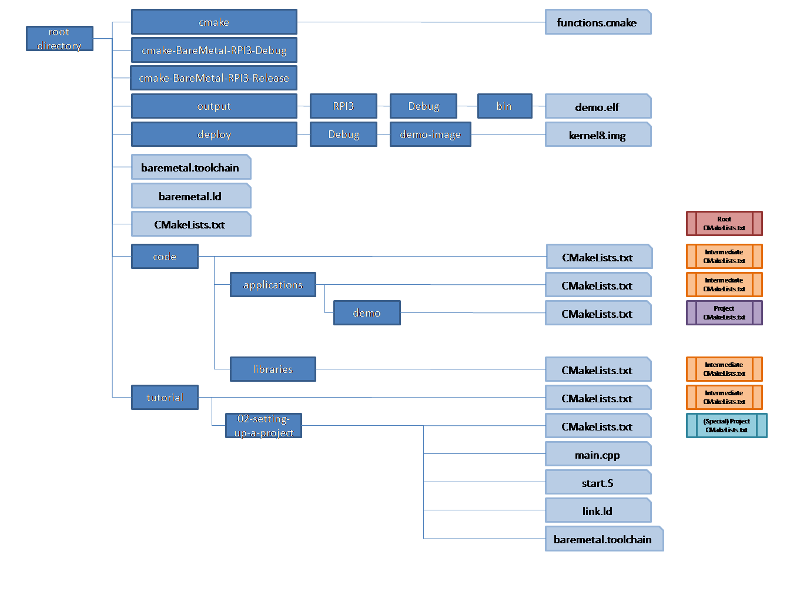
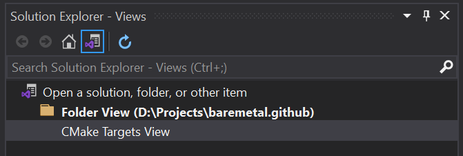

# Setting up project structure

Contents:
- [CMake project structure](##CMake-project-structure)
  - [Root CMakeLists.txt](###Root-CMakeLists.txt)
  - [Intermediate directory CMakeLists.txt](###Intermediate-directory-CMakeLists.txt)
  - [Project CMakeLists.txt](###Project-CMakeLists.txt)
- [Adding source file](###Adding-source-file)
- [Adding startup assembly code](###Adding-startup-assembly-code)
- [Building](##Building)
  - [Configuring CMake](###Configuring-CMake)
  - [Building a specific target](###Building-a-specific-target)
  - [Building a specific image](###Building-a-specific-image)
  - [Building all targets](###Building-all-targets)
  - [Starting QEMU](###Starting-QEMU)
  - [Starting GDB](###Starting-GDB)
- [Visual Studio CMake integration](##Visual-Studio-CMake-integration)
  - [Configuring CMake](###Configuring-CMake)
  - [Building](###Building)
  - [Debugging](###Debugging)

In order to start larger scale development, as well as to use Visual Studio for CMake project development for baremetal platforms,
it is wise to set up your project in a certain way.

IF you're curious to see how this works, or just want to dive directly into the code,
in `tutorials/03-setting-up-project-structure` there is a complete copy of what we work towards in this section.
Its root will clearly be `tutorial/03-setting-up-project-structure`.

To understand how to approach this, first a bit of information on how CMake projects are structured, and how Visual Studio integrates CMake projects.

## CMake project structure

When using `CMake`, there is a root `CMakeLists.txt`, that acts as the starting point for `CMake`. 
Normally, this is at the root directory of your project. In our case, for now, this was in `tutorial/02-setting-up-a-project`.
Each directory that is part of the `CMake` structure, will have a `CMakeLists.txt` file.
When building, we normally build out of tree, as we did before. 
This means there is a specific directory, we used `cmake-build` before, that is used to store all intermediate files used and generated by CMake. 
These files could be makefiles generated by CMake, but also contain object files etc.
The third directory tree is the target binary tree, in our case `output`, where all libaries and executables will be stored.
This will normally hold executable files (.exe or .elf for example), as well as dynamic or shared libraries (.dll or .so files).
In our case, we will also store static libraries (.lib or .a) there.
For our specific case, we wish to create kernel images from executables, so we will add a fourth tree named `deploy`.


We will slightly change this structure, to allow for more projects to be built, and also to enable easy integration with Visual Studio.

- First of all, we'll create multiple build directories:
  - cmake-BareMetal-Debug for Debug builds
  - cmake-BareMetal-Release for Release builds
  - cmake-BareMetal-RelWithDebInfo for RelWithDebInfo builds
  - cmake-BareMetal-MinSizeRel for MinSizeRel builds
- We will copy the custom scripting folder to the project root directory (`<root>/cmake`)
- We will copy the toolchain file to the root directory (`<root>/baremetal.toolchain`)
- We will copy the linker definition file to the root directory, and rename it (`<root>/baremetal.ld`)
- We will create a new directory `<root>/code` at root level, with subdirectories `applications` and `libraries` underneath which we will add our applications and libraries.
For now, there will be no subdirectories, but we will add `CMakeLists.txt` files in each directory for preparation.
- We will leave the tutorial directory in place, and leave the 02-setting-up-a-project directory as is (to ensure we can still build our previous project as before), but will also populate the tutorial directory with `CMakeLists.txt` to prepare for new tutorial projects.
- We will also add a CMakeLists.txt in the root directory (`<root>/CMakeLists.txt`)


In order to explain how to populate the new structure, let's start setting up a new application named `demo`, which we will later extend.



### Root CMakeLists.txt

The root `CMakeLists.txt` is the starting point for CMake, we will be calling this the root CMake file. 
It contains all global definitions and settings, such as the path to the custom CMake scripts, definition of base output directory,
and later on also general compiler settings etc.
It is common practice to create a main project in this file, in order for the toolchain to be processed. We will name it baremetal-main.

For now, we'll start with the following contents:

```cmake
File: CMakeLists.txt
1: cmake_minimum_required(VERSION 3.18)
2: 
3: message(STATUS "CMake ${CMAKE_VERSION}")
4: 
5: set(SCRIPTS_DIR "" CACHE STRING "CMake scripts path")
6: 
7: if ("${SCRIPTS_DIR}" STREQUAL "")
8:     set(SCRIPTS_DIR "${CMAKE_SOURCE_DIR}/cmake" CACHE STRING "CMake scripts path" FORCE)
9: endif()
10: 
11: list(APPEND CMAKE_MODULE_PATH ${SCRIPTS_DIR})
12: 
13: if("${CMAKE_BUILD_TYPE}" STREQUAL "")
14:     set(CMAKE_BUILD_TYPE Debug)
15: endif()
16: set(CONFIG_DIR ${CMAKE_BUILD_TYPE})
17: 
18: set(DEPLOYMENT_DIR "${CMAKE_SOURCE_DIR}/deploy" CACHE STRING "Deployment directory")
19: set(OUTPUT_BASE_DIR "${CMAKE_SOURCE_DIR}/output" CACHE STRING "Output directory")
20: set(OUTPUT_BIN_DIR "${OUTPUT_BASE_DIR}/${CONFIG_DIR}/bin")
21: set(OUTPUT_LIB_DIR "${OUTPUT_BASE_DIR}/${CONFIG_DIR}/lib")
22: 
23: message(STATUS "\n** Setting up project **\n--")
24: 
25: message(STATUS "\n##################################################################################")
26: message(STATUS "\n** Setting up toolchain **\n--")
27: 
28: project(baremetal-main
29:     DESCRIPTION "Baremetal overall project")
30: 
31: add_subdirectory(code)
```

Explanation:
- line 1: As before we start with the minimum CMake version required
- line 3: We then print the current CMake version
- line 5-11: We define a cached variables for the script path, and set it to the cmake scripts directory. We then add this path to the `CMAKE_MODULE_PATH`.
- line 13-16: Different is the way we defined the directory for the build configuration. 
We set the `CMAKE_BUILD_TYPE` to Debug if it is not set, and then depending on the build configuration set the directory to either
Debug (for Debug) or Release (for Release, MinSizeRel or RelWithDebInfo).
- line 18-19: We then define the variables for the common deployment directory `DEPLOYMENT_DIR` (for image files) and the common output directory
`OUTPUT_BASE_DIR` (for built libraries and executables). Both variables will also be stored in the cache.
- line 20-21: New is that we define two variable to hold the output library path `OUTPUT_LIB_DIR` and output executable path `OUTPUT_BIN_DIR`.
- line 23-26: We add some diagnostic printing to identify when the toolchain is being processed.
- line 28-29: We define the main project.
- line 31: Lastly, we include the `CMakeList.txt` file in the code directory.

### Intermediate directory CMakeLists.txt

The CMake files in the code, applications, and libraries directories simply print the current path, and then include the next level `CMakeLists.txt` files:

```cmake
File: code/CMakeLists.txt
1: message(STATUS "\n**********************************************************************************\n")
2: message(STATUS "\n## In directory: ${CMAKE_CURRENT_SOURCE_DIR}")
3: 
4: add_subdirectory(applications)
5: add_subdirectory(libraries)
```

```cmake
File: code/applications/CMakeLists.txt
1: message(STATUS "\n**********************************************************************************\n")
2: message(STATUS "\n## In directory: ${CMAKE_CURRENT_SOURCE_DIR}")
3: 
4: add_subdirectory(demo)
```

In the end the demo project `CMakeLists.txt` file is included, which is a normal project file.

```cmake
File: code/libraries/CMakeLists.txt
1: message(STATUS "\n**********************************************************************************\n")
2: message(STATUS "\n## In directory: ${CMAKE_CURRENT_SOURCE_DIR}")
3: 
```

### Project CMakeLists.txt

The CMake file in `code/applications/demo` defines our application:

```cmake
File: code/applications/demo/CMakeLists.txt
1: project(demo
2:     DESCRIPTION "Demo application"
3:     LANGUAGES CXX ASM)
4: 
5: message(STATUS "\n**********************************************************************************\n")
6: message(STATUS "\n## In directory: ${CMAKE_CURRENT_SOURCE_DIR}")
7: 
8: message("\n** Setting up ${PROJECT_NAME} **\n")
9: 
10: include(functions)
11: 
12: set(PROJECT_TARGET_NAME ${PROJECT_NAME}.elf)
13: 
14: set(PROJECT_COMPILE_DEFINITIONS_CXX_PRIVATE )
15: set(PROJECT_COMPILE_DEFINITIONS_CXX_PUBLIC )
16: set(PROJECT_COMPILE_DEFINITIONS_ASM_PRIVATE )
17: 
18: set(PROJECT_COMPILE_OPTIONS_CXX_PRIVATE 
19:     -Wall -O2 -ffreestanding -nostdinc -nostdlib -nostartfiles
20:     -mcpu=cortex-a53 -mlittle-endian -mcmodel=small 
21:     -Wall -Wextra -Werror 
22:     -Wno-missing-field-initializers -Wno-unused-value -Wno-aligned-new -Wno-unused-variable -Wno-unused-parameter
23:     -ffreestanding -fsigned-char -nostartfiles -mno-outline-atomics -nostdinc -nostdlib -nostdinc++
24:     -fno-exceptions -fno-rtti -O0 -std=gnu++17
25:     )
26: set(PROJECT_COMPILE_OPTIONS_CXX_PUBLIC )
27: set(PROJECT_COMPILE_OPTIONS_ASM_PRIVATE )
28: 
29: set(PROJECT_INCLUDE_DIRS_PRIVATE )
30: set(PROJECT_INCLUDE_DIRS_PUBLIC )
31: 
32: set(PROJECT_LINK_OPTIONS ${CMAKE_EXE_LINKER_FLAGS} -nostdlib -nostartfiles -Wl,--section-start=.init=0x80000 -T ${CMAKE_SOURCE_DIR}/baremetal.ld)
33: 
34: set(PROJECT_DEPENDENCIES
35:     )
36: 
37: set(PROJECT_LIBS
38:     ${PROJECT_DEPENDENCIES}
39:     )
40: 
41: set(PROJECT_SOURCES
42:     ${CMAKE_CURRENT_SOURCE_DIR}/src/main.cpp
43:     ${CMAKE_CURRENT_SOURCE_DIR}/src/start.S
44:     )
45: 
46: set(PROJECT_INCLUDES_PUBLIC )
47: set(PROJECT_INCLUDES_PRIVATE )
48: 
49: if (PLATFORM_BAREMETAL)
50:     set(START_GROUP -Wl,--start-group)
51:     set(END_GROUP -Wl,--end-group)
52: endif()
53: 
54: add_executable(${PROJECT_NAME} ${PROJECT_SOURCES} ${PROJECT_INCLUDES_PUBLIC} ${PROJECT_INCLUDES_PRIVATE})
55: 
56: target_link_libraries(${PROJECT_NAME} ${START_GROUP} ${PROJECT_LIBS} ${END_GROUP})
57: target_include_directories(${PROJECT_NAME} PRIVATE ${PROJECT_INCLUDE_DIRS_PRIVATE})
58: target_include_directories(${PROJECT_NAME} PUBLIC  ${PROJECT_INCLUDE_DIRS_PUBLIC})
59: target_compile_definitions(${PROJECT_NAME} PRIVATE 
60:     $<$<COMPILE_LANGUAGE:C>:${PROJECT_COMPILE_DEFINITIONS_C_PRIVATE}>
61:     $<$<COMPILE_LANGUAGE:CXX>:${PROJECT_COMPILE_DEFINITIONS_CXX_PRIVATE}>
62:     $<$<COMPILE_LANGUAGE:ASM>:${PROJECT_COMPILE_DEFINITIONS_ASM_PRIVATE}>
63:     )
64: target_compile_definitions(${PROJECT_NAME} PUBLIC 
65:     $<$<COMPILE_LANGUAGE:C>:${PROJECT_COMPILE_DEFINITIONS_C_PUBLIC}>
66:     $<$<COMPILE_LANGUAGE:CXX>:${PROJECT_COMPILE_DEFINITIONS_CXX_PUBLIC}>
67:     $<$<COMPILE_LANGUAGE:ASM>:${PROJECT_COMPILE_DEFINITIONS_ASM_PUBLIC}>
68:     )
69: target_compile_options(${PROJECT_NAME} PRIVATE 
70:     $<$<COMPILE_LANGUAGE:C>:${PROJECT_COMPILE_OPTIONS_C_PRIVATE}>
71:     $<$<COMPILE_LANGUAGE:CXX>:${PROJECT_COMPILE_OPTIONS_CXX_PRIVATE}>
72:     $<$<COMPILE_LANGUAGE:ASM>:${PROJECT_COMPILE_OPTIONS_ASM_PRIVATE}>
73:     )
74: target_compile_options(${PROJECT_NAME} PUBLIC 
75:     $<$<COMPILE_LANGUAGE:C>:${PROJECT_COMPILE_OPTIONS_C_PUBLIC}>
76:     $<$<COMPILE_LANGUAGE:CXX>:${PROJECT_COMPILE_OPTIONS_CXX_PUBLIC}>
77:     $<$<COMPILE_LANGUAGE:ASM>:${PROJECT_COMPILE_OPTIONS_ASM_PUBLIC}>
78:     )
79: 
80: list_to_string(PROJECT_LINK_OPTIONS PROJECT_LINK_OPTIONS_STRING)
81: if (NOT "${PROJECT_LINK_OPTIONS_STRING}" STREQUAL "")
82:     set_target_properties(${PROJECT_NAME} PROPERTIES LINK_FLAGS "${PROJECT_LINK_OPTIONS_STRING}")
83: endif()
84: 
85: set_target_properties(${PROJECT_NAME} PROPERTIES OUTPUT_NAME ${PROJECT_TARGET_NAME})
86: set_target_properties(${PROJECT_NAME} PROPERTIES ARCHIVE_OUTPUT_DIRECTORY ${OUTPUT_LIB_DIR})
87: set_target_properties(${PROJECT_NAME} PROPERTIES RUNTIME_OUTPUT_DIRECTORY ${OUTPUT_BIN_DIR})
88: 
89: add_subdirectory(create-image)
```

As you can see, it does pretty much the same as the second part in our 02-setting-up-a-project project. However, some things are slightly different.

- line 1-3: It defines the project, in this case `demo`. Notice that here we specify both C++ and assembly as source languages.
- line 5-8: We print the current directory, and also which project we're going to configure.
- line 10: We include the functions.cmake custom CMake script
- line 12-32: We specify the project target file name, the compiler definitions, compiler options, include directories, and linker options.
- line 34-39: We specify which libraries we depend upon, and which libraries we link to. For now this is empty.
- line 41-47: We then specify which source and header files are used for this application.
Notice that the main.cpp and start.S are now in the src subdirectory. This keeps project files and source files separated.
- line 49-52: We define the variables `START_GROUP` and `END_GROUP` as before.
- line 54-87: We define the executable, which files are used to build it, which libraries it links to, which include directories it used, while compiler definitions and options, we again use th same trick to specify the linker options, and then specify the executable name and directories.
Different is the way we pass compiler definitions and options. We use a more generic approach here, where we set the definitions and options per language using generator expressions.
- line 86-87: Notice that the directories now use the new variables `OUTPUT_LIB_DIR` and `OUTPUT_BIN_DIR`.
- line 89: Finally we include the `CMakeLists.txt` for the image creation project.

The CMake file in `code/applications/demo/create-image` defines the project to create the image:

```cmake
File: code/applications/demo/create-image/CMakeLists.txt
1: project(demo-image
2:     DESCRIPTION "Kernel image for demo RPI 64 bit bare metal")
3: 
4: message(STATUS "\n**********************************************************************************\n")
5: message(STATUS "\n## In directory: ${CMAKE_CURRENT_SOURCE_DIR}")
6: 
7: message("\n** Setting up ${PROJECT_NAME} **\n")
8: 
9: set(BAREMETAL_TARGET_KERNEL kernel8)
10: set(DEPENDENCY demo)
11: set(IMAGE_NAME ${BAREMETAL_TARGET_KERNEL}.img)
12: 
13: create_image(${PROJECT_NAME} ${IMAGE_NAME} ${DEPENDENCY})
```

Again this is very much like what we saw for `tutorial/02-setting-up-a-project/create-image`. The only difference is the dependency and the project name.

## Adding source file

The source code file `main.cpp` will for now be equal to that of the `02-setting-up-a-project` tutorial.

```cpp
File: code/applications/demo/src/main.cpp
1: int main()
2: {
3:     return 0;
4: }
```

## Adding startup assembly code

The startup assembly code will be equal to that of the `02-setting-up-a-project` tutorial.

```asm
File: d:\Projects\baremetal.github\code\applications\demo\src\start.S
1: //------------------------------------------------------------------------------
2: // Copyright   : Copyright(c) 2023 Rene Barto
3: //
4: // File        : start.S
5: //
6: // Namespace   : -
7: //
8: // Class       : -
9: //
10: // Description : Startup code. This is the entry point to any executable. It puts all cores except core 0 in sleep mode.
11: //               For core 0, it sets the stack pointer to just below the code (as the stack grows down), and then calls main().
12: //
13: //------------------------------------------------------------------------------
14: //
15: // Baremetal - A C++ bare metal environment for embedded 64 bit ARM devices
16: //
17: // Intended support is for 64 bit code only, running on Raspberry Pi (3 or 4) and Odroid
18: //
19: // Permission is hereby granted, free of charge, to any person
20: // obtaining a copy of this software and associated documentation
21: // files(the "Software"), to deal in the Software without
22: // restriction, including without limitation the rights to use, copy,
23: // modify, merge, publish, distribute, sublicense, and /or sell copies
24: // of the Software, and to permit persons to whom the Software is
25: // furnished to do so, subject to the following conditions :
26: //
27: // The above copyright notice and this permission notice shall be
28: // included in all copies or substantial portions of the Software.
29: //
30: // THE SOFTWARE IS PROVIDED "AS IS", WITHOUT WARRANTY OF ANY KIND,
31: // EXPRESS OR IMPLIED, INCLUDING BUT NOT LIMITED TO THE WARRANTIES OF
32: // MERCHANTABILITY, FITNESS FOR A PARTICULAR PURPOSE AND
33: // NONINFRINGEMENT.IN NO EVENT SHALL THE AUTHORS OR COPYRIGHT
34: // HOLDERS BE LIABLE FOR ANY CLAIM, DAMAGES OR OTHER LIABILITY,
35: // WHETHER IN AN ACTION OF CONTRACT, TORT OR OTHERWISE, ARISING FROM,
36: // OUT OF OR IN CONNECTION WITH THE SOFTWARE OR THE USE OR OTHER
37: // DEALINGS IN THE SOFTWARE.
38: //
39: //------------------------------------------------------------------------------
40: 
41: .section ".text.boot"
42: 
43: .global _start
44: 
45: _start:
46:     // Read MPIDR_EL1 register, low 7 bits contain core id (as we have 4 cores, we mask only lowest two bits)
47:     mrs     x1, mpidr_el1
48:     // Mask away everything but the core id
49:     and     x1, x1, #3
50:     // If core id is 0, continue
51:     cbz     x1, core0
52:     // If core id > 0, start wait loop
53: waitevent:
54:     wfe
55:     b       waitevent
56: 
57: core0:
58:     // core 0
59: 
60:     // set top of stack just before our code (stack grows to a lower address per AAPCS64)
61:     ldr     x1, =_start
62:     mov     sp, x1
63: 
64:     // clear bss
65:     // Load bss start
66:     ldr     x1, =__bss_start
67:     // Load bss size
68:     ldr     w2, =__bss_size
69:     // If bss is empty
70:     cbz     w2, empty_bss
71: 
72: clear_bss_loop:
73:     // Store 0 in x1 location for 8 bytes, increment x1 by 8
74:     str     xzr, [x1], #8
75:     // Cound down size
76:     sub     w2, w2, #1
77:     // Loop as loop as the end is not reached
78:     cbnz    w2, clear_bss_loop
79: 
80:     // jump to C code, should not return
81: empty_bss:
82:     bl      main
83:     // for failsafe, halt this core too
84:     b       waitevent
85: 
```

## Building

As now we have a common structure, it may be helpful to create some scripts to help us build.

### Configuring CMake

We will create a script for Windows and for Linux to configure the build. They will be placed in the tools directory underneath the root directory:

#### Windows

```bat
File: tools/configure.bat
1: @echo off
2: rmdir /s /q cmake-BareMetal-Debug
3: mkdir cmake-BareMetal-Debug
4: pushd cmake-BareMetal-Debug
5: 
6: cmake .. -G Ninja -DCMAKE_BUILD_TYPE:STRING="Debug" -DCMAKE_TOOLCHAIN_FILE:FILEPATH=../baremetal.toolchain
7: 
8: popd
```

Running the script:
```bat
tools\configure.bat
```

```text
-- CMake 3.27.8
--
** Setting up project **
--
--
##################################################################################
--
** Setting up toolchain **
--
-- TOOLCHAIN_ROOT           D:\toolchains\arm-gnu-toolchain-13.2.rel1-mingw-w64-i686-aarch64-none-elf
-- Processor                aarch64
-- Platform tuple           aarch64-none-elf
-- Assembler
-- C compiler               D:/toolchains/arm-gnu-toolchain-13.2.rel1-mingw-w64-i686-aarch64-none-elf/bin/aarch64-none-elf-gcc.exe
-- C++ compiler             D:/toolchains/arm-gnu-toolchain-13.2.rel1-mingw-w64-i686-aarch64-none-elf/bin/aarch64-none-elf-g++.exe
-- Archiver                 D:/toolchains/arm-gnu-toolchain-13.2.rel1-mingw-w64-i686-aarch64-none-elf/bin/aarch64-none-elf-ar.exe
-- Linker                   D:/toolchains/arm-gnu-toolchain-13.2.rel1-mingw-w64-i686-aarch64-none-elf/bin/aarch64-none-elf-ld.exe
-- ObjCopy                  D:/toolchains/arm-gnu-toolchain-13.2.rel1-mingw-w64-i686-aarch64-none-elf/bin/aarch64-none-elf-objcopy.exe
-- Std include path         D:\toolchains\arm-gnu-toolchain-13.2.rel1-mingw-w64-i686-aarch64-none-elf/lib/gcc/aarch64-none-elf/13.2.1/include
-- CMAKE_EXE_LINKER_FLAGS=
-- Adding to CMAKE_EXE_LINKER_FLAGS -LD:\toolchains\arm-gnu-toolchain-13.2.rel1-mingw-w64-i686-aarch64-none-elf/lib/gcc/aarch64-none-elf/13.2.1
-- TOOLCHAIN_ROOT           D:\toolchains\arm-gnu-toolchain-13.2.rel1-mingw-w64-i686-aarch64-none-elf
-- Processor                aarch64
-- Platform tuple           aarch64-none-elf
-- Assembler
-- C compiler               D:/toolchains/arm-gnu-toolchain-13.2.rel1-mingw-w64-i686-aarch64-none-elf/bin/aarch64-none-elf-gcc.exe
-- C++ compiler             D:/toolchains/arm-gnu-toolchain-13.2.rel1-mingw-w64-i686-aarch64-none-elf/bin/aarch64-none-elf-g++.exe
-- Archiver                 D:/toolchains/arm-gnu-toolchain-13.2.rel1-mingw-w64-i686-aarch64-none-elf/bin/aarch64-none-elf-ar.exe
-- Linker                   D:/toolchains/arm-gnu-toolchain-13.2.rel1-mingw-w64-i686-aarch64-none-elf/bin/aarch64-none-elf-ld.exe
-- ObjCopy                  D:/toolchains/arm-gnu-toolchain-13.2.rel1-mingw-w64-i686-aarch64-none-elf/bin/aarch64-none-elf-objcopy.exe
-- Std include path         D:\toolchains\arm-gnu-toolchain-13.2.rel1-mingw-w64-i686-aarch64-none-elf/lib/gcc/aarch64-none-elf/13.2.1/include
-- CMAKE_EXE_LINKER_FLAGS=   -LD:\toolchains\arm-gnu-toolchain-13.2.rel1-mingw-w64-i686-aarch64-none-elf/lib/gcc/aarch64-none-elf/13.2.1
-- The C compiler identification is GNU 13.2.1
-- The CXX compiler identification is GNU 13.2.1
--
**********************************************************************************

--
## In directory: D:/Projects/baremetal.github/code
--
**********************************************************************************

--
## In directory: D:/Projects/baremetal.github/code/applications
-- The ASM compiler identification is GNU
-- Found assembler: D:/Toolchains/arm-gnu-toolchain-13.2.Rel1-mingw-w64-i686-aarch64-none-elf/bin/aarch64-none-elf-gcc.exe
--
**********************************************************************************

--
## In directory: D:/Projects/baremetal.github/code/applications/demo

** Setting up demo **

--
**********************************************************************************

--
## In directory: D:/Projects/baremetal.github/code/applications/demo/create-image

** Setting up demo-image **

-- create_image demo-image kernel8.img demo
-- TARGET_NAME demo.elf
-- generate D:/Projects/baremetal.github/deploy/Debug/demo-image/kernel8.img from D:/Projects/baremetal.github/output/Debug/bin/demo
--
**********************************************************************************

--
## In directory: D:/Projects/baremetal.github/code/libraries
-- Configuring done (1.0s)
-- Generating done (0.0s)
-- Build files have been written to: D:/Projects/baremetal.github/cmake-BareMetal-Debug
```

#### Linux

We will leave the Linux scripts as with build directory cmake-build, as we still build on the command line there.

tools/configure.sh:
```bash
File: tools/configure.sh
1: rm -rf cmake-build/
2: mkdir cmake-build
3: pushd cmake-build
4: 
5: cmake .. -G Ninja -DCMAKE_BUILD_TYPE:STRING="Debug" -DCMAKE_TOOLCHAIN_FILE:FILEPATH=../baremetal.toolchain
6: 
7: popd
```

Running the script:
```bat
tools/configure.sh
```

```text
~/repo/baremetal.github/cmake-build ~/repo/baremetal.github
-- CMake 3.25.1
-- 
** Setting up project **
--
-- 
##################################################################################
-- 
** Setting up toolchain **
--
-- TOOLCHAIN_ROOT           /opt/toolchains/arm-gnu-toolchain-13.2.Rel1-x86_64-aarch64-none-elf
-- Processor                aarch64
-- Platform tuple           aarch64-none-elf
-- Assembler                
-- C compiler               /opt/toolchains/arm-gnu-toolchain-13.2.Rel1-x86_64-aarch64-none-elf/bin/aarch64-none-elf-gcc
-- C++ compiler             /opt/toolchains/arm-gnu-toolchain-13.2.Rel1-x86_64-aarch64-none-elf/bin/aarch64-none-elf-g++
-- Archiver                 /opt/toolchains/arm-gnu-toolchain-13.2.Rel1-x86_64-aarch64-none-elf/bin/aarch64-none-elf-ar
-- Linker                   /opt/toolchains/arm-gnu-toolchain-13.2.Rel1-x86_64-aarch64-none-elf/bin/aarch64-none-elf-ld
-- ObjCopy                  /opt/toolchains/arm-gnu-toolchain-13.2.Rel1-x86_64-aarch64-none-elf/bin/aarch64-none-elf-objcopy
-- Std include path         /opt/toolchains/arm-gnu-toolchain-13.2.Rel1-x86_64-aarch64-none-elf/lib/gcc/aarch64-none-elf/13.2.1/include
-- CMAKE_EXE_LINKER_FLAGS=  
-- Adding to CMAKE_EXE_LINKER_FLAGS -L/opt/toolchains/arm-gnu-toolchain-13.2.Rel1-x86_64-aarch64-none-elf/lib/gcc/aarch64-none-elf/13.2.1
-- TOOLCHAIN_ROOT           /opt/toolchains/arm-gnu-toolchain-13.2.Rel1-x86_64-aarch64-none-elf
-- Processor                aarch64
-- Platform tuple           aarch64-none-elf
-- Assembler                
-- C compiler               /opt/toolchains/arm-gnu-toolchain-13.2.Rel1-x86_64-aarch64-none-elf/bin/aarch64-none-elf-gcc
-- C++ compiler             /opt/toolchains/arm-gnu-toolchain-13.2.Rel1-x86_64-aarch64-none-elf/bin/aarch64-none-elf-g++
-- Archiver                 /opt/toolchains/arm-gnu-toolchain-13.2.Rel1-x86_64-aarch64-none-elf/bin/aarch64-none-elf-ar
-- Linker                   /opt/toolchains/arm-gnu-toolchain-13.2.Rel1-x86_64-aarch64-none-elf/bin/aarch64-none-elf-ld
-- ObjCopy                  /opt/toolchains/arm-gnu-toolchain-13.2.Rel1-x86_64-aarch64-none-elf/bin/aarch64-none-elf-objcopy
-- Std include path         /opt/toolchains/arm-gnu-toolchain-13.2.Rel1-x86_64-aarch64-none-elf/lib/gcc/aarch64-none-elf/13.2.1/include
-- CMAKE_EXE_LINKER_FLAGS=   -L/opt/toolchains/arm-gnu-toolchain-13.2.Rel1-x86_64-aarch64-none-elf/lib/gcc/aarch64-none-elf/13.2.1
-- The C compiler identification is GNU 13.2.1
-- The CXX compiler identification is GNU 13.2.1
-- 
**********************************************************************************

-- 
## In directory: /home/rene/repo/baremetal.github/code
-- 
**********************************************************************************

-- 
## In directory: /home/rene/repo/baremetal.github/code/applications
-- The ASM compiler identification is GNU
-- Found assembler: /opt/toolchains/arm-gnu-toolchain-13.2.Rel1-x86_64-aarch64-none-elf/bin/aarch64-none-elf-gcc
-- 
**********************************************************************************

-- 
## In directory: /home/rene/repo/baremetal.github/code/applications/demo

** Setting up demo **

-- 
**********************************************************************************

-- 
## In directory: /home/rene/repo/baremetal.github/code/applications/demo/create-image

** Setting up demo-image **

-- create_image demo-image kernel8.img demo
-- TARGET_NAME demo.elf
-- generate /home/rene/repo/baremetal.github/deploy/Debug/demo-image/kernel8.img from /home/rene/repo/baremetal.github/output/Debug/bin/demo
-- 
**********************************************************************************

-- 
## In directory: /home/rene/repo/baremetal.github/code/libraries
-- Configuring done
-- Generating done
-- Build files have been written to: /home/rene/repo/baremetal.github/cmake-build
~/repo/baremetal.github
```

### Building a specific target

#### Windows

```bat
File: tools/build-target.bat
1: cmake --build cmake-BareMetal-Debug --target %1
```

#### Linux

```bash
File: tools/build-target.sh
1: cmake --build cmake-build --target $1
```

### Building a specific image

#### Windows

```bat
File: tools/build-image.bat
1: cmake --build cmake-BareMetal-Debug --target %1-image
```

#### Linux

```bash
File: tools/build-image.sh
1: cmake --build cmake-build --target $1-image
```

### Building all targets

#### Windows

```bat
File: tools/build-all.bat
1: cmake --build cmake-BareMetal-Debug
```

Running the build:
```bat
tools\build-all.bat
```

```text
[4/4] Generating D:/Projects/baremetal.github/deploy/Debug/demo-image/kernel8.img
```

#### Linux

```bash
File: tools/build-all.sh
1: cmake --build cmake-build
```

Running the build:
```bash
tools/build-all.sh
```

```text
[4/4] Generating /home/rene/repo/baremetal.github/deploy/Debug/demo-image/kernel8.img
```

### Starting QEMU

#### Windows

Start QEMU listening to UART0

```bat
File: tools/startQEMU-image-uart0.bat
1: set thisdir=%~dp0
2: 
3: call %thisdir%\build-target %1
4: "c:\Program Files\qemu\qemu-system-aarch64.exe" -M raspi3b -kernel %thisdir%\..\deploy\Debug\%1-image\kernel8.img -serial stdio -s -S
```

Start QEMU listening to UART1

```bat
File: tools/startQEMU-image-uart1.bat
1: set thisdir=%~dp0
2: 
3: call %thisdir%\build-target %1
4: "c:\Program Files\qemu\qemu-system-aarch64.exe" -M raspi3b -kernel %thisdir%\..\deploy\Debug\%1-image\kernel8.img -serial null -serial stdio -s -S
```

Explanation:
- We start QEMU here to emulate Raspberry Pi 3B
- We use the specified image for the kernel. 
- We either listen to the first serial or the second (the first is then set to null).
- QEMU will start a gdb server at port 1234
- We do not start the system immediately, but let it wait for gdb (`-S`).

When starting QEMU on UART0:
```bat
tools\startQEMU-image-uart0.bat demo
```

```text
set thisdir=D:\Projects\baremetal.github\tools\

call D:\Projects\baremetal.github\tools\\build-target demo

cmake --build cmake-BareMetal-Debug --target demo
ninja: no work to do.

"c:\Program Files\qemu\qemu-system-aarch64.exe" -M raspi3b -kernel D:\Projects\baremetal.github\tools\\..\deploy\Debug\demo-image\kernel8.img -serial stdio -s -S

(qemu:23216): Gtk-WARNING **: 23:23:39.716: Could not load a pixbuf from icon theme.
This may indicate that pixbuf loaders or the mime database could not be found.
```

#### Linux

Start QEMU listening to UART0


```bash
File: tools/startQEMU-image-uart0.sh
1: thisdir=$(dirname "$0")
2: echo thisdir=$thisdir
3: 
4: echo "$thisdir/build-target.sh $1"
5: $thisdir/build-target.sh $1
6: 
7: echo qemu-system-aarch64 -M raspi3b -kernel $thisdir/../deploy/Debug/$1-image/kernel8.img -serial stdio -s -S
8: qemu-system-aarch64 -M raspi3b -kernel $thisdir/../deploy/Debug/$1-image/kernel8.img -serial stdio -s -S
```

Start QEMU listening to UART1

```bash
File: tools/startQEMU-image-uart1.sh
1: thisdir=$(dirname "$0")
2: echo thisdir=$thisdir
3: 
4: echo "$thisdir/build-target.sh $1"
5: $thisdir/build-target.sh $1
6: 
7: echo qemu-system-aarch64 -M raspi3b -kernel $thisdir/../deploy/Debug/$1-image/kernel8.img -serial null -serial stdio -s -S
8: qemu-system-aarch64 -M raspi3b -kernel $thisdir/../deploy/Debug/$1-image/kernel8.img -serial null -serial stdio -s -S
9: 
```

Explanation:
- We start QEMU here to emulate Raspberry Pi 3B
- We use the specified image for the kernel. 
- We either listen to the first serial or the second (the first is then set to null).
- QEMU will start a gdb server at port 1234
- We do not start the system immediately, but let it wait for gdb (`-S`).

When starting QEMU on UART0:
```bash
tools/startQEMU-image-uart0.sh demo
```

```text
thisdir=tools
tools/build-target.sh demo
ninja: no work to do.
qemu-system-aarch64 -M raspi3b -kernel tools/../deploy/Debug/demo-image/kernel8.img -serial stdio -s -S
```

### Starting GDB

When starting GDB, we need a way to specify GDB to connect to our QEMU gdb server. We do that using a command file:

tools/gdb-commands.txt
```text
target remote localhost:1234
load
```

#### Windows

```bat
File: tools/startgdb.bat
1: set thisdir=%~dp0
2: 
3: D:\Toolchains\arm-gnu-toolchain-13.2.Rel1-mingw-w64-i686-aarch64-none-elf\bin\aarch64-none-elf-gdb.exe -x %thisdir%\gdb-commands.txt -symbols=%CD%\output\Debug\bin\%1.elf --args %CD%\output\Debug\bin\%1.elf
```

We specify the command file, and also the symbol file to load

Starting GDB:
```bat
tools\startgdb.bat demo
```

```text
D:\Projects\baremetal.github>D:\Toolchains\arm-gnu-toolchain-13.2.Rel1-mingw-w64-i686-aarch64-none-elf\bin\aarch64-none-elf-gdb.exe -x D:\Projects\baremetal.github\tools\gdb-commands.txt -symbols=D:\Projects\baremetal.github\output\Debug\bin\demo.elf --args D:\Projects\baremetal.github\output\Debug\bin\demo.elf
GNU gdb (Arm GNU Toolchain 13.2.rel1 (Build arm-13.7)) 13.2.90.20231008-git
Copyright (C) 2023 Free Software Foundation, Inc.
License GPLv3+: GNU GPL version 3 or later <http://gnu.org/licenses/gpl.html>
This is free software: you are free to change and redistribute it.
There is NO WARRANTY, to the extent permitted by law.
Type "show copying" and "show warranty" for details.
This GDB was configured as "--host=i686-w64-mingw32 --target=aarch64-none-elf".
Type "show configuration" for configuration details.
For bug reporting instructions, please see:
<https://bugs.linaro.org/>.
Find the GDB manual and other documentation resources online at:
    <http://www.gnu.org/software/gdb/documentation/>.

For help, type "help".
Type "apropos word" to search for commands related to "word"...
Reading symbols from D:\Projects\baremetal.github\tutorial\03-setting-up-project-structure\output\Debug\bin\demo.elf...
0x0000000000000000 in ?? ()
Loading section .text, size 0x58 lma 0x80000
Start address 0x0000000000080000, load size 88
Transfer rate: 85 KB/sec, 88 bytes/write.
(gdb) 
```

#### Linux

```bash
File: tools/startgdb.sh
1: rootdir=`pwd`
2: gdb-multiarch -x $rootdir/tools/gdb-commands.txt -symbols=$rootdir/output/Debug/bin/$1.elf --args $rootdir/output/Debug/bin/$1.elf
```

We specify the command file, and also the symbol file to load

Starting GDB:
```bat
tools/startgdb.sh demo
```

```text
GNU gdb (Debian 13.1-3) 13.1
Copyright (C) 2023 Free Software Foundation, Inc.
License GPLv3+: GNU GPL version 3 or later <http://gnu.org/licenses/gpl.html>
This is free software: you are free to change and redistribute it.
There is NO WARRANTY, to the extent permitted by law.
Type "show copying" and "show warranty" for details.
This GDB was configured as "x86_64-linux-gnu".
Type "show configuration" for configuration details.
For bug reporting instructions, please see:
<https://www.gnu.org/software/gdb/bugs/>.
Find the GDB manual and other documentation resources online at:
    <http://www.gnu.org/software/gdb/documentation/>.

For help, type "help".
Type "apropos word" to search for commands related to "word"...
Reading symbols from /home/rene/repo/baremetal.github/output/Debug/bin/demo.elf...
0x0000000000000000 in ?? ()
Loading section .eh_frame, size 0x28 lma 0x158
Loading section .text, size 0x58 lma 0x80000
Start address 0x0000000000080000, load size 128
Transfer rate: 1024 bits in <1 sec, 64 bytes/write.
(gdb) 
```

## Visual Studio CMake integration

When using Visual Studio, there are two methods to integrate CMake projects.

1. Using `CMakePresets.json`
2. Using `CMakeSettings.json`

For Visual Studio 2019, getting things to work for baremetal development did not go well using `CMakePresets.json`, so we will focus on using `CMakeSettings.json` here.
Maybe later I will give the first option another go.

`CMakeSettings.json` is a JSON file, containing a section for every platform / build you wish to use. Let's add a baremetal target for every build configuration:

```json
File: CMakeSettings.json
1: {
2:   "environments": [ {} ],
3:   "configurations": [
4:     {
5:       "name": "BareMetal-Debug",
6:       "generator": "Ninja",
7:       "configurationType": "Debug",
8:       "buildRoot": "${projectDir}\\cmake-${name}",
9:       "installRoot": "${projectDir}\\output\\install\\${name}",
10:       "cmakeCommandArgs": "",
11:       "buildCommandArgs": "",
12:       "ctestCommandArgs": "",
13:       "cmakeToolchain": "${projectDir}\\baremetal.toolchain",
14:       "inheritEnvironments": [ "gcc-arm" ]
15:     },
16:     {
17:       "name": "BareMetal-Release",
18:       "generator": "Ninja",
19:       "configurationType": "Release",
20:       "buildRoot": "${projectDir}\\cmake-${name}",
21:       "installRoot": "${projectDir}\\output\\install\\${name}",
22:       "cmakeCommandArgs": "",
23:       "buildCommandArgs": "",
24:       "ctestCommandArgs": "",
25:       "cmakeToolchain": "${projectDir}\\baremetal.toolchain",
26:       "inheritEnvironments": [ "gcc-arm" ]
27:     },
28:     {
29:       "name": "BareMetal-RelWithDebInfo",
30:       "generator": "Ninja",
31:       "configurationType": "RelWithDebInfo",
32:       "buildRoot": "${projectDir}\\cmake-${name}",
33:       "installRoot": "${projectDir}\\output\\install\\${name}",
34:       "cmakeCommandArgs": "",
35:       "buildCommandArgs": "",
36:       "ctestCommandArgs": "",
37:       "cmakeToolchain": "${projectDir}\\baremetal.toolchain",
38:       "inheritEnvironments": [ "gcc-arm" ]
39:     },
40:     {
41:       "name": "BareMetal-MinSizeRel",
42:       "generator": "Ninja",
43:       "configurationType": "MinSizeRel",
44:       "buildRoot": "${projectDir}\\cmake-${name}",
45:       "installRoot": "${projectDir}\\output\\install\\${name}",
46:       "cmakeCommandArgs": "",
47:       "buildCommandArgs": "",
48:       "ctestCommandArgs": "",
49:       "cmakeToolchain": "${projectDir}\\baremetal.toolchain",
50:       "inheritEnvironments": [ "gcc-arm" ]
51:     }
52:   ]
53: }
```

The environments section (line 2) could contain environment variables common for all build configurations, but is left empty here.
The configurations section (line 4-51) will contain an array of build configurations, here one for every supported build configurations using the baremetal toolchain.

- `name` is the name of the configuration, which is what you will be able to select in the Configurations dropdown box in Visual Studio. This has to be unique.
- `generator` settings will define how to build a CMake project. This can be one of many, check `cmake --help` for the list.
Visual Studio will select `Ninja` as the default for CMake project, which is what we're going to use.
- `configurationType` specifies what kind of build we're going to perform. This is one of the CMake build types (Debug, Release, RelWithDebInfo, MinSizeRel).
- `buildRoot` specifies the cmake build directory to be used. 
Until now, we've been using `cmake-build`, we'll use `cmake-${name}` here, where `${name}` is the `name` of the configuration, e.g. resulting in `cmake-Baremetal-Debug` for the Debug configuration.
- `installRoot` is not so relevant now, but is the directory root used when executing an install target. We set it to `${projectDir}\\output\\install\\${name}`, in other words it will be in the ouput\install directory, under a subdirectory named after the CMake project we're building.
- `cmakeCommandArgs` will specify the CMake definitions we wish to pass. These variable will be defined in our CMake scrips. We leave this empty for now, but will revisit this later.
- `buildCommandArgs` specifies additional parameters to pass on to CMake for building. We are not using any.
- `ctestCommandArgs` specifies additional parameters when running CMake in test mode. As we will not be using CMake for testing, this is empty.
- `cmakeToolchain` specifies the toolchain file to be using. This is important for us, as we use the toolchain file to select our build toolchain for baremetal building.
We've placed the file in the root directory, so the location is `${projectDir}\\baremetal.toolchain`
- `inheritEnvironments` is used to re-use standard settings from Visual Studio. As we're building for ARM targets and we have a GNU toolchain, it is set to `gcc-arm`

As soon as the `CMakeSettings.json` file is saved, you will see that Visual Studio recognizes it. 
If you were not using Visual Studio yet, you can open the project by first starting Visual Studio 2019, and then selecting "Open a local folder". 


In the dialog that pops up select the root folder of your project (the folder that contains the `CMakeSettings.json`, `baremetal.toolchain`, `baremetal.ld` and main `CMakeLists.txt` file).
Then click "Select Folder"


Visual Studio will now open your project folder, and start loading `CMakeSettings.json`.
After loading, it will select the first configuration in your `CMakeSettings.json` file, in this case "Baremetal-Debug".

Depending on whether you selected to always generate CMake configuration or not, it will also automatically configure your project.
If not, you can always force configuration of CMake by selecting `Project->Configure baremetal-main`.
Notice that `baremetal-main` is mentioned here, which is the name of the top level project defined in the main CMake file.

Sometimes, the configuration does not match the actual state of the `CMakeLists.txt` well (especially when building for multiple different platforms and changing one platform to the other). 
In that case you can click `Project->CMake Cache (Baremetal-Debug Only)->Delete Cache`.
Again notice that the select configuration is shown.
This will completely remove the CMake cache for this configuration (`CMakeCache.txt`). You will then need to reconfigure again.

### Configuring CMake

After automatically or manually configuring CMake, the Output panel at the bottom will show the CMake output:

```text
1> CMake generation started for configuration: 'BareMetal-Debug'.
1> Command line: "C:\Windows\system32\cmd.exe" /c "%SYSTEMROOT%\System32\chcp.com 65001 >NUL && "C:\PROGRAM FILES (X86)\MICROSOFT VISUAL STUDIO\2019\COMMUNITY\COMMON7\IDE\COMMONEXTENSIONS\MICROSOFT\CMAKE\CMake\bin\cmake.exe"  -G "Ninja"  -DCMAKE_BUILD_TYPE:STRING="Debug" -DCMAKE_INSTALL_PREFIX:PATH="D:\Projects\baremetal.github\output\install\BareMetal-Debug" -DCMAKE_TOOLCHAIN_FILE:FILEPATH="D:\Projects\baremetal.github\baremetal.toolchain"  -DCMAKE_MAKE_PROGRAM="C:\PROGRAM FILES (X86)\MICROSOFT VISUAL STUDIO\2019\COMMUNITY\COMMON7\IDE\COMMONEXTENSIONS\MICROSOFT\CMAKE\Ninja\ninja.exe" "D:\Projects\baremetal.github" 2>&1"
1> Working directory: D:\Projects\baremetal.github\cmake-BareMetal-Debug
1> [CMake] -- CMake 3.20.21032501-MSVC_2
1> [CMake] -- 
1> [CMake] ** Setting up project **
1> [CMake] --
1> [CMake] -- 
1> [CMake] ##################################################################################
1> [CMake] -- 
1> [CMake] ** Setting up toolchain **
1> [CMake] --
1> [CMake] -- TOOLCHAIN_ROOT           D:\toolchains\arm-gnu-toolchain-13.2.rel1-mingw-w64-i686-aarch64-none-elf
1> [CMake] -- Processor                aarch64
1> [CMake] -- Platform tuple           aarch64-none-elf
1> [CMake] -- Assembler                D:/Toolchains/arm-gnu-toolchain-13.2.Rel1-mingw-w64-i686-aarch64-none-elf/bin/aarch64-none-elf-gcc.exe
1> [CMake] -- C compiler               D:/toolchains/arm-gnu-toolchain-13.2.rel1-mingw-w64-i686-aarch64-none-elf/bin/aarch64-none-elf-gcc.exe
1> [CMake] -- C++ compiler             D:/toolchains/arm-gnu-toolchain-13.2.rel1-mingw-w64-i686-aarch64-none-elf/bin/aarch64-none-elf-g++.exe
1> [CMake] -- Archiver                 D:/toolchains/arm-gnu-toolchain-13.2.rel1-mingw-w64-i686-aarch64-none-elf/bin/aarch64-none-elf-ar.exe
1> [CMake] -- Linker                   D:/toolchains/arm-gnu-toolchain-13.2.rel1-mingw-w64-i686-aarch64-none-elf/bin/aarch64-none-elf-ld.exe
1> [CMake] -- ObjCopy                  D:/toolchains/arm-gnu-toolchain-13.2.rel1-mingw-w64-i686-aarch64-none-elf/bin/aarch64-none-elf-objcopy.exe
1> [CMake] -- Std include path         D:\toolchains\arm-gnu-toolchain-13.2.rel1-mingw-w64-i686-aarch64-none-elf/lib/gcc/aarch64-none-elf/13.2.1/include
1> [CMake] -- CMAKE_EXE_LINKER_FLAGS=   -LD:\toolchains\arm-gnu-toolchain-13.2.rel1-mingw-w64-i686-aarch64-none-elf/lib/gcc/aarch64-none-elf/13.2.1
1> [CMake] -- TOOLCHAIN_ROOT           D:\toolchains\arm-gnu-toolchain-13.2.rel1-mingw-w64-i686-aarch64-none-elf
1> [CMake] -- Processor                aarch64
1> [CMake] -- Platform tuple           aarch64-none-elf
1> [CMake] -- Assembler                D:/Toolchains/arm-gnu-toolchain-13.2.Rel1-mingw-w64-i686-aarch64-none-elf/bin/aarch64-none-elf-gcc.exe
1> [CMake] -- C compiler               D:/toolchains/arm-gnu-toolchain-13.2.rel1-mingw-w64-i686-aarch64-none-elf/bin/aarch64-none-elf-gcc.exe
1> [CMake] -- C++ compiler             D:/toolchains/arm-gnu-toolchain-13.2.rel1-mingw-w64-i686-aarch64-none-elf/bin/aarch64-none-elf-g++.exe
1> [CMake] -- Archiver                 D:/toolchains/arm-gnu-toolchain-13.2.rel1-mingw-w64-i686-aarch64-none-elf/bin/aarch64-none-elf-ar.exe
1> [CMake] -- Linker                   D:/toolchains/arm-gnu-toolchain-13.2.rel1-mingw-w64-i686-aarch64-none-elf/bin/aarch64-none-elf-ld.exe
1> [CMake] -- ObjCopy                  D:/toolchains/arm-gnu-toolchain-13.2.rel1-mingw-w64-i686-aarch64-none-elf/bin/aarch64-none-elf-objcopy.exe
1> [CMake] -- Std include path         D:\toolchains\arm-gnu-toolchain-13.2.rel1-mingw-w64-i686-aarch64-none-elf/lib/gcc/aarch64-none-elf/13.2.1/include
1> [CMake] -- CMAKE_EXE_LINKER_FLAGS=   -LD:\toolchains\arm-gnu-toolchain-13.2.rel1-mingw-w64-i686-aarch64-none-elf/lib/gcc/aarch64-none-elf/13.2.1
1> [CMake] -- The C compiler identification is GNU 13.2.1
1> [CMake] -- The CXX compiler identification is GNU 13.2.1
1> [CMake] -- 
1> [CMake] **********************************************************************************
1> [CMake] 
1> [CMake] -- 
1> [CMake] ## In directory: D:/Projects/baremetal.github/code
1> [CMake] -- 
1> [CMake] **********************************************************************************
1> [CMake] 
1> [CMake] -- 
1> [CMake] ## In directory: D:/Projects/baremetal.github/code/applications
1> [CMake] -- The ASM compiler identification is GNU
1> [CMake] -- Found assembler: D:/Toolchains/arm-gnu-toolchain-13.2.Rel1-mingw-w64-i686-aarch64-none-elf/bin/aarch64-none-elf-gcc.exe
1> [CMake] -- 
1> [CMake] **********************************************************************************
1> [CMake] 
1> [CMake] -- 
1> [CMake] ## In directory: D:/Projects/baremetal.github/code/applications/demo
1> [CMake] 
1> [CMake] ** Setting up demo **
1> [CMake] 
1> [CMake] -- 
1> [CMake] **********************************************************************************
1> [CMake] 
1> [CMake] -- 
1> [CMake] ## In directory: D:/Projects/baremetal.github/code/applications/demo/create-image
1> [CMake] 
1> [CMake] ** Setting up demo-image **
1> [CMake] 
1> [CMake] -- create_image demo-image kernel8.img demo
1> [CMake] -- TARGET_NAME demo.elf
1> [CMake] -- generate D:/Projects/baremetal.github/deploy/Debug/demo-image/kernel8.img from D:/Projects/baremetal.github/output/Debug/bin/demo
1> [CMake] -- 
1> [CMake] **********************************************************************************
1> [CMake] 
1> [CMake] -- 
1> [CMake] ## In directory: D:/Projects/baremetal.github/code/libraries
1> [CMake] -- Configuring done
1> [CMake] -- Generating done
1> [CMake] -- Build files have been written to: D:/Projects/baremetal.github/cmake-Baremetal-Debug
1> Extracted CMake variables.
1> Extracted source files and headers.
1> Extracted code model.
1> Extracted toolchain configurations.
1> Extracted includes paths.
1> CMake generation finished.
```

If the toolchain was already checked, the output will be shorter.

After this, the CMake build directory is created, and CMake is configured, much like when you would run `tools\configure.bat` or `tools/configure.sh` on the command line.

### Building

After configuration is done, we can build the project, using `Build->Build All` or `Build->Rebuild All`. This will build or rebuild everything.
Another option is selecting the project to be built in the dropdown box next to the configuration, "Select Startup Items...".

<br/>


When a build target is selected, it can also be built using `Build->Build <target>` or `Build->Rebuild <target>`

Please be aware that in the current view, `Solution Explorer`, it is not possible to select the `demo-image` target.


In order for all possible targets to be built, we need to change the view. 
For this click on the button "Switch between solutions and available views", and then double-click "CMake Targets View".

<br/>




Going back to Solution Explorer can be done using the same mechanism, but then double-clicking "Folder View".

When in CMake Targets View, you can build a project by right clicking the project (e.g. demo-image (utility target)) and selecting "Build".

Running "Build All" or "Rebuild All" however does build all projects, including demo-image:

```text
>------ Build All started: Project: baremetal, Configuration: BareMetal-Debug ------
  [1/4] Building ASM object code/applications/demo/CMakeFiles/demo.dir/src/start.S.obj
  [2/4] Building CXX object code/applications/demo/CMakeFiles/demo.dir/src/main.cpp.obj
  [3/4] Linking CXX executable ..\output\Debug\bin\demo.elf
  [4/4] Generating ../../../../../deploy/Debug/demo-image/kernel8.img

Build All succeeded.
```

As you can see, both `demo.elf` and `kernel8.img` have been built.

### Debugging

As already stated in [Debugging](01-setting-up-for-development.md##Debugging) it is possible to debug on a real board using a FTDI JTAG adapter.
However this is not trivial and will be skipped for now.
So we'll debug the application from Visual Studio using QEMU.

First, we start QEMU. We could use a QEMU instance on Linux, however, as we are building on Windows, it is logical to use QEMU on Windows.
Starting QEMU will automaticall refresh the build for our image:

```bat
tools\startQEMU-image-uart0.bat demo
```

Now we need to configure Visual Studio to debug our project correctly. This is one of the less practical things in Visual Studio.

For every executable we wish to debug, for every configuration we wish to use, we need to add a section in the file .vs/launch.vs.json.
The .vs folder is not visible inside our project, however it does exist. 
The easiest way to configure our target for debugging is making sure it is selected in the "Select Startup Items..." dropdown, and the selecting `Debug->Debug and Launch Settings for <project>`

Visual Studio will then show the current contents of the file, and select the section that refers to our project:

```text
File: .vs/launch.vs.json
1: {
2:   "version": "0.2.1",
3:   "defaults": {},
4:   "configurations": [
5:     {
6:       "type": "default",
7:       "project": "CMakeLists.txt",
8:       "projectTarget": "demo.elf (D:\\Projects\\baremetal.github\\output\\Debug\\bin\\demo.elf)",
9:       "name": "demo.elf (D:\\Projects\\baremetal.github\\output\\Debug\\bin\\demo.elf)",
10:     }
11:   ]
12: }
```

The default contents generated by Visual Studio are not completely correct for our purpose, so we'll need to change them:

```text
File: .vs/launch.vs.json
1: {
2:   "version": "0.2.1",
3:   "defaults": {},
4:   "configurations": [
5:     {
6:       "type": "cppgdb",
7:       "project": "CMakeLists.txt",
8:       "projectTarget": "demo.elf (D:\\Projects\\baremetal.github\\output\\Debug\\bin\\demo.elf)",
9:       "name": "demo.elf (D:\\Projects\\baremetal.github\\output\\Debug\\bin\\demo.elf)",
10:       "program": "demo.elf",
11:       "request": "launch",
12:       "stopAtEntry": false,
13:       "cwd": "${workspaceRoot}\\output\\Debug\\bin",
14:       "externalConsole": true,
15:       "MIMode": "gdb",
16:       "targetArchitecture": "arm64",
17:       "miDebuggerServerAddress": "localhost:1234",
18:       "miDebuggerPath": "D:\\Toolchains\\arm-gnu-toolchain-13.2.Rel1-mingw-w64-i686-aarch64-none-elf\\bin\\aarch64-none-elf-gdb.exe",
19:       "args": []
20:     }
21:   ]
22: }
```

Explanation:
- line 6: `type` specifies which kind of debugger we are using. For GDB, this must be `cppgdb`
- line 7: `project` specifies the kind of project, which is `CMakeLists.txt` for CMake projects
- line 8: `projectTarget` is the selected target, this must be equal to the selected target in the "Select Startup Items..." dropbox box
- line 9: `name` is the name of the project, this must be equal to the selected target in the "Select Startup Items..." dropbox box
- line 10: `program` is the executable name, in this case `demo.elf`
- line 11: `request` is the way the debugger starts the session. As we would like to start our application, we use `launch` (it is also possible to attach to a running application)
- line 12: `stopAtEntry` determines whether the debugger will stop at the first code or not.
We set this to `false`, as we will simply put a breakpoint at the first line of code
- line 13: `cwd` will be the working directory used for debugging.
Here we are able to use the variable `${workspaceRoot}` to denote the root directory, unlike in `projectTarget` and `name`
It is best to select the directory from which the application is loaded, so `D:\\Projects\\baremetal.github\\output\\Debug\\bin`.
Notice the double backslashes to escape single ones
- line 14: `externalConsole` determines whether a console is created.
We set this to `true` so a console is created in the lower panel
- line 15: `MIMode` determines which debugger is used, this is set to `gdb`
- line 16: `targetArchitecture` specifies which archecture is used on the target.
As we are using a 64 bit ARM archittecture, this is set to `arm64`
- line 17: `miDebuggerServerAddress` specifies the host and port of the debug server, in this case QEMU.
QEMU starts a server on the same machine on port 1234, so we set this to `localhost:1234`
- line 18: `miDebuggerPath` specifies the path to the gdb application we are using.
We'll use the same one as specified before, which is part of the toolchain. So we specify `D:\\Toolchains\\arm-gnu-toolchain-13.2.Rel1-mingw-w64-i686-aarch64-none-elf\\bin\\aarch64-none-elf-gdb.exe`
- line 619: `args` specifies command line arguments for the application being debugged.
As our application is baremetal, we have no parameters, so we set it to an empty array `[]`
- `env` can be used to specify a set of key-value pairs of environment variables passed. We leave this out

Now, when we save .vs\launch.vs.json, we can start debugging.

First we open the source file and set a breakpoint on the first line.
Then of course we start QEMU:

```bat
tools/startQEMU-image-uart0.bat
```

Then we start the debugger by either clicking on the _Selected Startup Item_ button (which actually shows the selected application), or by selecting Debug->Start Debugging


The program breaks on the first sensible line after the breakpoint, which is actually inside the main function.


In the Output tab, we can also see the output of the debugger:

```text
=thread-group-added,id="i1"
GNU gdb (Arm GNU Toolchain 13.2.rel1 (Build arm-13.7)) 13.2.90.20231008-git
Copyright (C) 2023 Free Software Foundation, Inc.
License GPLv3+: GNU GPL version 3 or later <http://gnu.org/licenses/gpl.html>
This is free software: you are free to change and redistribute it.
There is NO WARRANTY, to the extent permitted by law.
Type "show copying" and "show warranty" for details.
This GDB was configured as "--host=i686-w64-mingw32 --target=aarch64-none-elf".
Type "show configuration" for configuration details.
For bug reporting instructions, please see:
<https://bugs.linaro.org/>.
Find the GDB manual and other documentation resources online at:
    <http://www.gnu.org/software/gdb/documentation/>.

For help, type "help".
Type "apropos word" to search for commands related to "word".
Warning: 'set target-async', an alias for the command 'set mi-async', is deprecated.
Use 'set mi-async'.

=cmd-param-changed,param="pagination",value="off"
0x0000000000000000 in ?? ()

Thread 1 hit Breakpoint 1, main () at ../code/applications/demo/src/main.cpp:3
3	    return 0;
```

You can now step through the code using the normal buttons / keys:

- F5: Run
- F10: Step over
- F11: Step in
- Shift+F11: Step out
- Ctrl+F10: Run to cursor

As there is not much to debug, you cannot really step through the code (you will soon end up in `start.S` in the halt loop.

When you stop debugging, the application will be killed, and QEMU will stop.

```text
Kill the program being debugged? (y or n) [answered Y; input not from terminal]
The thread 0x1 has exited with code 0 (0x0).
The thread 0x2 has exited with code 0 (0x0).
The thread 0x3 has exited with code 0 (0x0).
The thread 0x4 has exited with code 0 (0x0).
The program 'demo.elf' has exited with code 0 (0x0).
```
