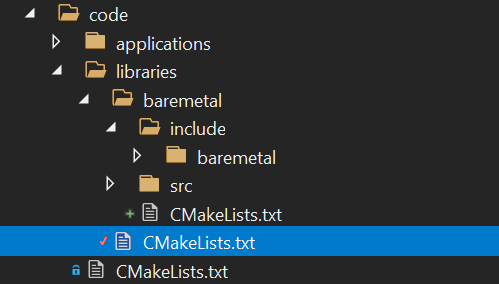
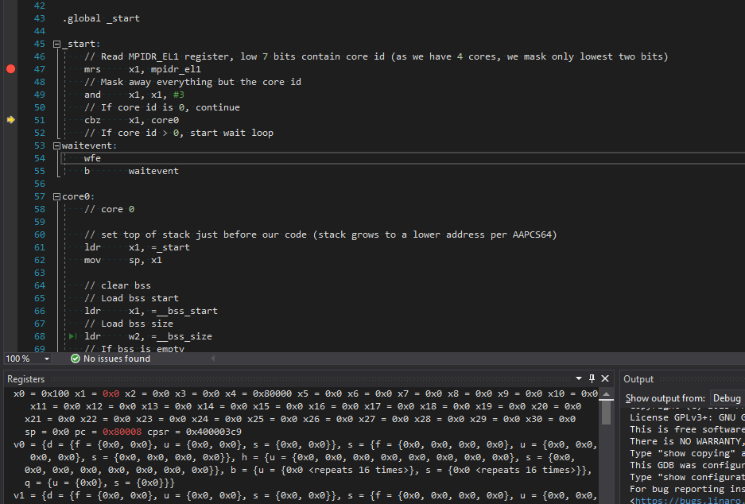
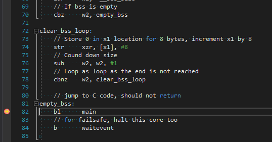

# First application - using the console - UART1

Contents:
- [Creating the baremetal library structure](##Creating-the-baremetal-library-structure)
- [Creating the library code - step 1](##Creating-the-library-code-step-1)
  - [ARMInstructions.h](###ARMInstructions.h)
  - [Dummy.cpp](###Dummy.cpp)
  - [Project setup for baremetal](###Project-setup-for-baremetal)
  - [Update application code](###Update-application-code)
  - [Update project setup for demo application](###Update-project-setup-for-demo-application)
  - [Configure and build](###Configure-and-build-step-1)
  - [Running the application](###Running-the-application-step-1)
- [Creating the library code - step 2](##Creating-the-library-code-step-2)
  - [Macros.h](###Macros.h)
  - [Types.h](###Types.h)
  - [BCMRegisters.h](###BCMRegisters.h)
  - [UART1.h](###UART1.h)
  - [UART1.cpp](###UART1.cpp)
  - [Update Linker Definition file](###Update-Linker-Definition-file)
  - [Update startup code](###Update-startup-code)
  - [Update CMake file for baremetal](###Update-CMake-file-for-baremetal)
  - [Update application](###Update-application)
  - [Update CMake file for applcation](###Update-CMake-file-for-applcation)
  - [Configure and build](###Configure-and-build-step-2)
  - [Running the application](###Running-the-application-step-2)

Now that we have set up our project structure, integrated with Visual Studio, and are able to configure, build, run and debug our projects, let's start some actual development.

One of the simplest things to start with is the serial console.
This is also practical, as using the serial console enables us to write output from the application, and also get input.

There are two serial consoles possible, UART0 and UART1, which can be used in parallel, however it is most common to use one of the two, as they normally use the same GPIO pins (14 and 15).
See also [here](01-setting-up-for-development.md###Attaching-a-serial-console).
For this application, we will use UART1, which is the easiest to set up.
It has less functionality, but for a simple serial console both are equally suitable.

If you're curious to see how this works, or just want to dive directly into the code,
in `tutorials/05-console-uart1` there is a complete copy of what we work towards in this section.
Its root will clearly be `tutorial/05-console-uart1`. Please be aware of this when e.g. debugging, the paths in vs.launch.json may not match your specific case.

## Creating the baremetal library structure

We will first start to create a library named baremetal, which will contain all our basic functionality.

In `code/libraries`, there is a CMake file, that currently only holds the following contents:

```cmake
File: code/libraries/CMakeLists.txt
1: message(STATUS "\n**********************************************************************************\n")
2: message(STATUS "\n## In directory: ${CMAKE_CURRENT_SOURCE_DIR}")
3:
```

- We will create a new folder underneath `code/libraries` named baremetal.
- We will add subdirectories underneath named `include` and `src`, which will hold header (.h) files and source files (.cpp) respectively.
- Underneath `code/libraries/baremetal/include` we will create another directory named `baremetal`. The reason for this will be explained shortly.
- We will create a new `CMakeLists.txt` file in `code/libraries/baremetal` with the following contents:

```cmake
File: code/libraries/baremetal/CMakeLists.txt
1: message(STATUS "\n**********************************************************************************\n")
2: message(STATUS "\n## In directory: ${CMAKE_CURRENT_SOURCE_DIR}")
3:
```

Note that all this can be done from within Visual Studio, of if desired directly on the command line, whatever you prefer.

The file `code/libraries/CMakeLists.txt` will be extended to include our new folder `code/libraries/baremetal`:

```cmake
File: code/libraries/CMakeLists.txt
1: message(STATUS "\n**********************************************************************************\n")
2: message(STATUS "\n## In directory: ${CMAKE_CURRENT_SOURCE_DIR}")
3:
4: add_subdirectory(baremetal)
```

The resulting structure will look like this:



The reason for adding an extra directory with the same name as the library underneath `code/libraries/baremetal/include` is the following:

- It is common practice to export the directory containing the header files to applications, so they can include the header files.
- If we would have two libraries, let's say `lib-one` and `lib-two`, which both contain a header file `inc.h`, and we export `lib-one/include` as well as `lib-two/include` as directories, if the the application wanted to include `inc.h`:

```cpp
#include "inc.h"
```

- Which one would it include? The answer is, it's undefined.
- By adding an extra directory underneath, so `lib-one/include/lib-one`, and `lib-two/include/lib-two`, and then exporting `lib-one/include` and `lib-two/include`, the application could include either:

```cpp
#include "lib-one/inc.h"
#include "lib-two/inc.h"
```

The name of the subdirectory does not matter much, but clearly it is more readable in code to use the name of the library.

## Creating the library code - step 1

So let's start adding some code for the library, and set up the project for this library.

As we will need to add quite some code, let's do it in small steps.

The first step we'll take is including a header to contain standard ARM instructions, starting with the NOP (No operation) instructions. We will then use this in a loop to wait for a while.

### ARMInstructions.h

We add ARM instructions.

```cpp
File: code/libraries/baremetal/include/baremetal/ARMInstructions.h
1: //------------------------------------------------------------------------------
2: // Copyright   : Copyright(c) 2023 Rene Barto
3: //
4: // File        : ArmInstructions.h
5: //
6: // Namespace   : -
7: //
8: // Class       : -
9: //
10: // Description : Common instructions for e.g. synchronization
11: //
12: //------------------------------------------------------------------------------
13: //
14: // Baremetal - A C++ bare metal environment for embedded 64 bit ARM devices
15: //
16: // Intended support is for 64 bit code only, running on Raspberry Pi (3 or 4) and Odroid
17: //
18: // Permission is hereby granted, free of charge, to any person
19: // obtaining a copy of this software and associated documentation
20: // files(the "Software"), to deal in the Software without
21: // restriction, including without limitation the rights to use, copy,
22: // modify, merge, publish, distribute, sublicense, and /or sell copies
23: // of the Software, and to permit persons to whom the Software is
24: // furnished to do so, subject to the following conditions :
25: //
26: // The above copyright notice and this permission notice shall be
27: // included in all copies or substantial portions of the Software.
28: //
29: // THE SOFTWARE IS PROVIDED "AS IS", WITHOUT WARRANTY OF ANY KIND,
30: // EXPRESS OR IMPLIED, INCLUDING BUT NOT LIMITED TO THE WARRANTIES OF
31: // MERCHANTABILITY, FITNESS FOR A PARTICULAR PURPOSE AND
32: // NONINFRINGEMENT.IN NO EVENT SHALL THE AUTHORS OR COPYRIGHT
33: // HOLDERS BE LIABLE FOR ANY CLAIM, DAMAGES OR OTHER LIABILITY,
34: // WHETHER IN AN ACTION OF CONTRACT, TORT OR OTHERWISE, ARISING FROM,
35: // OUT OF OR IN CONNECTION WITH THE SOFTWARE OR THE USE OR OTHER
36: // DEALINGS IN THE SOFTWARE.
37: //
38: //------------------------------------------------------------------------------
39:
40: #pragma once
41:
42: /// @file
43: /// ARM instructions represented as macros for ease of use.
44: ///
45: /// For specific registers, we also define the fields and their possible values.
46:
47: /// @brief NOP instruction
48: #define NOP()                           asm volatile("nop")
```

This header declares standard ARM instructions.
For now we will once use the NOP (no operation) instruction.
More will be added later.

### Dummy.cpp

As the baremetal currently has no source files, only a header file, we will create a dummy C++ file to allow for building the library:

```cpp
File: code/libraries/baremetal/src/Dummy.cpp
1: // This is just a dummy file to allow creating the baremetal project
2:
```

### Project setup for baremetal

First let's set up the project for the library:

```cmake
File: code/libraries/baremetal/CMakeLists.txt
1: message(STATUS "\n**********************************************************************************\n")
2: message(STATUS "\n## In directory: ${CMAKE_CURRENT_SOURCE_DIR}")
3:
4: project(baremetal
5:     DESCRIPTION "Bare metal library"
6:     LANGUAGES CXX ASM)
7:
8: set(PROJECT_TARGET_NAME ${PROJECT_NAME})
9:
10: set(PROJECT_COMPILE_DEFINITIONS_CXX_PRIVATE ${COMPILE_DEFINITIONS_C})
11: set(PROJECT_COMPILE_DEFINITIONS_CXX_PUBLIC )
12: set(PROJECT_COMPILE_DEFINITIONS_ASM_PRIVATE ${COMPILE_DEFINITIONS_ASM})
13: set(PROJECT_COMPILE_OPTIONS_CXX_PRIVATE ${COMPILE_OPTIONS_CXX})
14: set(PROJECT_COMPILE_OPTIONS_CXX_PUBLIC )
15: set(PROJECT_COMPILE_OPTIONS_ASM_PRIVATE ${COMPILE_OPTIONS_ASM})
16: set(PROJECT_INCLUDE_DIRS_PRIVATE )
17: set(PROJECT_INCLUDE_DIRS_PUBLIC ${CMAKE_CURRENT_SOURCE_DIR}/include)
18:
19: set(PROJECT_LINK_OPTIONS ${LINKER_OPTIONS})
20:
21: set(PROJECT_DEPENDENCIES
22:     )
23:
24: set(PROJECT_LIBS
25:     ${LINKER_LIBRARIES}
26:     ${PROJECT_DEPENDENCIES}
27:     )
28:
29: set(PROJECT_SOURCES
30:     ${CMAKE_CURRENT_SOURCE_DIR}/src/Dummy.cpp
31:     )
32:
33: set(PROJECT_INCLUDES_PUBLIC
34:     ${CMAKE_CURRENT_SOURCE_DIR}/include/baremetal/ARMInstructions.h
35:     )
36: set(PROJECT_INCLUDES_PRIVATE )
37:
38: if (CMAKE_VERBOSE_MAKEFILE)
39:     display_list("Package                           : " ${PROJECT_NAME} )
40:     display_list("Package description               : " ${PROJECT_DESCRIPTION} )
41:     display_list("Defines C - public                : " ${PROJECT_COMPILE_DEFINITIONS_C_PUBLIC} )
42:     display_list("Defines C - private               : " ${PROJECT_COMPILE_DEFINITIONS_C_PRIVATE} )
43:     display_list("Defines C++ - public              : " ${PROJECT_COMPILE_DEFINITIONS_CXX_PUBLIC} )
44:     display_list("Defines C++ - private             : " ${PROJECT_COMPILE_DEFINITIONS_CXX_PRIVATE} )
45:     display_list("Defines ASM - private             : " ${PROJECT_COMPILE_DEFINITIONS_ASM_PRIVATE} )
46:     display_list("Compiler options C - public       : " ${PROJECT_COMPILE_OPTIONS_C_PUBLIC} )
47:     display_list("Compiler options C - private      : " ${PROJECT_COMPILE_OPTIONS_C_PRIVATE} )
48:     display_list("Compiler options C++ - public     : " ${PROJECT_COMPILE_OPTIONS_CXX_PUBLIC} )
49:     display_list("Compiler options C++ - private    : " ${PROJECT_COMPILE_OPTIONS_CXX_PRIVATE} )
50:     display_list("Compiler options ASM - private    : " ${PROJECT_COMPILE_OPTIONS_ASM_PRIVATE} )
51:     display_list("Include dirs - public             : " ${PROJECT_INCLUDE_DIRS_PUBLIC} )
52:     display_list("Include dirs - private            : " ${PROJECT_INCLUDE_DIRS_PRIVATE} )
53:     display_list("Linker options                    : " ${PROJECT_LINK_OPTIONS} )
54:     display_list("Dependencies                      : " ${PROJECT_DEPENDENCIES} )
55:     display_list("Link libs                         : " ${PROJECT_LIBS} )
56:     display_list("Source files                      : " ${PROJECT_SOURCES} )
57:     display_list("Include files - public            : " ${PROJECT_INCLUDES_PUBLIC} )
58:     display_list("Include files - private           : " ${PROJECT_INCLUDES_PRIVATE} )
59: endif()
60:
61: add_library(${PROJECT_NAME} STATIC ${PROJECT_SOURCES} ${PROJECT_INCLUDES_PUBLIC} ${PROJECT_INCLUDES_PRIVATE})
62: target_link_libraries(${PROJECT_NAME} ${PROJECT_LIBS})
63: target_include_directories(${PROJECT_NAME} PRIVATE ${PROJECT_INCLUDE_DIRS_PRIVATE})
64: target_include_directories(${PROJECT_NAME} PUBLIC  ${PROJECT_INCLUDE_DIRS_PUBLIC})
65: target_compile_definitions(${PROJECT_NAME} PRIVATE
66:     $<$<COMPILE_LANGUAGE:C>:${PROJECT_COMPILE_DEFINITIONS_C_PRIVATE}>
67:     $<$<COMPILE_LANGUAGE:CXX>:${PROJECT_COMPILE_DEFINITIONS_CXX_PRIVATE}>
68:     $<$<COMPILE_LANGUAGE:ASM>:${PROJECT_COMPILE_DEFINITIONS_ASM_PRIVATE}>
69:     )
70: target_compile_definitions(${PROJECT_NAME} PUBLIC
71:     $<$<COMPILE_LANGUAGE:C>:${PROJECT_COMPILE_DEFINITIONS_C_PUBLIC}>
72:     $<$<COMPILE_LANGUAGE:CXX>:${PROJECT_COMPILE_DEFINITIONS_CXX_PUBLIC}>
73:     $<$<COMPILE_LANGUAGE:ASM>:${PROJECT_COMPILE_DEFINITIONS_ASM_PUBLIC}>
74:     )
75: target_compile_options(${PROJECT_NAME} PRIVATE
76:     $<$<COMPILE_LANGUAGE:C>:${PROJECT_COMPILE_OPTIONS_C_PRIVATE}>
77:     $<$<COMPILE_LANGUAGE:CXX>:${PROJECT_COMPILE_OPTIONS_CXX_PRIVATE}>
78:     $<$<COMPILE_LANGUAGE:ASM>:${PROJECT_COMPILE_OPTIONS_ASM_PRIVATE}>
79:     )
80: target_compile_options(${PROJECT_NAME} PUBLIC
81:     $<$<COMPILE_LANGUAGE:C>:${PROJECT_COMPILE_OPTIONS_C_PUBLIC}>
82:     $<$<COMPILE_LANGUAGE:CXX>:${PROJECT_COMPILE_OPTIONS_CXX_PUBLIC}>
83:     $<$<COMPILE_LANGUAGE:ASM>:${PROJECT_COMPILE_OPTIONS_ASM_PUBLIC}>
84:     )
85:
86: set_property(TARGET ${PROJECT_NAME} PROPERTY CXX_STANDARD ${SUPPORTED_CPP_STANDARD})
87:
88: list_to_string(PROJECT_LINK_OPTIONS PROJECT_LINK_OPTIONS_STRING)
89: if (NOT "${PROJECT_LINK_OPTIONS_STRING}" STREQUAL "")
90:     set_target_properties(${PROJECT_NAME} PROPERTIES LINK_FLAGS "${PROJECT_LINK_OPTIONS_STRING}")
91: endif()
92:
93: link_directories(${LINK_DIRECTORIES})
94: set_target_properties(${PROJECT_NAME} PROPERTIES OUTPUT_NAME ${PROJECT_TARGET_NAME})
95: set_target_properties(${PROJECT_NAME} PROPERTIES ARCHIVE_OUTPUT_DIRECTORY ${OUTPUT_LIB_DIR})
96:
97: show_target_properties(${PROJECT_NAME})
```

You will recognize the structure used in the previous demo project, with a one addition:

- line 17: We export the `code/libraries/baremetal/include` directory publicly
- line 34: We export the file `code/libraries/baremetal/include/baremetal/ARMInstructions.h` publicly

### Update application code

We will use the NOP instruction (which is part of the baremetal library) in a simple loop:

```cpp
File: code/applications/demo/src/main.cpp
1: #include "baremetal/ARMInstructions.h"
2:
3: int main()
4: {
5:     for (int i = 0; i < 1000000; ++i)
6:     {
7:         NOP();
8:     }
9:     return 0;
10: }
```

### Update project setup for demo application

We will update the demo application to add a dependency on the baremetal library:

```cmake
File: code/applications/demo/CMakeLists.txt
1: project(demo
2:     DESCRIPTION "Demo application"
3:     LANGUAGES CXX ASM)
4:
5: message(STATUS "\n**********************************************************************************\n")
6: message(STATUS "\n## In directory: ${CMAKE_CURRENT_SOURCE_DIR}")
7:
8: message("\n** Setting up ${PROJECT_NAME} **\n")
9:
10: include(functions)
11:
12: set(PROJECT_TARGET_NAME ${PROJECT_NAME}.elf)
13:
14: set(PROJECT_COMPILE_DEFINITIONS_CXX_PRIVATE ${COMPILE_DEFINITIONS_C})
15: set(PROJECT_COMPILE_DEFINITIONS_CXX_PUBLIC )
16: set(PROJECT_COMPILE_DEFINITIONS_ASM_PRIVATE ${COMPILE_DEFINITIONS_ASM})
17: set(PROJECT_COMPILE_OPTIONS_CXX_PRIVATE ${COMPILE_OPTIONS_CXX})
18: set(PROJECT_COMPILE_OPTIONS_CXX_PUBLIC )
19: set(PROJECT_COMPILE_OPTIONS_ASM_PRIVATE ${COMPILE_OPTIONS_ASM})
20: set(PROJECT_INCLUDE_DIRS_PRIVATE )
21: set(PROJECT_INCLUDE_DIRS_PUBLIC )
22:
23: set(PROJECT_LINK_OPTIONS ${LINKER_OPTIONS})
24:
25: set(PROJECT_DEPENDENCIES
26:     baremetal
27:     )
28:
29: set(PROJECT_LIBS
30:     ${LINKER_LIBRARIES}
31:     ${PROJECT_DEPENDENCIES}
32:     )
...
```

- line 26: We add a dependency to the baremetal library, such that its exported include directories become available, and we link to this library.

### Configure and build - Step 1

We are now able to configure the project again, and build it.

The output for the configure step should be similar to:

```text
1> CMake generation started for configuration: 'BareMetal-Debug'.
1> Command line: "C:\Windows\system32\cmd.exe" /c "%SYSTEMROOT%\System32\chcp.com 65001 >NUL && "C:\PROGRAM FILES (X86)\MICROSOFT VISUAL STUDIO\2019\COMMUNITY\COMMON7\IDE\COMMONEXTENSIONS\MICROSOFT\CMAKE\CMake\bin\cmake.exe"  -G "Ninja"  -DCMAKE_BUILD_TYPE:STRING="Debug" -DCMAKE_INSTALL_PREFIX:PATH="D:\Projects\baremetal.github\output\install\BareMetal-Debug" -DCMAKE_TOOLCHAIN_FILE:FILEPATH="D:\Projects\baremetal.github\baremetal.toolchain" -DVERBOSE_BUILD=ON -DBAREMETAL_TARGET=RPI3 -DCMAKE_MAKE_PROGRAM="C:\PROGRAM FILES (X86)\MICROSOFT VISUAL STUDIO\2019\COMMUNITY\COMMON7\IDE\COMMONEXTENSIONS\MICROSOFT\CMAKE\Ninja\ninja.exe" "D:\Projects\baremetal.github" 2>&1"
1> Working directory: D:\Projects\baremetal.github\cmake-BareMetal-Debug
1> [CMake] -- CMake 3.20.21032501-MSVC_2
1> [CMake] -- Building for Raspberry Pi 3
1> [CMake] --
1> [CMake] ** Setting up project **
1> [CMake] --
1> [CMake] --
1> [CMake] ##################################################################################
1> [CMake] --
1> [CMake] ** Setting up toolchain **
1> [CMake] --
1> [CMake] -- TOOLCHAIN_ROOT           D:\toolchains\arm-gnu-toolchain-13.2.rel1-mingw-w64-i686-aarch64-none-elf
1> [CMake] -- Processor                aarch64
1> [CMake] -- Platform tuple           aarch64-none-elf
1> [CMake] -- Assembler                D:/Toolchains/arm-gnu-toolchain-13.2.Rel1-mingw-w64-i686-aarch64-none-elf/bin/aarch64-none-elf-gcc.exe
1> [CMake] -- C compiler               D:/toolchains/arm-gnu-toolchain-13.2.rel1-mingw-w64-i686-aarch64-none-elf/bin/aarch64-none-elf-gcc.exe
1> [CMake] -- C++ compiler             D:/toolchains/arm-gnu-toolchain-13.2.rel1-mingw-w64-i686-aarch64-none-elf/bin/aarch64-none-elf-g++.exe
1> [CMake] -- Archiver                 D:/toolchains/arm-gnu-toolchain-13.2.rel1-mingw-w64-i686-aarch64-none-elf/bin/aarch64-none-elf-ar.exe
1> [CMake] -- Linker                   D:/toolchains/arm-gnu-toolchain-13.2.rel1-mingw-w64-i686-aarch64-none-elf/bin/aarch64-none-elf-ld.exe
1> [CMake] -- ObjCopy                  D:/toolchains/arm-gnu-toolchain-13.2.rel1-mingw-w64-i686-aarch64-none-elf/bin/aarch64-none-elf-objcopy.exe
1> [CMake] -- Std include path         D:\toolchains\arm-gnu-toolchain-13.2.rel1-mingw-w64-i686-aarch64-none-elf/lib/gcc/aarch64-none-elf/13.2.1/include
1> [CMake] -- CMAKE_EXE_LINKER_FLAGS=   -LD:\toolchains\arm-gnu-toolchain-13.2.rel1-mingw-w64-i686-aarch64-none-elf/lib/gcc/aarch64-none-elf/13.2.1
1> [CMake] --
1> [CMake] ** Setting up project **
1> [CMake] --
1> [CMake] --
1> [CMake] ##################################################################################
1> [CMake] --
1> [CMake] ** Setting up toolchain **
1> [CMake] --
1> [CMake] -- C++ compiler version:    13.2.1
1> [CMake] -- C compiler version:      13.2.1
1> [CMake] -- C++ supported standard:  17
1> [CMake] --
1> [CMake] **********************************************************************************
1> [CMake]
1> [CMake] --
1> [CMake] ## In directory: D:/Projects/baremetal.github/code
1> [CMake] --
1> [CMake] **********************************************************************************
1> [CMake]
1> [CMake] --
1> [CMake] ## In directory: D:/Projects/baremetal.github/code/applications
1> [CMake] --
1> [CMake] **********************************************************************************
1> [CMake]
1> [CMake] --
1> [CMake] ## In directory: D:/Projects/baremetal.github/code/applications/demo
1> [CMake]
1> [CMake] ** Setting up demo **
1> [CMake]
1> [CMake] -- Package                           :  demo
1> [CMake] -- Package description               :  Demo application
1> [CMake] -- Defines C - public                :
1> [CMake] -- Defines C - private               :
1> [CMake] -- Defines C++ - public              :
1> [CMake] -- Defines C++ - private             :  PLATFORM_BAREMETAL RPI_TARGET=3 _DEBUG
1> [CMake] -- Defines ASM - private             :  PLATFORM_BAREMETAL RPI_TARGET=3
1> [CMake] -- Compiler options C - public       :
1> [CMake] -- Compiler options C - private      :
1> [CMake] -- Compiler options C++ - public     :
1> [CMake] -- Compiler options C++ - private    :  -mcpu=cortex-a53 -mlittle-endian -mcmodel=small -Wall -Wextra -Werror -Wno-missing-field-initializers -Wno-unused-value -Wno-aligned-new -ffreestanding -fsigned-char -nostartfiles -mno-outline-atomics -nostdinc -nostdlib -nostdinc++ -fno-exceptions -fno-rtti -O0 -Wno-unused-variable -Wno-unused-parameter
1> [CMake] -- Compiler options ASM - private    :  -mcpu=cortex-a53 -mlittle-endian -mcmodel=small -O2
1> [CMake] -- Include dirs - public             :
1> [CMake] -- Include dirs - private            :
1> [CMake] -- Linker options                    :  -Wl,--section-start=.init=0x80000 -T D:/Projects/baremetal.github/baremetal.ld -nostdlib -nostartfiles
1> [CMake] -- Dependencies                      :  baremetal
1> [CMake] -- Link libs                         :  baremetal
1> [CMake] -- Source files                      :  D:/Projects/baremetal.github/code/applications/demo/src/main.cpp D:/Projects/baremetal.github/code/applications/demo/src/start.S
1> [CMake] -- Include files - public            :
1> [CMake] -- Include files - private           :
1> [CMake] --
1> [CMake] -- Properties for demo
1> [CMake] -- Target type                       :  EXECUTABLE
1> [CMake] -- Target defines                    :  $<$<COMPILE_LANGUAGE:C>:> $<$<COMPILE_LANGUAGE:CXX>:PLATFORM_BAREMETAL RPI_TARGET=3 _DEBUG> $<$<COMPILE_LANGUAGE:ASM>:PLATFORM_BAREMETAL RPI_TARGET=3> $<$<COMPILE_LANGUAGE:C>:> $<$<COMPILE_LANGUAGE:CXX>:> $<$<COMPILE_LANGUAGE:ASM>:>
1> [CMake] -- Target options                    :  $<$<COMPILE_LANGUAGE:C>:> $<$<COMPILE_LANGUAGE:CXX>:-mcpu=cortex-a53 -mlittle-endian -mcmodel=small -Wall -Wextra -Werror -Wno-missing-field-initializers -Wno-unused-value -Wno-aligned-new -ffreestanding -fsigned-char -nostartfiles -mno-outline-atomics -nostdinc -nostdlib -nostdinc++ -fno-exceptions -fno-rtti -O0 -Wno-unused-variable -Wno-unused-parameter> $<$<COMPILE_LANGUAGE:ASM>:-mcpu=cortex-a53 -mlittle-endian -mcmodel=small -O2> $<$<COMPILE_LANGUAGE:C>:> $<$<COMPILE_LANGUAGE:CXX>:> $<$<COMPILE_LANGUAGE:ASM>:>
1> [CMake] -- Target include dirs public        :  INCLUDES-NOTFOUND
1> [CMake] -- Target include dirs private       :  INCLUDES-NOTFOUND
1> [CMake] -- Target link libraries             :  -Wl,--start-group baremetal -Wl,--end-group
1> [CMake] -- Target link options               :  -Wl,--section-start=.init=0x80000 -T D:/Projects/baremetal.github/baremetal.ld -nostdlib -nostartfiles
1> [CMake] -- Target exported defines           :  $<$<COMPILE_LANGUAGE:C>:> $<$<COMPILE_LANGUAGE:CXX>:> $<$<COMPILE_LANGUAGE:ASM>:>
1> [CMake] -- Target exported options           :  $<$<COMPILE_LANGUAGE:C>:> $<$<COMPILE_LANGUAGE:CXX>:> $<$<COMPILE_LANGUAGE:ASM>:>
1> [CMake] -- Target exported include dirs      :  INCLUDE_DIRS_EXPORTS-NOTFOUND
1> [CMake] -- Target exported link libraries    :  -Wl,--start-group baremetal -Wl,--end-group
1> [CMake] -- Target imported dependencies      :
1> [CMake] -- Target imported link libraries    :
1> [CMake] -- Target link dependencies          :  LINK_DEPENDENCIES-NOTFOUND
1> [CMake] -- Target manual dependencies        :  EXPLICIT_DEPENDENCIES-NOTFOUND
1> [CMake] -- Target static library location    :  D:/Projects/baremetal.github/output/Debug/lib
1> [CMake] -- Target dynamic library location   :  LIBRARY_LOCATION-NOTFOUND
1> [CMake] -- Target binary location            :  D:/Projects/baremetal.github/output/Debug/bin
1> [CMake] -- Target link flags                 :  -Wl,--section-start=.init=0x80000 -T D:/Projects/baremetal.github/baremetal.ld -nostdlib -nostartfiles
1> [CMake] -- Target version                    :  TARGET_VERSION-NOTFOUND
1> [CMake] -- Target so-version                 :  TARGET_SOVERSION-NOTFOUND
1> [CMake] -- Target output name                :  demo.elf
1> [CMake] --
1> [CMake] **********************************************************************************
1> [CMake]
1> [CMake] --
1> [CMake] ## In directory: D:/Projects/baremetal.github/code/applications/demo/create-image
1> [CMake]
1> [CMake] ** Setting up demo-image **
1> [CMake]
1> [CMake] -- create_image demo-image kernel8.img demo
1> [CMake] -- TARGET_NAME demo.elf
1> [CMake] -- generate D:/Projects/baremetal.github/deploy/Debug/demo-image/kernel8.img from D:/Projects/baremetal.github/output/Debug/bin/demo
1> [CMake] --
1> [CMake] **********************************************************************************
1> [CMake]
1> [CMake] --
1> [CMake] ## In directory: D:/Projects/baremetal.github/code/libraries
1> [CMake] --
1> [CMake] **********************************************************************************
1> [CMake]
1> [CMake] --
1> [CMake] ## In directory: D:/Projects/baremetal.github/code/libraries/baremetal
1> [CMake] -- Package                           :  baremetal
1> [CMake] -- Package description               :  Bare metal library
1> [CMake] -- Defines C - public                :
1> [CMake] -- Defines C - private               :
1> [CMake] -- Defines C++ - public              :
1> [CMake] -- Defines C++ - private             :  PLATFORM_BAREMETAL RPI_TARGET=3 _DEBUG
1> [CMake] -- Defines ASM - private             :  PLATFORM_BAREMETAL RPI_TARGET=3
1> [CMake] -- Compiler options C - public       :
1> [CMake] -- Compiler options C - private      :
1> [CMake] -- Compiler options C++ - public     :
1> [CMake] -- Compiler options C++ - private    :  -mcpu=cortex-a53 -mlittle-endian -mcmodel=small -Wall -Wextra -Werror -Wno-missing-field-initializers -Wno-unused-value -Wno-aligned-new -ffreestanding -fsigned-char -nostartfiles -mno-outline-atomics -nostdinc -nostdlib -nostdinc++ -fno-exceptions -fno-rtti -O0 -Wno-unused-variable -Wno-unused-parameter
1> [CMake] -- Compiler options ASM - private    :  -mcpu=cortex-a53 -mlittle-endian -mcmodel=small -O2
1> [CMake] -- Include dirs - public             :  D:/Projects/baremetal.github/code/libraries/baremetal/include
1> [CMake] -- Include dirs - private            :
1> [CMake] -- Linker options                    :  -Wl,--section-start=.init=0x80000 -T D:/Projects/baremetal.github/baremetal.ld -nostdlib -nostartfiles
1> [CMake] -- Dependencies                      :
1> [CMake] -- Link libs                         :
1> [CMake] -- Source files                      :  D:/Projects/baremetal.github/code/libraries/baremetal/src/Dummy.cpp
1> [CMake] -- Include files - public            :  D:/Projects/baremetal.github/code/libraries/baremetal/include/baremetal/ARMInstructions.h
1> [CMake] -- Include files - private           :
1> [CMake] --
1> [CMake] -- Properties for baremetal
1> [CMake] -- Target type                       :  STATIC_LIBRARY
1> [CMake] -- Target defines                    :  $<$<COMPILE_LANGUAGE:C>:> $<$<COMPILE_LANGUAGE:CXX>:PLATFORM_BAREMETAL RPI_TARGET=3 _DEBUG> $<$<COMPILE_LANGUAGE:ASM>:PLATFORM_BAREMETAL RPI_TARGET=3> $<$<COMPILE_LANGUAGE:C>:> $<$<COMPILE_LANGUAGE:CXX>:> $<$<COMPILE_LANGUAGE:ASM>:>
1> [CMake] -- Target options                    :  $<$<COMPILE_LANGUAGE:C>:> $<$<COMPILE_LANGUAGE:CXX>:-mcpu=cortex-a53 -mlittle-endian -mcmodel=small -Wall -Wextra -Werror -Wno-missing-field-initializers -Wno-unused-value -Wno-aligned-new -ffreestanding -fsigned-char -nostartfiles -mno-outline-atomics -nostdinc -nostdlib -nostdinc++ -fno-exceptions -fno-rtti -O0 -Wno-unused-variable -Wno-unused-parameter> $<$<COMPILE_LANGUAGE:ASM>:-mcpu=cortex-a53 -mlittle-endian -mcmodel=small -O2> $<$<COMPILE_LANGUAGE:C>:> $<$<COMPILE_LANGUAGE:CXX>:> $<$<COMPILE_LANGUAGE:ASM>:>
1> [CMake] -- Target include dirs public        :  D:/Projects/baremetal.github/code/libraries/baremetal/include
1> [CMake] -- Target include dirs private       :  D:/Projects/baremetal.github/code/libraries/baremetal/include
1> [CMake] -- Target link libraries             :  LIBRARIES-NOTFOUND
1> [CMake] -- Target link options               :  -Wl,--section-start=.init=0x80000 -T D:/Projects/baremetal.github/baremetal.ld -nostdlib -nostartfiles
1> [CMake] -- Target exported defines           :  $<$<COMPILE_LANGUAGE:C>:> $<$<COMPILE_LANGUAGE:CXX>:> $<$<COMPILE_LANGUAGE:ASM>:>
1> [CMake] -- Target exported options           :  $<$<COMPILE_LANGUAGE:C>:> $<$<COMPILE_LANGUAGE:CXX>:> $<$<COMPILE_LANGUAGE:ASM>:>
1> [CMake] -- Target exported include dirs      :  D:/Projects/baremetal.github/code/libraries/baremetal/include
1> [CMake] -- Target exported link libraries    :  LIBRARIES_EXPORTS-NOTFOUND
1> [CMake] -- Target imported dependencies      :
1> [CMake] -- Target imported link libraries    :
1> [CMake] -- Target link dependencies          :  LINK_DEPENDENCIES-NOTFOUND
1> [CMake] -- Target manual dependencies        :  EXPLICIT_DEPENDENCIES-NOTFOUND
1> [CMake] -- Target static library location    :  D:/Projects/baremetal.github/output/Debug/lib
1> [CMake] -- Target dynamic library location   :  LIBRARY_LOCATION-NOTFOUND
1> [CMake] -- Target binary location            :  RUNTIME_LOCATION-NOTFOUND
1> [CMake] -- Target link flags                 :  -Wl,--section-start=.init=0x80000 -T D:/Projects/baremetal.github/baremetal.ld -nostdlib -nostartfiles
1> [CMake] -- Target version                    :  TARGET_VERSION-NOTFOUND
1> [CMake] -- Target so-version                 :  TARGET_SOVERSION-NOTFOUND
1> [CMake] -- Target output name                :  baremetal
1> [CMake] -- Configuring done
1> [CMake] -- Generating done
1> [CMake] -- Build files have been written to: D:/Projects/baremetal.github/cmake-BareMetal-Debug
1> Extracted CMake variables.
1> Extracted source files and headers.
1> Extracted code model.
1> Extracted toolchain configurations.
1> Extracted includes paths.
1> CMake generation finished.
```

You will notice that now, also the baremetal library is included, and the application project has a dependency on baremetal.

We can then build:

```text
>------ Rebuild All started: Project: baremetal, Configuration: BareMetal-Debug ------
  [1/1] "C:\Program Files (x86)\Microsoft Visual Studio\2019\Community\Common7\IDE\CommonExtensions\Microsoft\CMake\Ninja\ninja.exe"  -t clean
  Cleaning... 2 files.
  [1/6] D:\toolchains\arm-gnu-toolchain-13.2.rel1-mingw-w64-i686-aarch64-none-elf\bin\aarch64-none-elf-g++.exe -DPLATFORM_BAREMETAL -DRPI_TARGET=3 -D_DEBUG -I../code/libraries/baremetal/include -g -mcpu=cortex-a53 -mlittle-endian -mcmodel=small -Wall -Wextra -Werror -Wno-missing-field-initializers -Wno-unused-value -Wno-aligned-new -ffreestanding -fsigned-char -nostartfiles -mno-outline-atomics -nostdinc -nostdlib -nostdinc++ -fno-exceptions -fno-rtti -O0 -Wno-unused-variable -Wno-unused-parameter -std=gnu++17 -MD -MT code/libraries/baremetal/CMakeFiles/baremetal.dir/src/dummy.cpp.obj -MF code\libraries\baremetal\CMakeFiles\baremetal.dir\src\dummy.cpp.obj.d -o code/libraries/baremetal/CMakeFiles/baremetal.dir/src/dummy.cpp.obj -c ../code/libraries/baremetal/src/dummy.cpp
  [2/6] D:\Toolchains\arm-gnu-toolchain-13.2.Rel1-mingw-w64-i686-aarch64-none-elf\bin\aarch64-none-elf-gcc.exe -DPLATFORM_BAREMETAL -DRPI_TARGET=3 -I../code/libraries/baremetal/include -g -mcpu=cortex-a53 -mlittle-endian -mcmodel=small -O2 -MD -MT code/applications/demo/CMakeFiles/demo.dir/src/start.S.obj -MF code\applications\demo\CMakeFiles\demo.dir\src\start.S.obj.d -o code/applications/demo/CMakeFiles/demo.dir/src/start.S.obj -c ../code/applications/demo/src/start.S
  [3/6] D:\toolchains\arm-gnu-toolchain-13.2.rel1-mingw-w64-i686-aarch64-none-elf\bin\aarch64-none-elf-g++.exe -DPLATFORM_BAREMETAL -DRPI_TARGET=3 -D_DEBUG -I../code/libraries/baremetal/include -g -mcpu=cortex-a53 -mlittle-endian -mcmodel=small -Wall -Wextra -Werror -Wno-missing-field-initializers -Wno-unused-value -Wno-aligned-new -ffreestanding -fsigned-char -nostartfiles -mno-outline-atomics -nostdinc -nostdlib -nostdinc++ -fno-exceptions -fno-rtti -O0 -Wno-unused-variable -Wno-unused-parameter -std=gnu++17 -MD -MT code/applications/demo/CMakeFiles/demo.dir/src/main.cpp.obj -MF code\applications\demo\CMakeFiles\demo.dir\src\main.cpp.obj.d -o code/applications/demo/CMakeFiles/demo.dir/src/main.cpp.obj -c ../code/applications/demo/src/main.cpp
  [4/6] cmd.exe /C "cd . && "C:\Program Files (x86)\Microsoft Visual Studio\2019\Community\Common7\IDE\CommonExtensions\Microsoft\CMake\CMake\bin\cmake.exe" -E rm -f ..\output\Debug\lib\libbaremetal.a && D:\toolchains\arm-gnu-toolchain-13.2.rel1-mingw-w64-i686-aarch64-none-elf\bin\aarch64-none-elf-ar.exe qc ..\output\Debug\lib\libbaremetal.a  code/libraries/baremetal/CMakeFiles/baremetal.dir/src/dummy.cpp.obj && D:\Toolchains\arm-gnu-toolchain-13.2.Rel1-mingw-w64-i686-aarch64-none-elf\bin\aarch64-none-elf-ranlib.exe ..\output\Debug\lib\libbaremetal.a && cd ."
  [5/6] cmd.exe /C "cd . && D:\toolchains\arm-gnu-toolchain-13.2.rel1-mingw-w64-i686-aarch64-none-elf\bin\aarch64-none-elf-g++.exe -g -LD:\toolchains\arm-gnu-toolchain-13.2.rel1-mingw-w64-i686-aarch64-none-elf/lib/gcc/aarch64-none-elf/13.2.1   -Wl,--section-start=.init=0x80000 -T D:/Projects/baremetal.github/baremetal.ld -nostdlib -nostartfiles code/applications/demo/CMakeFiles/demo.dir/src/main.cpp.obj code/applications/demo/CMakeFiles/demo.dir/src/start.S.obj -o ..\output\Debug\bin\demo.elf  -Wl,--start-group  ../output/Debug/lib/libbaremetal.a  -Wl,--end-group && cd ."
  [6/6] cmd.exe /C "cd /D D:\Projects\baremetal.github\cmake-BareMetal-Debug\code\applications\demo\create-image && D:\toolchains\arm-gnu-toolchain-13.2.rel1-mingw-w64-i686-aarch64-none-elf\bin\aarch64-none-elf-objcopy.exe D:/Projects/baremetal.github/output/Debug/bin/demo.elf -O binary D:/Projects/baremetal.github/deploy/Debug/demo-image/kernel8.img"

Rebuild All succeeded.
```

- You can see that the baremetal library's Dummy.cpp file is compiled (step 1)
- Then the demo application's start.S and main.cpp files are compiled (step 2 and 3).
- Then the baremetal library is removed and re-created (step 4).
- The demo application is linked, using the baremetal library (step 5)
- And finally the image is created (step 6).

The only different steps are step 4 and 5.

#### Removing and re-creating the baremetal library (step 4)

The baremetal library is removed and re-created using the following command:

```text
cmd.exe /C
  "cd . &&
  "C:\Program Files (x86)\Microsoft Visual Studio\2019\Community\Common7\IDE\CommonExtensions\Microsoft\CMake\CMake\bin\cmake.exe"
    -E rm -f ..\output\Debug\lib\libbaremetal.a &&
    D:\toolchains\arm-gnu-toolchain-13.2.rel1-mingw-w64-i686-aarch64-none-elf\bin\aarch64-none-elf-ar.exe
      qc ..\output\Debug\lib\libbaremetal.a
      code/libraries/baremetal/CMakeFiles/baremetal.dir/src/dummy.cpp.obj &&
    D:\Toolchains\arm-gnu-toolchain-13.2.Rel1-mingw-w64-i686-aarch64-none-elf\bin\aarch64-none-elf-ranlib.exe
      ..\output\Debug\lib\libbaremetal.a &&
    cd ."
```

Here we see a total of 2 commands being performed inside a command shell:

1. This is just a cd command (actually moving to the same directory)
2. This is a cmake call to remove the baremetal library, which runs another command shell containing 4 commands:
  1. This command removes the baremetal library `output\Debug\lib\libbaremetal.a` (relative to the CMake build directory)
  2. This creates the baremetal library (the options qc mean _quick append_ and _create_)
  3. This adds a symbol to the baremetal library
  4. This is again a cd command to the same directory

#### Linking the demo application (step 5)

```text
cmd.exe /C
  "cd . &&
  D:\toolchains\arm-gnu-toolchain-13.2.rel1-mingw-w64-i686-aarch64-none-elf\bin\aarch64-none-elf-g++.exe
    -g
    -LD:\toolchains\arm-gnu-toolchain-13.2.rel1-mingw-w64-i686-aarch64-none-elf/lib/gcc/aarch64-none-elf/13.2.1
    -Wl,--section-start=.init=0x80000 -T D:/Projects/baremetal.github/baremetal.ld
    -nostdlib -nostartfiles
    code/applications/demo/CMakeFiles/demo.dir/src/main.cpp.obj
    code/applications/demo/CMakeFiles/demo.dir/src/start.S.obj
    -o ..\output\Debug\bin\demo.elf
    -Wl,--start-group  ../output/Debug/lib/libbaremetal.a  -Wl,--end-group &&
  cd ."
```

This is almost the same as shown before, the only difference is that now, the libary group contains the baremetal library:
```text
-Wl,--start-group  ../output/Debug/lib/libbaremetal.a  -Wl,--end-group
```

This is due to the added dependency on baremetal in the application's CMake file.

### Running the application - Step 1

Start QEMU, and start debugging as before, only this time, set a breakpoint on line 47 of start.S.



As you can see, we can also debug inside the assembly code. You can step through and see the code inside main() be called.
One thing you will see after continuing to the next line, is that register x1 is filled with value 0x80000000, which after masking results in 0x00000000. In other words, we're running on core 0.
The other cores will not run, as we did not allow them to yet.

One important remark however:
- The code that sets the stack pointer tends to throw the debugger off balance. So in this case it is better to also set a breakpoint on line 82 of start.S, and simply continue once you get to line 62.
- Next to this, you might notice a bit of unstable behaviour which we will come to next. This has to do with the startup code.



## Creating the library code - step 2

Let's try and write something more useful. We'll write code to set up UART1 and the GPIO pins, and write a string to the console.

In order to set up the console, we will need access to two devices:
- GPIO to set up the connections for UART1 to GPIO pins 14 and 15
- UART1 to configure the console and write to it

In order to access these devices, we'll add a header file with addresses for the different registers.

For this header, we also need some standard definitions and types, so we'll add these first.

### Macros.h

We'll add some basic definitions first.
Add the file `code/libraries/baremetal/include/baremetal/Macros.h`:

```cpp
File: code/libraries/baremetal/include/baremetal/Macros.h
1: //------------------------------------------------------------------------------
2: // Copyright   : Copyright(c) 2023 Rene Barto
3: //
4: // File        : Macros.h
5: //
6: // Namespace   : -
7: //
8: // Class       : -
9: //
10: // Description : Common defines
11: //
12: //------------------------------------------------------------------------------
13: //
14: // Baremetal - A C++ bare metal environment for embedded 64 bit ARM CharDevices
15: //
16: // Intended support is for 64 bit code only, running on Raspberry Pi (3 or 4) and Odroid
17: //
18: // Permission is hereby granted, free of charge, to any person
19: // obtaining a copy of this software and associated documentation
20: // files(the "Software"), to deal in the Software without
21: // restriction, including without limitation the rights to use, copy,
22: // modify, merge, publish, distribute, sublicense, and /or sell copies
23: // of the Software, and to permit persons to whom the Software is
24: // furnished to do so, subject to the following conditions :
25: //
26: // The above copyright notice and this permission notice shall be
27: // included in all copies or substantial portions of the Software.
28: //
29: // THE SOFTWARE IS PROVIDED "AS IS", WITHOUT WARRANTY OF ANY KIND,
30: // EXPRESS OR IMPLIED, INCLUDING BUT NOT LIMITED TO THE WARRANTIES OF
31: // MERCHANTABILITY, FITNESS FOR A PARTICULAR PURPOSE AND
32: // NONINFRINGEMENT.IN NO EVENT SHALL THE AUTHORS OR COPYRIGHT
33: // HOLDERS BE LIABLE FOR ANY CLAIM, DAMAGES OR OTHER LIABILITY,
34: // WHETHER IN AN ACTION OF CONTRACT, TORT OR OTHERWISE, ARISING FROM,
35: // OUT OF OR IN CONNECTION WITH THE SOFTWARE OR THE USE OR OTHER
36: // DEALINGS IN THE SOFTWARE.
37: //
38: //------------------------------------------------------------------------------
39:
40: #pragma once
41:
42: /// @file
43: /// Generic macros
44:
45: /// @defgroup Macros
46: /// @{
47:
48: /// @brief Convert bit index into integer
49: /// @param n Bit index
50: #define BIT(n)              (1U << (n))
51:
52: /// @}
```

For now, we'll define the macro BIT to define the value of a bit index index n, which is used to identify values of field in registers.

### Types.h

Then we define basic standard types.
Add the file `code/libraries/baremetal/include/baremetal/Types.h`:

```cpp
File: code/libraries/baremetal/include/baremetal/Types.h
1: //------------------------------------------------------------------------------
2: // Copyright   : Copyright(c) 2023 Rene Barto
3: //
4: // File        : Types.h
5: //
6: // Namespace   : -
7: //
8: // Class       : -
9: //
10: // Description : Common types, platform dependent
11: //
12: //------------------------------------------------------------------------------
13: //
14: // Baremetal - A C++ bare metal environment for embedded 64 bit ARM devices
15: //
16: // Intended support is for 64 bit code only, running on Raspberry Pi (3 or 4) and Odroid
17: //
18: // Permission is hereby granted, free of charge, to any person
19: // obtaining a copy of this software and associated documentation
20: // files(the "Software"), to deal in the Software without
21: // restriction, including without limitation the rights to use, copy,
22: // modify, merge, publish, distribute, sublicense, and /or sell copies
23: // of the Software, and to permit persons to whom the Software is
24: // furnished to do so, subject to the following conditions :
25: //
26: // The above copyright notice and this permission notice shall be
27: // included in all copies or substantial portions of the Software.
28: //
29: // THE SOFTWARE IS PROVIDED "AS IS", WITHOUT WARRANTY OF ANY KIND,
30: // EXPRESS OR IMPLIED, INCLUDING BUT NOT LIMITED TO THE WARRANTIES OF
31: // MERCHANTABILITY, FITNESS FOR A PARTICULAR PURPOSE AND
32: // NONINFRINGEMENT.IN NO EVENT SHALL THE AUTHORS OR COPYRIGHT
33: // HOLDERS BE LIABLE FOR ANY CLAIM, DAMAGES OR OTHER LIABILITY,
34: // WHETHER IN AN ACTION OF CONTRACT, TORT OR OTHERWISE, ARISING FROM,
35: // OUT OF OR IN CONNECTION WITH THE SOFTWARE OR THE USE OR OTHER
36: // DEALINGS IN THE SOFTWARE.
37: //
38: //------------------------------------------------------------------------------
39:
40: #pragma once
41:
42: /// @file
43: /// Standard types
44:
45: /// @brief Unsigned 8 bit integer
46: typedef unsigned char uint8;
47: /// @brief Unsigned 16 bit integer
48: typedef unsigned short uint16;
49: /// @brief Unsigned 32 bit integer
50: typedef unsigned int uint32;
51: /// @brief Unsigned 64 bit integer
52: typedef unsigned long uint64;
53:
54: /// @brief Signed 8 bit integer
55: typedef signed char int8;
56: /// @brief Signed 16 bit integer
57: typedef signed short int16;
58: /// @brief Signed 32 bit integer
59: typedef signed int int32;
60: /// @brief Signed 64 bit integer
61: typedef signed long int64;
62:
63: /// @brief Pointer as signed 64 bit integer
64: typedef int64 intptr;
65: /// @brief Pointer as unsigned 64 bit integer
66: typedef uint64 uintptr;
67: /// @brief Unsigned size type
68: typedef uint64 size_type;
69: /// @brief Signed size type
70: typedef int64 ssize_type;
71:
72: /// @brief Unsigned size
73: typedef size_type size_t;
74: /// @brief Signed size
75: typedef ssize_type ssize_t;
76:
77: /// @brief Unsigned volatile 32 bit integer (for registers)
78: typedef volatile uint32 reg32;
79: /// @brief Pointer to unsigned volatile 32 bit integer (for registers)
80: typedef reg32* regaddr;
```

This header defines the following types:
- 8/16/32/64 bit integer types, both signed an unsigned
- pointer like types, again both signed and unsigned
- size types, again both signed and unsigned
- a volatile variant of the 32 bit unsigned type, as well as a pointer to this type

### BCMRegisters.h

Now we add some registers of the Broadcom SoC in the Raspberry Pi (specifically those for GPIO and UART1 (mini UART).
This file will include the two header file defines before.
Add the file `code/libraries/baremetal/include/baremetal/BCMRegisters.h`:

```cpp
File: code/libraries/baremetal/include/baremetal/BCMRegisters.h
1: //------------------------------------------------------------------------------
2: // Copyright   : Copyright(c) 2023 Rene Barto
3: //
4: // File        : BCMRegisters.h
5: //
6: // Namespace   : -
7: //
8: // Class       : -
9: //
10: // Description : Locations and definitions for Raspberry Pi registers in the Broadcomm SoC
11: //
12: //------------------------------------------------------------------------------
13: //
14: // Baremetal - A C++ bare metal environment for embedded 64 bit ARM CharDevices
15: //
16: // Intended support is for 64 bit code only, running on Raspberry Pi (3 or 4) and Odroid
17: //
18: // Permission is hereby granted, free of charge, to any person
19: // obtaining a copy of this software and associated documentation
20: // files(the "Software"), to deal in the Software without
21: // restriction, including without limitation the rights to use, copy,
22: // modify, merge, publish, distribute, sublicense, and /or sell copies
23: // of the Software, and to permit persons to whom the Software is
24: // furnished to do so, subject to the following conditions :
25: //
26: // The above copyright notice and this permission notice shall be
27: // included in all copies or substantial portions of the Software.
28: //
29: // THE SOFTWARE IS PROVIDED "AS IS", WITHOUT WARRANTY OF ANY KIND,
30: // EXPRESS OR IMPLIED, INCLUDING BUT NOT LIMITED TO THE WARRANTIES OF
31: // MERCHANTABILITY, FITNESS FOR A PARTICULAR PURPOSE AND
32: // NONINFRINGEMENT.IN NO EVENT SHALL THE AUTHORS OR COPYRIGHT
33: // HOLDERS BE LIABLE FOR ANY CLAIM, DAMAGES OR OTHER LIABILITY,
34: // WHETHER IN AN ACTION OF CONTRACT, TORT OR OTHERWISE, ARISING FROM,
35: // OUT OF OR IN CONNECTION WITH THE SOFTWARE OR THE USE OR OTHER
36: // DEALINGS IN THE SOFTWARE.
37: //
38: //------------------------------------------------------------------------------
39:
40: #pragma once
41:
42: #include <baremetal/Macros.h>
43: #include <baremetal/Types.h>
44:
45: #if RPI_TARGET == 3
46: /// @brief Base address for Raspberry PI BCM I/O
47: #define RPI_BCM_IO_BASE                 0x3F000000
48: #else
49: /// @brief Base address for Raspberry PI BCM I/O
50: #define RPI_BCM_IO_BASE                 0xFE000000
51: #endif
52: /// @brief End address for Raspberry PI BCM I/O
53: #define RPI_BCM_IO_END                  (RPI_BCM_IO_BASE + 0xFFFFFF)
54:
55: //---------------------------------------------
56: // Raspberry Pi GPIO
57: //---------------------------------------------
58:
59: /// @brief Raspberry Pi GPIO registers base address
60: #define RPI_GPIO_BASE                   RPI_BCM_IO_BASE + 0x00200000
61: /// @brief Raspberry Pi GPIO function select register 0 (GPIO 0..9) (3 bits / GPIO) (R/W)
62: #define RPI_GPIO_GPFSEL0                reinterpret_cast<regaddr>(RPI_GPIO_BASE + 0x00000000)
63: /// @brief Raspberry Pi GPIO function select register 1 (GPIO 10..19) (3 bits / GPIO) (R/W)
64: #define RPI_GPIO_GPFSEL1                reinterpret_cast<regaddr>(RPI_GPIO_BASE + 0x00000004)
65: /// @brief Raspberry Pi GPIO function select register 2 (GPIO 20..29) (3 bits / GPIO) (R/W)
66: #define RPI_GPIO_GPFSEL2                reinterpret_cast<regaddr>(RPI_GPIO_BASE + 0x00000008)
67: /// @brief Raspberry Pi GPIO function select register 3 (GPIO 30..39) (3 bits / GPIO) (R/W)
68: #define RPI_GPIO_GPFSEL3                reinterpret_cast<regaddr>(RPI_GPIO_BASE + 0x0000000C)
69: /// @brief Raspberry Pi GPIO function select register 4 (GPIO 40..49) (3 bits / GPIO) (R/W)
70: #define RPI_GPIO_GPFSEL4                reinterpret_cast<regaddr>(RPI_GPIO_BASE + 0x00000010)
71: /// @brief Raspberry Pi GPIO function select register 5 (GPIO 50..53) (3 bits / GPIO) (R/W)
72: #define RPI_GPIO_GPFSEL5                reinterpret_cast<regaddr>(RPI_GPIO_BASE + 0x00000014)
73: /// @brief Raspberry Pi GPIO set register 0 (GPIO 0..31) (1 bit / GPIO) (R/W)
74: #define RPI_GPIO_GPSET0                 reinterpret_cast<regaddr>(RPI_GPIO_BASE + 0x0000001C)
75: /// @brief Raspberry Pi GPIO set register 1 (GPIO 32..53) (1 bit / GPIO) (R/W)
76: #define RPI_GPIO_GPSET1                 reinterpret_cast<regaddr>(RPI_GPIO_BASE + 0x00000020)
77: /// @brief Raspberry Pi GPIO clear register 0 (GPIO 0..31) (1 bit / GPIO) (R/W)
78: #define RPI_GPIO_GPCLR0                 reinterpret_cast<regaddr>(RPI_GPIO_BASE + 0x00000028)
79: /// @brief Raspberry Pi GPIO clear register 1 (GPIO 32..53) (1 bit / GPIO) (R/W)
80: #define RPI_GPIO_GPCLR1                 reinterpret_cast<regaddr>(RPI_GPIO_BASE + 0x0000002C)
81: /// @brief Raspberry Pi GPIO level register 0 (GPIO 0..31) (1 bit / GPIO) (R/W)
82: #define RPI_GPIO_GPLEV0                 reinterpret_cast<regaddr>(RPI_GPIO_BASE + 0x00000034)
83: /// @brief Raspberry Pi GPIO level register 1 (GPIO 32..53) (1 bit / GPIO) (R/W)
84: #define RPI_GPIO_GPLEV1                 reinterpret_cast<regaddr>(RPI_GPIO_BASE + 0x00000038)
85: /// @brief Raspberry Pi GPIO event detected register 0 (GPIO 0..31) (1 bit / GPIO) (R)
86: #define RPI_GPIO_GPEDS0                 reinterpret_cast<regaddr>(RPI_GPIO_BASE + 0x00000040)
87: /// @brief Raspberry Pi GPIO event detected register 1 (GPIO 32..53) (1 bit / GPIO) (R)
88: #define RPI_GPIO_GPEDS1                 reinterpret_cast<regaddr>(RPI_GPIO_BASE + 0x00000044)
89: /// @brief Raspberry Pi GPIO rising edge detect enable register 0 (GPIO 0..31) (1 bit / GPIO) (R/W)
90: #define RPI_GPIO_GPREN0                 reinterpret_cast<regaddr>(RPI_GPIO_BASE + 0x0000004C)
91: /// @brief Raspberry Pi GPIO rising edge detect enable register 1 (GPIO 32..53) (1 bit / GPIO) (R/W)
92: #define RPI_GPIO_GPREN1                 reinterpret_cast<regaddr>(RPI_GPIO_BASE + 0x00000050)
93: /// @brief Raspberry Pi GPIO falling edge detect enable register 0 (GPIO 0..31) (1 bit / GPIO) (R/W)
94: #define RPI_GPIO_GPFEN0                 reinterpret_cast<regaddr>(RPI_GPIO_BASE + 0x00000058)
95: /// @brief Raspberry Pi GPIO falling edge detect enable register 1 (GPIO 32..53) (1 bit / GPIO) (R/W)
96: #define RPI_GPIO_GPFEN1                 reinterpret_cast<regaddr>(RPI_GPIO_BASE + 0x0000005C)
97: /// @brief Raspberry Pi GPIO high level detect enable register 0 (GPIO 0..31) (1 bit / GPIO) (R/W)
98: #define RPI_GPIO_GPHEN0                 reinterpret_cast<regaddr>(RPI_GPIO_BASE + 0x00000064)
99: /// @brief Raspberry Pi GPIO high level detect enable register 1 (GPIO 32..53) (1 bit / GPIO) (R/W)
100: #define RPI_GPIO_GPHEN1                 reinterpret_cast<regaddr>(RPI_GPIO_BASE + 0x00000068)
101: /// @brief Raspberry Pi GPIO low level detect enable register 0 (GPIO 0..31) (1 bit / GPIO) (R/W)
102: #define RPI_GPIO_GPLEN0                 reinterpret_cast<regaddr>(RPI_GPIO_BASE + 0x00000070)
103: /// @brief Raspberry Pi GPIO low level detect enable register 1 (GPIO 32..53) (1 bit / GPIO) (R/W)
104: #define RPI_GPIO_GPLEN1                 reinterpret_cast<regaddr>(RPI_GPIO_BASE + 0x00000074)
105: /// @brief Raspberry Pi GPIO asynchronous rising edge detect enable register 0 (GPIO 0..31) (1 bit / GPIO) (R/W)
106: #define RPI_GPIO_GPAREN0                reinterpret_cast<regaddr>(RPI_GPIO_BASE + 0x0000007C)
107: /// @brief Raspberry Pi GPIO asynchronous rising edge detect enable register 1 (GPIO 32..53) (1 bit / GPIO) (R/W)
108: #define RPI_GPIO_GPAREN1                reinterpret_cast<regaddr>(RPI_GPIO_BASE + 0x00000080)
109: /// @brief Raspberry Pi GPIO asynchronous falling edge detect enable register 0 (GPIO 0..31) (1 bit / GPIO) (R/W)
110: #define RPI_GPIO_GPAFEN0                reinterpret_cast<regaddr>(RPI_GPIO_BASE + 0x00000088)
111: /// @brief Raspberry Pi GPIO asynchronous fallign edge detect enable register 1 (GPIO 32..53) (1 bit / GPIO) (R/W)
112: #define RPI_GPIO_GPAFEN1                reinterpret_cast<regaddr>(RPI_GPIO_BASE + 0x0000008C)
113: #if RPI_TARGET <= 3
114: /// @brief Raspberry Pi GPIO pull up/down mode register (2 bits) (R/W)
115: #define RPI_GPIO_GPPUD                  reinterpret_cast<regaddr>(RPI_GPIO_BASE + 0x00000094)
116: /// @brief Raspberry Pi GPIO pull up/down clock register 0 (GPIO 0..31) (1 bit / GPIO) (R/W)
117: #define RPI_GPIO_GPPUDCLK0              reinterpret_cast<regaddr>(RPI_GPIO_BASE + 0x00000098)
118: /// @brief Raspberry Pi GPIO pull up/down clock register 1 (GPIO 32..53) (1 bit / GPIO) (R/W)
119: #define RPI_GPIO_GPPUDCLK1              reinterpret_cast<regaddr>(RPI_GPIO_BASE + 0x0000009C)
120: #else // RPI target 4 or 5
121: #define RPI_GPIO_GPPINMUXSD             reinterpret_cast<regaddr>(RPI_GPIO_BASE + 0x000000D0)
122: #define RPI_GPIO_GPPUPPDN0              reinterpret_cast<regaddr>(RPI_GPIO_BASE + 0x000000E4)
123: #define RPI_GPIO_GPPUPPDN1              reinterpret_cast<regaddr>(RPI_GPIO_BASE + 0x000000E8)
124: #define RPI_GPIO_GPPUPPDN2              reinterpret_cast<regaddr>(RPI_GPIO_BASE + 0x000000EC)
125: #define RPI_GPIO_GPPUPPDN3              reinterpret_cast<regaddr>(RPI_GPIO_BASE + 0x000000F0)
126: #endif
127:
128: //---------------------------------------------
129: // Raspberry Pi auxilary registers (SPI1 / SPI2 / UART1)
130: //---------------------------------------------
131:
132: /// @brief Raspberry Pi Auxilary registers base address
133: #define RPI_AUX_BASE                  RPI_BCM_IO_BASE + 0x00215000
134: /// @brief Raspberry Pi Auxiliary IRQ register
135: #define RPI_AUX_IRQ                   reinterpret_cast<regaddr>(RPI_AUX_BASE + 0x00000000) // AUXIRQ
136: /// @brief Raspberry Pi Auxiliary Enable register
137: #define RPI_AUX_ENABLES               reinterpret_cast<regaddr>(RPI_AUX_BASE + 0x00000004) // AUXENB
138:
139: //---------------------------------------------
140: // Raspberry Pi auxilary mini UART registers (UART1)
141: //---------------------------------------------
142:
143: /// @brief Raspberry Pi Mini UART (UART1) I/O register
144: #define RPI_AUX_MU_IO                 reinterpret_cast<regaddr>(RPI_AUX_BASE + 0x00000040)
145: /// @brief Raspberry Pi Mini UART (UART1) Interrupt Enable register
146: #define RPI_AUX_MU_IER                reinterpret_cast<regaddr>(RPI_AUX_BASE + 0x00000044)
147: /// @brief Raspberry Pi Mini UART (UART1) Interrupt Identify register
148: #define RPI_AUX_MU_IIR                reinterpret_cast<regaddr>(RPI_AUX_BASE + 0x00000048)
149: /// @brief Raspberry Pi Mini UART (UART1) Line Control register
150: #define RPI_AUX_MU_LCR                reinterpret_cast<regaddr>(RPI_AUX_BASE + 0x0000004C)
151: /// @brief Raspberry Pi Mini UART (UART1) Modem Control register
152: #define RPI_AUX_MU_MCR                reinterpret_cast<regaddr>(RPI_AUX_BASE + 0x00000050)
153: /// @brief Raspberry Pi Mini UART (UART1) Line Status register
154: #define RPI_AUX_MU_LSR                reinterpret_cast<regaddr>(RPI_AUX_BASE + 0x00000054)
155: /// @brief Raspberry Pi Mini UART (UART1) Modem Status register
156: #define RPI_AUX_MU_MSR                reinterpret_cast<regaddr>(RPI_AUX_BASE + 0x00000058)
157: /// @brief Raspberry Pi Mini UART (UART1) Scratch register
158: #define RPI_AUX_MU_SCRATCH            reinterpret_cast<regaddr>(RPI_AUX_BASE + 0x0000005C)
159: /// @brief Raspberry Pi Mini UART (UART1) Extra Control register
160: #define RPI_AUX_MU_CNTL               reinterpret_cast<regaddr>(RPI_AUX_BASE + 0x00000060)
161: /// @brief Raspberry Pi Mini UART (UART1) Extra Status register
162: #define RPI_AUX_MU_STAT               reinterpret_cast<regaddr>(RPI_AUX_BASE + 0x00000064)
163: /// @brief Raspberry Pi Mini UART (UART1) Baudrate register
164: #define RPI_AUX_MU_BAUD               reinterpret_cast<regaddr>(RPI_AUX_BASE + 0x00000068)
165:
166: /// @brief Raspberry Pi Auxiliary Enable register values
167: /// @brief Raspberry Pi Auxiliary Enable register Enable SPI2
168: #define RPI_AUX_ENABLES_SPI2          BIT(2)
169: /// @brief Raspberry Pi Auxiliary Enable register Enable SPI1
170: #define RPI_AUX_ENABLES_SPI1          BIT(1)
171: /// @brief Raspberry Pi Auxiliary Enable register Enable UART1
172: #define RPI_AUX_ENABLES_UART1         BIT(0)
173:
174: /// @brief Raspberry Pi Mini UART (UART1) Interrupt Enable register values
175: /// @brief Raspberry Pi Mini UART (UART1) Interrupt Enable register enable transmit interrupts
176: #define RPI_AUX_MU_IER_TX_IRQ_ENABLE  BIT(1)
177: /// @brief Raspberry Pi Mini UART (UART1) Interrupt Enable register enable receive interrupts
178: #define RPI_AUX_MU_IER_RX_IRQ_ENABLE  BIT(0)
179:
180: /// @brief Raspberry Pi Mini UART (UART1) Interrupt Identify register values
181: /// @brief Raspberry Pi Mini UART (UART1) Interrupt Identify register transmit FIFO enabled (R)
182: #define RPI_AUX_MU_IIR_TX_FIFO_ENABLE BIT(7)
183: /// @brief Raspberry Pi Mini UART (UART1) Interrupt Identify register receive FIFO enabled (R)
184: #define RPI_AUX_MU_IIR_RX_FIFO_ENABLE BIT(6)
185: /// @brief Raspberry Pi Mini UART (UART1) Interrupt Identify register transmit FIFO clear (W)
186: #define RPI_AUX_MU_IIR_TX_FIFO_CLEAR  BIT(2)
187: /// @brief Raspberry Pi Mini UART (UART1) Interrupt Identify register receive FIFO clear (W)
188: #define RPI_AUX_MU_IIR_RX_FIFO_CLEAR  BIT(1)
189:
190: /// @brief Raspberry Pi Mini UART (UART1) Line Control register values
191: /// @brief Raspberry Pi Mini UART (UART1) Line Control register 7 bit characters
192: #define RPI_AUX_MU_LCR_DATA_SIZE_7    0
193: /// @brief Raspberry Pi Mini UART (UART1) Line Control register 8 bit characters
194: #define RPI_AUX_MU_LCR_DATA_SIZE_8    BIT(0) | BIT(1)
195:
196: /// @brief Raspberry Pi Mini UART (UART1) Modem Control register values
197: /// @brief Raspberry Pi Mini UART (UART1) Modem Control register set RTS low
198: #define RPI_AUX_MU_MCR_RTS_LOW        BIT(1)
199: /// @brief Raspberry Pi Mini UART (UART1) Modem Control register set RTS high
200: #define RPI_AUX_MU_MCR_RTS_HIGH       0
201:
202: /// @brief Raspberry Pi Mini UART (UART1) Line Status register values
203: /// @brief Raspberry Pi Mini UART (UART1) Line Status register transmit idle
204: #define RPI_AUX_MU_LST_TX_IDLE        BIT(6)
205: /// @brief Raspberry Pi Mini UART (UART1) Line Status register transmit empty
206: #define RPI_AUX_MU_LST_TX_EMPTY       BIT(5)
207: /// @brief Raspberry Pi Mini UART (UART1) Line Status register receive overrun
208: #define RPI_AUX_MU_LST_RX_OVERRUN     BIT(1)
209: /// @brief Raspberry Pi Mini UART (UART1) Line Status register receive ready
210: #define RPI_AUX_MU_LST_RX_READY       BIT(0)
211:
212: /// @brief Raspberry Pi Mini UART (UART1) Extra Control register values
213: /// @brief Raspberry Pi Mini UART (UART1) Extra Control register enable CTS
214: #define RPI_AUX_MU_CNTL_ENABLE_CTS    BIT(3)
215: /// @brief Raspberry Pi Mini UART (UART1) Extra Control register enable RTS
216: #define RPI_AUX_MU_CNTL_ENABLE_RTS    BIT(2)
217: /// @brief Raspberry Pi Mini UART (UART1) Extra Control register enable transmit
218: #define RPI_AUX_MU_CNTL_ENABLE_TX     BIT(1)
219: /// @brief Raspberry Pi Mini UART (UART1) Extra Control register enable receive
220: #define RPI_AUX_MU_CNTL_ENABLE_RX     BIT(0)
```

As said, this header defines the address of the GPIO and UART1 registers, as well as values of fields within these registers.
We will not go into details here, we'll cover this when we use the registers.
More information on the GPIO registers can be found [here](boards/RaspberryPi/RaspberryPi-GPIO-registers.md) and [here](boards/RaspberryPi/RaspberryPi-GPIO-functions.md), as well as in the official [Broadcom documentation](boards/RaspberryPi/BCM2835-peripherals.pdf) (page 89).
As you can see the GPIO register addresses are all prefixed with `RPI_GPIO_`.

More information on the Mini UART (UART1) registers can be found [here](boards/RaspberryPi/RaspberryPi-AUX-registers.md), as well as in the official [Broadcom documentation](boards/RaspberryPi/BCM2835-peripherals.pdf) (page 10).
The Mini UART or UART1 register addresses are all prefixed with `RPI_AUX_MU_`.

### UART1.h

We need to declare the UART1 functions.
Add the file `code/libraries/baremetal/include/baremetal/UART1.h`:

```cpp
File: code/libraries/baremetal/include/baremetal/UART1.h
1: //------------------------------------------------------------------------------
2: // Copyright   : Copyright(c) 2023 Rene Barto
3: //
4: // File        : UART1.h
5: //
6: // Namespace   : baremetal
7: //
8: // Class       : UART1
9: //
10: // Description : RPI UART1 class
11: //
12: //------------------------------------------------------------------------------
13: //
14: // Baremetal - A C++ bare metal environment for embedded 64 bit ARM devices
15: //
16: // Intended support is for 64 bit code only, running on Raspberry Pi (3 or 4) and Odroid
17: //
18: // Permission is hereby granted, free of charge, to any person
19: // obtaining a copy of this software and associated documentation
20: // files(the "Software"), to deal in the Software without
21: // restriction, including without limitation the rights to use, copy,
22: // modify, merge, publish, distribute, sublicense, and /or sell copies
23: // of the Software, and to permit persons to whom the Software is
24: // furnished to do so, subject to the following conditions :
25: //
26: // The above copyright notice and this permission notice shall be
27: // included in all copies or substantial portions of the Software.
28: //
29: // THE SOFTWARE IS PROVIDED "AS IS", WITHOUT WARRANTY OF ANY KIND,
30: // EXPRESS OR IMPLIED, INCLUDING BUT NOT LIMITED TO THE WARRANTIES OF
31: // MERCHANTABILITY, FITNESS FOR A PARTICULAR PURPOSE AND
32: // NONINFRINGEMENT.IN NO EVENT SHALL THE AUTHORS OR COPYRIGHT
33: // HOLDERS BE LIABLE FOR ANY CLAIM, DAMAGES OR OTHER LIABILITY,
34: // WHETHER IN AN ACTION OF CONTRACT, TORT OR OTHERWISE, ARISING FROM,
35: // OUT OF OR IN CONNECTION WITH THE SOFTWARE OR THE USE OR OTHER
36: // DEALINGS IN THE SOFTWARE.
37: //
38: //------------------------------------------------------------------------------
39:
40: #pragma once
41:
42: #include <baremetal/Types.h>
43:
44: namespace baremetal {
45:
46: /// @brief GPIO mode
47: enum class GPIOMode
48: {
49:     /// @brief GPIO used as input
50:     Input,
51:     /// @brief GPIO used as output
52:     Output,
53:     /// @brief GPIO used as input, using pull-up
54:     InputPullUp,
55:     /// @brief GPIO used as input, using pull-down
56:     InputPullDown,
57:     /// @brief GPIO used as Alternate Function 0.
58:     AlternateFunction0,
59:     /// @brief GPIO used as Alternate Function 1.
60:     AlternateFunction1,
61:     /// @brief GPIO used as Alternate Function 2.
62:     AlternateFunction2,
63:     /// @brief GPIO used as Alternate Function 3.
64:     AlternateFunction3,
65:     /// @brief GPIO used as Alternate Function 4.
66:     AlternateFunction4,
67:     /// @brief GPIO used as Alternate Function 5.
68:     AlternateFunction5,
69:     Unknown,
70: };
71:
72: /// @brief GPIO function
73: enum class GPIOFunction
74: {
75:     /// @brief GPIO used as input
76:     Input,
77:     /// @brief GPIO used as output
78:     Output,
79:     /// @brief GPIO used as Alternate Function 0.
80:     AlternateFunction0,
81:     /// @brief GPIO used as Alternate Function 1.
82:     AlternateFunction1,
83:     /// @brief GPIO used as Alternate Function 2.
84:     AlternateFunction2,
85:     /// @brief GPIO used as Alternate Function 3.
86:     AlternateFunction3,
87:     /// @brief GPIO used as Alternate Function 4.
88:     AlternateFunction4,
89:     /// @brief GPIO used as Alternate Function 5.
90:     AlternateFunction5,
91:     Unknown,
92: };
93:
94: /// @brief GPIO pull mode
95: enum class GPIOPullMode
96: {
97:     /// @brief GPIO pull mode off (no pull-up or pull-down)
98:     Off,
99:     /// @brief GPIO pull mode pull-down
100:     PullDown,
101:     /// @brief GPIO pull mode pull-up
102:     PullUp,
103:     Unknown,
104: };
105:
106: /// @brief Encapsulation for the UART1 device.
107: ///
108: class UART1
109: {
110: private:
111:     bool            m_initialized;
112:
113: public:
114:     /// @brief Constructs a default UART1 instance.
115:     UART1();
116:     /// @brief Initialize the UART1 device. Only performed once, guarded by m_initialized.
117:     ///
118:     ///  Set baud rate and characteristics (115200 8N1) and map to GPIO
119:     void Initialize();
120:     /// @brief Read a character
121:     /// @return Character read
122:     char Read();
123:     /// @brief Write a character
124:     /// @param c Character to be written
125:     void Write(char c);
126:     /// @brief Write a string
127:     /// @param str String to be written
128:     void WriteString(const char *str);
129:
130: private:
131:     /// @param mode GPIO mode to be selected.
132:     /// @return true if successful, false otherwise
133:     bool SetMode(uint8 pinNumber, GPIOMode mode);
134:     /// @brief Set GPIO pin function
135:     /// @param function GPIO function to be selected.
136:     bool SetFunction(uint8 pinNumber, GPIOFunction function);
137:     /// @brief Set GPIO pin pull mode
138:     /// @param pullMode GPIO pull mode to be used.
139:     bool SetPullMode(uint8 pinNumber, GPIOPullMode pullMode);
140:     /// @brief Switch GPIO off
141:     bool Off(uint8 pinNumber, GPIOMode mode);
142: };
143:
144: } // namespace baremetal
```

This header declares the class UART1 inside the namespace baremetal. All types and functions inside the baremetal library will use this namespace.

The class has a default constructor, and a method to initialize it. It also declares a method to read and write a character, as well as to write a string.
The other methods are used to set up the GPIO pins correctly, as part of the Initialize() method.

### UART1.cpp

Finally we need to implement the UART1 functions.

<u>As we now have the first functional source file in the project, we can remove the previous `Dummy.cpp` file.</u>

Add the file `code/libraries/baremetal/src/UART1.cpp`:

```cpp
File: code/libraries/baremetal/src/UART1.cpp
1: //------------------------------------------------------------------------------
2: // Copyright   : Copyright(c) 2023 Rene Barto
3: //
4: // File        : UART1.cpp
5: //
6: // Namespace   : baremetal
7: //
8: // Class       : UART1
9: //
10: // Description : RPI UART1 class
11: //
12: //------------------------------------------------------------------------------
13: //
14: // Baremetal - A C++ bare metal environment for embedded 64 bit ARM devices
15: //
16: // Intended support is for 64 bit code only, running on Raspberry Pi (3 or 4) and Odroid
17: //
18: // Permission is hereby granted, free of charge, to any person
19: // obtaining a copy of this software and associated documentation
20: // files(the "Software"), to deal in the Software without
21: // restriction, including without limitation the rights to use, copy,
22: // modify, merge, publish, distribute, sublicense, and /or sell copies
23: // of the Software, and to permit persons to whom the Software is
24: // furnished to do so, subject to the following conditions :
25: //
26: // The above copyright notice and this permission notice shall be
27: // included in all copies or substantial portions of the Software.
28: //
29: // THE SOFTWARE IS PROVIDED "AS IS", WITHOUT WARRANTY OF ANY KIND,
30: // EXPRESS OR IMPLIED, INCLUDING BUT NOT LIMITED TO THE WARRANTIES OF
31: // MERCHANTABILITY, FITNESS FOR A PARTICULAR PURPOSE AND
32: // NONINFRINGEMENT.IN NO EVENT SHALL THE AUTHORS OR COPYRIGHT
33: // HOLDERS BE LIABLE FOR ANY CLAIM, DAMAGES OR OTHER LIABILITY,
34: // WHETHER IN AN ACTION OF CONTRACT, TORT OR OTHERWISE, ARISING FROM,
35: // OUT OF OR IN CONNECTION WITH THE SOFTWARE OR THE USE OR OTHER
36: // DEALINGS IN THE SOFTWARE.
37: //
38: //------------------------------------------------------------------------------
39:
40: #include <baremetal/UART1.h>
41:
42: #include <baremetal/ARMInstructions.h>
43: #include <baremetal/BCMRegisters.h>
44:
45: /// @brief Total count of GPIO pins, numbered from 0 through 53
46: #define NUM_GPIO 54
47:
48: namespace baremetal {
49:
50: #if BAREMETAL_TARGET == RPI3
51: static const int NumWaitCycles = 150;
52:
53: static void WaitCycles(uint32 numCycles)
54: {
55:     if (numCycles)
56:     {
57:         while (numCycles--)
58:         {
59:             NOP();
60:         }
61:     }
62: }
63: #endif // BAREMETAL_TARGET == RPI3
64:
65: UART1::UART1()
66:     : m_initialized{}
67: {
68: }
69:
70: // Set baud rate and characteristics (115200 8N1) and map to GPIO
71: void UART1::Initialize()
72: {
73:     if (m_initialized)
74:         return;
75:
76:     // initialize UART
77:     auto value = *(RPI_AUX_ENABLES);
78:     *(RPI_AUX_ENABLES) = value & ~RPI_AUX_ENABLES_UART1;// Disable UART1, AUX mini uart
79:
80:     SetMode(14, GPIOMode::AlternateFunction5);
81:
82:     SetMode(15, GPIOMode::AlternateFunction5);
83:
84:     *(RPI_AUX_ENABLES) = value | RPI_AUX_ENABLES_UART1;  // enable UART1, AUX mini uart
85:     *(RPI_AUX_MU_CNTL) = 0;                              // Disable Tx, Rx
86:     *(RPI_AUX_MU_LCR) = RPI_AUX_MU_LCR_DATA_SIZE_8;      // 8 bit mode
87:     *(RPI_AUX_MU_MCR) = RPI_AUX_MU_MCR_RTS_HIGH;         // RTS high
88:     *(RPI_AUX_MU_IER) = 0;                               // Disable interrupts
89:     *(RPI_AUX_MU_IIR) = RPI_AUX_MU_IIR_TX_FIFO_ENABLE | RPI_AUX_MU_IIR_RX_FIFO_ENABLE | RPI_AUX_MU_IIR_TX_FIFO_CLEAR | RPI_AUX_MU_IIR_RX_FIFO_CLEAR;
90:     // Clear FIFO
91: #if BAREMETAL_TARGET == RPI3
92:     *(RPI_AUX_MU_BAUD) = 270;                            // 250 MHz / (8 * (baud + 1)) = 250000000 / (8 * 271) =  115313 -> 115200 baud
93: #else
94:     *(RPI_AUX_MU_BAUD) = 541;                            // 500 MHz / (8 * (baud + 1)) = 500000000 / (8 * 542) =  115313 -> 115200 baud
95: #endif
96:
97:     *(RPI_AUX_MU_CNTL) = RPI_AUX_MU_CNTL_ENABLE_RX | RPI_AUX_MU_CNTL_ENABLE_TX;
98:     // Enable Tx, Rx
99:     m_initialized = true;
100: }
101:
102: // Write a character
103: void UART1::Write(char c)
104: {
105:     // wait until we can send
106:     // Check Tx FIFO empty
107:     while (!(*(RPI_AUX_MU_LSR) & RPI_AUX_MU_LST_TX_EMPTY))
108:     {
109:         NOP();
110:     }
111:     // Write the character to the buffer
112:     *(RPI_AUX_MU_IO) = static_cast<unsigned int>(c);
113: }
114:
115: // Receive a character
116: char UART1::Read()
117: {
118:     // wait until something is in the buffer
119:     // Check Rx FIFO holds data
120:     while (!(*(RPI_AUX_MU_LSR) & RPI_AUX_MU_LST_RX_READY))
121:     {
122:         NOP();
123:     }
124:     // Read it and return
125:     return static_cast<char>(*(RPI_AUX_MU_IO));
126: }
127:
128: void UART1::WriteString(const char* str)
129: {
130:     while (*str)
131:     {
132:         // convert newline to carriage return + newline
133:         if (*str == '\n')
134:             Write('\r');
135:         Write(*str++);
136:     }
137: }
138:
139: bool UART1::SetMode(uint8 pinNumber, GPIOMode mode)
140: {
141:     if (pinNumber >= NUM_GPIO)
142:         return false;
143:     if (mode >= GPIOMode::Unknown)
144:         return false;
145:     if ((GPIOMode::AlternateFunction0 <= mode) && (mode <= GPIOMode::AlternateFunction5))
146:     {
147:         if (!SetPullMode(pinNumber, GPIOPullMode::Off))
148:             return false;
149:
150:         if (!SetFunction(pinNumber, static_cast<GPIOFunction>(static_cast<unsigned>(mode) - static_cast<unsigned>(GPIOMode::AlternateFunction0) +
151:                                     static_cast<unsigned>(GPIOFunction::AlternateFunction0))))
152:             return false;
153:     }
154:     else if (GPIOMode::Output == mode)
155:     {
156:         if (!SetPullMode(pinNumber, GPIOPullMode::Off))
157:             return false;
158:
159:         if (!SetFunction(pinNumber, GPIOFunction::Output))
160:             return false;
161:     }
162:     else
163:     {
164:         if (!SetPullMode(pinNumber, (mode == GPIOMode::InputPullUp) ? GPIOPullMode::PullUp : (mode == GPIOMode::InputPullDown) ? GPIOPullMode::PullDown : GPIOPullMode::Off))
165:             return false;
166:         if (!SetFunction(pinNumber, GPIOFunction::Input))
167:             return false;
168:     }
169:     if (mode == GPIOMode::Output)
170:         Off(pinNumber, mode);
171:     return true;
172: }
173:
174: bool UART1::SetFunction(uint8 pinNumber, GPIOFunction function)
175: {
176:     if (pinNumber >= NUM_GPIO)
177:         return false;
178:     if (function >= GPIOFunction::Unknown)
179:         return false;
180:
181:     regaddr selectRegister = RPI_GPIO_GPFSEL0 + (pinNumber / 10) * 4;
182:     uint32  shift = (pinNumber % 10) * 3;
183:
184:     static const unsigned FunctionMap[] = { 0, 1, 4, 5, 6, 7, 3, 2 };
185:
186:     uint32 value = *(selectRegister);
187:     value &= ~(7 << shift);
188:     value |= static_cast<uint32>(FunctionMap[static_cast<size_t>(function)]) << shift;
189:     *(selectRegister) = value;
190:     return true;
191: }
192:
193: bool UART1::SetPullMode(uint8 pinNumber, GPIOPullMode pullMode)
194: {
195:     if (pullMode >= GPIOPullMode::Unknown)
196:         return false;
197:
198:     if (pinNumber >= NUM_GPIO)
199:         return false;
200: #if BAREMETAL_TARGET == RPI3
201:     regaddr clkRegister = RPI_GPIO_GPPUDCLK0 + (pinNumber / 32) * 4;
202:     uint32  shift = pinNumber % 32;
203:
204:     *(RPI_GPIO_GPPUD) = static_cast<uint32>(pullMode);
205:     WaitCycles(NumWaitCycles);
206:     *(clkRegister) = static_cast<uint32>(1 << shift);
207:     WaitCycles(NumWaitCycles);
208:     *(clkRegister) = 0;
209: #else
210:     uintptr               modeReg = RPI_GPIO_GPPUPPDN0 + (pinNumber / 16) * 4;
211:     unsigned              shift = (pinNumber % 16) * 2;
212:
213:     static const unsigned ModeMap[3] = { 0, 2, 1 };
214:
215:     uint32                value = *(modeReg);
216:     value &= ~(3 << shift);
217:     value |= ModeMap[static_cast<size_t>(pullMode)] << shift;
218:     *(modeReg) = value;
219: #endif
220:
221:     return true;
222: }
223:
224: bool UART1::Off(uint8 pinNumber, GPIOMode mode)
225: {
226:     if (pinNumber >= NUM_GPIO)
227:         return false;
228:
229:     // Output level can be set in input mode for subsequent switch to output
230:     if (mode >= GPIOMode::AlternateFunction0)
231:         return false;
232:
233:     unsigned regOffset = (pinNumber / 32) * 4;
234:     uint32 regMask = 1 << (pinNumber % 32);
235:
236:     bool value = false;
237:
238:     regaddr setClrReg = (value ? RPI_GPIO_GPSET0 : RPI_GPIO_GPCLR0) + regOffset;
239:
240:     *(setClrReg) = regMask;
241:
242:     return true;
243: }
244:
245: } // namespace baremetal
```

- Line 46: The source file starts by defining the total number of GPIO pins that can be used on Raspberry Pi (it has GPIO pins 0 through 53)
- Line 48: We define the baremetal namespace again, everything else will be inside this namespace
- Line 50-63: Note that these lines are only compiled for Raspberry Pi 3, we don't need them for Raspberry Pi 4 and higher
- Line 51: We define a constant to set the number of NOP cycles we wait between GPIO operations `NumWaitCycles`
- Line 53-62: We define a static function `WaitCycles`, that waits the specified number of NOP instructions
- Line 65-68: We implement the UART1 constructor, which only initializes the `m_initialized` member variable
- Line 70-100: We implement the `Initialize` method. This invokes the most part of the code
  - Line 73-74: We check whether the class was already initialized (`m_initialized` is true), if so we simply return
  - Line 77: We read the Enable Register, which contains enable bits for SPI1, SPI2 and UART1
  - Line 78: We clear the enable bit for UART1 by writing to the Enable Register. This will disable UART1, as advised in the documentation
  - Line 80: We set GPIO pin 14 to GPIO Alternate function 5, which makes it the UART1 TxD signal (transmit). See also [GPIO functions](boards/RaspberryPi/RaspberryPi-GPIO-functions.md#GPIO-functions)
  - Line 82: We set GPIO pin 15 to GPIO Alternate function 5, which makes it the UART1 RxD signal (receive). See also [GPIO functions](boards/RaspberryPi/RaspberryPi-GPIO-functions.md#GPIO-functions)
  - Line 84: We set the enable bit for UART1 by writing to the Enable Register. This will enable UART1, and makes its registers available
  - Line 85: We write to the UART1 Control Register to disable Rx and Tx (receive and transmit) signals
  - Line 86: We set UART1 to 8 bit mode by writing to the Line Control Register
  - Line 87: We set the RTS signal high (see documentation, we don't use RTS in this case) by writing to the Modem Control Register
  - Line 88: We disable UART1 interrupts by writing to the Interrupt Control Register
  - Line 89: We enable and clear the receive and transmit FIFO buffers by writing to the Interrupt Identity Register
  - Line 91-95: We set the baud rate (speed) to 115200, by writing 270 (Raspberry Pi 3) or 541 (Raspberry Pi 4) to the Baud Rate Register.
As shown in the comments, the documentation specifies how to set the value. The actual baud rate is 115313, but this is close enough to work well.
  - Line 97: We enable Rx and Tx signals again by writing to the UART1 Control Register
  - Line 99: We set `m_initialized` to true
- Line 103-113: We implement the `Write` method, which writes a character to UART1
  - The function waits for the device to become available for writing by executing NOP instructions while the Line Status Register does not contain a 1 for the Tx empty bit (which signals there is room for a character)
  - It then writes the character to the IO register
- Line 116-126: We implement the `Read` method, which reads a character from UART1
  - The function waits for the device to become available for reading by executing NOP instructions while the Line Status Register does not contain a 1 for the Rx ready bit (which signals there is at least one character ready to be read)
  - It then reads a character to the IO register and returns the character
- Line 128-137: We implement the `WriteString` method, which writes a string to UART1
  - This simply iterates through the string and writes the character using the `Write()` method.
  - The only special case is that a line feed ('\n') in the string is written as a line feed plus carriage return character ('\r' followed by '\n')

#### SetMode

The `SetMode()` method used in line 78 and 80 is implemented as:
```cpp
File: code/libraries/baremetal/src/UART1.cpp
139: bool UART1::SetMode(uint8 pinNumber, GPIOMode mode)
140: {
141:     if (pinNumber >= NUM_GPIO)
142:         return false;
143:     if (mode >= GPIOMode::Unknown)
144:         return false;
145:     if ((GPIOMode::AlternateFunction0 <= mode) && (mode <= GPIOMode::AlternateFunction5))
146:     {
147:         if (!SetPullMode(pinNumber, GPIOPullMode::Off))
148:             return false;
149:
150:         if (!SetFunction(pinNumber, static_cast<GPIOFunction>(static_cast<unsigned>(mode) - static_cast<unsigned>(GPIOMode::AlternateFunction0) +
151:                                     static_cast<unsigned>(GPIOFunction::AlternateFunction0))))
152:             return false;
153:     }
154:     else if (GPIOMode::Output == mode)
155:     {
156:         if (!SetPullMode(pinNumber, GPIOPullMode::Off))
157:             return false;
158:
159:         if (!SetFunction(pinNumber, GPIOFunction::Output))
160:             return false;
161:     }
162:     else
163:     {
164:         if (!SetPullMode(pinNumber, (mode == GPIOMode::InputPullUp) ? GPIOPullMode::PullUp : (mode == GPIOMode::InputPullDown) ? GPIOPullMode::PullDown : GPIOPullMode::Off))
165:             return false;
166:         if (!SetFunction(pinNumber, GPIOFunction::Input))
167:             return false;
168:     }
169:     if (mode == GPIOMode::Output)
170:         Off(pinNumber, mode);
171:     return true;
172: }
```

- Line 141-144: Some sanity checks are performed. If these fail, false is returned
- Line 145-153: If the GPIOMode passed signifies an Alternate Function, the pull mode on the pin is switched off using `SetPullMode()`, and the function is set using `SetFunction()`
- Line 154-161: If the GPIOMode is Output, the pull mode on the pin is switched off using `SetPullMode()`, and the function is set to Output using `SetFunction()`
- Line 162-168: If the GPIOMode is Input, InputPullDown or InputPullUp, the pull mode on the pin is set accordingly using `SetPullMode()`, and the function is set to Input using `SetFunction()`
- Line 169-170: If the mode is output, the output is set to off (false, low) using `Off()`

#### SetPullMode

The `SetPullMode()` method is implemented as:
```cpp
File: code/libraries/baremetal/src/UART1.cpp
193: bool UART1::SetPullMode(uint8 pinNumber, GPIOPullMode pullMode)
194: {
195:     if (pullMode >= GPIOPullMode::Unknown)
196:         return false;
197:
198:     if (pinNumber >= NUM_GPIO)
199:         return false;
200: #if BAREMETAL_TARGET == RPI3
201:     regaddr clkRegister = RPI_GPIO_GPPUDCLK0 + (pinNumber / 32) * 4;
202:     uint32  shift = pinNumber % 32;
203:
204:     *(RPI_GPIO_GPPUD) = static_cast<uint32>(pullMode);
205:     WaitCycles(NumWaitCycles);
206:     *(clkRegister) = static_cast<uint32>(1 << shift);
207:     WaitCycles(NumWaitCycles);
208:     *(clkRegister) = 0;
209: #else
210:     uintptr               modeReg = RPI_GPIO_GPPUPPDN0 + (pinNumber / 16) * 4;
211:     unsigned              shift = (pinNumber % 16) * 2;
212:
213:     static const unsigned ModeMap[3] = { 0, 2, 1 };
214:
215:     uint32                value = *(modeReg);
216:     value &= ~(3 << shift);
217:     value |= ModeMap[static_cast<size_t>(pullMode)] << shift;
218:     *(modeReg) = value;
219: #endif
220:
221:     return true;
222: }
```

- Line 195-199: Some sanity checks are performed. If these fail, false is returned
- Line 201-208: For Raspberry Pi 3 we set the pull mode
  - Line 201: We calculate the register for the GPIO pull up/down clock.
This register uses 1 bit for every GPIO pin, so a 32 bit register can deal with 32 GPIO pins.
This means there are 2 registers:
    - `RPI_GPIO_GPPUDCLK0` for GPIO pins 0 to 31
    - `RPI_GPIO_GPPUDCLK1` for the rest of the GPIO pins
  - Line 200: We calculate the corresponding bit shift to select the correct bit in the GPIO pull up/down clock register.
The GPIO pull up/down clock register uses one bit for every GPIO pin
  - Line 204: We write the pull mode to the GPIO pull up/down register.
For the value we use the integer conversion of the `GPIOPullMode` enum.
  - Line 205: We wait a bit (`NumWaitCycles` NOP operations)
  - Line 206: We set the GPIO pull up/down clock bit high. This acts as a strobe to set the pull mode for the GPIO pin
  - Line 207: We wait a bit again
  - Line 208: We set the GPIO pull up/down clock bit low again
- Line 210-218: For Raspberry Pi 4/5 we set the pull mode
  - Line 210: We calculate the register for the GPIO pull up/down register.
Raspberry Pi 4/5 use two bits for every pin, so a 32 bit register can deal with 16 GPIO pins.
This means there are 4 registers:
    - `RPI_GPIO_GPPUPPDN0` for GPIO pins 0 to 15
    - `RPI_GPIO_GPPUPPDN1` for GPIO pins 16 to 31
    - `RPI_GPIO_GPPUPPDN2` for GPIO pins 32 to 47
    - `RPI_GPIO_GPPUPPDN3` for the rest of the GPIO pins
  - Line 211: We calculate the corresponding bit shift to select the correct bits in the GPIO pull up/down register
  - Line 215: We read the current value of the GPIO pull up/down register
  - Line 216: We mask the bits for the selected GPIO pin
  - Line 217: We add the bits for the pull modeof the selected GPIO pin, using the conversion map defined in Line 211.
For input of the map we use the integer conversion of the `GPIOPullMode` enum.
  - Line 218: We write the value to the GPIO pull up/down register

#### SetFunction

The `SetFunction()` method is implemented as:
```cpp
File: code/libraries/baremetal/src/UART1.cpp
174: bool UART1::SetFunction(uint8 pinNumber, GPIOFunction function)
175: {
176:     if (pinNumber >= NUM_GPIO)
177:         return false;
178:     if (function >= GPIOFunction::Unknown)
179:         return false;
180:
181:     regaddr selectRegister = RPI_GPIO_GPFSEL0 + (pinNumber / 10) * 4;
182:     uint32  shift = (pinNumber % 10) * 3;
183:
184:     static const unsigned FunctionMap[] = { 0, 1, 4, 5, 6, 7, 3, 2 };
185:
186:     uint32 value = *(selectRegister);
187:     value &= ~(7 << shift);
188:     value |= static_cast<uint32>(FunctionMap[static_cast<size_t>(function)]) << shift;
189:     *(selectRegister) = value;
190:     return true;
191: }
```

- Line 176-179: Some sanity checks are performed. If these fail, false is returned
- Line 181: We calculate the register for the GPIO function select register.
This register uses 3 bits for every GPIO pin, so a 32 bit register can deal with 10 GPIO pins (the upper 2 bits are not used).
This means there are 6 registers:
  - `RPI_GPIO_GPFSEL0` for GPIO pins 0 to 9
  - `RPI_GPIO_GPFSEL1` for GPIO pins 10 to 19
  - `RPI_GPIO_GPFSEL2` for GPIO pins 20 to 29
  - `RPI_GPIO_GPFSEL3` for GPIO pins 30 to 39
  - `RPI_GPIO_GPFSEL4` for GPIO pins 40 to 49
  - `RPI_GPIO_GPFSEL5` for the rest of the GPIO pins
- Line 182: We calculate the corresponding bit shift to select the correct bits in the GPIO function select register
- Line 186: We read the current value of the GPIO function select register
- Line 187: We mask the bits for the selected GPIO pin
- Line 188: We add the bits for the pull mode of the selected GPIO pin, using the conversion map defined in Line 182.
For input of the map we use the integer conversion of the `GPIOFunction` enum.
- Line 189: We write the value to the GPIO function select register

#### Off

The `Off()` method is implemented as:
```cpp
File: code/libraries/baremetal/src/UART1.cpp
224: bool UART1::Off(uint8 pinNumber, GPIOMode mode)
225: {
226:     if (pinNumber >= NUM_GPIO)
227:         return false;
228:
229:     // Output level can be set in input mode for subsequent switch to output
230:     if (mode >= GPIOMode::AlternateFunction0)
231:         return false;
232:
233:     unsigned regOffset = (pinNumber / 32) * 4;
234:     uint32 regMask = 1 << (pinNumber % 32);
235:
236:     bool value = false;
237:
238:     regaddr setClrReg = (value ? RPI_GPIO_GPSET0 : RPI_GPIO_GPCLR0) + regOffset;
239:
240:     *(setClrReg) = regMask;
241:
242:     return true;
243: }
```

- Line 226-231: Some sanity checks are performed. If these fail, false is returned
- Line 233: We calculate the index for the GPIO set or clear register.
A GPIO pin can be set by writing a 1 to the correct GPIO pin set register at the correct bit offset, and can be reset by writing a 1 to the correct GPIO pin clear register at the correct bit offset.
This register uses 1 bit for every GPIO pin, so a 32 bit register can deal with 32 GPIO pins.
This means there are 2 registers:
  - `RPI_GPIO_GPSET0` or `RPI_GPIO_GPCLR0` for GPIO pins 0 to 31
  - `RPI_GPIO_GPSET1` or `RPI_GPIO_GPCLR1` for the rest of the GPIO pins
- Line 234: We calculate the corresponding bit shift to select the correct bit in the GPIO set of clear register
- Line 236: We set the value. This is a bit superfluous, but we will be reusing this code later
- Line 238: We decide depending on the value whether to use the GPIO set register or GPIO clear register
- Line 240: We set the corresponding bit in the correct register

### Update Linker Definition file

We update the `.text` section as we will be changing the startup code. All code except for the startup code will now be in the `.text` section.
The startup code itself will be in the `.init` section

```text
File: baremetal.ld
1: /*------------------------------------------------------------------------------
2: // Copyright   : Copyright(c) 2023 Rene Barto
3: //
4: // File        : baremetal.ld
5: //
6: // Namespace   : -
7: //
8: // Class       : -
9: //
10: // Description : Linker definition file
11: //
12: //------------------------------------------------------------------------------
13: //
14: // Baremetal - A C++ bare metal environment for embedded 64 bit ARM devices
15: //
16: // Intended support is for 64 bit code only, running on Raspberry Pi (3 or 4) and Odroid
17: //
18: // Permission is hereby granted, free of charge, to any person
19: // obtaining a copy of this software and associated documentation
20: // files(the "Software"), to deal in the Software without
21: // restriction, including without limitation the rights to use, copy,
22: // modify, merge, publish, distribute, sublicense, and /or sell copies
23: // of the Software, and to permit persons to whom the Software is
24: // furnished to do so, subject to the following conditions :
25: //
26: // The above copyright notice and this permission notice shall be
27: // included in all copies or substantial portions of the Software.
28: //
29: // THE SOFTWARE IS PROVIDED "AS IS", WITHOUT WARRANTY OF ANY KIND,
30: // EXPRESS OR IMPLIED, INCLUDING BUT NOT LIMITED TO THE WARRANTIES OF
31: // MERCHANTABILITY, FITNESS FOR A PARTICULAR PURPOSE AND
32: // NONINFRINGEMENT.IN NO EVENT SHALL THE AUTHORS OR COPYRIGHT
33: // HOLDERS BE LIABLE FOR ANY CLAIM, DAMAGES OR OTHER LIABILITY,
34: // WHETHER IN AN ACTION OF CONTRACT, TORT OR OTHERWISE, ARISING FROM,
35: // OUT OF OR IN CONNECTION WITH THE SOFTWARE OR THE USE OR OTHER
36: // DEALINGS IN THE SOFTWARE.
37: //
38: //------------------------------------------------------------------------------*/
39:
40: /* Executable entry point (defined in start.S) */
41: ENTRY(_start)
42:
43: /* Executable headers */
44: PHDRS
45: {
46:     init PT_LOAD FILEHDR PHDRS FLAGS(RE);
47:     fini PT_LOAD FILEHDR PHDRS FLAGS(RE);
48:     text PT_LOAD FILEHDR PHDRS FLAGS(RE);
49:     rodata PT_LOAD FLAGS(RE);
50:     data PT_LOAD FLAGS(RWE);
51: }
52:
53: SECTIONS
54: {
55:     . = SIZEOF_HEADERS;
56:     /* Executable initialization section */
57:     .init : {
58:         *(.init)
59:     } : init
60:
61:     /* Executable cleanup section */
62:     .fini : {
63:         *(.fini)
64:     } : fini
65:
66:     /* Code section */
67:     .text : {
68:         *(.text*)
69:
70:         _etext = .;
71:     } : text
72:
73:     /* Executable read only data section */
74:     .rodata : {
75:         *(.rodata*)
76:     } : rodata
77:
78:     /* Executable static initialization section */
79:     .init_array : {
80:         __init_start = .;
81:
82:         KEEP(*(.init_array*))
83:
84:         __init_end = .;
85:     }
86:
87:     /* Executable read/write data section */
88:     .data : {
89:         *(.data*)
90:     } : data
91:
92:     /* Executable uninitialized data section */
93:     .bss : {
94:         __bss_start = .;
95:
96:         *(.bss*)
97:         *(COMMON)
98:
99:         __bss_end = .;
100:     } : data
101: }
102: /* bss size is actual size rounded down to blocks of 8 bytes */
103: __bss_size = (__bss_end - __bss_start) >> 3;
```

### Update startup code

#### Startup.S

As we are going to write to registers, we first need to set up the system such that this is allowed.
By default, all access to registers on Exception Level 1 (EL1) and below will be trapped, leading to an exception at EL2.

So we will need to do some programming in assembly to make sure the SoC is set up correctly.
Also, in order to prepare for running code which used stack and heap, we will change the startup code.
This code will use a memory map, which will be loaded through two additional headers, which will be covered soon.
Also, as all applications will be using the same startup code, it is more logical to move this code to the baremetal library.
We therefore remove `code/applications/demo/src/start.S`, and add a new file `code/libraries/baremetal/src/Startup.S`

This also means we can remove `code/applications/demo/src/start.S`.

```asm
File: code/libraries/baremetal/src/Startup.S
1: //------------------------------------------------------------------------------
2: // Copyright   : Copyright(c) 2023 Rene Barto
3: //
4: // File        : Startup.S
5: //
6: // Namespace   : -
7: //
8: // Class       : -
9: //
10: // Description : Startup code. This is the entry point to any executable. It puts all cores except core 0 in sleep mode.
11: //               For core 0, it sets the stack pointer to just below the code (as the stack grows down), and then calls main().
12: //               Note: this file is based on the Circle startup assembly file by Rene Stange.
13: //
14: //------------------------------------------------------------------------------
15: //
16: // Baremetal - A C++ bare metal environment for embedded 64 bit ARM devices
17: //
18: // Intended support is for 64 bit code only, running on Raspberry Pi (3 or 4) and Odroid
19: //
20: // Permission is hereby granted, free of charge, to any person
21: // obtaining a copy of this software and associated documentation
22: // files(the "Software"), to deal in the Software without
23: // restriction, including without limitation the rights to use, copy,
24: // modify, merge, publish, distribute, sublicense, and /or sell copies
25: // of the Software, and to permit persons to whom the Software is
26: // furnished to do so, subject to the following conditions :
27: //
28: // The above copyright notice and this permission notice shall be
29: // included in all copies or substantial portions of the Software.
30: //
31: // THE SOFTWARE IS PROVIDED "AS IS", WITHOUT WARRANTY OF ANY KIND,
32: // EXPRESS OR IMPLIED, INCLUDING BUT NOT LIMITED TO THE WARRANTIES OF
33: // MERCHANTABILITY, FITNESS FOR A PARTICULAR PURPOSE AND
34: // NONINFRINGEMENT.IN NO EVENT SHALL THE AUTHORS OR COPYRIGHT
35: // HOLDERS BE LIABLE FOR ANY CLAIM, DAMAGES OR OTHER LIABILITY,
36: // WHETHER IN AN ACTION OF CONTRACT, TORT OR OTHERWISE, ARISING FROM,
37: // OUT OF OR IN CONNECTION WITH THE SOFTWARE OR THE USE OR OTHER
38: // DEALINGS IN THE SOFTWARE.
39: //
40: //------------------------------------------------------------------------------
41:
42: #include <baremetal/SysConfig.h>
43:
44: .macro armv8_switch_to_el1_m, xreg1, xreg2
45:
46:     // Initialize Generic Timers
47:     mrs \xreg1, cnthctl_el2
48:     orr \xreg1, \xreg1, #0x3            // Enable EL1 access to timers
49:     msr cnthctl_el2, \xreg1
50:     msr cntvoff_el2, xzr
51:
52:     // Initilize MPID/MPIDR registers
53:     mrs \xreg1, midr_el1
54:     mrs \xreg2, mpidr_el1
55:     msr vpidr_el2, \xreg1
56:     msr vmpidr_el2, \xreg2
57:
58:     // Disable coprocessor traps
59:     mov \xreg1, #0x33ff
60:     msr cptr_el2, \xreg1                // Disable coprocessor traps to EL2
61:     msr hstr_el2, xzr                   // Disable coprocessor traps to EL2
62:     mov \xreg1, #3 << 20
63:     msr cpacr_el1, \xreg1               // Enable FP/SIMD at EL1
64:
65:     // Initialize HCR_EL2
66:     mov \xreg1, #(1 << 31)              // 64bit EL1
67:     msr hcr_el2, \xreg1
68:
69:     // SCTLR_EL1 initialization
70:     //
71:     // setting RES1 bits (29,28,23,22,20,11) to 1
72:     // and RES0 bits (31,30,27,21,17,13,10,6) +
73:     // UCI,EE,EOE,WXN,nTWE,nTWI,UCT,DZE,I,UMA,SED,ITD,
74:     // CP15BEN,SA0,SA,C,A,M to 0
75:     mov \xreg1, #0x0800
76:     movk \xreg1, #0x30d0, lsl #16
77:     msr sctlr_el1, \xreg1
78:
79:     // Return to the EL1_SP1 mode from EL2
80:     mov \xreg1, #0x3c4
81:     msr spsr_el2, \xreg1                // EL1_SP0 | D | A | I | F
82:     adr \xreg1, label1
83:     msr elr_el2, \xreg1
84:     eret
85: label1:
86: .endm
87:
88: .section .init
89:
90:     .globl _start
91: _start:                                 // normally entered from armstub8 in EL2 after boot
92:     mrs x0, CurrentEL                   // check if already in EL1t mode?
93:     cmp x0, #4
94:     beq EL1
95:
96:     ldr x0, =MEM_EXCEPTION_STACK        // IRQ, FIQ and exception handler run in EL1h
97:     msr sp_el1, x0                      // init their stack
98:
99:     armv8_switch_to_el1_m x0, x1
100:
101: EL1:
102:     ldr x0, =MEM_KERNEL_STACK           // main thread runs in EL1t and uses sp_el0
103:     mov sp, x0                          // init its stack
104:
105:     b main                              // Jump to main()
106:
107: // End
```

- Line 42: We include `SysConfig.h`. This header will define some defaults, and then include `MemoryMap.h`. Both will be handled in the next sections.
- Line 44-86: A macro to set the ARM registers correctly, this will be explained in [Macro armv8_switch_to_el1_m](####Macro-armv8_switch_to_el1_m)
- Line 88: Start of the .init section
- Line 90: Declaration of the _start function, such that it can be linked elsewhere
- Line 91: Label of the _start function, which is where the function actually starts
- Line 92: We read the current exception level, see [ARM architecture registers](cpu/ARM-architecture-registers.pdf), page 380.
This will contain the current exception level in bit 2 and 3, the other bits will be 0.
- Line 93: We check whether the value read is equal to 4 (i.e. bits 3 and 2 are `01`), which means EL1, otherwise we continue
- Line 94: If the values are equal, we jump to label EL1, meaning that initialization was already done.
- Line 96: We load the exception stack address for core 0.
This is also used for FIQ (fast interrupt) and IRQ (normal interrupt). The variable referenced here is defined in `MemoryMap.h` (see [MemoryMap.h](###MemoryMap.h))
- Line 97: We set the stack pointer for EL1 exceptions to this address
- Line 99: We switch to EL1 using the macro armv8_switch_to_el1_m. See below in [Macro armv8_switch_to_el1_m](####Macro-armv8_switch_to_el1_m)
- Line 102: We load the kernel stack address. The variable referenced here is defined in `MemoryMap.h` (see [MemoryMap.h](###MemoryMap.h))
- Line 103: We set the code stack pointer to this address
- Line 105: We jump to the main() function

#### Macro armv8_switch_to_el1_m

The macro armv8_switch_to_el1_m sets up a number of registers for our code to run smoothly. This contains quite to intricate details, so bare with me.

```asm
File: d:\Projects\baremetal.github\code\libraries\baremetal\src\Startup.S
44: .macro armv8_switch_to_el1_m, xreg1, xreg2
45:
46:     // Initialize Generic Timers
47:     mrs \xreg1, cnthctl_el2
48:     orr \xreg1, \xreg1, #0x3            // Enable EL1 access to timers
49:     msr cnthctl_el2, \xreg1
50:     msr cntvoff_el2, xzr
51:
52:     // Initilize MPID/MPIDR registers
53:     mrs \xreg1, midr_el1
54:     mrs \xreg2, mpidr_el1
55:     msr vpidr_el2, \xreg1
56:     msr vmpidr_el2, \xreg2
57:
58:     // Disable coprocessor traps
59:     mov \xreg1, #0x33ff
60:     msr cptr_el2, \xreg1                // Disable coprocessor traps to EL2
61:     msr hstr_el2, xzr                   // Disable coprocessor traps to EL2
62:     mov \xreg1, #3 << 20
63:     msr cpacr_el1, \xreg1               // Enable FP/SIMD at EL1
64:
65:     // Initialize HCR_EL2
66:     mov \xreg1, #(1 << 31)              // 64bit EL1
67:     msr hcr_el2, \xreg1
68:
69:     // SCTLR_EL1 initialization
70:     //
71:     // setting RES1 bits (29,28,23,22,20,11) to 1
72:     // and RES0 bits (31,30,27,21,17,13,10,6) +
73:     // UCI,EE,EOE,WXN,nTWE,nTWI,UCT,DZE,I,UMA,SED,ITD,
74:     // CP15BEN,SA0,SA,C,A,M to 0
75:     mov \xreg1, #0x0800
76:     movk \xreg1, #0x30d0, lsl #16
77:     msr sctlr_el1, \xreg1
78:
79:     // Return to the EL1_SP1 mode from EL2
80:     mov \xreg1, #0x3c4
81:     msr spsr_el2, \xreg1                // EL1_SP0 | D | A | I | F
82:     adr \xreg1, label1
83:     msr elr_el2, \xreg1
84:     eret
85: label1:
86: .endm
87:
```

- Line 47: The register `cnthctl_el2` (Counter-timer Hypervisor Control register, see [ARM architecture registers](cpu/ARM-architecture-registers.pdf), page 224) is read.
- Line 48: The two lower bits (bit 0 and 1) are set on this value.
In short this means the bits `EL0VCTEN` and `EL0CTEN` are set, which allows code in EL0 and EL1 to access the timer frequency and physical and virtual timer counter registers without access being trapped.
- Line 49: The new value is written to the `cnthctl_el2` register
- Line 50: The register `cntvoff_el2` (Counter-timer Virtual Offset register, see [ARM architecture registers](cpu/ARM-architecture-registers.pdf), page 339) is set to 0.
The term `xzr` points to the virtual zero register, which can be wzr (32 bits) or xzr (64 bits).
This sets the offset of the virtual timer count relative to the physical timer count to 0.
- Line 53: The register `midr_el1` (Main ID Register, see [ARM architecture registers](cpu/ARM-architecture-registers.pdf), page 1330) is read and stored in the first parameter.
This register is read-only and holds information on the chip, such as the manfacturer, the variant, architecture, part number and revision.
- Line 54: The register `mpidr_el1` (Multiprocessor Affinity Register, see [ARM architecture registers](cpu/ARM-architecture-registers.pdf), page 1390) is read and stored in the second parameter.
This register contains the affinity levels. What is comes down to, is that the lowest 7 bits of this register contain the core id.
- Line 55: We write to register `vpidr_el2` (Virtualization Processor ID Register, see [ARM architecture registers](cpu/ARM-architecture-registers.pdf), page 2456) the value read from the `midr_el1` register.
This register is used for virtualization, and has a 64 bit value.
- Line 56: We write to register `vmpidr_el2` (Virtualization Processor ID Register, see [ARM architecture registers](cpu/ARM-architecture-registers.pdf), page 2450) the value read from the `mpidr_el1` register.
This register is used for virtualization, and has a 64 bit value.
- Line 59-60: We set the value 0x33FF into the first parameter, and write this to the register `cptr_el2` (Architectural Feature Trap Register (EL2), see [ARM architecture registers](cpu/ARM-architecture-registers.pdf), page 358).
This register defines which traps are set for exception level 2. The value written will set the following bits:
  - TCPAC bit to 0: this will not trap any instructions
  - TAM bit to 0: this will not trap any access to activity monitor registers
  - TTA bit to 0: this will not trap any access to trace registers
  - TTA bit to 0: this will not trap any access to trace registers
  - TSM bit to 1: this will trap SME and SVE instructions
  - TFP to 0: this will not trap SIMD and floating point operations
  - TZ bit to 1: this will trap SVE instructions
- Line 61: The register `hstr_el2` (Hypervisor System Trap Register, see [ARM architecture registers](cpu/ARM-architecture-registers.pdf), page 942) is set to 0.
This register defines which traps are set for the hypervisor mode for exception level 2. The value written will set all trap bits to 0, disabling the traps for all kinds of instructions.
- Line 62-63: We set the value 0x03 << 20 => 0x00300000 into the first parameter, and write this to the register `cpacr_el1` (Architectural Feature Access Control Register, see [ARM architecture registers](cpu/ARM-architecture-registers.pdf), page 347).
This register controls access to certain functions in EL0 and EL1 mode. The value written will set the following bits:
  - TTA bit to 0: this will not trap any access to system registers
  - SMEN bits to 0: this will trap SME instructions
  - FPEN bits to 1: this will not trap SIMD and floating point instructions
  - ZEN bits to 0: this will trap SVE instructions
- Line 66-67: We set the value 0x01 << 31 => 0x80000000 into the first parameter, and write this to the register `hcr_el2` (Hypervisor Configuration Register, see [ARM architecture registers](cpu/ARM-architecture-registers.pdf), page 788).
This register controls virtualization and trapping for EL2 in this mode. The value written will set the following bits:
  - RW bit to 1: this will set EL1 mode to 64 bit
- Line 75-77: We set the value 0x0800 | 0x30d0 << 16 => 0x30D00800 into the first parameter, and write this to the register `sctlr_el1` (System Control Register (EL1), see [ARM architecture registers](cpu/ARM-architecture-registers.pdf), page 1611).
This register controls the system, from a EL1 perspective.
The value is constructed in a strange way, but the first part `mov \xreg1, #0x0800` writes a 16 bit value in the first parameter, and the second `movk \xreg1, #0x30d0, lsl #16` copies a 16 bit value, while shiftting it 16 bits to the left, into the first parameter, while keeping the other bits untouched.
The final result is that 0x0800 is written in the lower 16 bits, and 0x30D0 is written in the higher 16 bits.
The value written will set the following bits:
  - EnIA bit to 0: this feature is not implemented to we set RES0
  - EnIB bit to 0: this feature is not implemented to we set RES0
  - LSMAOE bit to 1: this feature is not implemented to we set RES1
  - nTLSMD bit to 1: this feature is not implemented to we set RES1
  - ENDA bit to 0: this feature is not implemented to we set RES0
  - UCI bit to 0: this will trap a set of instructions in EL0
  - EE bit to 0: this sets data access in EL1 to be little endian
  - EOE bit to 0: this sets data access in EL0 to be little endian
  - SPAN bit to 1: this feature is not implemented to we set RES1
  - EIS bit to 1: this feature is not implemented to we set RES1
  - EISB bit to 0: this feature is not implemented to we set RES0
  - TSCXT bit to 1: this feature is not implemented to we set RES1
  - WXN bit to 0: this will enable writing to memory for EL1 and EL0
  - nTWE bit to 0: this will trap wfe (Wait for event) instructions from EL0 to EL1
  - nTWI bit to 0: this will trap wfi (Wait for interrupt) instructions from EL0 to EL1
  - UCT bit to 0: this will trap access to the CTR_EL0 register from EL0 to EL1
  - DZE bit to 0: this will trap certain instructions from EL0 to EL1
  - EnDB bit to 0: this feature is not implemented to we set RES0
  - I bit to 0: this will flag access to L1 cache as non cacheable
  - EOS bit to 1: this feature is not implemented to we set RES1
  - EnRCTX bit to 0: this feature is not implemented to we set RES0
  - UMA bit to 0: this will trap access to the DAIF register from EL0 to EL1
  - SED bit to 0: this will enable use of the SETEND instruction in EL0
  - ITD bit to 0: this will set EL0 mode to 32 bit
  - nAA bit to 0: this feature is not implemented to we set RES0
  - CP15BEN bit to 0: this will trap DMB, DSB and ISB instructions in EL0 to EL1
  - SA0 bit to 0: this will not check for stack pointer alignment in EL0
  - SA bit to 0: this will not check for stack pointer alignment in EL1
  - C bit to 0: this will flag access to L1 cache as non cacheable
  - A bit to 0: this will not check for memory alignment in EL1 / EL0
  - M bit to 0: this will disable MMU translation for EL1 / EL0
  - In short, most access from EL0 level is trapped, and moved up to EL1. EL1 however can perform these operations.
- Line 80-81: We set the value 0x03c4 into the first parameter, and write this to the register `spsr_el2` (Saved Program Status Register (EL2), see [ARM architecture registers](cpu/ARM-architecture-registers.pdf), page 1743).
This register will hold the programs state for when an exception moves to EL2 state.
The value written will set the following bits:
  - ALLINT bit to 0: this feature is not implemented to we set RES0
  - SSBS bit to 0: this feature is not implemented to we set RES0
  - BTYPE bits to 0: this feature is not implemented to we set RES0
  - D bit to 1: Debug exception mask is copied
  - A bit to 1: SError exception mask is copied
  - I bit to 1: IRQ interrupt mask is copied
  - F bit to 1: FIQ interrupt mask is copied
  - M[4] bit to 0: execute in 64 bit mode
  - M[3:0] bits to 00100: set EL1t mode -> move to EL1t
- Line 82-83: We get the address of after the last instruction in the macro, which is the address of the next instruction to be executed after the macro is invoked.
This is stored in the first parameter, and then written to the register `elr_el2` (Exception Link Register (EL2), see [ARM architecture registers](cpu/ARM-architecture-registers.pdf), page 525).
This register sets the return address for when a EL2 exception was executed.
- Line 84: We return to the exception level set in register `spsr_el2`, which means we move to EL1.

As said this is all very intricate and detailed, forcing one to dive into all the details of quite some specific ARM registers. You could also simply decide to accept what was explained here, and use the code.

#### SysConfig.h

We add the system configuration header. This header can be used to set certain system parameters, to override the default.
Add the file `code/libraries/baremetal/include/baremetal/SysConfig.h`:

```cpp
File: code/libraries/baremetal/include/baremetal/SysConfig.h
1: //------------------------------------------------------------------------------
2: // Copyright   : Copyright(c) 2023 Rene Barto
3: //
4: // File        : SysConfig.h
5: //
6: // Namespace   : baremetal
7: //
8: // Class       : -
9: //
10: // Description : System configuration defines
11: //
12: //------------------------------------------------------------------------------
13: //
14: // Baremetal - A C++ bare metal environment for embedded 64 bit ARM devices
15: //
16: // Intended support is for 64 bit code only, running on Raspberry Pi (3 or 4) and Odroid
17: //
18: // Permission is hereby granted, free of charge, to any person
19: // obtaining a copy of this software and associated documentation
20: // files(the "Software"), to deal in the Software without
21: // restriction, including without limitation the rights to use, copy,
22: // modify, merge, publish, distribute, sublicense, and /or sell copies
23: // of the Software, and to permit persons to whom the Software is
24: // furnished to do so, subject to the following conditions :
25: //
26: // The above copyright notice and this permission notice shall be
27: // included in all copies or substantial portions of the Software.
28: //
29: // THE SOFTWARE IS PROVIDED "AS IS", WITHOUT WARRANTY OF ANY KIND,
30: // EXPRESS OR IMPLIED, INCLUDING BUT NOT LIMITED TO THE WARRANTIES OF
31: // MERCHANTABILITY, FITNESS FOR A PARTICULAR PURPOSE AND
32: // NONINFRINGEMENT.IN NO EVENT SHALL THE AUTHORS OR COPYRIGHT
33: // HOLDERS BE LIABLE FOR ANY CLAIM, DAMAGES OR OTHER LIABILITY,
34: // WHETHER IN AN ACTION OF CONTRACT, TORT OR OTHERWISE, ARISING FROM,
35: // OUT OF OR IN CONNECTION WITH THE SOFTWARE OR THE USE OR OTHER
36: // DEALINGS IN THE SOFTWARE.
37: //
38: //------------------------------------------------------------------------------
39:
40: #pragma once
41:
42: /// @file
43: /// System definitions
44:
45: /// @brief Number of cores to use (if ARM_ALLOW_MULTI_CORE is defined)
46: #define CORES    4
47:
48: /// @brief Size of 1 Megabyte
49: #define MEGABYTE 0x100000
50: /// @brief Size of 1 Gigabyte
51: #define GIGABYTE 0x40000000ULL
52:
53: /// @brief KERNEL_MAX_SIZE is the maximum allowed size of a built kernel image.
54: /// If your kernel image contains big data areas it may be required to
55: /// increase this value. The value must be a multiple of 16 KByte.
56: #ifndef KERNEL_MAX_SIZE
57: #define KERNEL_MAX_SIZE (2 * MEGABYTE)
58: #endif
59:
60: /// @brief Set part to be used by GPU (normally set in config.txt)
61: #ifndef GPU_MEM_SIZE
62: #define GPU_MEM_SIZE (64 * MEGABYTE)
63: #endif
64:
65: #include <baremetal/MemoryMap.h>
```

For now, this header only defines some parameters:

- Line 46: The number of cores used in this system. For Raspberry Pi 3 and higher, this is always 4.
- Line 49: We define the value for one megabyte (Mb), or 1 << 20
- Line 51: We define the value for one gigabyte (Gb), or 1 << 30
- Line 56-58: Unless overridden by the build, we set the size for the kernel code to be 2 Mb
- Line 61-63: Unless overridden by the build, we set the GPU memory size to be 64 Mb.
This splits up the physical memory between the CPU and the GPU.
Unless we write heavy graphics applications, 64 Mb for the GPU should be fine
- Line 65: We then include `MemoryMap.h`. See the next section

#### MemoryMap.h

We add the defintion of the memory layout for the system. As we are building a baremetal system, we have much more freedom in this, but we also need to take care that the mapping is well defined and complete.
Add the file `code/libraries/baremetal/include/baremetal/MemoryMap.h`:

```cpp
File: d:\Projects\baremetal.github\code\libraries\baremetal\include\baremetal\MemoryMap.h
1: //------------------------------------------------------------------------------
2: // Copyright   : Copyright(c) 2023 Rene Barto
3: //
4: // File        : MemoryMap.h
5: //
6: // Namespace   : baremetal
7: //
8: // Class       : -
9: //
10: // Description : Memory layout definitions
11: //
12: //------------------------------------------------------------------------------
13: //
14: // Baremetal - A C++ bare metal environment for embedded 64 bit ARM devices
15: //
16: // Intended support is for 64 bit code only, running on Raspberry Pi (3 or 4) and Odroid
17: //
18: // Permission is hereby granted, free of charge, to any person
19: // obtaining a copy of this software and associated documentation
20: // files(the "Software"), to deal in the Software without
21: // restriction, including without limitation the rights to use, copy,
22: // modify, merge, publish, distribute, sublicense, and /or sell copies
23: // of the Software, and to permit persons to whom the Software is
24: // furnished to do so, subject to the following conditions :
25: //
26: // The above copyright notice and this permission notice shall be
27: // included in all copies or substantial portions of the Software.
28: //
29: // THE SOFTWARE IS PROVIDED "AS IS", WITHOUT WARRANTY OF ANY KIND,
30: // EXPRESS OR IMPLIED, INCLUDING BUT NOT LIMITED TO THE WARRANTIES OF
31: // MERCHANTABILITY, FITNESS FOR A PARTICULAR PURPOSE AND
32: // NONINFRINGEMENT.IN NO EVENT SHALL THE AUTHORS OR COPYRIGHT
33: // HOLDERS BE LIABLE FOR ANY CLAIM, DAMAGES OR OTHER LIABILITY,
34: // WHETHER IN AN ACTION OF CONTRACT, TORT OR OTHERWISE, ARISING FROM,
35: // OUT OF OR IN CONNECTION WITH THE SOFTWARE OR THE USE OR OTHER
36: // DEALINGS IN THE SOFTWARE.
37: //
38: //------------------------------------------------------------------------------
39:
40: #pragma once
41:
42: /// @file
43: /// Memory mapping definitions
44:
45: /// @brief Default RAM memory size (minimum size as of RPI 3)
46: #define MEM_SIZE (1024 * MEGABYTE)
47: /// @brief Part of RAM mapped to GPU (minimum size is 64Mb)
48: #if !defined(GPU_MEM_SIZE)
49: #define GPU_MEM_SIZE (64 * MEGABYTE) // set in config.txt
50: #endif
51: /// @brief Part of RAM mapped to ARM (this is the total amount - amount allocated to GPU)
52: #define ARM_MEM_SIZE (MEM_SIZE - GPU_MEM_SIZE) // normally overwritten
53:
54: /// @brief Memory reserved for paging
55: #define PAGE_RESERVE (16 * MEGABYTE)
56:
57: /// @brief Size of every page
58: #define PAGE_SIZE    0x10000
59:
60: /// @brief Maximum size of the kernel space (if not already specified in SysConfig.h)
61: #if !defined(KERNEL_MAX_SIZE)
62: #define KERNEL_MAX_SIZE (2 * MEGABYTE)
63: #endif
64: /// @brief Memory reserved for the stack (this memory is reserved for every core)
65: #define KERNEL_STACK_SIZE       0x20000
66: /// @brief Memory reserved for the exception stack (this memory is reserved for every core)
67: #define EXCEPTION_STACK_SIZE    0x8000
68: /// @brief Location where the kernel starts. This is also the location where the code starts
69: #define MEM_KERNEL_START        0x80000
70: /// @brief End of kernel space (start + size)
71: #define MEM_KERNEL_END          (MEM_KERNEL_START + KERNEL_MAX_SIZE)
72: /// @brief Top of stack for core 0 (stack grows down)
73: #define MEM_KERNEL_STACK        (MEM_KERNEL_END + KERNEL_STACK_SIZE)
74: /// @brief Top of exception stack for core 0 (stack grows down). Also includes the stacks for cores 1..CORES-1
75: #define MEM_EXCEPTION_STACK     (MEM_KERNEL_STACK + KERNEL_STACK_SIZE * (CORES - 1) + EXCEPTION_STACK_SIZE)
76: /// @brief Top of exception stack for all cores (stack grows down). Also includes the exception stacks for cores 1..CORES-1
77: #define MEM_EXCEPTION_STACK_END (MEM_EXCEPTION_STACK + EXCEPTION_STACK_SIZE * (CORES - 1))
```

This deserves some explanation. The memory map layout is as defined in the next sections

#### Raspberry Pi 3

| Base       | Size       | Contents               | Remarks      |
|------------|------------|------------------------|--------------|
| 0x00000000 | 256 bytes  | ARM stub               | Contains spinlock table for cores 1-3 (start address for each core)
| 0x00000100 | variable   | ATAGS                  | unused
| 0x00080000 | 0x00200000 | Kernel image           | 2Mb, can be larger if KERNEL_MAX_SIZE redefined
|            |            | .init                  | Startup code
|            |            | .text                  | Code
|            |            | .rodata                | Read only data
|            |            | .init_array            | Static construction functions
|            |            | .ARM.exidx             | ARM exception index
|            |            | .eh_frame              | unused
|            |            | .data                  | Read/write data
|            |            | .bss                   | Uninitialized data
| 0x00280000 |            | End of kernel image    | Defined by `MEM_KERNEL_END`
| 0x00280000 | 0x00020000 | Kernel stack core 0    | Stack for core 0, growing down, size is defined by `KERNEL_STACK_SIZE`. Top of stack address is defined by `MEM_KERNEL_STACK = MEM_KERNEL_END + 1 * KERNEL_STACK_SIZE`
| 0x002A0000 | 0x00020000 | Kernel stack core 1    | Stack for core 1, growing down, size is defined by `KERNEL_STACK_SIZE`. Top of stack address is defined by `MEM_KERNEL_END + 2 * KERNEL_STACK_SIZE`
| 0x002C0000 | 0x00020000 | Kernel stack core 2    | Stack for core 2, growing down, size is defined by `KERNEL_STACK_SIZE`. Top of stack address is defined by `MEM_KERNEL_END + 3 * KERNEL_STACK_SIZE`
| 0x002E0000 | 0x00020000 | Kernel stack core 3    | Stack for core 3, growing down, size is defined by `KERNEL_STACK_SIZE`. Top of stack address is defined by `MEM_KERNEL_END + 4 * KERNEL_STACK_SIZE`
| 0x00308000 | 0x00008000 | Exception stack core 0 | Stack for handling exceptions for core 0, growing down, size if defined by `EXCEPTION_STACK_SIZE`. Top of stack address is defined by `MEM_EXCEPTION_STACK = MEM_KERNEL_END + 4 * KERNEL_STACK_SIZE + 1 * EXCEPTION_STACK_SIZE`
| 0x00310000 | 0x00008000 | Exception stack core 1 | Stack for handling exceptions for core 1, growing down, size if defined by `EXCEPTION_STACK_SIZE`. Top of stack address is defined by `MEM_KERNEL_END + 4 * KERNEL_STACK_SIZE + 2 * EXCEPTION_STACK_SIZE`
| 0x00318000 | 0x00008000 | Exception stack core 2 | Stack for handling exceptions for core 2, growing down, size if defined by `EXCEPTION_STACK_SIZE`. Top of stack address is defined by `MEM_KERNEL_END + 4 * KERNEL_STACK_SIZE + 3 * EXCEPTION_STACK_SIZE`
| 0x00320000 | 0x00008000 | Exception stack core 3 | Stack for handling exceptions for core 3, growing down, size if defined by `EXCEPTION_STACK_SIZE`. Top of stack address is defined by `MEM_KERNEL_END + 4 * KERNEL_STACK_SIZE + 4 * EXCEPTION_STACK_SIZE`
| 0x00328000 |            | End of exception stack | Defined by `MEM_EXCEPTION_STACK_END`
| ...        |            |                        |
| 0x00500000 | 0x00100000 | Coherent region        | for property mailbox, VCHIQ. Discussed later
| 0x00600000 | variable   | Heap allocator         | Range used for heap allocation (using malloc()). Discussed later
| ????????   | 0x01000000 | Page allocator         | Range for page allocation (using palloc()). Size if defined as `PAGE_RESERVE`. Discussed later
| 0x3C000000 | 0x04000000 | GPU memory             | Depending on split location (64 Mb GPU memory in this example) (mapped to different range by memory management unit). This address is defined as `ARM_MEM_SIZE`
| 0x3F000000 | 0x01000000 | Peripherals            | Address range mapped to I/O for peripherals (GPIO, UART, etc.)
| 0x40000000 |            | End of physical RAM    | Raspberry Pi 3 always has 1Gb memory
| 0x40000000 |            | Local peripherals      |
| ...        |            |                        |

#### Raspberry Pi 4/5

| Base        | Size       | Contents                   | Remarks      |
|-------------|------------|----------------------------|--------------|
| 0x000000000 | 0x00000100 | ARM stub                   | Contains spinlock table for cores 1-3 (start address for each core)
| 0x000000100 | variable   | ATAGS                      | unused
| 0x00006F000 | 0x00001000 | EL3 stack                  | Stack for exception level 3
| 0x000070000 | 0x00000800 | Exception vector table EL3 | Contains lookup table for exception level 3 handling
| 0x000080000 | 0x00200000 | Kernel image               | 2Mb, can be larger if KERNEL_MAX_SIZE redefined. Start address is defined by `MEM_KERNEL_START`. Start address is defined by `MEM_KERNEL_START`
|             |            | .init                      | Startup code
|             |            | .text                      | Code
|             |            | .rodata                    | Read only data
|             |            | .init_array                | Static construction functions
|             |            | .ARM.exidx                 | ARM exception index
|             |            | .eh_frame                  | unused
|             |            | .data                      | Read/write data
|             |            | .bss                       | Uninitialized data
| 0x000280000 |            | End of kernel image        | Defined by `MEM_KERNEL_END`
| 0x000280000 | 0x00020000 | Kernel stack core 0        | Stack for core 0, growing down, size is defined by `KERNEL_STACK_SIZE`. Top of stack address is defined by `MEM_KERNEL_STACK = MEM_KERNEL_END + 1 * KERNEL_STACK_SIZE`
| 0x0002A0000 | 0x00020000 | Kernel stack core 1        | Stack for core 1, growing down, size is defined by `KERNEL_STACK_SIZE`. Top of stack address is defined by `MEM_KERNEL_END + 2 * KERNEL_STACK_SIZE`
| 0x0002C0000 | 0x00020000 | Kernel stack core 2        | Stack for core 2, growing down, size is defined by `KERNEL_STACK_SIZE`. Top of stack address is defined by `MEM_KERNEL_END + 3 * KERNEL_STACK_SIZE`
| 0x0002E0000 | 0x00020000 | Kernel stack core 3        | Stack for core 3, growing down, size is defined by `KERNEL_STACK_SIZE`. Top of stack address is defined by `MEM_KERNEL_END + 4 * KERNEL_STACK_SIZE`
| 0x000308000 | 0x00008000 | Exception stack core 0     | Stack for handling exceptions for core 0, growing down, size if defined by `EXCEPTION_STACK_SIZE`. Top of stack address is defined by `MEM_EXCEPTION_STACK = MEM_KERNEL_END + 4 * KERNEL_STACK_SIZE + 1 * EXCEPTION_STACK_SIZE`
| 0x000310000 | 0x00008000 | Exception stack core 1     | Stack for handling exceptions for core 1, growing down, size if defined by `EXCEPTION_STACK_SIZE`. Top of stack address is defined by `MEM_KERNEL_END + 4 * KERNEL_STACK_SIZE + 2 * EXCEPTION_STACK_SIZE`
| 0x000318000 | 0x00008000 | Exception stack core 2     | Stack for handling exceptions for core 2, growing down, size if defined by `EXCEPTION_STACK_SIZE`. Top of stack address is defined by `MEM_KERNEL_END + 4 * KERNEL_STACK_SIZE + 3 * EXCEPTION_STACK_SIZE`
| 0x000320000 | 0x00008000 | Exception stack core 3     | Stack for handling exceptions for core 3, growing down, size if defined by `EXCEPTION_STACK_SIZE`. Top of stack address is defined by `MEM_KERNEL_END + 4 * KERNEL_STACK_SIZE + 4 * EXCEPTION_STACK_SIZE`
| 0x000328000 |            | End of exception stack     | Defined by `MEM_EXCEPTION_STACK_END`
| ...         |            |                            |
| 0x000500000 | 0x00400000 | Coherent region            | for property mailbox, VCHIQ, xHCI. Discussed later
| 0x000900000 | variable   | Heap allocator             | Range used for heap allocation (using malloc()). Discussed later
| ????????    | 0x01000000 | Page allocator             | Range for page allocation (using palloc()). Size if defined as `PAGE_RESERVE`. Discussed later
| 0x03C000000 | 0x04000000 | GPU memory                 | Depending on split location (64 Mb GPU memory in this example) (mapped to different range by memory management unit). This address is defined as `ARM_MEM_SIZE`
| 0x040000000 | variable   | high heap allocator        | Memory above 1Gb can be used for high heap, but is unused above 0xC0000000 (3 Gb). Discussed later
| 0x080000000 |            | End of physical RAM        | Raspberry Pi 4 can have 2, 4 or 8 Gb of RAM. This is for 2 Gb version
| 0x0FC000000 | 0x04000000 | Peripherals                |
| 0x100000000 |            | End of physical RAM        | For 4 Gb version
| 0x200000000 |            | End of physical RAM        | For 8 Gb version
| ...         |            |                            |
| 0x600000000 | 64 MByte   | xHCI controller            | mapped from 0x600000000

In other words, the code space is between `MEM_KERNEL_START` and `MEM_KERNEL_END`
Then follows the stack space for cores 0, 1, 2, and 3 (separate for every core)
Then end (top) of the stack for core 0 is `MEM_KERNEL_STACK`. This is the value set in line 102 of `Startup.S`
After this the stack space for exception and interrupt handling is allocated for cores 0, 1, 2, and 3 (separate for every core)
Then end (top) of the exception stack for core 0 is `MEM_EXCEPTION_STACK`. This is the value set in line 96 of `Startup.S`
Finally the end of the exception stacks is `MEM_EXCEPTION_STACK_END`.
As you can see in the tables, there is also heap space, page space, etc. We'll get around to that later.

### Update CMake file for baremetal

As we've added some files to the baremetal library, and removed Dummy.cpp, we will update the CMake file.

```cmake
File: code/libraries/baremetal/CMakeLists.txt
1: message(STATUS "\n**********************************************************************************\n")
2: message(STATUS "\n## In directory: ${CMAKE_CURRENT_SOURCE_DIR}")
3:
4: project(baremetal
5:     DESCRIPTION "Bare metal library"
6:     LANGUAGES CXX ASM)
7:
8: set(PROJECT_TARGET_NAME ${PROJECT_NAME})
9:
10: set(PROJECT_COMPILE_DEFINITIONS_CXX_PRIVATE ${COMPILE_DEFINITIONS_C})
11: set(PROJECT_COMPILE_DEFINITIONS_CXX_PUBLIC )
12: set(PROJECT_COMPILE_DEFINITIONS_ASM_PRIVATE ${COMPILE_DEFINITIONS_ASM})
13: set(PROJECT_COMPILE_OPTIONS_CXX_PRIVATE ${COMPILE_OPTIONS_CXX})
14: set(PROJECT_COMPILE_OPTIONS_CXX_PUBLIC )
15: set(PROJECT_COMPILE_OPTIONS_ASM_PRIVATE ${COMPILE_OPTIONS_ASM})
16: set(PROJECT_INCLUDE_DIRS_PRIVATE )
17: set(PROJECT_INCLUDE_DIRS_PUBLIC ${CMAKE_CURRENT_SOURCE_DIR}/include)
18:
19: set(PROJECT_LINK_OPTIONS ${LINKER_OPTIONS})
20:
21: set(PROJECT_DEPENDENCIES
22:     )
23:
24: set(PROJECT_LIBS
25:     ${LINKER_LIBRARIES}
26:     ${PROJECT_DEPENDENCIES}
27:     )
28:
29: set(PROJECT_SOURCES
30:     ${CMAKE_CURRENT_SOURCE_DIR}/src/Startup.S
31:     ${CMAKE_CURRENT_SOURCE_DIR}/src/UART1.cpp
32:     )
33:
34: set(PROJECT_INCLUDES_PUBLIC
35:     ${CMAKE_CURRENT_SOURCE_DIR}/include/baremetal/ARMInstructions.h
36:     ${CMAKE_CURRENT_SOURCE_DIR}/include/baremetal/BCMRegisters.h
37:     ${CMAKE_CURRENT_SOURCE_DIR}/include/baremetal/Macros.h
38:     ${CMAKE_CURRENT_SOURCE_DIR}/include/baremetal/MemoryMap.h
39:     ${CMAKE_CURRENT_SOURCE_DIR}/include/baremetal/SysConfig.h
40:     ${CMAKE_CURRENT_SOURCE_DIR}/include/baremetal/Types.h
41:     ${CMAKE_CURRENT_SOURCE_DIR}/include/baremetal/UART1.h
42:     )
43: set(PROJECT_INCLUDES_PRIVATE )
44:
45: if (CMAKE_VERBOSE_MAKEFILE)
46:     display_list("Package                           : " ${PROJECT_NAME} )
47:     display_list("Package description               : " ${PROJECT_DESCRIPTION} )
48:     display_list("Defines C - public                : " ${PROJECT_COMPILE_DEFINITIONS_C_PUBLIC} )
49:     display_list("Defines C - private               : " ${PROJECT_COMPILE_DEFINITIONS_C_PRIVATE} )
50:     display_list("Defines C++ - public              : " ${PROJECT_COMPILE_DEFINITIONS_CXX_PUBLIC} )
51:     display_list("Defines C++ - private             : " ${PROJECT_COMPILE_DEFINITIONS_CXX_PRIVATE} )
52:     display_list("Defines ASM - private             : " ${PROJECT_COMPILE_DEFINITIONS_ASM_PRIVATE} )
53:     display_list("Compiler options C - public       : " ${PROJECT_COMPILE_OPTIONS_C_PUBLIC} )
54:     display_list("Compiler options C - private      : " ${PROJECT_COMPILE_OPTIONS_C_PRIVATE} )
55:     display_list("Compiler options C++ - public     : " ${PROJECT_COMPILE_OPTIONS_CXX_PUBLIC} )
56:     display_list("Compiler options C++ - private    : " ${PROJECT_COMPILE_OPTIONS_CXX_PRIVATE} )
57:     display_list("Compiler options ASM - private    : " ${PROJECT_COMPILE_OPTIONS_ASM_PRIVATE} )
58:     display_list("Include dirs - public             : " ${PROJECT_INCLUDE_DIRS_PUBLIC} )
59:     display_list("Include dirs - private            : " ${PROJECT_INCLUDE_DIRS_PRIVATE} )
60:     display_list("Linker options                    : " ${PROJECT_LINK_OPTIONS} )
61:     display_list("Dependencies                      : " ${PROJECT_DEPENDENCIES} )
62:     display_list("Link libs                         : " ${PROJECT_LIBS} )
63:     display_list("Source files                      : " ${PROJECT_SOURCES} )
64:     display_list("Include files - public            : " ${PROJECT_INCLUDES_PUBLIC} )
65:     display_list("Include files - private           : " ${PROJECT_INCLUDES_PRIVATE} )
66: endif()
67:
68: add_library(${PROJECT_NAME} STATIC ${PROJECT_SOURCES} ${PROJECT_INCLUDES_PUBLIC} ${PROJECT_INCLUDES_PRIVATE})
69: target_link_libraries(${PROJECT_NAME} ${PROJECT_LIBS})
70: target_include_directories(${PROJECT_NAME} PRIVATE ${PROJECT_INCLUDE_DIRS_PRIVATE})
71: target_include_directories(${PROJECT_NAME} PUBLIC  ${PROJECT_INCLUDE_DIRS_PUBLIC})
72: target_compile_definitions(${PROJECT_NAME} PRIVATE
73:     $<$<COMPILE_LANGUAGE:C>:${PROJECT_COMPILE_DEFINITIONS_C_PRIVATE}>
74:     $<$<COMPILE_LANGUAGE:CXX>:${PROJECT_COMPILE_DEFINITIONS_CXX_PRIVATE}>
75:     $<$<COMPILE_LANGUAGE:ASM>:${PROJECT_COMPILE_DEFINITIONS_ASM_PRIVATE}>
76:     )
77: target_compile_definitions(${PROJECT_NAME} PUBLIC
78:     $<$<COMPILE_LANGUAGE:C>:${PROJECT_COMPILE_DEFINITIONS_C_PUBLIC}>
79:     $<$<COMPILE_LANGUAGE:CXX>:${PROJECT_COMPILE_DEFINITIONS_CXX_PUBLIC}>
80:     $<$<COMPILE_LANGUAGE:ASM>:${PROJECT_COMPILE_DEFINITIONS_ASM_PUBLIC}>
81:     )
82: target_compile_options(${PROJECT_NAME} PRIVATE
83:     $<$<COMPILE_LANGUAGE:C>:${PROJECT_COMPILE_OPTIONS_C_PRIVATE}>
84:     $<$<COMPILE_LANGUAGE:CXX>:${PROJECT_COMPILE_OPTIONS_CXX_PRIVATE}>
85:     $<$<COMPILE_LANGUAGE:ASM>:${PROJECT_COMPILE_OPTIONS_ASM_PRIVATE}>
86:     )
87: target_compile_options(${PROJECT_NAME} PUBLIC
88:     $<$<COMPILE_LANGUAGE:C>:${PROJECT_COMPILE_OPTIONS_C_PUBLIC}>
89:     $<$<COMPILE_LANGUAGE:CXX>:${PROJECT_COMPILE_OPTIONS_CXX_PUBLIC}>
90:     $<$<COMPILE_LANGUAGE:ASM>:${PROJECT_COMPILE_OPTIONS_ASM_PUBLIC}>
91:     )
92:
93: set_property(TARGET ${PROJECT_NAME} PROPERTY CXX_STANDARD ${SUPPORTED_CPP_STANDARD})
94:
95: list_to_string(PROJECT_LINK_OPTIONS PROJECT_LINK_OPTIONS_STRING)
96: if (NOT "${PROJECT_LINK_OPTIONS_STRING}" STREQUAL "")
97:     set_target_properties(${PROJECT_NAME} PROPERTIES LINK_FLAGS "${PROJECT_LINK_OPTIONS_STRING}")
98: endif()
99:
100: link_directories(${LINK_DIRECTORIES})
101: set_target_properties(${PROJECT_NAME} PROPERTIES OUTPUT_NAME ${PROJECT_TARGET_NAME})
102: set_target_properties(${PROJECT_NAME} PROPERTIES ARCHIVE_OUTPUT_DIRECTORY ${OUTPUT_LIB_DIR})
103:
104: show_target_properties(${PROJECT_NAME})
```

### Update application

The last thing we need to do is update the application code to actually make use of the functionality we just created.
So we change the code in main.cpp:

```cpp
File: code/applications/demo/src/main.cpp
1: #include "baremetal/ARMInstructions.h"
2: #include "baremetal/UART1.h"
3:
4: int main()
5: {
6:     baremetal::UART1 uart;
7:     uart.Initialize();
8:
9:     uart.WriteString("Hello World!\n");
10:     return 0;
11: }
```

In the main() function, we first create an instance of the UART, then initialize it with a call to `Initialize()`, and finally we write the string "Hello World!\n" to the console. Notice the `\n` character, and remember that we will write the sequency `\r\n` instead of the simple line feed.

### Update CMake file for application

As we have now added `Startup.S` to the baremetal library, we can remove `Start.S` from the application. Next, we can update the CMake file for application.

```cmake
File: d:\Projects\baremetal.github\code\applications\demo\CMakeLists.txt
...

25: set(PROJECT_DEPENDENCIES
26:     baremetal
27:     )
28:
29: set(PROJECT_LIBS
30:     ${LINKER_LIBRARIES}
31:     ${PROJECT_DEPENDENCIES}
32:     )
33:
34: set(PROJECT_SOURCES
35:     ${CMAKE_CURRENT_SOURCE_DIR}/src/main.cpp
36:     )
37:
38: set(PROJECT_INCLUDES_PUBLIC )
39: set(PROJECT_INCLUDES_PRIVATE )

...
```

### Configure and build - Step 2

We are now able to configure the project again, and build it.

The output for the configure step should be similar to:

```text
1> CMake generation started for configuration: 'BareMetal-Debug'.
1> Command line: "C:\Windows\system32\cmd.exe" /c "%SYSTEMROOT%\System32\chcp.com 65001 >NUL && "C:\PROGRAM FILES (X86)\MICROSOFT VISUAL STUDIO\2019\COMMUNITY\COMMON7\IDE\COMMONEXTENSIONS\MICROSOFT\CMAKE\CMake\bin\cmake.exe"  -G "Ninja"  -DCMAKE_BUILD_TYPE:STRING="Debug" -DCMAKE_INSTALL_PREFIX:PATH="D:\Projects\baremetal.github\tutorial\05-console-uart1\output\install\BareMetal-Debug" -DCMAKE_TOOLCHAIN_FILE:FILEPATH="D:\Projects\baremetal.github\tutorial\05-console-uart1\baremetal.toolchain" -DVERBOSE_BUILD=ON -DBAREMETAL_TARGET=RPI3 -DCMAKE_MAKE_PROGRAM="C:\PROGRAM FILES (X86)\MICROSOFT VISUAL STUDIO\2019\COMMUNITY\COMMON7\IDE\COMMONEXTENSIONS\MICROSOFT\CMAKE\Ninja\ninja.exe" "D:\Projects\baremetal.github\tutorial\05-console-uart1" 2>&1"
1> Working directory: D:\Projects\baremetal.github\tutorial\05-console-uart1\cmake-BareMetal-Debug
1> [CMake] -- CMake 3.20.21032501-MSVC_2
1> [CMake] -- Building for Raspberry Pi 3
1> [CMake] --
1> [CMake] ** Setting up project **
1> [CMake] --
1> [CMake] --
1> [CMake] ##################################################################################
1> [CMake] --
1> [CMake] ** Setting up toolchain **
1> [CMake] --
1> [CMake] -- TOOLCHAIN_ROOT           D:\toolchains\arm-gnu-toolchain-13.2.rel1-mingw-w64-i686-aarch64-none-elf
1> [CMake] -- Processor                aarch64
1> [CMake] -- Platform tuple           aarch64-none-elf
1> [CMake] -- Assembler                D:/Toolchains/arm-gnu-toolchain-13.2.Rel1-mingw-w64-i686-aarch64-none-elf/bin/aarch64-none-elf-gcc.exe
1> [CMake] -- C compiler               D:/toolchains/arm-gnu-toolchain-13.2.rel1-mingw-w64-i686-aarch64-none-elf/bin/aarch64-none-elf-gcc.exe
1> [CMake] -- C++ compiler             D:/toolchains/arm-gnu-toolchain-13.2.rel1-mingw-w64-i686-aarch64-none-elf/bin/aarch64-none-elf-g++.exe
1> [CMake] -- Archiver                 D:/toolchains/arm-gnu-toolchain-13.2.rel1-mingw-w64-i686-aarch64-none-elf/bin/aarch64-none-elf-ar.exe
1> [CMake] -- Linker                   D:/toolchains/arm-gnu-toolchain-13.2.rel1-mingw-w64-i686-aarch64-none-elf/bin/aarch64-none-elf-ld.exe
1> [CMake] -- ObjCopy                  D:/toolchains/arm-gnu-toolchain-13.2.rel1-mingw-w64-i686-aarch64-none-elf/bin/aarch64-none-elf-objcopy.exe
1> [CMake] -- Std include path         D:\toolchains\arm-gnu-toolchain-13.2.rel1-mingw-w64-i686-aarch64-none-elf/lib/gcc/aarch64-none-elf/13.2.1/include
1> [CMake] -- CMAKE_EXE_LINKER_FLAGS=   -LD:\toolchains\arm-gnu-toolchain-13.2.rel1-mingw-w64-i686-aarch64-none-elf/lib/gcc/aarch64-none-elf/13.2.1
1> [CMake] -- C++ compiler version:    13.2.1
1> [CMake] -- C compiler version:      13.2.1
1> [CMake] -- C++ supported standard:  17
1> [CMake] --
1> [CMake] **********************************************************************************
1> [CMake]
1> [CMake] --
1> [CMake] ## In directory: D:/Projects/baremetal.github/code
1> [CMake] --
1> [CMake] **********************************************************************************
1> [CMake]
1> [CMake] --
1> [CMake] ## In directory: D:/Projects/baremetal.github/code/applications
1> [CMake] --
1> [CMake] **********************************************************************************
1> [CMake]
1> [CMake] --
1> [CMake] ## In directory: D:/Projects/baremetal.github/code/applications/demo
1> [CMake]
1> [CMake] ** Setting up demo **
1> [CMake]
1> [CMake] -- Package                           :  demo
1> [CMake] -- Package description               :  Demo application
1> [CMake] -- Defines C - public                :
1> [CMake] -- Defines C - private               :
1> [CMake] -- Defines C++ - public              :
1> [CMake] -- Defines C++ - private             :  PLATFORM_BAREMETAL BAREMETAL_TARGET=RPI3 _DEBUG
1> [CMake] -- Defines ASM - private             :  PLATFORM_BAREMETAL BAREMETAL_TARGET=RPI3
1> [CMake] -- Compiler options C - public       :
1> [CMake] -- Compiler options C - private      :
1> [CMake] -- Compiler options C++ - public     :
1> [CMake] -- Compiler options C++ - private    :  -mcpu=cortex-a53 -mlittle-endian -mcmodel=small -Wall -Wextra -Werror -Wno-missing-field-initializers -Wno-unused-value -Wno-aligned-new -ffreestanding -fsigned-char -nostartfiles -mno-outline-atomics -nostdinc -nostdlib -nostdinc++ -fno-exceptions -fno-rtti -O0 -Wno-unused-variable -Wno-unused-parameter
1> [CMake] -- Compiler options ASM - private    :  -mcpu=cortex-a53 -mlittle-endian -mcmodel=small -O2
1> [CMake] -- Include dirs - public             :
1> [CMake] -- Include dirs - private            :
1> [CMake] -- Linker options                    :  -Wl,--section-start=.init=0x80000 -T D:/Projects/baremetal.github/baremetal.ld -nostdlib -nostartfiles
1> [CMake] -- Dependencies                      :  baremetal
1> [CMake] -- Link libs                         :  baremetal
1> [CMake] -- Source files                      :  D:/Projects/baremetal.github/code/applications/demo/src/main.cpp
1> [CMake] -- Include files - public            :
1> [CMake] -- Include files - private           :
1> [CMake] --
1> [CMake] -- Properties for demo
1> [CMake] -- Target type                       :  EXECUTABLE
1> [CMake] -- Target defines                    :  $<$<COMPILE_LANGUAGE:C>:> $<$<COMPILE_LANGUAGE:CXX>:PLATFORM_BAREMETAL BAREMETAL_TARGET=RPI3 _DEBUG> $<$<COMPILE_LANGUAGE:ASM>:PLATFORM_BAREMETAL BAREMETAL_TARGET=RPI3> $<$<COMPILE_LANGUAGE:C>:> $<$<COMPILE_LANGUAGE:CXX>:> $<$<COMPILE_LANGUAGE:ASM>:>
1> [CMake] -- Target options                    :  $<$<COMPILE_LANGUAGE:C>:> $<$<COMPILE_LANGUAGE:CXX>:-mcpu=cortex-a53 -mlittle-endian -mcmodel=small -Wall -Wextra -Werror -Wno-missing-field-initializers -Wno-unused-value -Wno-aligned-new -ffreestanding -fsigned-char -nostartfiles -mno-outline-atomics -nostdinc -nostdlib -nostdinc++ -fno-exceptions -fno-rtti -O0 -Wno-unused-variable -Wno-unused-parameter> $<$<COMPILE_LANGUAGE:ASM>:-mcpu=cortex-a53 -mlittle-endian -mcmodel=small -O2> $<$<COMPILE_LANGUAGE:C>:> $<$<COMPILE_LANGUAGE:CXX>:> $<$<COMPILE_LANGUAGE:ASM>:>
1> [CMake] -- Target include dirs public        :  INCLUDES-NOTFOUND
1> [CMake] -- Target include dirs private       :  INCLUDES-NOTFOUND
1> [CMake] -- Target link libraries             :  -Wl,--start-group baremetal -Wl,--end-group
1> [CMake] -- Target link options               :  -Wl,--section-start=.init=0x80000 -T D:/Projects/baremetal.github/baremetal.ld -nostdlib -nostartfiles
1> [CMake] -- Target exported defines           :  $<$<COMPILE_LANGUAGE:C>:> $<$<COMPILE_LANGUAGE:CXX>:> $<$<COMPILE_LANGUAGE:ASM>:>
1> [CMake] -- Target exported options           :  $<$<COMPILE_LANGUAGE:C>:> $<$<COMPILE_LANGUAGE:CXX>:> $<$<COMPILE_LANGUAGE:ASM>:>
1> [CMake] -- Target exported include dirs      :  INCLUDE_DIRS_EXPORTS-NOTFOUND
1> [CMake] -- Target exported link libraries    :  -Wl,--start-group baremetal -Wl,--end-group
1> [CMake] -- Target imported dependencies      :
1> [CMake] -- Target imported link libraries    :
1> [CMake] -- Target link dependencies          :  LINK_DEPENDENCIES-NOTFOUND
1> [CMake] -- Target manual dependencies        :  EXPLICIT_DEPENDENCIES-NOTFOUND
1> [CMake] -- Target static library location    :  D:/Projects/baremetal.github/output/Debug/lib
1> [CMake] -- Target dynamic library location   :  LIBRARY_LOCATION-NOTFOUND
1> [CMake] -- Target binary location            :  D:/Projects/baremetal.github/output/Debug/bin
1> [CMake] -- Target link flags                 :  -Wl,--section-start=.init=0x80000 -T D:/Projects/baremetal.github/baremetal.ld -nostdlib -nostartfiles
1> [CMake] -- Target version                    :  TARGET_VERSION-NOTFOUND
1> [CMake] -- Target so-version                 :  TARGET_SOVERSION-NOTFOUND
1> [CMake] -- Target output name                :  demo.elf
1> [CMake] --
1> [CMake] **********************************************************************************
1> [CMake]
1> [CMake] --
1> [CMake] ## In directory: D:/Projects/baremetal.github/code/applications/demo/create-image
1> [CMake]
1> [CMake] ** Setting up demo-image **
1> [CMake]
1> [CMake] -- create_image demo-image kernel8.img demo
1> [CMake] -- TARGET_NAME demo.elf
1> [CMake] -- generate D:/Projects/baremetal.github/deploy/Debug/demo-image/kernel8.img from D:/Projects/baremetal.github/output/Debug/bin/demo
1> [CMake] --
1> [CMake] **********************************************************************************
1> [CMake]
1> [CMake] --
1> [CMake] ## In directory: D:/Projects/baremetal.github/code/libraries
1> [CMake] --
1> [CMake] **********************************************************************************
1> [CMake]
1> [CMake] --
1> [CMake] ## In directory: D:/Projects/baremetal.github/code/libraries/baremetal
1> [CMake] -- Package                           :  baremetal
1> [CMake] -- Package description               :  Bare metal library
1> [CMake] -- Defines C - public                :
1> [CMake] -- Defines C - private               :
1> [CMake] -- Defines C++ - public              :
1> [CMake] -- Defines C++ - private             :  PLATFORM_BAREMETAL BAREMETAL_TARGET=RPI3 _DEBUG
1> [CMake] -- Defines ASM - private             :  PLATFORM_BAREMETAL BAREMETAL_TARGET=RPI3
1> [CMake] -- Compiler options C - public       :
1> [CMake] -- Compiler options C - private      :
1> [CMake] -- Compiler options C++ - public     :
1> [CMake] -- Compiler options C++ - private    :  -mcpu=cortex-a53 -mlittle-endian -mcmodel=small -Wall -Wextra -Werror -Wno-missing-field-initializers -Wno-unused-value -Wno-aligned-new -ffreestanding -fsigned-char -nostartfiles -mno-outline-atomics -nostdinc -nostdlib -nostdinc++ -fno-exceptions -fno-rtti -O0 -Wno-unused-variable -Wno-unused-parameter
1> [CMake] -- Compiler options ASM - private    :  -mcpu=cortex-a53 -mlittle-endian -mcmodel=small -O2
1> [CMake] -- Include dirs - public             :  D:/Projects/baremetal.github/code/libraries/baremetal/include
1> [CMake] -- Include dirs - private            :
1> [CMake] -- Linker options                    :  -Wl,--section-start=.init=0x80000 -T D:/Projects/baremetal.github/baremetal.ld -nostdlib -nostartfiles
1> [CMake] -- Dependencies                      :
1> [CMake] -- Link libs                         :
1> [CMake] -- Source files                      :  D:/Projects/baremetal.github/code/libraries/baremetal/src/Startup.S D:/Projects/baremetal.github/code/libraries/baremetal/src/UART1.cpp
1> [CMake] -- Include files - public            :  D:/Projects/baremetal.github/code/libraries/baremetal/include/baremetal/ARMInstructions.h D:/Projects/baremetal.github/code/libraries/baremetal/include/baremetal/BCMRegisters.h D:/Projects/baremetal.github/code/libraries/baremetal/include/baremetal/Macros.h D:/Projects/baremetal.github/code/libraries/baremetal/include/baremetal/MemoryMap.h D:/Projects/baremetal.github/code/libraries/baremetal/include/baremetal/SysConfig.h D:/Projects/baremetal.github/code/libraries/baremetal/include/baremetal/Types.h D:/Projects/baremetal.github/code/libraries/baremetal/include/baremetal/UART1.h
1> [CMake] -- Include files - private           :
1> [CMake] --
1> [CMake] -- Properties for baremetal
1> [CMake] -- Target type                       :  STATIC_LIBRARY
1> [CMake] -- Target defines                    :  $<$<COMPILE_LANGUAGE:C>:> $<$<COMPILE_LANGUAGE:CXX>:PLATFORM_BAREMETAL BAREMETAL_TARGET=RPI3 _DEBUG> $<$<COMPILE_LANGUAGE:ASM>:PLATFORM_BAREMETAL BAREMETAL_TARGET=RPI3> $<$<COMPILE_LANGUAGE:C>:> $<$<COMPILE_LANGUAGE:CXX>:> $<$<COMPILE_LANGUAGE:ASM>:>
1> [CMake] -- Target options                    :  $<$<COMPILE_LANGUAGE:C>:> $<$<COMPILE_LANGUAGE:CXX>:-mcpu=cortex-a53 -mlittle-endian -mcmodel=small -Wall -Wextra -Werror -Wno-missing-field-initializers -Wno-unused-value -Wno-aligned-new -ffreestanding -fsigned-char -nostartfiles -mno-outline-atomics -nostdinc -nostdlib -nostdinc++ -fno-exceptions -fno-rtti -O0 -Wno-unused-variable -Wno-unused-parameter> $<$<COMPILE_LANGUAGE:ASM>:-mcpu=cortex-a53 -mlittle-endian -mcmodel=small -O2> $<$<COMPILE_LANGUAGE:C>:> $<$<COMPILE_LANGUAGE:CXX>:> $<$<COMPILE_LANGUAGE:ASM>:>
1> [CMake] -- Target include dirs public        :  D:/Projects/baremetal.github/code/libraries/baremetal/include
1> [CMake] -- Target include dirs private       :  D:/Projects/baremetal.github/code/libraries/baremetal/include
1> [CMake] -- Target link libraries             :  LIBRARIES-NOTFOUND
1> [CMake] -- Target link options               :  -Wl,--section-start=.init=0x80000 -T D:/Projects/baremetal.github/baremetal.ld -nostdlib -nostartfiles
1> [CMake] -- Target exported defines           :  $<$<COMPILE_LANGUAGE:C>:> $<$<COMPILE_LANGUAGE:CXX>:> $<$<COMPILE_LANGUAGE:ASM>:>
1> [CMake] -- Target exported options           :  $<$<COMPILE_LANGUAGE:C>:> $<$<COMPILE_LANGUAGE:CXX>:> $<$<COMPILE_LANGUAGE:ASM>:>
1> [CMake] -- Target exported include dirs      :  D:/Projects/baremetal.github/code/libraries/baremetal/include
1> [CMake] -- Target exported link libraries    :  LIBRARIES_EXPORTS-NOTFOUND
1> [CMake] -- Target imported dependencies      :
1> [CMake] -- Target imported link libraries    :
1> [CMake] -- Target link dependencies          :  LINK_DEPENDENCIES-NOTFOUND
1> [CMake] -- Target manual dependencies        :  EXPLICIT_DEPENDENCIES-NOTFOUND
1> [CMake] -- Target static library location    :  D:/Projects/baremetal.github/output/Debug/lib
1> [CMake] -- Target dynamic library location   :  LIBRARY_LOCATION-NOTFOUND
1> [CMake] -- Target binary location            :  RUNTIME_LOCATION-NOTFOUND
1> [CMake] -- Target link flags                 :  -Wl,--section-start=.init=0x80000 -T D:/Projects/baremetal.github/baremetal.ld -nostdlib -nostartfiles
1> [CMake] -- Target version                    :  TARGET_VERSION-NOTFOUND
1> [CMake] -- Target so-version                 :  TARGET_SOVERSION-NOTFOUND
1> [CMake] -- Target output name                :  baremetal
1> [CMake] -- Configuring done
1> [CMake] -- Generating done
1> [CMake] -- Build files have been written to: D:/Projects/baremetal.github/cmake-BareMetal-Debug
1> Extracted CMake variables.
1> Extracted source files and headers.
1> Extracted code model.
1> Extracted toolchain configurations.
1> Extracted includes paths.
1> CMake generation finished.
```

We can then build:

```text
>------ Rebuild All started: Project: baremetal, Configuration: BareMetal-Debug ------
  [1/1] "C:\Program Files (x86)\Microsoft Visual Studio\2019\Community\Common7\IDE\CommonExtensions\Microsoft\CMake\Ninja\ninja.exe"  -t clean
  Cleaning... 6 files.
  [1/6] D:\Toolchains\arm-gnu-toolchain-13.2.Rel1-mingw-w64-i686-aarch64-none-elf\bin\aarch64-none-elf-gcc.exe -DPLATFORM_BAREMETAL -DRPI_TARGET=3 -I../code/libraries/baremetal/include -g -mcpu=cortex-a53 -mlittle-endian -mcmodel=small -O2 -MD -MT code/libraries/baremetal/CMakeFiles/baremetal.dir/src/Startup.S.obj -MF code\libraries\baremetal\CMakeFiles\baremetal.dir\src\Startup.S.obj.d -o code/libraries/baremetal/CMakeFiles/baremetal.dir/src/Startup.S.obj -c ../code/libraries/baremetal/src/Startup.S
  [2/6] D:\toolchains\arm-gnu-toolchain-13.2.rel1-mingw-w64-i686-aarch64-none-elf\bin\aarch64-none-elf-g++.exe -DPLATFORM_BAREMETAL -DRPI_TARGET=3 -D_DEBUG -I../code/libraries/baremetal/include -g -mcpu=cortex-a53 -mlittle-endian -mcmodel=small -Wall -Wextra -Werror -Wno-missing-field-initializers -Wno-unused-value -Wno-aligned-new -ffreestanding -fsigned-char -nostartfiles -mno-outline-atomics -nostdinc -nostdlib -nostdinc++ -fno-exceptions -fno-rtti -O0 -Wno-unused-variable -Wno-unused-parameter -std=gnu++17 -MD -MT code/applications/demo/CMakeFiles/demo.dir/src/main.cpp.obj -MF code\applications\demo\CMakeFiles\demo.dir\src\main.cpp.obj.d -o code/applications/demo/CMakeFiles/demo.dir/src/main.cpp.obj -c ../code/applications/demo/src/main.cpp
  [3/6] D:\toolchains\arm-gnu-toolchain-13.2.rel1-mingw-w64-i686-aarch64-none-elf\bin\aarch64-none-elf-g++.exe -DPLATFORM_BAREMETAL -DRPI_TARGET=3 -D_DEBUG -I../code/libraries/baremetal/include -g -mcpu=cortex-a53 -mlittle-endian -mcmodel=small -Wall -Wextra -Werror -Wno-missing-field-initializers -Wno-unused-value -Wno-aligned-new -ffreestanding -fsigned-char -nostartfiles -mno-outline-atomics -nostdinc -nostdlib -nostdinc++ -fno-exceptions -fno-rtti -O0 -Wno-unused-variable -Wno-unused-parameter -std=gnu++17 -MD -MT code/libraries/baremetal/CMakeFiles/baremetal.dir/src/UART1.cpp.obj -MF code\libraries\baremetal\CMakeFiles\baremetal.dir\src\UART1.cpp.obj.d -o code/libraries/baremetal/CMakeFiles/baremetal.dir/src/UART1.cpp.obj -c ../code/libraries/baremetal/src/UART1.cpp
  [4/6] cmd.exe /C "cd . && "C:\Program Files (x86)\Microsoft Visual Studio\2019\Community\Common7\IDE\CommonExtensions\Microsoft\CMake\CMake\bin\cmake.exe" -E rm -f ..\output\Debug\lib\libbaremetal.a && D:\toolchains\arm-gnu-toolchain-13.2.rel1-mingw-w64-i686-aarch64-none-elf\bin\aarch64-none-elf-ar.exe qc ..\output\Debug\lib\libbaremetal.a  code/libraries/baremetal/CMakeFiles/baremetal.dir/src/Startup.S.obj code/libraries/baremetal/CMakeFiles/baremetal.dir/src/UART1.cpp.obj && D:\Toolchains\arm-gnu-toolchain-13.2.Rel1-mingw-w64-i686-aarch64-none-elf\bin\aarch64-none-elf-ranlib.exe ..\output\Debug\lib\libbaremetal.a && cd ."
  [5/6] cmd.exe /C "cd . && D:\toolchains\arm-gnu-toolchain-13.2.rel1-mingw-w64-i686-aarch64-none-elf\bin\aarch64-none-elf-g++.exe -g -LD:\toolchains\arm-gnu-toolchain-13.2.rel1-mingw-w64-i686-aarch64-none-elf/lib/gcc/aarch64-none-elf/13.2.1   -Wl,--section-start=.init=0x80000 -T D:/Projects/baremetal.github/baremetal.ld -nostdlib -nostartfiles code/applications/demo/CMakeFiles/demo.dir/src/main.cpp.obj -o ..\output\Debug\bin\demo.elf  -Wl,--start-group  ../output/Debug/lib/libbaremetal.a  -Wl,--end-group && cd ."
  [6/6] cmd.exe /C "cd /D D:\Projects\baremetal.github\cmake-BareMetal-Debug\code\applications\demo\create-image && D:\toolchains\arm-gnu-toolchain-13.2.rel1-mingw-w64-i686-aarch64-none-elf\bin\aarch64-none-elf-objcopy.exe D:/Projects/baremetal.github/output/Debug/bin/demo.elf -O binary D:/Projects/baremetal.github/deploy/Debug/demo-image/kernel8.img"

Rebuild All succeeded.
```

- You can see that the baremetal library's Startup.S file is compiled (step 1)
- Then the demo application's main.cpp files is compiled (step 2).
- Then the baremetal library's UART1.cpp files is compiled (step 3).
- Then the baremetal library is removed and re-created (step 4).
- The demo application is linked, using the baremetal library (step 5)
- And finally the image is created (step 6).

The only difference is that now `Startup.S` is built in baremetal, instead of 'Start.S' in the application, and the `Dummy.cpp` file is now replaced with `UART1.cpp`.

### Running the application - Step 2

Start QEMU, and start debugging as before.

After the WriteString() method is called, you will see output in the command window (not the QEMU window, the console output is writting to the command window that started QEMU).

```text
(qemu:5832): Gtk-WARNING **: 03:03:40.319: Could not load a pixbuf from icon theme.
This may indicate that pixbuf loaders or the mime database could not be found.
Hello World!
qemu: QEMU: Terminated via GDBstub
```

You will also notice that when you end the application, it is restarted again. This has to do with how QEMU runs our system. We will get to restarting and halting the system later.

Unless something worthwhile can be mentioned, we will not describe building and running / debugging in detail any longer.

Next: [06-improving-startup-static-initialization](06-improving-startup-static-initialization.md)
