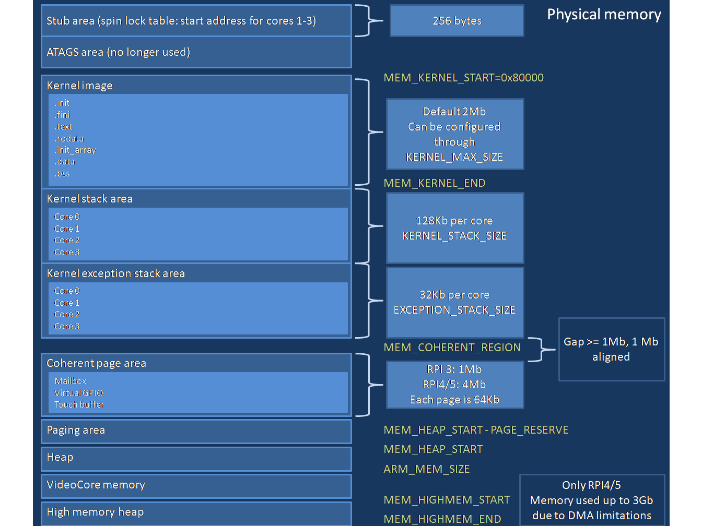
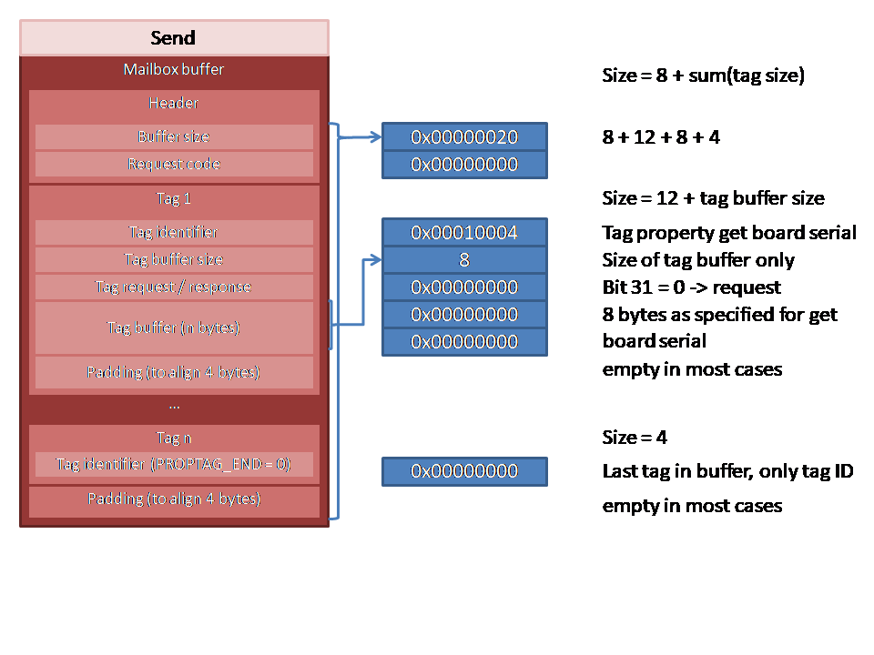
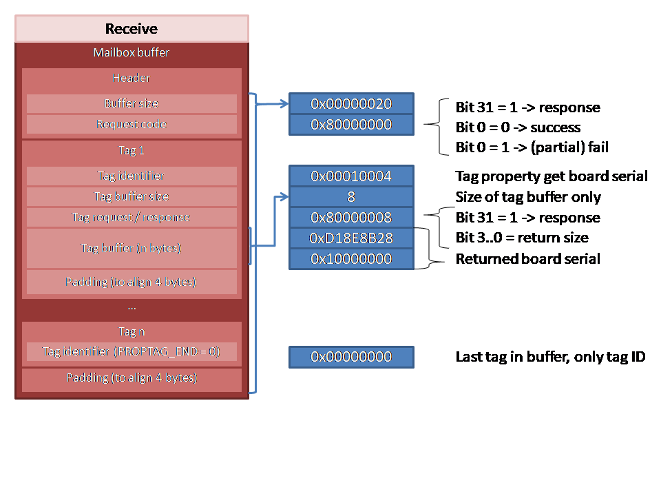

# Mailbox

Contents:
- [New tutorial setup](##New-tutorial-setup)
  - [Tutorial results](###Tutorial-results)
- [Updating the memory map - Step 1](##Updating-the-memory-map-Step-1)
  - [MemoryMap.h](###MemoryMap.h)
  - [Update the application code - Step 1](###Update-the-application-code-Step-1)
  - [Update project configuration - Step 1](###Update-project-configuration-Step-1)
  - [Configuring, building and debugging - Step 1](###Configuring-building-and-debugging-Step-1)
- [Setting up for memory management - Step 2](##Setting-up-for-memory-management-Step-2)
  - [MemoryManager.h](###MemoryManager.h)
  - [MemoryManager.cpp](###MemoryManager.cpp)
  - [Update project configuration - Step 2](###Update-project-configuration-Step-2)
  - [Configuring, building and debugging - Step 2](###Configuring-building-and-debugging-Step-2)
- [Adding the mailbox - Step 3](##Adding-the-mailbox-Step-3)
  - [IMailbox.h](###IMailbox.h)
  - [Mailbox.h](###Mailbox.h)
  - [Mailbox.cpp](###Mailbox.cpp)
  - [Update the application code - Step 3](###Update-the-application-code-Step-3)
  - [Update project configuration - Step 3](###Update-project-configuration-Step-3)
  - [Configuring, building and debugging - Step 3](###Configuring-building-and-debugging-Step-3)
- [Adding the properties interface - Step 4](##Adding-the-properties-interface-Step-4)
  - [RPIPropertiesInterface.h](###RPIPropertiesInterface.h)
  - [RPIPropertiesInterface.cpp](###RPIPropertiesInterface.cpp)
  - [Update the application code - Step 4](###Update-the-application-code-Step-4)
  - [Update project configuration - Step 4](###Update-project-configuration-Step-4)
  - [Configuring, building and debugging - Step 4](###Configuring-building-and-debugging-Step-4)
- [Adding the properties interface - Step 5](##Adding-the-properties-interface-Step-5)
  - [RPIProperties.h](###RPIProperties.h)
  - [RPIProperties.cpp](###RPIProperties.cpp)
  - [Update the application code - Step 5](###Update-the-application-code-Step-5)
  - [Update project configuration - Step 5](###Update-project-configuration-Step-5)
  - [Configuring, building and debugging - Step 5](###Configuring-building-and-debugging-Step-5)

## New tutorial setup

As in the previous tutorial, you will find the code integrated into the CMake structure, in `tutorial/09-mailbox`.
In the same way, the project names are adapted to make sure there are no conflicts.

### Tutorial results

This tutorial will result in (next to the main project structure):
- a library `output/Debug/lib/baremetal-09.a`
- an application `output/Debug/bin/09-mailbox.elf`
- an image in `deploy/Debug/09-mailbox-image`

## The Raspberry Pi Mailbox

Before we can work on the other serial console(s), such as UART0 on Raspberry Pi 3 and UART0, 2, 3, 4, 5 on Raspberry Pi 4, we need to use the Raspberry Pi mailbox.

The mailbox is a mechanism to communicate between the ARM cores and the GPU. As you can read in [System startup](system-startup.md), the GPU is the first part that becomes active after power on.
It runs the firmware, has detailed information on the system and can control some of the peripherals. And, of course, it can rendering to the screen.

In order to use the mailbox, we need to establish a common address between ARM and GPU to exchange information. This is done through a so-called Coherent page.
We can decide the location of this page, but need to convert the address for the GPU such that it can find the page.

A logical location for the coherent page is a bit after the last address used by our code.

Let's first revisit the memory map and add the coherent page information. Then we will add a mamory manager, that for now will only hand out coherent memory pages, and after that we can start using the mailbox.
We'll finalize by using the mailbox to retrieve board information, such as board type, serial number and memory size.

### Updating the memory map - Step 1

We need to update the memory map. We discussed the memory map before, in [05-console-uart1](05-console-uart1.md####Raspberry-Pi-3).
The image below hopefully gives a clearer view on the memory map.
.
So, we need to add the coherent region part.

### MemoryMap.h

Update the file `code/libraries/baremetal/include/baremetal/MemoryMap.h`

```cpp
File: code/libraries/baremetal/include/baremetal/MemoryMap.h
...
77: #define MEM_EXCEPTION_STACK_END (MEM_EXCEPTION_STACK + EXCEPTION_STACK_SIZE * (CORES - 1))
78: 
79: #if BAREMETAL_RPI_TARGET == 3
80: /// @brief Size reserved for coherent memory
81: #define COHERENT_REGION_SIZE 1 * MEGABYTE
82: #else
83: /// @brief Region reserved for coherent memory (memory shared between ARM and GPU). We reserve 4 Mb, but make sure then end is rounded
84: #define COHERENT_REGION_SIZE 4 * MEGABYTE
85: #endif
86: 
87: /// @brief Region reserved for coherent memory rounded to 1 Mb
88: #define MEM_COHERENT_REGION ((MEM_EXCEPTION_STACK_END + 2 * MEGABYTE) & ~(MEGABYTE - 1))
89: 
```

### Update the application code - Step 1

#### Serialization.h

In order to show which exact addresses we have, let's print them in our application.
However, we can write characters and strings to the console, but how about integers?
In standard C we would use `printf()`, in C++ we would use the stream insertion operator, but we don't have those.
So we'll have to write something ourselves. We could simply look around for a `printf()` implementation, but what's the fun in that?

So let's start adding a header for our serialization routines.

For now, we'll simply add one function.
Create the file `code/libraries/baremetal/include/baremetal/Serialization.h`

```cpp
File: code/libraries/baremetal/include/baremetal/Serialization.h
1: //------------------------------------------------------------------------------
2: // Copyright   : Copyright(c) 2024 Rene Barto
3: //
4: // File        : Serialization.h
5: //
6: // Namespace   : serialization
7: //
8: // Class       : -
9: //
10: // Description : Serialization of types to character buffer
11: //
12: //------------------------------------------------------------------------------
13: //
14: // Baremetal - A C++ bare metal environment for embedded 64 bit ARM devices
15: //
16: // Intended support is for 64 bit code only, running on Raspberry Pi (3 or 4) and Odroid
17: //
18: // Permission is hereby granted, free of charge, to any person
19: // obtaining a copy of this software and associated documentation
20: // files(the "Software"), to deal in the Software without
21: // restriction, including without limitation the rights to use, copy,
22: // modify, merge, publish, distribute, sublicense, and /or sell copies
23: // of the Software, and to permit persons to whom the Software is
24: // furnished to do so, subject to the following conditions :
25: //
26: // The above copyright notice and this permission notice shall be
27: // included in all copies or substantial portions of the Software.
28: //
29: // THE SOFTWARE IS PROVIDED "AS IS", WITHOUT WARRANTY OF ANY KIND,
30: // EXPRESS OR IMPLIED, INCLUDING BUT NOT LIMITED TO THE WARRANTIES OF
31: // MERCHANTABILITY, FITNESS FOR A PARTICULAR PURPOSE AND
32: // NONINFRINGEMENT.IN NO EVENT SHALL THE AUTHORS OR COPYRIGHT
33: // HOLDERS BE LIABLE FOR ANY CLAIM, DAMAGES OR OTHER LIABILITY,
34: // WHETHER IN AN ACTION OF CONTRACT, TORT OR OTHERWISE, ARISING FROM,
35: // OUT OF OR IN CONNECTION WITH THE SOFTWARE OR THE USE OR OTHER
36: // DEALINGS IN THE SOFTWARE.
37: //
38: //------------------------------------------------------------------------------
39: 
40: #pragma once
41: 
42: #include <baremetal/Types.h>
43: 
44: namespace baremetal {
45: 
46: void Serialize(char* buffer, size_t bufferSize, uint32 value, int width, int base, bool showBase, bool leadingZeros);
47: 
48: } // namespace baremetal
```

- Line 46: We declare a function that write a 32 bit unsigned integer value into a `buffer`, with a maximum `bufferSize` (including the trailing null character).
The value will take `width` characters at most (if zero the space needed is calculated), it will use a `base` which can be between 2 and 36 (so e.g. 16 for hexadecimal).
If `showBase` is true, the base prefix will be added (0b for `base` = 2, 0 for `base` = 8, 0x for `base` = 16).
If the size of the type would require more characters than strictly needed for the value, and `leadingZeros` is true, the value is prefix with '0' characters.

#### Serialization.cpp

We need to implement the `Serialize` function. As we need to write into a fixed size buffer, we need to check whether what we need to write fits.
Create the file `code/libraries/baremetal/src/Serialization.cpp`

```cpp
File: code/libraries/baremetal/src/Serialization.cpp
1: //------------------------------------------------------------------------------
2: // Copyright   : Copyright(c) 2024 Rene Barto
3: //
4: // File        : Serialization.cpp
5: //
6: // Namespace   : serialization
7: //
8: // Class       : -
9: //
10: // Description : Serialization of types to character buffer
11: //
12: //------------------------------------------------------------------------------
13: //
14: // Baremetal - A C++ bare metal environment for embedded 64 bit ARM devices
15: //
16: // Intended support is for 64 bit code only, running on Raspberry Pi (3 or 4) and Odroid
17: //
18: // Permission is hereby granted, free of charge, to any person
19: // obtaining a copy of this software and associated documentation
20: // files(the "Software"), to deal in the Software without
21: // restriction, including without limitation the rights to use, copy,
22: // modify, merge, publish, distribute, sublicense, and /or sell copies
23: // of the Software, and to permit persons to whom the Software is
24: // furnished to do so, subject to the following conditions :
25: //
26: // The above copyright notice and this permission notice shall be
27: // included in all copies or substantial portions of the Software.
28: //
29: // THE SOFTWARE IS PROVIDED "AS IS", WITHOUT WARRANTY OF ANY KIND,
30: // EXPRESS OR IMPLIED, INCLUDING BUT NOT LIMITED TO THE WARRANTIES OF
31: // MERCHANTABILITY, FITNESS FOR A PARTICULAR PURPOSE AND
32: // NONINFRINGEMENT.IN NO EVENT SHALL THE AUTHORS OR COPYRIGHT
33: // HOLDERS BE LIABLE FOR ANY CLAIM, DAMAGES OR OTHER LIABILITY,
34: // WHETHER IN AN ACTION OF CONTRACT, TORT OR OTHERWISE, ARISING FROM,
35: // OUT OF OR IN CONNECTION WITH THE SOFTWARE OR THE USE OR OTHER
36: // DEALINGS IN THE SOFTWARE.
37: //
38: //------------------------------------------------------------------------------
39: 
40: #include <baremetal/Serialization.h>
41: 
42: namespace baremetal {
43: 
44: static bool           Uppercase = true;
45: 
46: inline constexpr int NextPowerOf2Bits(size_t value)
47: {
48:     int bitCount{ 0 };
49:     size_t temp = value;
50:     while (temp >= 1)
51:     {
52:         ++bitCount;
53:         temp >>= 1;
54:     }
55:     return bitCount;
56: }
57: 
58: static constexpr char GetDigit(uint8 value)
59: {
60:     // cppcheck-suppress knownConditionTrueFalse
61:     return value + ((value < 10) ? '0' : 'A' - 10 + (Uppercase ? 0 : 0x20));
62: }
63: 
64: static constexpr int BitsToDigits(int bits, int base)
65: {
66:     int baseBits = NextPowerOf2Bits(base - 1);
67:     return (bits + baseBits - 1) / baseBits;
68: }
69: 
70: void Serialize(char* buffer, size_t bufferSize, uint32 value, int width, int base, bool showBase, bool leadingZeros)
71: {
72:     if ((base < 2) || (base > 36))
73:         return;
74: 
75:     int       numDigits = 0;
76:     uint64    divisor   = 1;
77:     size_t    absWidth  = (width < 0) ? -width : width;
78:     const int numBits   = 32;
79:     while ((value >= divisor) && (numDigits <= BitsToDigits(numBits, base)))
80:     {
81:         divisor *= base;
82:         ++numDigits;
83:     }
84: 
85:     size_t numChars = (numDigits > 0) ? numDigits : 1;
86:     if (showBase)
87:     {
88:         numChars += ((base == 2) || (base == 16)) ? 2 : (base == 8) ? 1 : 0;
89:     }
90:     if (absWidth > numChars)
91:         numChars = absWidth;
92:     if (numChars > bufferSize - 1) // Leave one character for \0
93:         return;
94: 
95:     char* bufferPtr = buffer;
96: 
97:     switch (base)
98:     {
99:     case 10:
100:         {
101:             if (leadingZeros)
102:             {
103:                 if (absWidth == 0)
104:                     absWidth = BitsToDigits(numBits, base);
105:                 for (size_t digitIndex = numDigits; digitIndex < absWidth; ++digitIndex)
106:                 {
107:                     *bufferPtr++ = '0';
108:                 }
109:             }
110:             else
111:             {
112:                 if (numDigits == 0)
113:                 {
114:                     *bufferPtr++ = '0';
115:                 }
116:             }
117:             while (numDigits > 0)
118:             {
119:                 divisor /= base;
120:                 int digit = (value / divisor) % base;
121:                 *bufferPtr++ = GetDigit(digit);
122:                 --numDigits;
123:             }
124:         }
125:         break;
126:     default:
127:         {
128:             if (showBase)
129:             {
130:                 if (base == 2)
131:                 {
132:                     *bufferPtr++ = '0';
133:                     *bufferPtr++ = 'b';
134:                 }
135:                 else if (base == 8)
136:                 {
137:                     *bufferPtr++ = '0';
138:                 }
139:                 else if (base == 16)
140:                 {
141:                     *bufferPtr++ = '0';
142:                     *bufferPtr++ = 'x';
143: 
144:                 }
145:             }
146:             if (leadingZeros)
147:             {
148:                 if (absWidth == 0)
149:                     absWidth = BitsToDigits(numBits, base);
150:                 for (size_t digitIndex = numDigits; digitIndex < absWidth; ++digitIndex)
151:                 {
152:                     *bufferPtr++ = '0';
153:                 }
154:             }
155:             else
156:             {
157:                 if (numDigits == 0)
158:                 {
159:                     *bufferPtr++ = '0';
160:                 }
161:             }
162:             while (numDigits > 0)
163:             {
164:                 divisor /= base;
165:                 int digit = (value / divisor) % base;
166:                 *bufferPtr++ = GetDigit(digit);
167:                 --numDigits;
168:             }
169:         }
170:         break;
171:     }
172:     *bufferPtr++ = '\0';
173: }
174: 
175: } // namespace baremetal
```

- Line 44: We define a value `Uppercase` which can be set to false to print hexadecimal values with lowercase letters. The default is uppercase.
- Line 46-46: We determine the power of 2 equal or higher than the `value` passed, but return it as a power of 2. This is used to determine the size of a base in bits.
- Line 58-62: We return a 'digit' for the `value` specified. So `0`..`9` for 0 to 9, `A`..`Z` for 10 to 35, or lower case if `uppercase` is false.
- Line 64-68: We determine how many digits are needed to represent a type of size `bits` in base `base`
- Line 70-173: The actual Serialize function
  - Line 72-73: We do a sanity check on the base
  - Line 75-83: We calculate how many digits are needed to represent the value using the base specified
  - Line 85-91: We set the minimum number of digits needed to 1, we take the prefix into account if desired, and if the width is specified, that is the minimum.
  - Line 92-93: We do a sanity check to see whether the characters to be written fit in the buffer
  - Line 99-125: We print digits for decimal representation, taking into account leading zeros
  - Line 126-170: We print digits for other base values, adding the prefix, and then taking into account leading zeros
  - Line 172: We end the string with a null character

#### main.cpp

Now we can update the application code and print the memory map.
Update the file `code/applications/demo/src/main.cpp`

```cpp
File: code/applications/demo/src/main.cpp
1: #include <baremetal/ARMInstructions.h>
2: #include <baremetal/SysConfig.h>
3: #include <baremetal/Serialization.h>
4: #include <baremetal/System.h>
5: #include <baremetal/Timer.h>
6: #include <baremetal/UART1.h>
7: 
8: using namespace baremetal;
9: 
10: int main()
11: {
12:     auto& uart = GetUART1();
13:     uart.WriteString("Hello World!\n");
14: 
15:     char buffer[128];
16:     uart.WriteString("------------------------------------------------- ");
17:     Serialize(buffer, sizeof(buffer), MEM_KERNEL_START, 10, 16, true, true);
18:     uart.WriteString(buffer);
19:     uart.WriteString(" MEM_KERNEL_START\n");
20: 
21:     uart.WriteString(" Kernel image : Size ");
22:     Serialize(buffer, sizeof(buffer), KERNEL_MAX_SIZE, 10, 16, true, true);
23:     uart.WriteString(buffer);
24:     uart.WriteString("\n");
25: 
26:     uart.WriteString("------------------------------------------------- ");
27:     Serialize(buffer, sizeof(buffer), MEM_KERNEL_END, 10, 16, true, true);
28:     uart.WriteString(buffer);
29:     uart.WriteString(" MEM_KERNEL_END\n");
30: 
31:     uart.WriteString(" Core 0 stack : Size ");
32:     Serialize(buffer, sizeof(buffer), KERNEL_STACK_SIZE, 10, 16, true, true);
33:     uart.WriteString(buffer);
34:     uart.WriteString("\n");
35: 
36:     uart.WriteString("------------------------------------------------- ");
37:     Serialize(buffer, sizeof(buffer), MEM_KERNEL_STACK, 10, 16, true, true);
38:     uart.WriteString(buffer);
39:     uart.WriteString(" MEM_KERNEL_STACK\n");
40: 
41:     uart.WriteString(" Core 1 stack : Size ");
42:     Serialize(buffer, sizeof(buffer), KERNEL_STACK_SIZE, 10, 16, true, true);
43:     uart.WriteString(buffer);
44:     uart.WriteString("\n");
45: 
46:     uart.WriteString("------------------------------------------------- ");
47:     Serialize(buffer, sizeof(buffer), MEM_KERNEL_STACK + KERNEL_STACK_SIZE, 10, 16, true, true);
48:     uart.WriteString(buffer);
49:     uart.WriteString("\n");
50: 
51:     uart.WriteString(" Core 2 stack : Size ");
52:     Serialize(buffer, sizeof(buffer), KERNEL_STACK_SIZE, 10, 16, true, true);
53:     uart.WriteString(buffer);
54:     uart.WriteString("\n");
55: 
56:     uart.WriteString("------------------------------------------------- ");
57:     Serialize(buffer, sizeof(buffer), MEM_KERNEL_STACK + 2 * KERNEL_STACK_SIZE, 10, 16, true, true);
58:     uart.WriteString(buffer);
59:     uart.WriteString("\n");
60: 
61:     uart.WriteString(" Core 3 stack : Size ");
62:     Serialize(buffer, sizeof(buffer), KERNEL_STACK_SIZE, 10, 16, true, true);
63:     uart.WriteString(buffer);
64:     uart.WriteString("\n");
65: 
66:     uart.WriteString("------------------------------------------------- ");
67:     Serialize(buffer, sizeof(buffer), MEM_KERNEL_STACK + 3 * KERNEL_STACK_SIZE, 10, 16, true, true);
68:     uart.WriteString(buffer);
69:     uart.WriteString("\n");
70: 
71:     uart.WriteString(" Core 0 exception stack : Size ");
72:     Serialize(buffer, sizeof(buffer), EXCEPTION_STACK_SIZE, 10, 16, true, true);
73:     uart.WriteString(buffer);
74:     uart.WriteString("\n");
75: 
76:     uart.WriteString("------------------------------------------------- ");
77:     Serialize(buffer, sizeof(buffer), MEM_EXCEPTION_STACK, 10, 16, true, true);
78:     uart.WriteString(buffer);
79:     uart.WriteString(" MEM_EXCEPTION_STACK\n");
80: 
81:     uart.WriteString(" Core 1 exception stack : Size ");
82:     Serialize(buffer, sizeof(buffer), EXCEPTION_STACK_SIZE, 10, 16, true, true);
83:     uart.WriteString(buffer);
84:     uart.WriteString("\n");
85: 
86:     uart.WriteString("------------------------------------------------- ");
87:     Serialize(buffer, sizeof(buffer), MEM_EXCEPTION_STACK + EXCEPTION_STACK_SIZE, 10, 16, true, true);
88:     uart.WriteString(buffer);
89:     uart.WriteString("\n");
90: 
91:     uart.WriteString(" Core 2 exception stack : Size ");
92:     Serialize(buffer, sizeof(buffer), EXCEPTION_STACK_SIZE, 10, 16, true, true);
93:     uart.WriteString(buffer);
94:     uart.WriteString("\n");
95: 
96:     uart.WriteString("------------------------------------------------- ");
97:     Serialize(buffer, sizeof(buffer), MEM_EXCEPTION_STACK + 2 * EXCEPTION_STACK_SIZE, 10, 16, true, true);
98:     uart.WriteString(buffer);
99:     uart.WriteString("\n");
100: 
101:     uart.WriteString(" Core 3 exception stack : Size ");
102:     Serialize(buffer, sizeof(buffer), EXCEPTION_STACK_SIZE, 10, 16, true, true);
103:     uart.WriteString(buffer);
104:     uart.WriteString("\n");
105: 
106:     uart.WriteString("------------------------------------------------- ");
107:     Serialize(buffer, sizeof(buffer), MEM_EXCEPTION_STACK_END, 10, 16, true, true);
108:     uart.WriteString(buffer);
109:     uart.WriteString(" MEM_EXCEPTION_STACK_END\n");
110: 
111:     uart.WriteString(" Unused\n");
112: 
113:     uart.WriteString("------------------------------------------------- ");
114:     Serialize(buffer, sizeof(buffer), MEM_COHERENT_REGION, 10, 16, true, true);
115:     uart.WriteString(buffer);
116:     uart.WriteString(" MEM_COHERENT_REGION\n");
117: 
118:     uart.WriteString(" Coherent region : Size ");
119:     Serialize(buffer, sizeof(buffer), COHERENT_REGION_SIZE, 10, 16, true, true);
120:     uart.WriteString(buffer);
121:     uart.WriteString("\n");
122: 
123:     uart.WriteString("------------------------------------------------- ");
124:     Serialize(buffer, sizeof(buffer), MEM_COHERENT_REGION + COHERENT_REGION_SIZE, 10, 16, true, true);
125:     uart.WriteString(buffer);
126:     uart.WriteString(" \n");
127: 
128:     uart.WriteString("Wait 5 seconds\n");
129:     Timer::WaitMilliSeconds(5000);
130: 
131:     uart.WriteString("Press r to reboot, h to halt\n");
132:     char ch{};
133:     while ((ch != 'r') && (ch != 'h'))
134:     {
135:         ch = uart.Read();
136:         uart.Write(ch);
137:     }
138: 
139:     return static_cast<int>((ch == 'r') ? ReturnCode::ExitReboot : ReturnCode::ExitHalt);
140: }
```

The code should speak for itself.

### Update project configuration - Step 1

As we added some files to the baremetal project, we need to update its CMake file.
Update the file `code/libraries/baremetal/CMakeLists.txt`

```cmake
File: code/libraries/baremetal/CMakeLists.txt
...
29: set(PROJECT_SOURCES
30:     ${CMAKE_CURRENT_SOURCE_DIR}/src/CXAGuard.cpp
31:     ${CMAKE_CURRENT_SOURCE_DIR}/src/MemoryAccess.cpp
32:     ${CMAKE_CURRENT_SOURCE_DIR}/src/New.cpp
33:     ${CMAKE_CURRENT_SOURCE_DIR}/src/PhysicalGPIOPin.cpp
34:     ${CMAKE_CURRENT_SOURCE_DIR}/src/Serialization.cpp
35:     ${CMAKE_CURRENT_SOURCE_DIR}/src/Startup.S
36:     ${CMAKE_CURRENT_SOURCE_DIR}/src/System.cpp
37:     ${CMAKE_CURRENT_SOURCE_DIR}/src/Timer.cpp
38:     ${CMAKE_CURRENT_SOURCE_DIR}/src/UART1.cpp
39:     ${CMAKE_CURRENT_SOURCE_DIR}/src/Util.cpp
40:     )
41: 
42: set(PROJECT_INCLUDES_PUBLIC
43:     ${CMAKE_CURRENT_SOURCE_DIR}/include/baremetal/ARMInstructions.h
44:     ${CMAKE_CURRENT_SOURCE_DIR}/include/baremetal/BCMRegisters.h
45:     ${CMAKE_CURRENT_SOURCE_DIR}/include/baremetal/IGPIOPin.h
46:     ${CMAKE_CURRENT_SOURCE_DIR}/include/baremetal/IMemoryAccess.h
47:     ${CMAKE_CURRENT_SOURCE_DIR}/include/baremetal/Macros.h
48:     ${CMAKE_CURRENT_SOURCE_DIR}/include/baremetal/MemoryAccess.h
49:     ${CMAKE_CURRENT_SOURCE_DIR}/include/baremetal/MemoryMap.h
50:     ${CMAKE_CURRENT_SOURCE_DIR}/include/baremetal/New.h
51:     ${CMAKE_CURRENT_SOURCE_DIR}/include/baremetal/PhysicalGPIOPin.h
52:     ${CMAKE_CURRENT_SOURCE_DIR}/include/baremetal/Serialization.h
53:     ${CMAKE_CURRENT_SOURCE_DIR}/include/baremetal/SysConfig.h
54:     ${CMAKE_CURRENT_SOURCE_DIR}/include/baremetal/System.h
55:     ${CMAKE_CURRENT_SOURCE_DIR}/include/baremetal/Timer.h
56:     ${CMAKE_CURRENT_SOURCE_DIR}/include/baremetal/Types.h
57:     ${CMAKE_CURRENT_SOURCE_DIR}/include/baremetal/UART1.h
58:     ${CMAKE_CURRENT_SOURCE_DIR}/include/baremetal/Util.h
59:     )
60: set(PROJECT_INCLUDES_PRIVATE )
...
```

### Configuring, building and debugging - Step 1

We can now configure and build our code, and start debugging.

When running the application, you can see the memory map being printed:

```text
Starting up
Hello World!
------------------------------------------------- 0x0000080000 MEM_KERNEL_START
 Kernel image : Size 0x0000200000
------------------------------------------------- 0x0000280000 MEM_KERNEL_END
 Core 0 stack : Size 0x0000020000
------------------------------------------------- 0x00002A0000 MEM_KERNEL_STACK
 Core 1 stack : Size 0x0000020000
------------------------------------------------- 0x00002C0000
 Core 2 stack : Size 0x0000020000
------------------------------------------------- 0x00002E0000
 Core 3 stack : Size 0x0000020000
------------------------------------------------- 0x0000300000
 Core 0 exception stack : Size 0x0000008000
------------------------------------------------- 0x0000308000 MEM_EXCEPTION_STACK
 Core 1 exception stack : Size 0x0000008000
------------------------------------------------- 0x0000310000
 Core 2 exception stack : Size 0x0000008000
------------------------------------------------- 0x0000318000
 Core 3 exception stack : Size 0x0000008000
------------------------------------------------- 0x0000320000 MEM_EXCEPTION_STACK_END
 Unused
------------------------------------------------- 0x0000500000 MEM_COHERENT_REGION
 Coherent region : Size 0x0000100000
------------------------------------------------- 0x0000600000
Wait 5 seconds
Press r to reboot, h to halt
hHalt
```

## Setting up for memory management - Step 2

As a very small first step, we'll create a class with one single method to retrieve the Coherent page for a specified class of usage.
We will create a class `MemoryManager` for this, that we will extend in later tutorials when actually adding memory management.

### MemoryManager.h

Create the file `code/libraries/baremetal/include/baremetal/MemoryManager.h`

```cpp
File: code/libraries/baremetal/include/baremetal/MemoryManager.h
1: //------------------------------------------------------------------------------
2: // Copyright   : Copyright(c) 2024 Rene Barto
3: //
4: // File        : MemoryManager.h
5: //
6: // Namespace   : baremetal
7: //
8: // Class       : MemoryManager
9: //
10: // Description : Memory handling
11: //
12: //------------------------------------------------------------------------------
13: //
14: // Baremetal - A C++ bare metal environment for embedded 64 bit ARM devices
15: // 
16: // Intended support is for 64 bit code only, running on Raspberry Pi (3 or 4) and Odroid
17: // 
18: // Permission is hereby granted, free of charge, to any person
19: // obtaining a copy of this software and associated documentation
20: // files(the "Software"), to deal in the Software without
21: // restriction, including without limitation the rights to use, copy,
22: // modify, merge, publish, distribute, sublicense, and /or sell copies
23: // of the Software, and to permit persons to whom the Software is
24: // furnished to do so, subject to the following conditions :
25: //
26: // The above copyright notice and this permission notice shall be
27: // included in all copies or substantial portions of the Software.
28: //
29: // THE SOFTWARE IS PROVIDED "AS IS", WITHOUT WARRANTY OF ANY KIND,
30: // EXPRESS OR IMPLIED, INCLUDING BUT NOT LIMITED TO THE WARRANTIES OF
31: // MERCHANTABILITY, FITNESS FOR A PARTICULAR PURPOSE AND
32: // NONINFRINGEMENT.IN NO EVENT SHALL THE AUTHORS OR COPYRIGHT
33: // HOLDERS BE LIABLE FOR ANY CLAIM, DAMAGES OR OTHER LIABILITY,
34: // WHETHER IN AN ACTION OF CONTRACT, TORT OR OTHERWISE, ARISING FROM,
35: // OUT OF OR IN CONNECTION WITH THE SOFTWARE OR THE USE OR OTHER
36: // DEALINGS IN THE SOFTWARE.
37: // 
38: //------------------------------------------------------------------------------
39: 
40: #pragma once
41: 
42: #include <baremetal/Types.h>
43: 
44: enum class CoherentPageSlot
45: {
46:     PropertyMailbox = 0,
47: };
48: 
49: namespace baremetal {
50: 
51: /// @brief MemoryManager: Handles memory allocation, re-allocation, and de-allocation for heap and paging memory
52: class MemoryManager
53: {
54: public:
55:     static uintptr GetCoherentPage(CoherentPageSlot slot);
56: };
57: 
58: } // namespace baremetal
```

- Line 44-47, we declare an enum type to hold the kind of Coherent Page to request. For now this is only one kind, but this will be extended.
- Line 55: We define a static method in `MemoryManager` to get the address for a Coherent Page.

### MemoryManager.cpp

Create the file `code/libraries/baremetal/src/MemoryManager.cpp`

```cpp
File: code/libraries/baremetal/src/MemoryManager.cpp
1: //------------------------------------------------------------------------------
2: // Copyright   : Copyright(c) 2024 Rene Barto
3: //
4: // File        : MemoryManager.cpp
5: //
6: // Namespace   : baremetal
7: //
8: // Class       : MemoryManager
9: //
10: // Description : Memory handling
11: //
12: //------------------------------------------------------------------------------
13: //
14: // Baremetal - A C++ bare metal environment for embedded 64 bit ARM devices
15: // 
16: // Intended support is for 64 bit code only, running on Raspberry Pi (3 or 4) and Odroid
17: // 
18: // Permission is hereby granted, free of charge, to any person
19: // obtaining a copy of this software and associated documentation
20: // files(the "Software"), to deal in the Software without
21: // restriction, including without limitation the rights to use, copy,
22: // modify, merge, publish, distribute, sublicense, and /or sell copies
23: // of the Software, and to permit persons to whom the Software is
24: // furnished to do so, subject to the following conditions :
25: //
26: // The above copyright notice and this permission notice shall be
27: // included in all copies or substantial portions of the Software.
28: //
29: // THE SOFTWARE IS PROVIDED "AS IS", WITHOUT WARRANTY OF ANY KIND,
30: // EXPRESS OR IMPLIED, INCLUDING BUT NOT LIMITED TO THE WARRANTIES OF
31: // MERCHANTABILITY, FITNESS FOR A PARTICULAR PURPOSE AND
32: // NONINFRINGEMENT.IN NO EVENT SHALL THE AUTHORS OR COPYRIGHT
33: // HOLDERS BE LIABLE FOR ANY CLAIM, DAMAGES OR OTHER LIABILITY,
34: // WHETHER IN AN ACTION OF CONTRACT, TORT OR OTHERWISE, ARISING FROM,
35: // OUT OF OR IN CONNECTION WITH THE SOFTWARE OR THE USE OR OTHER
36: // DEALINGS IN THE SOFTWARE.
37: // 
38: //------------------------------------------------------------------------------
39: 
40: #include <baremetal/MemoryManager.h>
41: 
42: #include <baremetal/SysConfig.h>
43: 
44: using namespace baremetal;
45: 
46: uintptr MemoryManager::GetCoherentPage(CoherentPageSlot slot)
47: {
48:     uint64 pageAddress = MEM_COHERENT_REGION;
49: 
50:     pageAddress += static_cast<uint32>(slot) * PAGE_SIZE;
51: 
52:     return pageAddress;
53: }
```

### Update project configuration - Step 2

As we added some files to the baremetal project, we need to update its CMake file.
Update the file `code/libraries/baremetal/CMakeLists.txt`

```cmake
File: code/libraries/baremetal/CMakeLists.txt
...
29: set(PROJECT_SOURCES
30:     ${CMAKE_CURRENT_SOURCE_DIR}/src/CXAGuard.cpp
31:     ${CMAKE_CURRENT_SOURCE_DIR}/src/MemoryAccess.cpp
32:     ${CMAKE_CURRENT_SOURCE_DIR}/src/MemoryManager.cpp
33:     ${CMAKE_CURRENT_SOURCE_DIR}/src/New.cpp
34:     ${CMAKE_CURRENT_SOURCE_DIR}/src/PhysicalGPIOPin.cpp
35:     ${CMAKE_CURRENT_SOURCE_DIR}/src/Serialization.cpp
36:     ${CMAKE_CURRENT_SOURCE_DIR}/src/Startup.S
37:     ${CMAKE_CURRENT_SOURCE_DIR}/src/System.cpp
38:     ${CMAKE_CURRENT_SOURCE_DIR}/src/Timer.cpp
39:     ${CMAKE_CURRENT_SOURCE_DIR}/src/UART1.cpp
40:     ${CMAKE_CURRENT_SOURCE_DIR}/src/Util.cpp
41:     )
42: 
43: set(PROJECT_INCLUDES_PUBLIC
44:     ${CMAKE_CURRENT_SOURCE_DIR}/include/baremetal/ARMInstructions.h
45:     ${CMAKE_CURRENT_SOURCE_DIR}/include/baremetal/BCMRegisters.h
46:     ${CMAKE_CURRENT_SOURCE_DIR}/include/baremetal/IGPIOPin.h
47:     ${CMAKE_CURRENT_SOURCE_DIR}/include/baremetal/IMemoryAccess.h
48:     ${CMAKE_CURRENT_SOURCE_DIR}/include/baremetal/Macros.h
49:     ${CMAKE_CURRENT_SOURCE_DIR}/include/baremetal/MemoryAccess.h
50:     ${CMAKE_CURRENT_SOURCE_DIR}/include/baremetal/MemoryManager.h
51:     ${CMAKE_CURRENT_SOURCE_DIR}/include/baremetal/MemoryMap.h
52:     ${CMAKE_CURRENT_SOURCE_DIR}/include/baremetal/New.h
53:     ${CMAKE_CURRENT_SOURCE_DIR}/include/baremetal/PhysicalGPIOPin.h
54:     ${CMAKE_CURRENT_SOURCE_DIR}/include/baremetal/Serialization.h
55:     ${CMAKE_CURRENT_SOURCE_DIR}/include/baremetal/SysConfig.h
56:     ${CMAKE_CURRENT_SOURCE_DIR}/include/baremetal/System.h
57:     ${CMAKE_CURRENT_SOURCE_DIR}/include/baremetal/Timer.h
58:     ${CMAKE_CURRENT_SOURCE_DIR}/include/baremetal/Types.h
59:     ${CMAKE_CURRENT_SOURCE_DIR}/include/baremetal/UART1.h
60:     ${CMAKE_CURRENT_SOURCE_DIR}/include/baremetal/Util.h
61:     )
62: set(PROJECT_INCLUDES_PRIVATE )
...
```

### Configuring, building and debugging - Step 2

We can now configure and build our code, and start debugging.
The behaviour however did not change.

## Adding the mailbox - Step 3

We are now ready to add the acutal mailbox. The way it works is quite complex, but there is a pattern. We will take a layered approach here:
- The first thing we'll do is create an abstract interface for the mailbox called `IMailbox`
- We will then declare and implement the basic mailbox mechanics in a class `Mailbox`
- To handle requests to get and set properties we will need to package data in a certain way, we will declare and implement a class `RPIPropertiesInterface` for this
- Finally to do the actual requests, we add a class `RPIProperties` that will have methods for each of the properties we wish to get or set. We will keep this relatively simple for now

### BCMRegisters.h

As the mailbox implementation will use some specific registers, we need to add these.
UPdate the file `code/libraries/baremetal/include/baremetal/BCMRegisters.h`.

```cpp
File: code/libraries/baremetal/include/baremetal/BCMRegisters.h
45: #define GPU_CACHED_BASE                 0x40000000 // see \ref doc/boards/RaspberryPi/BCM2837-peripherals.pdf page 5
46: #define GPU_UNCACHED_BASE               0xC0000000 // see \ref doc/boards/RaspberryPi/BCM2837-peripherals.pdf page 5, 6
47: 
48: #define GPU_MEM_BASE                    GPU_UNCACHED_BASE
49: 
50: // Convert ARM address to GPU bus address (also works for aliases)
51: #define ARM_TO_GPU(addr)                (((addr) & ~0xC0000000) | GPU_MEM_BASE)
52: #define GPU_TO_ARM(addr)                ((addr) & ~0xC0000000)
53: 
54: /// \ref doc/boards/RaspberryPi/BCM2835-peripherals.pdf
55: /// \ref doc/boards/RaspberryPi/bcm2711-peripherals.pdf
56: #if BAREMETAL_RPI_TARGET == 3
57: /// @brief Base address for Raspberry PI BCM I/O
58: #define RPI_BCM_IO_BASE                 0x3F000000
59: #else
60: /// @brief Base address for Raspberry PI BCM I/O
61: #define RPI_BCM_IO_BASE                 0xFE000000
62: #endif
63: /// @brief End address for Raspberry PI BCM I/O
64: #define RPI_BCM_IO_END                  (RPI_BCM_IO_BASE + 0xFFFFFF)
...
79: //---------------------------------------------
80: // Mailbox registers
81: //---------------------------------------------
82: 
83: #define RPI_MAILBOX_BASE                RPI_BCM_IO_BASE + 0x0000B880
84: #define RPI_MAILBOX0_READ               reinterpret_cast<regaddr>(RPI_MAILBOX_BASE + 0x00000000)
85: #define RPI_MAILBOX0_POLL               reinterpret_cast<regaddr>(RPI_MAILBOX_BASE + 0x00000010)
86: #define RPI_MAILBOX0_SENDER             reinterpret_cast<regaddr>(RPI_MAILBOX_BASE + 0x00000014)
87: #define RPI_MAILBOX0_STATUS             reinterpret_cast<regaddr>(RPI_MAILBOX_BASE + 0x00000018)
88: #define RPI_MAILBOX_CONFIG              reinterpret_cast<regaddr>(RPI_MAILBOX_BASE + 0x0000001C)
89: #define RPI_MAILBOX1_WRITE              reinterpret_cast<regaddr>(RPI_MAILBOX_BASE + 0x00000020)
90: #define RPI_MAILBOX1_STATUS             reinterpret_cast<regaddr>(RPI_MAILBOX_BASE + 0x00000038)
91: #define RPI_MAILBOX_RESPONSE_SUCCESS    BIT(31)
92: #define RPI_MAILBOX_RESPONSE_ERROR      BIT(31) | BIT(0)
93: #define RPI_MAILBOX_TAG_RESPONSE        BIT(31)
94: #define RPI_MAILBOX_STATUS_EMPTY        BIT(30)
95: #define RPI_MAILBOX_STATUS_FULL         BIT(31)
96: #define RPI_MAILBOX_REQUEST             0
97: 
```

- Line 45:  We define the address of the VC mapped to ARM address space for cached usage (we will not use this)
- Line 46:  We define the address of the VC mapped to ARM address space for uncached usage
- Line 48:  We define the address of the VC mapped to ARM address we will use (the uncached variant)
- Line 51:  We define a macro to convert an ARM address to the GPU / VC
- Line 52:  We define a macro to convert an GPU / VC address to the ARM
- Line 83-96: We define the register addresses and values for the mailbox

The Mailbox peripheral is not well described, it is not mentioned in the official documentation. There is however information available.
More information on the Mailbox registers can be found in:
- [Raspberry Pi firmware wiki - Mailboxes](https://github.com/raspberrypi/firmware/wiki/Mailboxes)
- [Raspberry Pi firmware wiki - Accessing mailboxes](https://github.com/raspberrypi/firmware/wiki/Accessing-mailboxes)
- [Raspberry Pi firmware wiki - Mailbox property interface](https://github.com/raspberrypi/firmware/wiki/Mailbox-property-interface)

We'll dive a bit deeper into the information when discussing the actual code.

The Mailbox register addresses are all prefixed with `RPI_MAILBOX`.

### IMailbox.h

Create the file `code/libraries/baremetal/include/baremetal/IMailbox.h`.

```cpp
File: code/libraries/baremetal/include/baremetal/IMailbox.h
1: //------------------------------------------------------------------------------
2: // Copyright   : Copyright(c) 2024 Rene Barto
3: //
4: // File        : IMailbox.h
5: //
6: // Namespace   : baremetal
7: //
8: // Class       : IMailbox
9: //
10: // Description : Arm <-> VC mailbox abstract interface
11: //
12: //------------------------------------------------------------------------------
13: //
14: // Baremetal - A C++ bare metal environment for embedded 64 bit ARM devices
15: //
16: // Intended support is for 64 bit code only, running on Raspberry Pi (3 or 4) and Odroid
17: //
18: // Permission is hereby granted, free of charge, to any person
19: // obtaining a copy of this software and associated documentation
20: // files(the "Software"), to deal in the Software without
21: // restriction, including without limitation the rights to use, copy,
22: // modify, merge, publish, distribute, sublicense, and /or sell copies
23: // of the Software, and to permit persons to whom the Software is
24: // furnished to do so, subject to the following conditions :
25: //
26: // The above copyright notice and this permission notice shall be
27: // included in all copies or substantial portions of the Software.
28: //
29: // THE SOFTWARE IS PROVIDED "AS IS", WITHOUT WARRANTY OF ANY KIND,
30: // EXPRESS OR IMPLIED, INCLUDING BUT NOT LIMITED TO THE WARRANTIES OF
31: // MERCHANTABILITY, FITNESS FOR A PARTICULAR PURPOSE AND
32: // NONINFRINGEMENT.IN NO EVENT SHALL THE AUTHORS OR COPYRIGHT
33: // HOLDERS BE LIABLE FOR ANY CLAIM, DAMAGES OR OTHER LIABILITY,
34: // WHETHER IN AN ACTION OF CONTRACT, TORT OR OTHERWISE, ARISING FROM,
35: // OUT OF OR IN CONNECTION WITH THE SOFTWARE OR THE USE OR OTHER
36: // DEALINGS IN THE SOFTWARE.
37: //
38: //------------------------------------------------------------------------------
39: 
40: #pragma once
41: 
42: #include <baremetal/Types.h>
43: 
44: namespace baremetal {
45: 
46: /// @brief Mailbox channels
47: /// \ref https://github.com/raspberrypi/firmware/wiki/Mailboxes
48: enum class MailboxChannel
49: {
50:     ARM_MAILBOX_CH_POWER = 0,       // Power management
51:     ARM_MAILBOX_CH_FB = 1,          // Frame buffer
52:     ARM_MAILBOX_CH_VUART = 2,       // Virtual UART?
53:     ARM_MAILBOX_CH_VCHIQ = 3,
54:     ARM_MAILBOX_CH_LEDS = 4,
55:     ARM_MAILBOX_CH_BTNS = 5,
56:     ARM_MAILBOX_CH_TOUCH = 6,
57:     ARM_MAILBOX_CH_COUNT = 7,
58:     ARM_MAILBOX_CH_PROP_OUT = 8,    // Properties / tags ARM -> VC
59:     ARM_MAILBOX_CH_PROP_IN = 9,     // Properties / tags VC -> ARM
60: };
61: 
62: /// @brief IMailbox: Mailbox abstract interface
63: class IMailbox
64: {
65: public:
66:     virtual ~IMailbox() = default;
67: 
68:     virtual uintptr WriteRead(uintptr address) = 0;
69: };
70: 
71: } // namespace baremetal
```

As you can see, there are multiple mailboxes available, which are identified by a channel number:

0. Power management
1. Framebuffer
2. Virtual UART
3. VCHIQ
4. LEDs
5. Buttons
6. Touch screen
7.
8. Property tags (ARM -> VC)
9. Property tags (VC -> ARM)

For now we will only use channel 8 (`ARM_MAILBOX_CH_PROP_OUT`), channel 9 (`ARM_MAILBOX_CH_PROP_IN`) is currently not used at all.

### Mailbox.h

Create the file `code/libraries/baremetal/include/baremetal/Mailbox.h`.

```cpp
File: code/libraries/baremetal/include/baremetal/Mailbox.h
1: //------------------------------------------------------------------------------
2: // Copyright   : Copyright(c) 2024 Rene Barto
3: //
4: // File        : Mailbox.h
5: //
6: // Namespace   : baremetal
7: //
8: // Class       : Mailbox
9: //
10: // Description : Arm <-> VC mailbox handling
11: //
12: //------------------------------------------------------------------------------
13: //
14: // Baremetal - A C++ bare metal environment for embedded 64 bit ARM devices
15: //
16: // Intended support is for 64 bit code only, running on Raspberry Pi (3 or 4) and Odroid
17: //
18: // Permission is hereby granted, free of charge, to any person
19: // obtaining a copy of this software and associated documentation
20: // files(the "Software"), to deal in the Software without
21: // restriction, including without limitation the rights to use, copy,
22: // modify, merge, publish, distribute, sublicense, and /or sell copies
23: // of the Software, and to permit persons to whom the Software is
24: // furnished to do so, subject to the following conditions :
25: //
26: // The above copyright notice and this permission notice shall be
27: // included in all copies or substantial portions of the Software.
28: //
29: // THE SOFTWARE IS PROVIDED "AS IS", WITHOUT WARRANTY OF ANY KIND,
30: // EXPRESS OR IMPLIED, INCLUDING BUT NOT LIMITED TO THE WARRANTIES OF
31: // MERCHANTABILITY, FITNESS FOR A PARTICULAR PURPOSE AND
32: // NONINFRINGEMENT.IN NO EVENT SHALL THE AUTHORS OR COPYRIGHT
33: // HOLDERS BE LIABLE FOR ANY CLAIM, DAMAGES OR OTHER LIABILITY,
34: // WHETHER IN AN ACTION OF CONTRACT, TORT OR OTHERWISE, ARISING FROM,
35: // OUT OF OR IN CONNECTION WITH THE SOFTWARE OR THE USE OR OTHER
36: // DEALINGS IN THE SOFTWARE.
37: //
38: //------------------------------------------------------------------------------
39: 
40: #pragma once
41: 
42: #include <baremetal/IMailbox.h>
43: #include <baremetal/MemoryAccess.h>
44: 
45: namespace baremetal {
46: 
47: /// @brief Mailbox: Handles access to system parameters, stored in the VC
48: class Mailbox : public IMailbox
49: {
50: private:
51:     MailboxChannel m_channel;
52:     IMemoryAccess &m_memoryAccess;
53: 
54: public:
55:     Mailbox(MailboxChannel channel, IMemoryAccess &memoryAccess = GetMemoryAccess());
56: 
57:     uintptr WriteRead(uintptr address) override;
58: 
59: private:
60:     void   Flush();
61:     uintptr Read();
62:     void   Write(uintptr data);
63: };
64: 
65: } // namespace baremetal
```

- Line 51-52: We keep a MailboxChannel (the mailbox channel ID) as well as a reference to the MemoryAccess instance both passed in to the constructor
- Line 55: We declare a constructor
- Line 57: We declare the mailbox interaction method, which is a write-read cycle.
- This will send the address passed to the mailbox through its registers, and then read back the result when ready.
- Line 60: We declare a private method to clear the mailbox
- Line 61: We delcare a private method to read the mailbox
- Line 62: We delcare a private method to write the mailbox
- 
### Mailbox.cpp

Create the file: `code/libraries/baremetal/src/Mailbox.cpp`

```cpp
File: code/libraries/baremetal/src/Mailbox.cpp
File: f:\Projects\Private\baremetal.github\code\libraries\baremetal\src\Mailbox.cpp
1: //------------------------------------------------------------------------------
2: // Copyright   : Copyright(c) 2024 Rene Barto
3: //
4: // File        : Mailbox.cpp
5: //
6: // Namespace   : baremetal
7: //
8: // Class       : Mailbox
9: //
10: // Description : Arm <-> VC mailbox handling
11: //
12: //------------------------------------------------------------------------------
13: //
14: // Baremetal - A C++ bare metal environment for embedded 64 bit ARM devices
15: //
16: // Intended support is for 64 bit code only, running on Raspberry Pi (3 or 4) and Odroid
17: //
18: // Permission is hereby granted, free of charge, to any person
19: // obtaining a copy of this software and associated documentation
20: // files(the "Software"), to deal in the Software without
21: // restriction, including without limitation the rights to use, copy,
22: // modify, merge, publish, distribute, sublicense, and /or sell copies
23: // of the Software, and to permit persons to whom the Software is
24: // furnished to do so, subject to the following conditions :
25: //
26: // The above copyright notice and this permission notice shall be
27: // included in all copies or substantial portions of the Software.
28: //
29: // THE SOFTWARE IS PROVIDED "AS IS", WITHOUT WARRANTY OF ANY KIND,
30: // EXPRESS OR IMPLIED, INCLUDING BUT NOT LIMITED TO THE WARRANTIES OF
31: // MERCHANTABILITY, FITNESS FOR A PARTICULAR PURPOSE AND
32: // NONINFRINGEMENT.IN NO EVENT SHALL THE AUTHORS OR COPYRIGHT
33: // HOLDERS BE LIABLE FOR ANY CLAIM, DAMAGES OR OTHER LIABILITY,
34: // WHETHER IN AN ACTION OF CONTRACT, TORT OR OTHERWISE, ARISING FROM,
35: // OUT OF OR IN CONNECTION WITH THE SOFTWARE OR THE USE OR OTHER
36: // DEALINGS IN THE SOFTWARE.
37: //
38: //------------------------------------------------------------------------------
39: 
40: #include <baremetal/Mailbox.h>
41: 
42: #include <baremetal/ARMInstructions.h>
43: #include <baremetal/BCMRegisters.h>
44: #include <baremetal/MemoryAccess.h>
45: #include <baremetal/Timer.h>
46: 
47: using namespace baremetal;
48: 
49: Mailbox::Mailbox(MailboxChannel channel, IMemoryAccess& memoryAccess /*= GetMemoryAccess()*/)
50:     : m_channel{ channel }
51:     , m_memoryAccess{ memoryAccess }
52: {
53: }
54: 
55: /// @brief Perform a write/read cycle to the mailbox for channel m_channel, with mailbox data address converted to VC address space
56: /// \param address Address to write to VC mailbox register, mapped to VC address space, aligned to 16 bytes.
57: /// \return Address read from VC mailbox register
58: /// \ref https://github.com/raspberrypi/firmware/wiki/Accessing-mailboxes
59: uintptr Mailbox::WriteRead(uintptr address)
60: {
61:     Flush();
62: 
63:     Write(address);
64: 
65:     uint32 result = Read();
66: 
67:     return result;
68: }
69: 
70: /// @brief Flush the mailbox, by reading until it is empty. A short wait is added for synchronization reasons.
71: void Mailbox::Flush()
72: {
73:     while (!(m_memoryAccess.Read32(RPI_MAILBOX0_STATUS) & RPI_MAILBOX_STATUS_EMPTY))
74:     {
75:         m_memoryAccess.Read32(RPI_MAILBOX0_READ);
76: 
77:         Timer::WaitMilliSeconds(20);
78:     }
79: }
80: 
81: /// @brief Read back the address of the data block to the mailbox
82: /// The address should be equal to what was written, as the mailbox can only handle sequential requests for a channel
83: ///
84: /// @return Address to prepared data block written to write register (in VC address space), with channel in lower 4 bits. The channel is checked to be equal to m_channel.
85: uintptr Mailbox::Read()
86: {
87:     uintptr result;
88: 
89:     do
90:     {
91:         while (m_memoryAccess.Read32(RPI_MAILBOX0_STATUS) & RPI_MAILBOX_STATUS_EMPTY)
92:         {
93:             NOP();
94:         }
95: 
96:         result = static_cast<uintptr>(m_memoryAccess.Read32(RPI_MAILBOX0_READ));
97:     } while ((result & 0xF) != static_cast<uint32>(m_channel)); // channel number is in the lower 4 bits
98: 
99:     return result & ~0xF;
100: }
101: 
102: /// @brief Write the address of the data block to the mailbox
103: ///
104: /// @param data Address to prepared data block for the mailbox, converted to the address space of the VC. This address should be 16 byte aligned, as the channel (m_channel) to be written to will be placed in the lower 4 bits
File: f:\Projects\Private\baremetal.github\code\libraries\baremetal\src\Mailbox.cpp
105: void Mailbox::Write(uintptr data)
106: {
107:     if ((data & 0xF) != 0)
108:         return;
109: 
110:     while (m_memoryAccess.Read32(RPI_MAILBOX1_STATUS) & RPI_MAILBOX_STATUS_FULL)
111:     {
112:         NOP();
113:     }
114: 
115:     m_memoryAccess.Write32(RPI_MAILBOX1_WRITE, static_cast<uint32>(m_channel) | static_cast<uint32>(data)); // channel number is in the lower 4 bits
116: }
```

- Line 49-53: We implement the constructor, which is quite straightforward
- Line 59-68: We implement the `WriteRead()` method, which simply calls `Flush()`, `Write()` and then `Read()` and returns the value returned
- Line 71-79: We implement the `Flush()` method.
This keeps reading `RPI_MAILBOX0_READ` register while the `RPI_MAILBOX0_STATUS` register signals that it is not empty.
- Line 85-100: We implement the `Read()` method.
This waits until the `RPI_MAILBOX0_STATUS` register signals that it is not empty, executing NOP instructions. 
It then reads the mailbox through the `RPI_MAILBOX0_READ` register, and checks whether the result matches the mailbox channel.
The result is a combination of the address (upper 28 bits, the lower 4 are expected to be 0) and the mailbox channel (lower 4 bits).
If the mailbox channel is not as expected, it keeps reading.
When successful, the mailbox channel is masked away, leaving only the address to return.
The returned address should be equal to the address written
- Line 105-115: We implement the `Write()` method.
This first does a sanity check on the address passed in. This should be 16 byte aligned, so the lower 4 bits should be 0.
This is because the lower 4 bits are used for the mailbox channel.
The method then waits until the `RPI_MAILBOX1_STATUS` register signals that it is not full, executing NOP instructions
And finally, it writs the combination of the address and the mailbox channel to the `RPI_MAILBOX1_WRITE` register

### Update the application code - Step 3

#### main.cpp

Now that we have a mailbox implemented, we can start to use it.
Let's try to retrieve the board serial number.
The first steps will feel awkward, but we'll create a more logical approach step by step.

Update the file `code/applications/demo/src/main.cpp`

```cpp
File: code/applications/demo/src/main.cpp
1: #include <baremetal/ARMInstructions.h>
2: #include <baremetal/BCMRegisters.h>
3: #include <baremetal/Mailbox.h>
4: #include <baremetal/MemoryManager.h>
5: #include <baremetal/SysConfig.h>
6: #include <baremetal/Serialization.h>
7: #include <baremetal/System.h>
8: #include <baremetal/Timer.h>
9: #include <baremetal/UART1.h>
10: 
11: using namespace baremetal;
12: 
13: int main()
14: {
15:     auto& uart = GetUART1();
16:     uart.WriteString("Hello World!\n");
17: 
18:     char buffer[128];
19:     uart.WriteString("------------------------------------------------- ");
20:     Serialize(buffer, sizeof(buffer), MEM_KERNEL_START, 10, 16, true, true);
21:     uart.WriteString(buffer);
22:     uart.WriteString(" MEM_KERNEL_START\n");
23: 
24:     uart.WriteString(" Kernel image : Size ");
25:     Serialize(buffer, sizeof(buffer), KERNEL_MAX_SIZE, 10, 16, true, true);
26:     uart.WriteString(buffer);
27:     uart.WriteString("\n");
28: 
29:     uart.WriteString("------------------------------------------------- ");
30:     Serialize(buffer, sizeof(buffer), MEM_KERNEL_END, 10, 16, true, true);
31:     uart.WriteString(buffer);
32:     uart.WriteString(" MEM_KERNEL_END\n");
33: 
34:     uart.WriteString(" Core 0 stack : Size ");
35:     Serialize(buffer, sizeof(buffer), KERNEL_STACK_SIZE, 10, 16, true, true);
36:     uart.WriteString(buffer);
37:     uart.WriteString("\n");
38: 
39:     uart.WriteString("------------------------------------------------- ");
40:     Serialize(buffer, sizeof(buffer), MEM_KERNEL_STACK, 10, 16, true, true);
41:     uart.WriteString(buffer);
42:     uart.WriteString(" MEM_KERNEL_STACK\n");
43: 
44:     uart.WriteString(" Core 1 stack : Size ");
45:     Serialize(buffer, sizeof(buffer), KERNEL_STACK_SIZE, 10, 16, true, true);
46:     uart.WriteString(buffer);
47:     uart.WriteString("\n");
48: 
49:     uart.WriteString("------------------------------------------------- ");
50:     Serialize(buffer, sizeof(buffer), MEM_KERNEL_STACK + KERNEL_STACK_SIZE, 10, 16, true, true);
51:     uart.WriteString(buffer);
52:     uart.WriteString("\n");
53: 
54:     uart.WriteString(" Core 2 stack : Size ");
55:     Serialize(buffer, sizeof(buffer), KERNEL_STACK_SIZE, 10, 16, true, true);
56:     uart.WriteString(buffer);
57:     uart.WriteString("\n");
58: 
59:     uart.WriteString("------------------------------------------------- ");
60:     Serialize(buffer, sizeof(buffer), MEM_KERNEL_STACK + 2 * KERNEL_STACK_SIZE, 10, 16, true, true);
61:     uart.WriteString(buffer);
62:     uart.WriteString("\n");
63: 
64:     uart.WriteString(" Core 3 stack : Size ");
65:     Serialize(buffer, sizeof(buffer), KERNEL_STACK_SIZE, 10, 16, true, true);
66:     uart.WriteString(buffer);
67:     uart.WriteString("\n");
68: 
69:     uart.WriteString("------------------------------------------------- ");
70:     Serialize(buffer, sizeof(buffer), MEM_KERNEL_STACK + 3 * KERNEL_STACK_SIZE, 10, 16, true, true);
71:     uart.WriteString(buffer);
72:     uart.WriteString("\n");
73: 
74:     uart.WriteString(" Core 0 exception stack : Size ");
75:     Serialize(buffer, sizeof(buffer), EXCEPTION_STACK_SIZE, 10, 16, true, true);
76:     uart.WriteString(buffer);
77:     uart.WriteString("\n");
78: 
79:     uart.WriteString("------------------------------------------------- ");
80:     Serialize(buffer, sizeof(buffer), MEM_EXCEPTION_STACK, 10, 16, true, true);
81:     uart.WriteString(buffer);
82:     uart.WriteString(" MEM_EXCEPTION_STACK\n");
83: 
84:     uart.WriteString(" Core 1 exception stack : Size ");
85:     Serialize(buffer, sizeof(buffer), EXCEPTION_STACK_SIZE, 10, 16, true, true);
86:     uart.WriteString(buffer);
87:     uart.WriteString("\n");
88: 
89:     uart.WriteString("------------------------------------------------- ");
90:     Serialize(buffer, sizeof(buffer), MEM_EXCEPTION_STACK + EXCEPTION_STACK_SIZE, 10, 16, true, true);
91:     uart.WriteString(buffer);
92:     uart.WriteString("\n");
93: 
94:     uart.WriteString(" Core 2 exception stack : Size ");
95:     Serialize(buffer, sizeof(buffer), EXCEPTION_STACK_SIZE, 10, 16, true, true);
96:     uart.WriteString(buffer);
97:     uart.WriteString("\n");
98: 
99:     uart.WriteString("------------------------------------------------- ");
100:     Serialize(buffer, sizeof(buffer), MEM_EXCEPTION_STACK + 2 * EXCEPTION_STACK_SIZE, 10, 16, true, true);
101:     uart.WriteString(buffer);
102:     uart.WriteString("\n");
103: 
104:     uart.WriteString(" Core 3 exception stack : Size ");
105:     Serialize(buffer, sizeof(buffer), EXCEPTION_STACK_SIZE, 10, 16, true, true);
106:     uart.WriteString(buffer);
107:     uart.WriteString("\n");
108: 
109:     uart.WriteString("------------------------------------------------- ");
110:     Serialize(buffer, sizeof(buffer), MEM_EXCEPTION_STACK_END, 10, 16, true, true);
111:     uart.WriteString(buffer);
112:     uart.WriteString(" MEM_EXCEPTION_STACK_END\n");
113: 
114:     uart.WriteString(" Unused\n");
115: 
116:     uart.WriteString("----------h--------------------------------------- ");
117:     Serialize(buffer, sizeof(buffer), MEM_COHERENT_REGION, 10, 16, true, true);
118:     uart.WriteString(buffer);
119:     uart.WriteString(" MEM_COHERENT_REGION\n");
120: 
121:     uart.WriteString(" Coherent region : Size ");
122:     Serialize(buffer, sizeof(buffer), COHERENT_REGION_SIZE, 10, 16, true, true);
123:     uart.WriteString(buffer);
124:     uart.WriteString("\n");
125: 
126:     uart.WriteString("------------------------------------------------- ");
127:     Serialize(buffer, sizeof(buffer), MEM_COHERENT_REGION + COHERENT_REGION_SIZE, 10, 16, true, true);
128:     uart.WriteString(buffer);
129:     uart.WriteString(" \n");
130: 
131:     Mailbox mailbox(MailboxChannel::ARM_MAILBOX_CH_PROP_OUT);
132:     auto mailboxBuffer = MemoryManager::GetCoherentPage(CoherentPageSlot::PropertyMailbox);
133:     uint32* mailboxData = reinterpret_cast<uint32*>(mailboxBuffer);
134:     // Property buffer
135:     mailboxData[0] = 32; // Buffer size (property buffer + tags)
136:     mailboxData[1] = RPI_MAILBOX_REQUEST;
137:     // Tag get board serial
138:     mailboxData[2] = 0x00010004; // Tag for property get board serial
139:     mailboxData[3] = 8; // Size of buffer (request and response)
140:     mailboxData[4] = 0; // Size of request
141:     mailboxData[5] = 0; // return value low word
142:     mailboxData[6] = 0; // return value high word
143:     // Tag end
144:     mailboxData[7] = 0; // Tag for end of list
145: 
146:     uintptr bufferAddress = ARM_TO_GPU(reinterpret_cast<uintptr>(mailboxBuffer));
147: 
148:     DataSyncBarrier();
149: 
150:     uart.WriteString("Send\n");
151:     for (int i = 0; i < 8; ++i)
152:     {
153:         Serialize(buffer, sizeof(buffer), mailboxData[i], 0, 16, true, true);
154:         uart.WriteString(buffer);
155:         uart.WriteString("\n");
156:     }
157:     if ((bufferAddress == mailbox.WriteRead(bufferAddress)) && (mailboxData[1] == RPI_MAILBOX_RESPONSE_SUCCESS))
158:     {
159:         uart.WriteString("Receive\n");
160:         for (int i = 0; i < 8; ++i)
161:         {
162:             Serialize(buffer, sizeof(buffer), mailboxData[i], 0, 16, true, true);
163:             uart.WriteString(buffer);
164:             uart.WriteString("\n");
165:         }
166:         uart.WriteString("Mailbox call succeeded\n");
167:         uart.WriteString("Serial: ");
168:         Serialize(buffer, sizeof(buffer), mailboxData[6], 8, 16, false, true);
169:         uart.WriteString(buffer);
170:         Serialize(buffer, sizeof(buffer), mailboxData[5], 8, 16, false, true);
171:         uart.WriteString(buffer);
172:         uart.WriteString("\n");
173:     }
174:     else
175:     {
176:         uart.WriteString("Mailbox call failed\n");
177:     }
178: 
179:     DataMemBarrier();
180: 
181:     uart.WriteString("Wait 5 seconds\n");
182:     Timer::WaitMilliSeconds(5000);
183: 
184:     uart.WriteString("Press r to reboot, h to halt\n");
185:     char ch{};
186:     while ((ch != 'r') && (ch != 'h'))
187:     {
188:         ch = uart.Read();
189:         uart.Write(ch);
190:     }
191: 
192:     return static_cast<int>((ch == 'r') ? ReturnCode::ExitReboot : ReturnCode::ExitHalt);
193: }
```

- Line 2-4: We need to include `BCMRegisters.h`, `Mailbox.h` and `MemoryManager.h`.
- Line 131: We instantiate a mailbox, for the `ARM_MAILBOX_CH_PROP_OUT` channel. The `MemoryAccess` instance is the default singleton.
- Line 132: We request the coherent page for the mailbox from `MemoryManager` as the mailbox buffer
- Line 133: We cast this to a uint32 pointer so we can access the words easily. All data in the buffer transferred to the mailbox consists of 32 bit words
- Line 135-144: We fill the buffer with the correct information to request the board serial number. This will be described shortly
- Line 146: We convert the address of the buffer from ARM address space to VC address space
- Line 148: We synchronize the memory access with other cores and the VC (`DataSyncBarrier()`)
- Line 150-156: We print the values we're sending to the mailbox
- Line 157: We call the `WriteRead()` method on the mailbox.
If the returned address is the same as the address sent, and the request code signals success, the call was successful
- Line 159-165: We print the values we receive from the mailbox
- Line 166-172: We print a success message and the serial number if the call succeeeds
- Line 176: We print a failure message if the call fails
- Line 165: We again synchronize the memory access with other cores and the VC (note the different call / assembly instruction, we will not explain that here, it has to do with releasing and claiming memory)  (`DataMemBarrier()`)

#### Mailbox buffer organization

The images below show the structure of the block sent to and received back from the mailbox.




In general, the structure of the block remains the same. Every tag stays in the same location, if it is handled successfully, bit 31 of the request // response code is set.
Bit 31 of request code is set to 1. If all tag requests were handled successfully, bit 0 of request code is set to 0, if something failed it is set to 1.

Notice that the size in the tag only covers the tag buffer, but the buffer size in the complete block covers everything.

So what it comes down to, is that we fill a buffer, with a 8 byte header, 
followed by all the reqeusts, each having a 12 byte header and then the request specific buffers.
We end with a special end tag.

#### ARMInstructions.h

We used a new instruction `DataMemBarrier()` that needs to be added.
Update the file `code/libraries/baremetal/include/baremetal/ARMInstructions.h`.

```cpp
File: code/libraries/baremetal/include/baremetal/ARMInstructions.h
...
50: /// @brief Data sync barrier
51: #define DataSyncBarrier()               asm volatile ("dsb sy" ::: "memory")
52: /// @brief Data memory barrier
53: #define DataMemBarrier()                asm volatile ("dmb sy" ::: "memory")
...
```

### Update project configuration - Step 3

As we added some files to the baremetal project, we need to update its CMake file.
Update the file `code/libraries/baremetal/CMakeLists.txt`

```cmake
File: code/libraries/baremetal/CMakeLists.txt
...
29: set(PROJECT_SOURCES
30:     ${CMAKE_CURRENT_SOURCE_DIR}/src/CXAGuard.cpp
31:     ${CMAKE_CURRENT_SOURCE_DIR}/src/Mailbox.cpp
32:     ${CMAKE_CURRENT_SOURCE_DIR}/src/MemoryAccess.cpp
33:     ${CMAKE_CURRENT_SOURCE_DIR}/src/MemoryManager.cpp
34:     ${CMAKE_CURRENT_SOURCE_DIR}/src/New.cpp
35:     ${CMAKE_CURRENT_SOURCE_DIR}/src/PhysicalGPIOPin.cpp
36:     ${CMAKE_CURRENT_SOURCE_DIR}/src/Serialization.cpp
37:     ${CMAKE_CURRENT_SOURCE_DIR}/src/Startup.S
38:     ${CMAKE_CURRENT_SOURCE_DIR}/src/System.cpp
39:     ${CMAKE_CURRENT_SOURCE_DIR}/src/Timer.cpp
40:     ${CMAKE_CURRENT_SOURCE_DIR}/src/UART1.cpp
41:     ${CMAKE_CURRENT_SOURCE_DIR}/src/Util.cpp
42:     )
43: 
44: set(PROJECT_INCLUDES_PUBLIC
45:     ${CMAKE_CURRENT_SOURCE_DIR}/include/baremetal/ARMInstructions.h
46:     ${CMAKE_CURRENT_SOURCE_DIR}/include/baremetal/BCMRegisters.h
47:     ${CMAKE_CURRENT_SOURCE_DIR}/include/baremetal/IGPIOPin.h
48:     ${CMAKE_CURRENT_SOURCE_DIR}/include/baremetal/IMailbox.h
49:     ${CMAKE_CURRENT_SOURCE_DIR}/include/baremetal/IMemoryAccess.h
50:     ${CMAKE_CURRENT_SOURCE_DIR}/include/baremetal/Macros.h
51:     ${CMAKE_CURRENT_SOURCE_DIR}/include/baremetal/Mailbox.h
52:     ${CMAKE_CURRENT_SOURCE_DIR}/include/baremetal/MemoryAccess.h
53:     ${CMAKE_CURRENT_SOURCE_DIR}/include/baremetal/MemoryManager.h
54:     ${CMAKE_CURRENT_SOURCE_DIR}/include/baremetal/MemoryMap.h
55:     ${CMAKE_CURRENT_SOURCE_DIR}/include/baremetal/New.h
56:     ${CMAKE_CURRENT_SOURCE_DIR}/include/baremetal/PhysicalGPIOPin.h
57:     ${CMAKE_CURRENT_SOURCE_DIR}/include/baremetal/Serialization.h
58:     ${CMAKE_CURRENT_SOURCE_DIR}/include/baremetal/SysConfig.h
59:     ${CMAKE_CURRENT_SOURCE_DIR}/include/baremetal/System.h
60:     ${CMAKE_CURRENT_SOURCE_DIR}/include/baremetal/Timer.h
61:     ${CMAKE_CURRENT_SOURCE_DIR}/include/baremetal/Types.h
62:     ${CMAKE_CURRENT_SOURCE_DIR}/include/baremetal/UART1.h
63:     ${CMAKE_CURRENT_SOURCE_DIR}/include/baremetal/Util.h
64:     )
65: set(PROJECT_INCLUDES_PRIVATE )
...
```

### Configuring, building and debugging - Step 3

We can now configure and build our code, and start debugging.

You will see the printout of the values sent to the mailbox, and the values returned, as well as the board serial number.

```text
Starting up
Hello World!
------------------------------------------------- 0x0000080000 MEM_KERNEL_START
 Kernel image : Size 0x0000200000
------------------------------------------------- 0x0000280000 MEM_KERNEL_END
 Core 0 stack : Size 0x0000020000
------------------------------------------------- 0x00002A0000 MEM_KERNEL_STACK
 Core 1 stack : Size 0x0000020000
------------------------------------------------- 0x00002C0000
 Core 2 stack : Size 0x0000020000
------------------------------------------------- 0x00002E0000
 Core 3 stack : Size 0x0000020000
------------------------------------------------- 0x0000300000
 Core 0 exception stack : Size 0x0000008000
------------------------------------------------- 0x0000308000 MEM_EXCEPTION_STACK
 Core 1 exception stack : Size 0x0000008000
------------------------------------------------- 0x0000310000
 Core 2 exception stack : Size 0x0000008000
------------------------------------------------- 0x0000318000
 Core 3 exception stack : Size 0x0000008000
------------------------------------------------- 0x0000320000 MEM_EXCEPTION_STACK_END
 Unused
------------------------------------------------- 0x0000500000 MEM_COHERENT_REGION
 Coherent region : Size 0x0000400000
------------------------------------------------- 0x0000900000
Send
0x00000020
0x00000000
0x00010004
0x00000008
0x00000000
0x00000000
0x00000000
0x00000000
Receive
0x00000020
0x80000000
0x00010004
0x00000008
0x80000008
0xD18E8B28
0x10000000
0x00000000
Mailbox call succeeded
Serial: 10000000D18E8B28
Wait 5 seconds
Press r to reboot, h to halt
```

## Adding the properties interface - Step 4

So we've seen the mailbox work, but also saw we need to do quite some work to fill the data block correctly.
Let's introduce a class that can handle all this work for us.

### RPIPropertiesInterface.h

First we'll add a new class.
Create the file `code/libraries/baremetal/include/baremetal/RPIPropertiesInterface.h`.

```cpp
File: f:\Projects\Private\baremetal.github\tutorial\09-mailbox\code\libraries\baremetal\include\baremetal\RPIPropertiesInterface.h
1: //------------------------------------------------------------------------------
2: // Copyright   : Copyright(c) 2024 Rene Barto
3: //
4: // File        : RPIPropertiesInterface.h
5: //
6: // Namespace   : baremetal
7: //
8: // Class       : RPIPropertiesInterface
9: //
10: // Description : Access to BCM2835/6/7 properties using mailbox
11: //
12: //------------------------------------------------------------------------------
13: //
14: // Baremetal - A C++ bare metal environment for embedded 64 bit ARM devices
15: //
16: // Intended support is for 64 bit code only, running on Raspberry Pi (3 or 4) and Odroid
17: //
18: // Permission is hereby granted, free of charge, to any person
19: // obtaining a copy of this software and associated documentation
20: // files(the "Software"), to deal in the Software without
21: // restriction, including without limitation the rights to use, copy,
22: // modify, merge, publish, distribute, sublicense, and /or sell copies
23: // of the Software, and to permit persons to whom the Software is
24: // furnished to do so, subject to the following conditions :
25: //
26: // The above copyright notice and this permission notice shall be
27: // included in all copies or substantial portions of the Software.
28: //
29: // THE SOFTWARE IS PROVIDED "AS IS", WITHOUT WARRANTY OF ANY KIND,
30: // EXPRESS OR IMPLIED, INCLUDING BUT NOT LIMITED TO THE WARRANTIES OF
31: // MERCHANTABILITY, FITNESS FOR A PARTICULAR PURPOSE AND
32: // NONINFRINGEMENT.IN NO EVENT SHALL THE AUTHORS OR COPYRIGHT
33: // HOLDERS BE LIABLE FOR ANY CLAIM, DAMAGES OR OTHER LIABILITY,
34: // WHETHER IN AN ACTION OF CONTRACT, TORT OR OTHERWISE, ARISING FROM,
35: // OUT OF OR IN CONNECTION WITH THE SOFTWARE OR THE USE OR OTHER
36: // DEALINGS IN THE SOFTWARE.
37: //
38: //------------------------------------------------------------------------------
39: 
40: #pragma once
41: 
42: #include <baremetal/IMailbox.h>
43: #include <baremetal/Macros.h>
44: #include <baremetal/MemoryAccess.h>
45: 
46: namespace baremetal {
47: 
48: /// @brief Raspberry Pi mailbox property tags
49: /// \ref https://github.com/raspberrypi/firmware/wiki/Mailbox-property-interface
50: enum class PropertyID : uint32
51: {
52:     PROPTAG_END                     = 0x00000000,
53:     PROPTAG_GET_FIRMWARE_REVISION   = 0x00000001,
54:     PROPTAG_SET_CURSOR_INFO         = 0x00008010,
55:     PROPTAG_SET_CURSOR_STATE        = 0x00008011,
56:     PROPTAG_GET_BOARD_MODEL         = 0x00010001,
57:     PROPTAG_GET_BOARD_REVISION      = 0x00010002,
58:     PROPTAG_GET_MAC_ADDRESS         = 0x00010003,
59:     PROPTAG_GET_BOARD_SERIAL        = 0x00010004,
60:     PROPTAG_GET_ARM_MEMORY          = 0x00010005,
61:     PROPTAG_GET_VC_MEMORY           = 0x00010006,
62:     PROPTAG_GET_POWER_STATE         = 0x00020001,
63:     PROPTAG_SET_POWER_STATE         = 0x00028001,
64:     PROPTAG_GET_CLOCK_RATE          = 0x00030002,
65:     PROPTAG_GET_MAX_CLOCK_RATE      = 0x00030004,
66:     PROPTAG_GET_TEMPERATURE         = 0x00030006,
67:     PROPTAG_GET_MIN_CLOCK_RATE      = 0x00030007,
68:     PROPTAG_GET_TURBO               = 0x00030009,
69:     PROPTAG_GET_MAX_TEMPERATURE     = 0x0003000A,
70:     PROPTAG_GET_EDID_BLOCK          = 0x00030020,
71:     PROPTAG_GET_LED_STATE           = 0x00030041,
72:     PROPTAG_GET_THROTTLED           = 0x00030046,
73:     PROPTAG_GET_CLOCK_RATE_MEASURED = 0x00030047,
74:     PROPTAG_NOTIFY_XHCI_RESET       = 0x00030058,
75:     PROPTAG_TEST_LED_STATE          = 0x00034041,
76:     PROPTAG_SET_CLOCK_RATE          = 0x00038002,
77:     PROPTAG_SET_TURBO               = 0x00038009,
78:     PROPTAG_SET_DOMAIN_STATE        = 0x00038030,
79:     PROPTAG_SET_LED_STATE           = 0x00038041,
80:     PROPTAG_SET_SDHOST_CLOCK        = 0x00038042,
81:     PROPTAG_ALLOCATE_DISPLAY_BUFFER = 0x00040001,
82:     PROPTAG_GET_DISPLAY_DIMENSIONS  = 0x00040003,
83:     PROPTAG_GET_PITCH               = 0x00040008,
84:     PROPTAG_GET_TOUCHBUF            = 0x0004000F,
85:     PROPTAG_GET_GPIO_VIRTBUF        = 0x00040010,
86:     PROPTAG_GET_NUM_DISPLAYS        = 0x00040013,
87:     PROPTAG_SET_PHYS_WIDTH_HEIGHT   = 0x00048003,
88:     PROPTAG_SET_VIRT_WIDTH_HEIGHT   = 0x00048004,
89:     PROPTAG_SET_DEPTH               = 0x00048005,
90:     PROPTAG_SET_PIXEL_ORDER         = 0x00048006,
91:     PROPTAG_SET_VIRTUAL_OFFSET      = 0x00048009,
92:     PROPTAG_SET_PALETTE             = 0x0004800B,
93:     PROPTAG_WAIT_FOR_VSYNC          = 0x0004800E,
94:     PROPTAG_SET_BACKLIGHT           = 0x0004800F,
95:     PROPTAG_SET_DISPLAY_NUM         = 0x00048013,
96:     PROPTAG_SET_TOUCHBUF            = 0x0004801F,
97:     PROPTAG_SET_GPIO_VIRTBUF        = 0x00048020,
98:     PROPTAG_GET_COMMAND_LINE        = 0x00050001,
99:     PROPTAG_GET_DMA_CHANNELS        = 0x00060001,
100: };
101: 
102: struct Property
103: {
104:     uint32 tagID;           // See PropertyID
105:     uint32 valueBufferSize; // bytes, multiple of 4
106:     uint32 valueLength;     // bytes
107:     // uint8  ValueBuffer[0];         // must be padded to be 4 byte aligned
108: } PACKED;
109: 
110: struct MailboxBuffer
111: {
112:     uint32 bufferSize;      // bytes
113:     uint32 code;
114:     uint8  tags[0];
115:     // end tag follows
116: } PACKED ALIGN(16);
117: 
118: class RPIPropertiesInterface
119: {
120: private:
121:     IMailbox &m_mailbox;
122: 
123: public:
124:     explicit RPIPropertiesInterface(IMailbox &mailbox);
125:     virtual ~RPIPropertiesInterface();
126: 
127:     bool   GetTag(PropertyID tagID, void *tag, unsigned tagSize, unsigned requestParmSize = 0);
128: 
129: private:
130:     size_t FillTag(PropertyID tagID, void *tag, unsigned tagSize, unsigned requestParmSize = 0);
131:     bool   CheckTagResult(void *tag);
132:     bool   GetTags(void *tags, unsigned tagsSize);
133: };
134: 
135: } // namespace baremetal
```

- Line 50-100: We define all the known property tag IDs as an enum type `PropertyID`.
These can be found in the [Raspberry Pi firmware wiki](https://github.com/raspberrypi/firmware/wiki/Mailbox-property-interface)
- Line 102-108: We declare a structure for the mailbox buffer `MailboxBuffer`.
This contains the fields for the mailbox buffer shown in the image in [the application update section above](###Update-the-application-code-Step-3):
  - bufferSize: The total buffer size of all tags, and the mailbox buffer header, including padding
  - requestCode: The mailbox request code (always set to 0 on request)
  - tags: The space used for the tags, as a placeholder
  - Notice that this struct has properties PACKED and ALIGN(16) 
- Line 110-116: We declare a structure for the property tag `Property`. 
This contains the fields for the tag shown in the image in [the application update section above](###Update-the-application-code-Step-3):
  - tagID: The property tag id
  - tagBufferSize: The size of the tag buffer
  - tagRequestResponse: The tag request / response code
  - tagBuffer: The tag buffer contents, as a placeholder
  - Notice that this struct has property PACKED
- Line 118-135: We declare the RPIPropertiesInterface class.
  - Line 121: We declare a reference `m_mailbox` to the mailbox instance passed in through the constructor
  - Line 124: We declare the constructor, which receives a Mailbox instance
  - Line 126: We declare the method to request a property. This has three parameters:
    - tagID: The property tag ID, from the enum specied in `PropertyID`
    - tag: a pointer to a buffer that contains sufficient information for the tag request and its response.
We will declare types for this per property
    - tagSize: The size of the buffer passed as `tag`
  - Line 129: We declare a private method to fill the tag information
  - Line 130: We declare a private method to check the result of a mailbox call
  - Line 131: We declare a private method to perform the actual call.
This will fill in the complete mailbox buffer, in the region retrieved from the memory manager for the coherent page, 
convert the address, and use the `Mailbox` to perform the call.

You will notice that the structures declared in Line 102-108 and 110-116 use the keywords PACKED and ALIGN.
We will add the definitions for this in `Macros.h`. The reason for a definition is to make it possible to redefine for a different compiler.

### RPIPropertiesInterface.h

Let's add the definitions for PACKED and ALIGN.
Create the file `code/libraries/baremetal/include/baremetal/Macros.h`.

```cpp
File: code/libraries/baremetal/include/baremetal/Macros.h
45: /// @defgroup Macros
46: /// @{
47: 
48: /// @brief Make a struct packed (GNU compiler only)
49: #define PACKED              __attribute__ ((packed))
50: /// @brief Make a struct have alignment of n bytes (GNU compiler only)
51: /// @param n alignment in bytes
52: #define ALIGN(n)            __attribute__ ((aligned (n)))
53: 
54: /// @brief Make a variable a weak instance (GCC compiler only)
55: #define WEAK                __attribute__ ((weak))
```

### RPIPropertiesInterface.cpp

Now we can implement the `RPIPropertiesInterface` class.
Create the file `code/libraries/baremetal/src/RPIPropertiesInterface.cpp`.

```cpp
File: code/libraries/baremetal/src/RPIPropertiesInterface.cpp
1: //------------------------------------------------------------------------------
2: // Copyright   : Copyright(c) 2024 Rene Barto
3: //
4: // File        : RPIPropertiesInterface.cpp
5: //
6: // Namespace   : baremetal
7: //
8: // Class       : RPIPropertiesInterface
9: //
10: // Description : Access to BCM2835/6/7 properties using mailbox
11: //
12: //------------------------------------------------------------------------------
13: //
14: // Baremetal - A C++ bare metal environment for embedded 64 bit ARM devices
15: //
16: // Intended support is for 64 bit code only, running on Raspberry Pi (3 or 4) and Odroid
17: //
18: // Permission is hereby granted, free of charge, to any person
19: // obtaining a copy of this software and associated documentation
20: // files(the "Software"), to deal in the Software without
21: // restriction, including without limitation the rights to use, copy,
22: // modify, merge, publish, distribute, sublicense, and /or sell copies
23: // of the Software, and to permit persons to whom the Software is
24: // furnished to do so, subject to the following conditions :
25: //
26: // The above copyright notice and this permission notice shall be
27: // included in all copies or substantial portions of the Software.
28: //
29: // THE SOFTWARE IS PROVIDED "AS IS", WITHOUT WARRANTY OF ANY KIND,
30: // EXPRESS OR IMPLIED, INCLUDING BUT NOT LIMITED TO THE WARRANTIES OF
31: // MERCHANTABILITY, FITNESS FOR A PARTICULAR PURPOSE AND
32: // NONINFRINGEMENT.IN NO EVENT SHALL THE AUTHORS OR COPYRIGHT
33: // HOLDERS BE LIABLE FOR ANY CLAIM, DAMAGES OR OTHER LIABILITY,
34: // WHETHER IN AN ACTION OF CONTRACT, TORT OR OTHERWISE, ARISING FROM,
35: // OUT OF OR IN CONNECTION WITH THE SOFTWARE OR THE USE OR OTHER
36: // DEALINGS IN THE SOFTWARE.
37: //
38: //------------------------------------------------------------------------------
39: 
40: #include <baremetal/RPIPropertiesInterface.h>
41: 
42: #include <baremetal/ARMInstructions.h>
43: #include <baremetal/BCMRegisters.h>
44: #include <baremetal/MemoryManager.h>
45: #include <baremetal/Util.h>
46: 
47: using namespace baremetal;
48: 
49: struct PropertySimple
50: {
51:     Property tag;
52:     uint32   value;
53: } PACKED;
54: 
55: RPIPropertiesInterface::RPIPropertiesInterface(IMailbox &mailbox)
56:     : m_mailbox{mailbox}
57: {
58: }
59: 
60: bool RPIPropertiesInterface::GetTag(PropertyID tagID, void *tag, unsigned tagSize)
61: {
62:     if (FillTag(tagID, tag, tagSize) != tagSize)
63:         return false;
64: 
65:     auto result = GetTags(tag, tagSize);
66: 
67:     if (!result)
68:     {
69:         return false;
70:     }
71: 
72:     return CheckTagResult(tag);
73: }
74: 
75: bool RPIPropertiesInterface::CheckTagResult(void *tag)
76: {
77:     Property *header = reinterpret_cast<Property *>(tag);
78: 
79:     if ((header->tagRequestResponse & RPI_MAILBOX_TAG_RESPONSE) == 0)
80:         return false;
81: 
82:     header->tagRequestResponse &= ~RPI_MAILBOX_TAG_RESPONSE;
83:     return (header->tagRequestResponse != 0);
84: }
85: 
86: size_t RPIPropertiesInterface::FillTag(PropertyID tagID, void *tag, unsigned tagSize)
87: {
88:     if ((tag == nullptr) || (tagSize < sizeof(PropertySimple)))
89:         return 0;
90: 
91:     Property *header        = reinterpret_cast<Property *>(tag);
92:     header->tagID           = static_cast<uint32>(tagID);
93:     header->tagBufferSize   = tagSize - sizeof(Property);
94:     header->tagRequestResponse = 0;
95: 
96:     return tagSize;
97: }
98: 
99: bool RPIPropertiesInterface::GetTags(void *tags, unsigned tagsSize)
100: {
101:     if ((tags == nullptr) || (tagsSize < sizeof(PropertySimple)))
102:         return false;
103: 
104:     unsigned bufferSize = sizeof(MailboxBuffer) + tagsSize + sizeof(uint32);
105:     if ((bufferSize & 3) != 0)
106:         return false;
107: 
108:     MailboxBuffer *buffer = reinterpret_cast<MailboxBuffer *>(MemoryManager::GetCoherentPage(CoherentPageSlot::PropertyMailbox));
109: 
110:     buffer->bufferSize  = bufferSize;
111:     buffer->requestCode = RPI_MAILBOX_REQUEST;
112:     memcpy(buffer->tags, tags, tagsSize);
113: 
114:     uint32 *endTag = reinterpret_cast<uint32 *>(buffer->tags + tagsSize);
115:     *endTag        = static_cast<uint32>(PropertyID::PROPTAG_END);
116: 
117:     DataSyncBarrier();
118: 
119:     uintptr bufferAddress = ARM_TO_GPU(reinterpret_cast<uintptr>(buffer));
120:     if (m_mailbox.WriteRead(bufferAddress) != bufferAddress)
121:     {
122:         return false;
123:     }
124: 
125:     DataMemBarrier();
126: 
127:     if (buffer->requestCode != RPI_MAILBOX_RESPONSE_SUCCESS)
128:     {
129:         return false;
130:     }
131: 
132:     memcpy(tags, buffer->tags, tagsSize);
133: 
134:     return true;
135: }
```

- Line 49-53: We declare a structure to hold the minimum property tag, which holds a single 32 bit value in the tag buffer.
This will be used for sanity checks on the tag sizes
- Line 55-58: We implement the `RPIPropertiesInterface` constructor. This is quite straightforward
- Line 60-73: We implement the `GetTag()` method.
  - Line 62-63: We fill in the tag data, and return false if the sanity check fails
  - Line 65-70: We request the property, which will return true if successful. If this fails, we return false
  - Line 72: We check whether the tag result is as expected
- Line 75-84: We implement the private `CheckTagResult()` method
  - Line 77: We cast the tag pointer to a `Property` struct so we can evaluate it easily
  - Line 79-80: We check that bit 31 on the tag request / response field is set. This flags successful handling of the tag
  - Line 82-83: We check that the size returned in the tag request / response field is not zero
- Line 86-97: We implement the private `FillTag()` method
  - Line 88-89: We do a sanity check that the tag pointer is not null, and the size is at least the minimum. If not, we return false
  - Line 91: We cast the tag pointer to a `Property` struct so we can evaluate it easily
  - Line 92: We set the tagID
  - Line 93: We set the tag buffer size (which is the size of the tag - the header size)
  - Line 94: We set the tag request code
- Line 99-135: We implement the private `GetTags()` method
  - Line 101-102: We do a sanity check that the tag pointer is not null, and the size is at least the minimum. If not, we return false
  - Line 104: We calculate the size of the mailbox buffer (in this case the size of the mailbox buffer header, the size of the property tag we wish to rqeuest, and the end tag size)
  - Line 105-106: We do a sanity check that the mailbox buffer size is a multiple of 4. If not, we return false
  - Line 108: We retrieve the coherent page for the mailbox, and cast it to a `MailboxBuffer` for easy manipulation
  - Line 110: We set the mailbox buffer size
  - Line 111: We set the mailbox request code
  - Line 112: We copy the contents of the tag we pass in to the mailbox buffer
  - Line 114: We calculate the address just after the tag, and cast it to a 32 bit unsigned int pointer
  - Line 115: We set the end tag ID
  - Line 116: We perform a sync using `DataSyncBarrier()` as before
  - Line 119: We convert the mailbox buffer address to VC address space as before
  - Line 120-123: We can `WriteRead()` on the mailbox, and check the return value. If not the same as the address we passed in, we return false
  - Line 125: We perform a sync using `DataMemBarrier()` as before
  - Line 127-130: We check that the requestCode is equal to success `0x80000000`, and return false if not
  - Line 132: We copy the tag contents back to the tag

As you can see, we use a function `memcpy()` here to copy data, which is a standard C function. However, we need to implement it.

### Util.h

Let's add the `memcpy()` function.
Update the file `code/libraries/baremetal/include/baremetal/Util.h`.

```cpp
File: code/libraries/baremetal/include/baremetal/Util.h
...
44: #ifdef __cplusplus
45: extern "C" {
46: #endif
47: 
48: void* memset(void* buffer, int value, size_t length);
49: void* memcpy(void* dest, const void* src, size_t length);
50: 
51: #ifdef __cplusplus
52: }
53: #endif
...
```

### Util.cpp

Now we can implement the `memcpy()1 function.
Update the file `code/libraries/baremetal/src/Util.cpp`.

```cpp
File: code/libraries/baremetal/src/Util.cpp
...
53: void* memcpy(void* dest, const void* src, size_t length)
54: {
55:     uint8* dstPtr = reinterpret_cast<uint8*>(dest);
56:     const uint8* srcPtr = reinterpret_cast<const uint8*>(src);
57: 
58:     while (length-- > 0)
59:     {
60:         *dstPtr++ = *srcPtr++;
61:     }
62:     return dest;
63: }
...
```

### Update the application code - Step 4

Now we can update the application again, to make use of the new `RPIPropertiesInterface` class.
At the same time, we'll also clean up a bit, we'll remove the code printing the memory map as well.

Update the file `code/applications/demo/src/main.cpp`

```cpp
File: code/applications/demo/src/main.cpp
1: #include <baremetal/ARMInstructions.h>
2: #include <baremetal/BCMRegisters.h>
3: #include <baremetal/Mailbox.h>
4: #include <baremetal/MemoryManager.h>
5: #include <baremetal/RPIPropertiesInterface.h>
6: #include <baremetal/SysConfig.h>
7: #include <baremetal/Serialization.h>
8: #include <baremetal/System.h>
9: #include <baremetal/Timer.h>
10: #include <baremetal/UART1.h>
11: 
12: using namespace baremetal;
13: 
14: int main()
15: {
16:     auto& uart = GetUART1();
17:     uart.WriteString("Hello World!\n");
18: 
19:     char buffer[128];
20:     Mailbox mailbox(MailboxChannel::ARM_MAILBOX_CH_PROP_OUT);
21:     RPIPropertiesInterface properties(mailbox);
22: 
23:     struct PropertySerial
24:     {
25:         Property tag;
26:         uint32   serial[2];
27:     } PACKED;
28: 
29:     PropertySerial serialProperty;
30:     if (properties.GetTag(PropertyID::PROPTAG_GET_BOARD_SERIAL, &serialProperty, sizeof(serialProperty)))
31:     {
32:         uart.WriteString("Mailbox call succeeded\n");
33:         uart.WriteString("Serial: ");
34:         Serialize(buffer, sizeof(buffer), serialProperty.serial[1], 8, 16, false, true);
35:         uart.WriteString(buffer);
36:         Serialize(buffer, sizeof(buffer), serialProperty.serial[0], 8, 16, false, true);
37:         uart.WriteString(buffer);
38:         uart.WriteString("\n");
39:     }
40:     else
41:     {
42:         uart.WriteString("Mailbox call failed\n");
43:     }
44: 
45:     uart.WriteString("Wait 5 seconds\n");
46:     Timer::WaitMilliSeconds(5000);
47: 
48:     uart.WriteString("Press r to reboot, h to halt\n");
49:     char ch{};
50:     while ((ch != 'r') && (ch != 'h'))
51:     {
52:         ch = uart.Read();
53:         uart.Write(ch);
54:     }
55: 
56:     return static_cast<int>((ch == 'r') ? ReturnCode::ExitReboot : ReturnCode::ExitHalt);
57: }
```

The code is quite a bit simpler now.

- Line 20: We instantiate a `Mailbox`
- Line 21: We instantiate a `RPIPropertiesInterface` using the mailbox
- Line 23-27: We declare a structure `PropertySerial` specifically for the board serial number property (note that the property header is always part of this)
- Line 29: We define a variable of the type `PropertySerial`
- Line 30: We call the `GetTag()` method on the `RPIPropertiesInterface`, passing in the enum for the board serial number property, our `PropertySerial` variable pointer, and its size
- Line 32-38: If successful, we print the serial number
- Line 42: If not we print a failure message

### Update project configuration - Step 4

As we added some files to the baremetal project, we need to update its CMake file.
Update the file `code/libraries/baremetal/CMakeLists.txt`

```cmake
File: code/libraries/baremetal/CMakeLists.txt
...
29: set(PROJECT_SOURCES
30:     ${CMAKE_CURRENT_SOURCE_DIR}/src/CXAGuard.cpp
31:     ${CMAKE_CURRENT_SOURCE_DIR}/src/Mailbox.cpp
32:     ${CMAKE_CURRENT_SOURCE_DIR}/src/MemoryAccess.cpp
33:     ${CMAKE_CURRENT_SOURCE_DIR}/src/MemoryManager.cpp
34:     ${CMAKE_CURRENT_SOURCE_DIR}/src/New.cpp
35:     ${CMAKE_CURRENT_SOURCE_DIR}/src/PhysicalGPIOPin.cpp
36:     ${CMAKE_CURRENT_SOURCE_DIR}/src/RPIPropertiesInterface.cpp
37:     ${CMAKE_CURRENT_SOURCE_DIR}/src/Serialization.cpp
38:     ${CMAKE_CURRENT_SOURCE_DIR}/src/Startup.S
39:     ${CMAKE_CURRENT_SOURCE_DIR}/src/System.cpp
40:     ${CMAKE_CURRENT_SOURCE_DIR}/src/Timer.cpp
41:     ${CMAKE_CURRENT_SOURCE_DIR}/src/UART1.cpp
42:     ${CMAKE_CURRENT_SOURCE_DIR}/src/Util.cpp
43:     )
44: 
45: set(PROJECT_INCLUDES_PUBLIC
46:     ${CMAKE_CURRENT_SOURCE_DIR}/include/baremetal/ARMInstructions.h
47:     ${CMAKE_CURRENT_SOURCE_DIR}/include/baremetal/BCMRegisters.h
48:     ${CMAKE_CURRENT_SOURCE_DIR}/include/baremetal/IGPIOPin.h
49:     ${CMAKE_CURRENT_SOURCE_DIR}/include/baremetal/IMailbox.h
50:     ${CMAKE_CURRENT_SOURCE_DIR}/include/baremetal/IMemoryAccess.h
51:     ${CMAKE_CURRENT_SOURCE_DIR}/include/baremetal/Macros.h
52:     ${CMAKE_CURRENT_SOURCE_DIR}/include/baremetal/Mailbox.h
53:     ${CMAKE_CURRENT_SOURCE_DIR}/include/baremetal/MemoryAccess.h
54:     ${CMAKE_CURRENT_SOURCE_DIR}/include/baremetal/MemoryManager.h
55:     ${CMAKE_CURRENT_SOURCE_DIR}/include/baremetal/MemoryMap.h
56:     ${CMAKE_CURRENT_SOURCE_DIR}/include/baremetal/New.h
57:     ${CMAKE_CURRENT_SOURCE_DIR}/include/baremetal/PhysicalGPIOPin.h
58:     ${CMAKE_CURRENT_SOURCE_DIR}/include/baremetal/RPIPropertiesInterface.h
59:     ${CMAKE_CURRENT_SOURCE_DIR}/include/baremetal/Serialization.h
60:     ${CMAKE_CURRENT_SOURCE_DIR}/include/baremetal/SysConfig.h
61:     ${CMAKE_CURRENT_SOURCE_DIR}/include/baremetal/System.h
62:     ${CMAKE_CURRENT_SOURCE_DIR}/include/baremetal/Timer.h
63:     ${CMAKE_CURRENT_SOURCE_DIR}/include/baremetal/Types.h
64:     ${CMAKE_CURRENT_SOURCE_DIR}/include/baremetal/UART1.h
65:     ${CMAKE_CURRENT_SOURCE_DIR}/include/baremetal/Util.h
66:     )
67: set(PROJECT_INCLUDES_PRIVATE )
...
```

### Configuring, building and debugging - Step 4

We can now configure and build our code, and start debugging.

You will see a success message followed by the board serial number again as expected.

```text
Starting up
Hello World!
Mailbox call succeeded
Serial: 10000000D18E8B28
Wait 5 seconds
Press r to reboot, h to halt
```

## Adding the properties interface - Step 5

A small improvement would be to hide the handling of the specific struct inside separate code, so our application code can become even simpler.
Let's introduce a class that can handle this for us. For now, we'll only add functionality for the board serial number, but we'll start adding more soon.

### RPIProperties.h

Add the file `code/libraries/baremetal/include/baremetal/RPIProperties.h`

```cpp
File: code/libraries/baremetal/include/baremetal/RPIProperties.h
1: //------------------------------------------------------------------------------
2: // Copyright   : Copyright(c) 2024 Rene Barto
3: //
4: // File        : RPIProperties.h
5: //
6: // Namespace   : baremetal
7: //
8: // Class       : RPIProperties
9: //
10: // Description : Access to BCM2835/2836/2837/2711/2712 properties using mailbox
11: //
12: //------------------------------------------------------------------------------
13: //
14: // Baremetal - A C++ bare metal environment for embedded 64 bit ARM devices
15: //
16: // Intended support is for 64 bit code only, running on Raspberry Pi (3 or 4) and Odroid
17: //
18: // Permission is hereby granted, free of charge, to any person
19: // obtaining a copy of this software and associated documentation
20: // files(the "Software"), to deal in the Software without
21: // restriction, including without limitation the rights to use, copy,
22: // modify, merge, publish, distribute, sublicense, and /or sell copies
23: // of the Software, and to permit persons to whom the Software is
24: // furnished to do so, subject to the following conditions :
25: //
26: // The above copyright notice and this permission notice shall be
27: // included in all copies or substantial portions of the Software.
28: //
29: // THE SOFTWARE IS PROVIDED "AS IS", WITHOUT WARRANTY OF ANY KIND,
30: // EXPRESS OR IMPLIED, INCLUDING BUT NOT LIMITED TO THE WARRANTIES OF
31: // MERCHANTABILITY, FITNESS FOR A PARTICULAR PURPOSE AND
32: // NONINFRINGEMENT.IN NO EVENT SHALL THE AUTHORS OR COPYRIGHT
33: // HOLDERS BE LIABLE FOR ANY CLAIM, DAMAGES OR OTHER LIABILITY,
34: // WHETHER IN AN ACTION OF CONTRACT, TORT OR OTHERWISE, ARISING FROM,
35: // OUT OF OR IN CONNECTION WITH THE SOFTWARE OR THE USE OR OTHER
36: // DEALINGS IN THE SOFTWARE.
37: //
38: //------------------------------------------------------------------------------
39: 
40: #pragma once
41: 
42: #include <baremetal/IMailbox.h>
43: #include <baremetal/Types.h>
44: 
45: namespace baremetal {
46: 
47: class RPIProperties
48: {
49: private:
50:     IMailbox &m_mailbox;
51: 
52: public:
53:     explicit RPIProperties(IMailbox &mailbox);
54: 
55:     bool GetBoardSerial(uint64 &serial);
56: };
57: 
58: } // namespace baremetal
```

We declare the class `RPIProperties` which has a constructor taking a `Mailbox` again, and a method `GetBoardSerial()` which returns the board serial number.

### RPIProperties.cpp

We'll implement the class `RPIProperties`
Add the file `code/libraries/baremetal/src/RPIProperties.cpp`

```cpp
File: code/libraries/baremetal/src/RPIProperties.cpp
1: //------------------------------------------------------------------------------
2: // Copyright   : Copyright(c) 2024 Rene Barto
3: //
4: // File        : RPIProperties.cpp
5: //
6: // Namespace   : baremetal
7: //
8: // Class       : RPIProperties
9: //
10: // Description : Access to BCM2835/6/7 properties using mailbox
11: //
12: //------------------------------------------------------------------------------
13: //
14: // Baremetal - A C++ bare metal environment for embedded 64 bit ARM devices
15: //
16: // Intended support is for 64 bit code only, running on Raspberry Pi (3 or 4) and Odroid
17: //
18: // Permission is hereby granted, free of charge, to any person
19: // obtaining a copy of this software and associated documentation
20: // files(the "Software"), to deal in the Software without
21: // restriction, including without limitation the rights to use, copy,
22: // modify, merge, publish, distribute, sublicense, and /or sell copies
23: // of the Software, and to permit persons to whom the Software is
24: // furnished to do so, subject to the following conditions :
25: //
26: // The above copyright notice and this permission notice shall be
27: // included in all copies or substantial portions of the Software.
28: //
29: // THE SOFTWARE IS PROVIDED "AS IS", WITHOUT WARRANTY OF ANY KIND,
30: // EXPRESS OR IMPLIED, INCLUDING BUT NOT LIMITED TO THE WARRANTIES OF
31: // MERCHANTABILITY, FITNESS FOR A PARTICULAR PURPOSE AND
32: // NONINFRINGEMENT.IN NO EVENT SHALL THE AUTHORS OR COPYRIGHT
33: // HOLDERS BE LIABLE FOR ANY CLAIM, DAMAGES OR OTHER LIABILITY,
34: // WHETHER IN AN ACTION OF CONTRACT, TORT OR OTHERWISE, ARISING FROM,
35: // OUT OF OR IN CONNECTION WITH THE SOFTWARE OR THE USE OR OTHER
36: // DEALINGS IN THE SOFTWARE.
37: //
38: //------------------------------------------------------------------------------
39: 
40: #include <baremetal/RPIProperties.h>
41: 
42: #include <baremetal/BCMRegisters.h>
43: #include <baremetal/RPIPropertiesInterface.h>
44: #include <baremetal/Util.h>
45: 
46: namespace baremetal {
47: 
48: struct PropertySerial
49: {
50:     Property tag;
51:     uint32   serial[2];
52: } PACKED;
53: 
54: RPIProperties::RPIProperties(IMailbox &mailbox)
55:     : m_mailbox{mailbox}
56: {
57: }
58: 
59: bool RPIProperties::GetBoardSerial(uint64 &serial)
60: {
61:     PropertySerial         tag{};
62:     RPIPropertiesInterface interface(m_mailbox);
63: 
64:     auto                   result = interface.GetTag(PropertyID::PROPTAG_GET_BOARD_SERIAL, &tag, sizeof(tag));
65: 
66:     if (result)
67:     {
68:         serial = (static_cast<uint64>(tag.serial[1]) << 32 | static_cast<uint64>(tag.serial[0]));
69:     }
70: 
71:     return result;
72: }
73: 
74: } // namespace baremetal
```

- Line 48-52: We declare the same `PropertySerial` struct
- Line 54: We implement the `RPIProperties` constructor, which is again quite straightforward. We store the `Mailbox` reference for use in the methods
- Line 59-72: We implement the method `GetBoardSerial()`
  - Line 61: We instantiate a `ProperySerial` struct
  - Line 62: We instantiate a RPIPropertiesInterface
  - Line 64: We call the `GetTag()` method on the `RPIPropertiesInterface`
  - Line 66-68: If the call was successful, we extract the serial number

### Update the application code - Step 4

Now we can update the application again, to it even simpler.
However, the serial number is 64 bits, and we don't have a serializer for it yet. Let's add it.

#### Serialization.h

Update the file `code/libraries/baremetal/include/baremetal/Serialization.h`

```cpp
File: code/libraries/baremetal/include/baremetal/Serialization.h
...
46: void Serialize(char* buffer, size_t bufferSize, uint32 value, int width, int base, bool showBase, bool leadingZeros);
47: void Serialize(char* buffer, size_t bufferSize, uint64 value, int width, int base, bool showBase, bool leadingZeros);
...
```

- Line 46: We declare a function that write a 32 bit unsigned integer value into a `buffer`, with a maximum `bufferSize` (including the trailing null character).
The value will take `width` characters at most (if zero the space needed is calculated), it will use a `base` which can be between 2 and 36 (so e.g. 16 for hexadecimal).
If `showBase` is true, the base prefix will be added (0b for `base` = 2, 0 for `base` = 8, 0x for `base` = 16).
If the size of the type would require more characters than strictly needed for the value, and `leadingZeros` is true, the value is prefix with '0' characters.

#### Serialization.cpp

We need to implement the `Serialize` function. As we need to write into a fixed size buffer, we need to check whether what we need to write fits.
Create the file `code/libraries/baremetal/src/Serialization.cpp`

```cpp
File: code/libraries/baremetal/src/Serialization.cpp
...
175: void Serialize(char* buffer, size_t bufferSize, uint64 value, int width, int base, bool showBase, bool leadingZeros)
176: {
177:     if ((base < 2) || (base > 36))
178:         return;
179: 
180:     int       numDigits = 0;
181:     uint64    divisor = 1;
182:     size_t    absWidth = (width < 0) ? -width : width;
183:     const int numBits = 64;
184:     while ((value >= divisor) && (numDigits <= BitsToDigits(numBits, base)))
185:     {
186:         divisor *= base;
187:         ++numDigits;
188:     }
189: 
190:     size_t numChars = (numDigits > 0) ? numDigits : 1;
191:     if (showBase)
192:     {
193:         numChars += ((base == 2) || (base == 16)) ? 2 : (base == 8) ? 1 : 0;
194:     }
195:     if (absWidth > numChars)
196:         numChars = absWidth;
197:     if (numChars > bufferSize - 1) // Leave one character for \0
198:         return;
199: 
200:     char* bufferPtr = buffer;
201: 
202:     switch (base)
203:     {
204:     case 10:
205:     {
206:         if (leadingZeros)
207:         {
208:             if (absWidth == 0)
209:                 absWidth = BitsToDigits(numBits, base);
210:             for (size_t digitIndex = numDigits; digitIndex < absWidth; ++digitIndex)
211:             {
212:                 *bufferPtr++ = '0';
213:             }
214:         }
215:         else
216:         {
217:             if (numDigits == 0)
218:             {
219:                 *bufferPtr++ = '0';
220:             }
221:         }
222:         while (numDigits > 0)
223:         {
224:             divisor /= base;
225:             int digit = (value / divisor) % base;
226:             *bufferPtr++ = GetDigit(digit);
227:             --numDigits;
228:         }
229:     }
230:     break;
231:     default:
232:     {
233:         if (showBase)
234:         {
235:             if (base == 2)
236:             {
237:                 *bufferPtr++ = '0';
238:                 *bufferPtr++ = 'b';
239:             }
240:             else if (base == 8)
241:             {
242:                 *bufferPtr++ = '0';
243:             }
244:             else if (base == 16)
245:             {
246:                 *bufferPtr++ = '0';
247:                 *bufferPtr++ = 'x';
248: 
249:             }
250:         }
251:         if (leadingZeros)
252:         {
253:             if (absWidth == 0)
254:                 absWidth = BitsToDigits(numBits, base);
255:             for (size_t digitIndex = numDigits; digitIndex < absWidth; ++digitIndex)
256:             {
257:                 *bufferPtr++ = '0';
258:             }
259:         }
260:         else
261:         {
262:             if (numDigits == 0)
263:             {
264:                 *bufferPtr++ = '0';
265:             }
266:         }
267:         while (numDigits > 0)
268:         {
269:             divisor /= base;
270:             int digit = (value / divisor) % base;
271:             *bufferPtr++ = GetDigit(digit);
272:             --numDigits;
273:         }
274:     }
275:     break;
276:     }
277:     *bufferPtr++ = '\0';
278: }
...
```

The implementation is similar to the one for 32 bits unsigned integers, the only difference is:
- Line 183: const int numBits = 64;

#### main.cpp

Update the file `code/applications/demo/src/main.cpp`

```cpp
File: code/applications/demo/src/main.cpp
File: f:\Projects\Private\baremetal.github\code\applications\demo\src\main.cpp
1: #include <baremetal/ARMInstructions.h>
2: #include <baremetal/BCMRegisters.h>
3: #include <baremetal/Mailbox.h>
4: #include <baremetal/MemoryManager.h>
5: #include <baremetal/RPIProperties.h>
6: #include <baremetal/SysConfig.h>
7: #include <baremetal/Serialization.h>
8: #include <baremetal/System.h>
9: #include <baremetal/Timer.h>
10: #include <baremetal/UART1.h>
11: 
12: using namespace baremetal;
13: 
14: int main()
15: {
16:     auto& uart = GetUART1();
17:     uart.WriteString("Hello World!\n");
18: 
19:     char buffer[128];
20:     Mailbox mailbox(MailboxChannel::ARM_MAILBOX_CH_PROP_OUT);
21:     RPIProperties properties(mailbox);
22: 
23:     uint64 serial;
24:     if (properties.GetBoardSerial(serial))
25:     {
26:         uart.WriteString("Mailbox call succeeded\n");
27:         uart.WriteString("Serial: ");
28:         Serialize(buffer, sizeof(buffer), serial, 8, 16, false, true);
29:         uart.WriteString(buffer);
30:         uart.WriteString("\n");
31:     }
32:     else
33:     {
34:         uart.WriteString("Mailbox call failed\n");
35:     }
36: 
37:     uart.WriteString("Wait 5 seconds\n");
38:     Timer::WaitMilliSeconds(5000);
39: 
40:     uart.WriteString("Press r to reboot, h to halt\n");
41:     char ch{};
42:     while ((ch != 'r') && (ch != 'h'))
43:     {
44:         ch = uart.Read();
45:         uart.Write(ch);
46:     }
47: 
48:     return static_cast<int>((ch == 'r') ? ReturnCode::ExitReboot : ReturnCode::ExitHalt);
49: }
```

Note we removed the inclusion of `RPIPropertiesInterface.h` as we no longer need it.
The code is again quite a bit simpler.

### Update project configuration - Step 5

As we added some files to the baremetal project, we need to update its CMake file.
Update the file `code/libraries/baremetal/CMakeLists.txt`

```cmake
File: code/libraries/baremetal/CMakeLists.txt
...
29: set(PROJECT_SOURCES
30:     ${CMAKE_CURRENT_SOURCE_DIR}/src/CXAGuard.cpp
31:     ${CMAKE_CURRENT_SOURCE_DIR}/src/Mailbox.cpp
32:     ${CMAKE_CURRENT_SOURCE_DIR}/src/MemoryAccess.cpp
33:     ${CMAKE_CURRENT_SOURCE_DIR}/src/MemoryManager.cpp
34:     ${CMAKE_CURRENT_SOURCE_DIR}/src/New.cpp
35:     ${CMAKE_CURRENT_SOURCE_DIR}/src/PhysicalGPIOPin.cpp
36:     ${CMAKE_CURRENT_SOURCE_DIR}/src/RPIProperties.cpp
37:     ${CMAKE_CURRENT_SOURCE_DIR}/src/RPIPropertiesInterface.cpp
38:     ${CMAKE_CURRENT_SOURCE_DIR}/src/Serialization.cpp
39:     ${CMAKE_CURRENT_SOURCE_DIR}/src/Startup.S
40:     ${CMAKE_CURRENT_SOURCE_DIR}/src/System.cpp
41:     ${CMAKE_CURRENT_SOURCE_DIR}/src/Timer.cpp
42:     ${CMAKE_CURRENT_SOURCE_DIR}/src/UART1.cpp
43:     ${CMAKE_CURRENT_SOURCE_DIR}/src/Util.cpp
44:     )
45: 
46: set(PROJECT_INCLUDES_PUBLIC
47:     ${CMAKE_CURRENT_SOURCE_DIR}/include/baremetal/ARMInstructions.h
48:     ${CMAKE_CURRENT_SOURCE_DIR}/include/baremetal/BCMRegisters.h
49:     ${CMAKE_CURRENT_SOURCE_DIR}/include/baremetal/IGPIOPin.h
50:     ${CMAKE_CURRENT_SOURCE_DIR}/include/baremetal/IMailbox.h
51:     ${CMAKE_CURRENT_SOURCE_DIR}/include/baremetal/IMemoryAccess.h
52:     ${CMAKE_CURRENT_SOURCE_DIR}/include/baremetal/Macros.h
53:     ${CMAKE_CURRENT_SOURCE_DIR}/include/baremetal/Mailbox.h
54:     ${CMAKE_CURRENT_SOURCE_DIR}/include/baremetal/MemoryAccess.h
55:     ${CMAKE_CURRENT_SOURCE_DIR}/include/baremetal/MemoryManager.h
56:     ${CMAKE_CURRENT_SOURCE_DIR}/include/baremetal/MemoryMap.h
57:     ${CMAKE_CURRENT_SOURCE_DIR}/include/baremetal/New.h
58:     ${CMAKE_CURRENT_SOURCE_DIR}/include/baremetal/PhysicalGPIOPin.h
59:     ${CMAKE_CURRENT_SOURCE_DIR}/include/baremetal/RPIProperties.h
60:     ${CMAKE_CURRENT_SOURCE_DIR}/include/baremetal/RPIPropertiesInterface.h
61:     ${CMAKE_CURRENT_SOURCE_DIR}/include/baremetal/Serialization.h
62:     ${CMAKE_CURRENT_SOURCE_DIR}/include/baremetal/SysConfig.h
63:     ${CMAKE_CURRENT_SOURCE_DIR}/include/baremetal/System.h
64:     ${CMAKE_CURRENT_SOURCE_DIR}/include/baremetal/Timer.h
65:     ${CMAKE_CURRENT_SOURCE_DIR}/include/baremetal/Types.h
66:     ${CMAKE_CURRENT_SOURCE_DIR}/include/baremetal/UART1.h
67:     ${CMAKE_CURRENT_SOURCE_DIR}/include/baremetal/Util.h
68:     )
69: set(PROJECT_INCLUDES_PRIVATE )
...
```

### Configuring, building and debugging - Step 5

We can now configure and build our code, and start debugging.

The output will be the same as before.

```text
Starting up
Hello World!
Mailbox call succeeded
Serial: 00000000000000000
Wait 5 seconds
Press r to reboot, h to halt
```

Next: [08-using-the-mailbox](08-using-the-mailbox.md)

