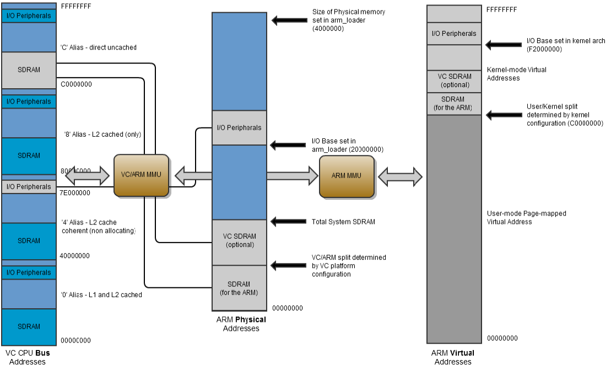

\page RPI_BAREMETAL Raspberry Pi baremetal development

# Raspberry Pi baremetal development

## Reference material

 - [Raspberry Pi documentation](https://github.com/raspberrypi/documentation/tree/develop/documentation/asciidoc/computers/raspberry-pi)
 - [Raspberry Pi 3B schematics](RPI-3B-V1_2-schematic-reduced.pdf)
 - [Raspberry Pi 3B physical layout](RPI-3B-V1_2-mechanical-drawing.pdf)
 - [Raspberry Pi 4B schematics](RPI-4B-schematics-reduced.pdf)
 - [Raspberry Pi 4B physical layout](RPI-4B-mechanical-drawing.pdf)
 - [ARM architecture registers](../../cpu/ARM-architecture-registers.pdf)
 - [ARM Cortex A-53 reference r0p2](../../cpu/ARM-Cortex-A53-r0p2.pdf)
 - [ARM Cortex A-53 reference r0p4](../../cpu/ARM-Cortex-A53-r0p4.pdf)
 - [ARM Cortex A-72 reference r0p3](../../cpu/ARM-Cortex-A72-r0p3.pdf)
 - [BCM2835 peripherals specification](BCM2835-peripherals.pdf)
 - [BCM2836 peripherals specification](BCM2836-peripherals.pdf)
 - [BCM2837 peripherals specification](BCM2837-peripherals.pdf)
 - [BCM2711 peripherals specification](bcm2711-peripherals.pdf)
 - [VideoCore IV specification](VideoCore-IV-3D-architecture-reference-guide.pdf)

## Startup

### Start of execution, loading image

At startup, the video core (VC) starts first. It loads start.elf, and executes it, i.e. start.elf is a GPU executable, not an ARM executable.
The code in the GPU loads the image for execution, which depends on the board and the architecture used:

| Board  | Architecture     | Image            |
|--------|------------------|------------------|
| RPI 1  | 32 bit (Arm)     | kernel.img       |
| RPI 2  | 32 bit (Arm)     | kernel7.img      |
| RPI 3  | 32 bit (Arm)     | kernel8-32.img   |
| RPI 3  | 64 bit (AArch64) | kernel8.img      |
| RPI 4  | 32 bit (Arm)     | kernel7l.img     |
| RPI 4  | 64 bit (AArch64) | kernel8-rpi4.img |

Once the image is loaded, the GPU resets the ARM, which then starts executing. The start address depends on the architecture:

### CPU execution start address

| Architecture     | Start address |
|------------------|---------------|
| 32 bit (Arm)     | 0x8000        |
| 64 bit (AArch64) | 0x80000       |

This is due to the GPU placing a jump opcode at address 0x0000, which is the initial starting point.

### CPU <-> GPU communication

CPU and GPU communicate through a mailbox interface:
 - CPU writes data
 - CPU flags to GPU that data is ready
 - GPU reads data and processes
 - GPU writes response
 - CPU polls for ready response and reads it

The mailbox interface is just another peripheral.

### CPU <-> Peripheral communication

Every peripheral has a slot of memory mapped I/O (MMIO). The start address depends on the SoC:

| SoC           | Peripheral address start | Peripheral address size |
|---------------|--------------------------|-------------------------|
| BCM2835       | 0x20000000               | 0x01000000
| BCM2836       | 0x3F000000               | 0x01000000
| BCM2837       | 0x3F000000               | 0x01000000
| BCM2711       | 0xFE000000               | 0x01800000
 
Peripheral data is written in 32 bit words, aligned on 4 bytes.
Every peripheral has control/status and data words.

Peripheral MMIO slots for BCM2837:

| Start address | Peripheral |
|---------------|------------|
| 0x3F003000    | System Timer 
| 0x3F00B000    | Interrupt controller
| 0x3F00B880    | VideoCore mailbox 
| 0x3F100000    | Power management 
| 0x3F104000    | Random Number Generator
| 0x3F200000    | General Purpose IO controller
| 0x3F201000    | UART0 (serial port, PL011)
| 0x3F215000    | UART1 (serial port, AUX mini UART)
| 0x3F300000    | External Mass Media Controller (SD card reader)
| 0x3F980000    | Universal Serial Bus controller

### Memory Management Unit (MMU)

The CPU also has a MMU, which can be used to map addresses to virtual addresses.

### Code execution

After the GPU initializes, all cores are started, however depending on whether the core is core 0 or a secondary core:

| Core | Start address |
|------|---------------|
| 0    | 0x00000000 -> 0x00008000 or 0x00080000
| 1    | Address read from memory location 0x000000E0
| 2    | Address read from memory location 0x000000E8
| 3    | Address read from memory location 0x000000F0

To determine which core is currently running, use the MPIDR_EL1 system register, e.g.:

```asm
asm volatile ("mrs %0, mpidr_el1" : "=r" (nMPIDR));
```

### Memory mapping

Memory is mapping in ranges, with different address mapping for each range:

| Physical address      | VC address                          | Use                                |
|-----------------------|-------------------------------------|------------------------------------|
| 0x00000000-end        | -                                   | User space (Physical memory depending on memory size)
| 0x00000000-split      | 0xC0000000-0xC0000000 + split       | Kernel space of ARM assigned memory
| split-end             | 0xC0000000 + split-0xC0000000 + end | Kernel space of VC assigned memory
| 0x20000000-0x21000000 | 0x7E000000-0x7F000000               | I/O peripherals (RPI 1)
| 0x3F000000-0x40000000 | 0x7E000000-0x7F000000               | I/O peripherals (RPI 2/3)
| 0xFE000000-0xFF000000 | 0x7E000000-0x7F000000               | I/O peripherals (RPI 4)

Mapping from BCM2835 peripherals specification.


Linux uses a virtual address mapping, however that is not relevant here.

Circle uses the following layout of the ARM memory:

#### RPI 1

| Base     | Size         | Contents               | Remarks                      |
|----------|--------------|------------------------|------------------------------|
| 00000000 | 32 Bytes     | Exception vector table |                              |
| ...      |              |                        |                              |
| 00000100 | variable     | ATAGS                  | unused                       |
| 00008000 | max. 2 MByte | Kernel image           |                              |
|          |              | .init                  | startup code                 |
|          |              | .text                  |                              |
|          |              | .rodata                |                              |
|          |              | .init_array            | static constructors          |
|          |              | .ARM.exidx             | C++ exception index          |
|          |              | .eh_frame              | unused                       |
|          |              | .data                  |                              |
|          |              | .bss                   |                              |
| ...      |              |                        |                              |
| 00208000 | 128 KByte    | Kernel stack           |                              |
| 00228000 | 32 KByte     | Abort exception stack  |                              |
| 00230000 | 32 KByte     | IRQ exception stack    |                              |
| 00238000 | 32 KByte     | FIQ exception stack    |                              |
| 00240000 | 16 KByte     | Page table 1           |                              |
| ...      |              |                        |                              |
| 00400000 | 1 MByte      | Coherent region        | for property mailbox, VCHIQ  |
| 00500000 | variable     | Heap allocator         | malloc()                     |
| ???????? | 4 MByte      | Page allocator         | palloc()                     |
| split    | variable     | GPU memory             | depending on split location  |
| end RAM  |              | End of physical RAM    |                              |
| 20000000 |              | Peripherals            |                              |
| ...      |              |                        |                              |

#### RPI 2/3 32 bit

| Base     | Size         | Contents                     | Remarks                      |
|----------|--------------|------------------------------|------------------------------|
| 00000000 | 32 Bytes     | Exception vector table       |                              |
| 00000000 | 256 Bytes    | ARM stub                     | Contains spinlock for cores 1-3 |
| ...      |              |                              |                              |
| 00000100 | variable     | ATAGS                        | unused                       |
| 00008000 | max. 2 MByte | Kernel image                 | Can be larger if KERNEL_MAX_SIZE redefined
|          |              | .init                        | startup code                 |
|          |              | .text                        |                              |
|          |              | .rodata                      |                              |
|          |              | .init_array                  | static constructors          |
|          |              | .ARM.exidx                   | C++ exception index          |
|          |              | .eh_frame                    | unused                       |
|          |              | .data                        |                              |
|          |              | .bss                         |                              |
| ...      |              |                              |                              |
| 00208000 | 128 KByte    | Kernel stack core 0          |                              |
| 00228000 | 128 KByte    | Kernel stack core 1          |                              |
| 00248000 | 128 KByte    | Kernel stack core 2          |                              |
| 00268000 | 128 KByte    | Kernel stack core 3          |                              |
| 00288000 | 32 KByte     | Abort exception stack core 0 |                              |
| 00290000 | 32 KByte     | Abort exception stack core 1 |                              |
| 00298000 | 32 KByte     | Abort exception stack core 2 |                              |
| 002A0000 | 32 KByte     | Abort exception stack core 3 |                              |
| 002A8000 | 32 KByte     | IRQ exception stack core 0   |                              |
| 002B0000 | 32 KByte     | IRQ exception stack core 1   |                              |
| 002B8000 | 32 KByte     | IRQ exception stack core 2   |                              |
| 002C0000 | 32 KByte     | IRQ exception stack core 3   |                              |
| 002C8000 | 32 KByte     | FIQ exception stack core 0   |                              |
| 002D0000 | 32 KByte     | FIQ exception stack core 1   |                              |
| 002D8000 | 32 KByte     | FIQ exception stack core 2   |                              |
| 002E0000 | 32 KByte     | FIQ exception stack core 3   |                              |
| 002E8000 | 16 KByte     | Page table 1                 |                              |
| ...      |              |                              |                              |
| 00400000 | 1 MByte      | Coherent region              | for property mailbox, VCHIQ  |
| 00500000 | variable     | Heap allocator               | malloc()                     |
| ???????? | 4 MByte      | Page allocator               | palloc()                     |
| 1F000000 | variable     | RPI stub                     | if used for debugging        |
| split    | variable     | GPU memory                   | depending on split location  |
| end RAM  |              | End of physical RAM          |                              |
| 3F000000 | 16 MByte     | Peripherals                  |                              |
| 40000000 |              | Local peripherals            |                              |
| ...      |              |                              |                              |

#### RPI 2/3 64 bit

| Base     | Size         | Contents                     | Remarks                      |
|----------|--------------|------------------------------|------------------------------|
| 00000000 | 256 Bytes    | ARM stub                     | Contains spinlock for cores 1-3 |
| ...      |              |                              |                              |
| 00000100 | variable     | ATAGS                        | unused                       |
| 00080000 | max. 2 MByte | Kernel image                 | Can be larger if KERNEL_MAX_SIZE redefined |
|          |              | .init                        | startup code                 |
|          |              | .text                        |                              |
|          |              | .rodata                      |                              |
|          |              | .init_array                  | static constructors          |
|          |              | .ARM.exidx                   | C++ exception index          |
|          |              | .eh_frame                    | unused                       |
|          |              | .data                        |                              |
|          |              | .bss                         |                              |
| ...      |              |                              |                              |
| 00208000 | 128 KByte    | Kernel stack core 0          |                              |
| 00228000 | 128 KByte    | Kernel stack core 1          |                              |
| 00248000 | 128 KByte    | Kernel stack core 2          |                              |
| 00268000 | 128 KByte    | Kernel stack core 3          |                              |
| ...      |              |                              |                              |
| 00500000 | 1 MByte      | Coherent region              | for property mailbox, VCHIQ  |
| 00500000 | variable     | Heap allocator               | malloc()                     |
| ???????? | 16 MByte     | Page allocator               | palloc()                     |
| split    | variable     | GPU memory                   | depending on split location  |
| end RAM  |              | End of physical RAM          |                              |
| 3F000000 | 16 MByte     | Peripherals                  |                              |
| 40000000 |              | Local peripherals            |                              |
| ...      |              |                              |                              |

#### RPI 4 32 bit

| Base     | Size         | Contents                     | Remarks                      |
|----------|--------------|------------------------------|------------------------------|
| 00000000 | 32 Bytes     | Exception vector table       |                              |
| 00000000 | 256 Bytes    | ARM stub                     | Contains spinlock for cores 1-3
| ...      |              |                              |                              |
| 00000100 | variable     | ATAGS                        | unused                       |
| 00008000 | max. 2 MByte | Kernel image                 | Can be larger if KERNEL_MAX_SIZE redefined |
|          |              | .init                        | startup code                 |
|          |              | .text                        |                              |
|          |              | .rodata                      |                              |
|          |              | .init_array                  | static constructors          |
|          |              | .ARM.exidx                   | C++ exception index          |
|          |              | .eh_frame                    | unused                       |
|          |              | .data                        |                              |
|          |              | .bss                         |                              |
| ...      |              |                              |                              |
| 00208000 | 128 KByte    | Kernel stack core 0          |                              |
| 00228000 | 128 KByte    | Kernel stack core 1          |                              |
| 00248000 | 128 KByte    | Kernel stack core 2          |                              |
| 00268000 | 128 KByte    | Kernel stack core 3          |                              |
| 00288000 | 32 KByte     | Abort exception stack core 0 |                              |
| 00290000 | 32 KByte     | Abort exception stack core 1 |                              |
| 00298000 | 32 KByte     | Abort exception stack core 2 |                              |
| 002A0000 | 32 KByte     | Abort exception stack core 3 |                              |
| 002A8000 | 32 KByte     | IRQ exception stack core 0   |                              |
| 002B0000 | 32 KByte     | IRQ exception stack core 1   |                              |
| 002B8000 | 32 KByte     | IRQ exception stack core 2   |                              |
| 002C0000 | 32 KByte     | IRQ exception stack core 3   |                              |
| 002C8000 | 32 KByte     | FIQ exception stack core 0   |                              |
| 002D0000 | 32 KByte     | FIQ exception stack core 1   |                              |
| 002D8000 | 32 KByte     | FIQ exception stack core 2   |                              |
| 002E0000 | 32 KByte     | FIQ exception stack core 3   |                              |
| 002E8000 | 16 KByte     | Page table 1                 |                              |
| ...      |              |                              |                              |
| 00500000 | 4 MByte      | Coherent region              | for property mailbox, VCHIQ, xHCI |
| 00500000 | variable     | Heap allocator               | "new" and malloc()           |
| ???????? | 4 MByte      | Page allocator               | palloc()                     |
| split    | variable     | GPU memory                   | depending on split location  |
| 40000000 | variable     | high heap allocator          | unused above 0xC0000000      |
| end RAM  |              | End of physical RAM          |                              |
| ...      |              |                              |                              |
| FA000000 | 2 MByte      | xHCI controller              | mapped from 0x600000000      |
| ...      |              |                              |                              |
| FE000000 | 64 MByte     | Peripherals                  |                              |

#### RPI 4 64 bit

| Base     | Size         | Contents                     | Remarks                      |
|----------|--------------|------------------------------|------------------------------|
| 00000000 | 256 Bytes    | ARM stub                     | Contains spinlock for cores 1-3 |
| ...      |              |                              |                              |
| 00000100 | variable     | ATAGS                        | unused                       |
| 0006F000 | 4 KByte      | EL3 stack                    |                              |
| 00070000 | 2 KByte      | Exception vector table EL3   |                              |
| 00080000 | max. 2 MByte | Kernel image                 | Can be larger if KERNEL_MAX_SIZE redefined |
|          |              | .init                        | startup code                 |
|          |              | .text                        |                              |
|          |              | .rodata                      |                              |
|          |              | .init_array                  | static constructors          |
|          |              | .ARM.exidx                   | unused                       |
|          |              | .eh_frame                    | C++ exception frames         |
|          |              | .data                        |                              |
|          |              | .bss                         |                              |
| ...      |              |                              |                              |
| 00208000 | 128 KByte    | Kernel stack core 0          |                              |
| 00228000 | 128 KByte    | Kernel stack core 1          |                              |
| 00248000 | 128 KByte    | Kernel stack core 2          |                              |
| 00268000 | 128 KByte    | Kernel stack core 3          |                              |
| 00288000 | 32 KByte     | Exception stack core 0       |                              |
| 00290000 | 32 KByte     | Exception stack core 1       |                              |
| 00298000 | 32 KByte     | Exception stack core 2       |                              |
| 002A0000 | 32 KByte     | Exception stack core 3       |                              |
| ...      |              |                              |                              |
| 00500000 | 4 MByte      | Coherent region              | for property mailbox, VCHIQ, xHCI |
| 00900000 | variable     | Heap allocator               | "new" and malloc()           |
| ???????? | 16 MByte     | Page allocator               | palloc()                     |
| split    | variable     | GPU memory                   | depending on split location  |
| 40000000 | variable     | high heap allocator          | unused above 0xC0000000      |
| end RAM  |              | End of physical RAM          |                              |
| ...      |              |                              |                              |
| FE000000 | 64 MByte     | Peripherals                  |                              |
| ...      |              |                              |                              |
| 600000000 | 64 MByte    | xHCI controller              | mapped from 0x600000000      |
| ...      |              |                              |                              |
| FC000000 | 64 MByte     | Peripherals                  |                              |
| ...      |              |                              |                              |
| 600000000 | 64 MByte    | xHCI controller              |                              |
