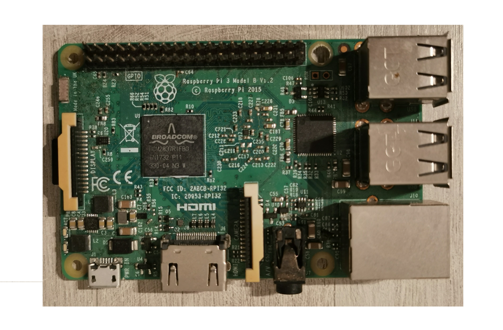
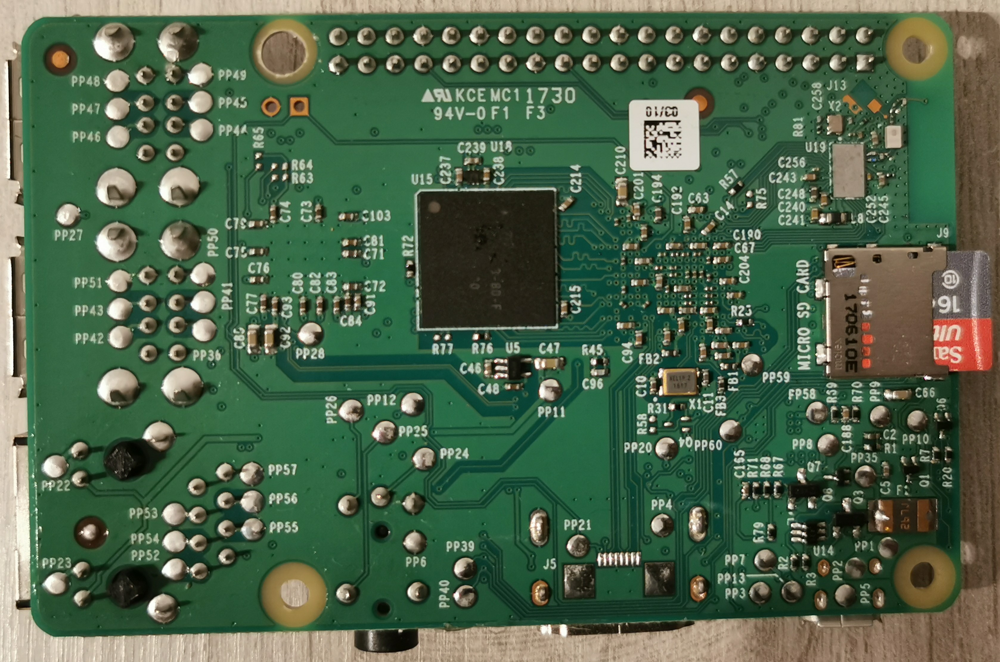
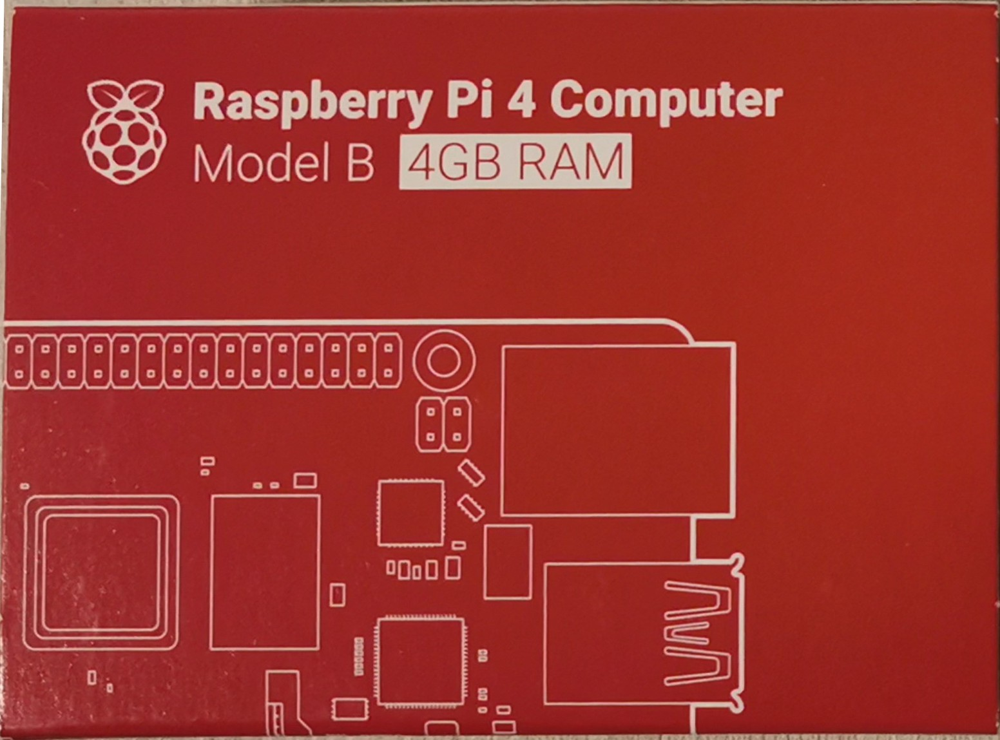
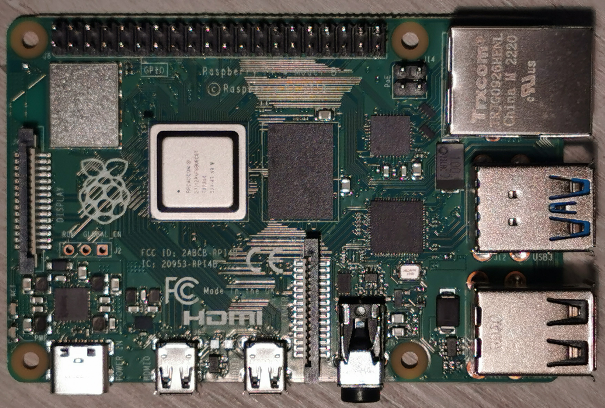
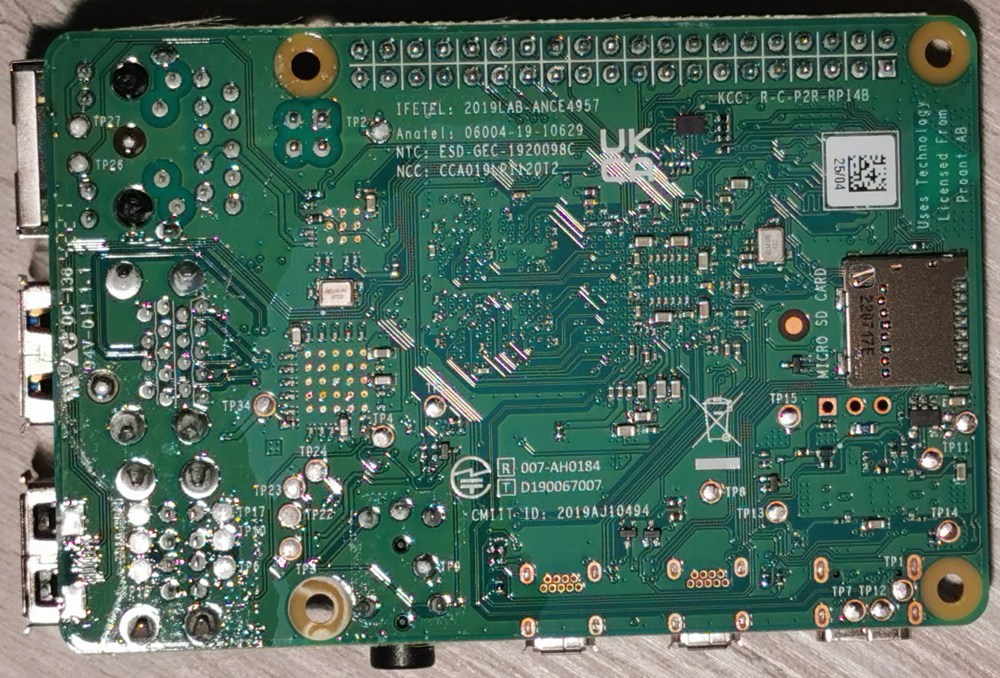
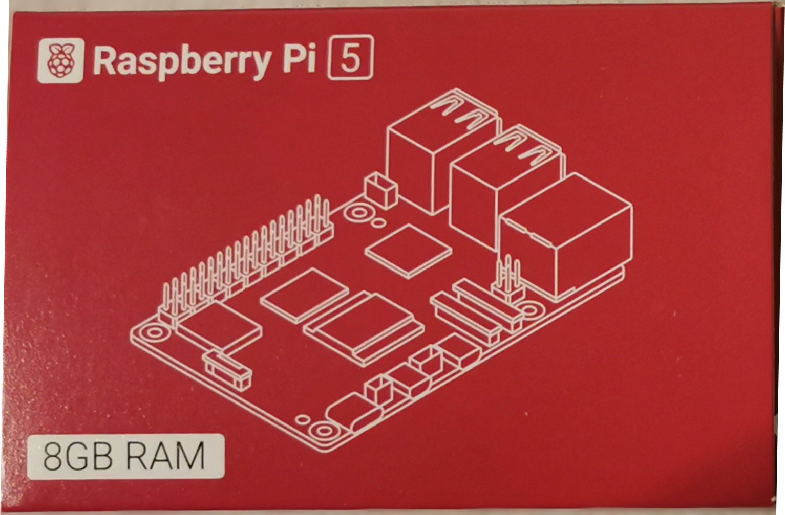
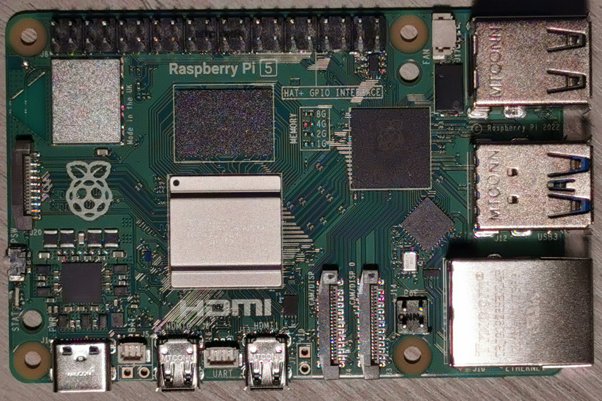
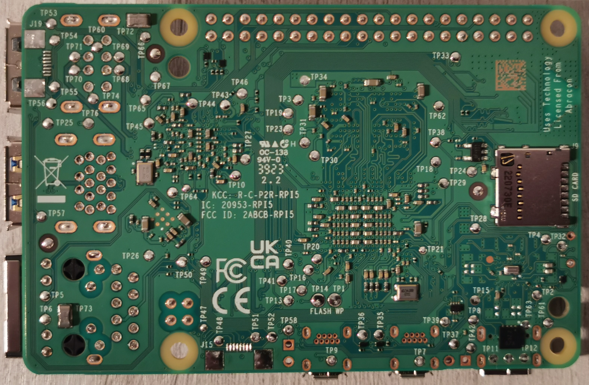

# Hardware overview {#HARDWARE_OVERVIEW}

So let's start with the description of the boards we're targeting. I currently own a RPI3B, 4B and 5B

## Rasperry Pi 3B {#HARDWARE_OVERVIEW_RASPERRY_PI_3B}

Raspberry Pi 3 was introduced in 2016. It was the first board to have a quad core ARM v8, 64-bit OS support, and with the model B, also Wifi and Bluetooth connectivity. It is arguably the best sold model up until now.

__Raspberry Pi 3B top view__

__Raspberry Pi 3B bottom view__

## Raspberry Pi 4B {#HARDWARE_OVERVIEW_RASPBERRY_PI_4B}

After the success of Raspberry Pi 3, the waiting for its follow up took long.
Raspberry Pi 4B was finally introduced in 2019.
The differences were a Cortex A72 quad core Arm V8 instead of Cortex A53, which ran at a slightly higher clock rate.
But the major difference was in USB3 support, and finally a full speed network socket at 1 Gbps.
This board also has a USB-C power socket.

__Raspberry Pi 4B box__

__Raspberry Pi 4B top view__

__Raspberry Pi 4B bottom view__

## Raspberry Pi 5 {#HARDWARE_OVERVIEW_RASPBERRY_PI_5}

Again after quite some time, Raspberry Pi 5 was introduced October 2023.
It has quite some feature improvements, amongst which are a power / reset switch and of course an improved SoC.

__Raspberry Pi 5 box__

__Raspberry Pi 5 top view__

__Raspberry Pi 5 bottom view__
## Hardware specifications {#HARDWARE_OVERVIEW_HARDWARE_SPECIFICATIONS}

The table below shows the different hardware specifications for the boards mentioned

| Feature   | Raspberry Pi 3B                                            | Raspberry Pi 4B                                             | Raspberry Pi 5                                                |
|-----------|------------------------------------------------------------|-------------------------------------------------------------|---------------------------------------------------------------|
| SoC       | BCM8237                                                    | BCM 2711                                                    | BCM 2712                                                      |
| CPU       | Quad ARM Cortex A53 (ArmV8) 64 bit @ 1.2 Ghz               | Quad ARM Cortex A72 (ArmV8) 64 bit @ 1.5 Ghz                | Quad ARM Cortex A76 (ArmV8) 64 bit @ 2.4 Ghz                  |
| Cache     |                                                            | L1: 32K data 48K instr per core, L2: 1Mb                    | L1: 64K data 64K instr per core, L2: 512Kb per core, L3: 2 Mb |
| GPU       | VideoCore IV @ 250 Mhz                                     | VideoCore VI 3D @ 500 Mhz                                   | VideoCore VII 12 core @ 1 Ghz                                 |
| Codecs    |                                                            | H.265 (4Kp60), H.264 (1080p60 1080p30) OpenGL ES 3.1 Vulkan | HEVC (4Kp60), OpenGL ES 3.1 Vulkan 1.2                        |
| IO bus    | USB 2.0                                                    | PCIe 1x                                                     | PCIe 2.0 1x                                                   |
| RAM       | 1 Gb                                                       | 1/2/4/8 Gb LPDDR4-3200                                      | 4 /8 Gb LPDDR4X-4267                                          |
| Wifi      | 802.11 b/g/n (BCM43438)                                    | 802.11ac b/g/n (Infineon CYW43455)                          | 802.11ac b/g/n (Infineon CYW43455)                            |
| Bluetooth | 4.1 (BCM43438)                                             | 5.0 BLE                                                     | 5.0 BLE                                                       |
| Ethernet  | 100 Mbit                                                   | 1 Gbps with PoE                                             | 1 Gbps with PoE+                                              |
| USB       | 4 x USB 2.0                                                | 2 x USB2.0, 2 x USB 3.0                                     | 2 x USB2.0, 2 x USB 3.0                                       |
| Audio     | 3.5 mm stereo out, mono in, with CVBS out, 1 x HDMI        | 3.5 mm stereo out, mono in, with CVBS out, 2 x HDMI         | 2 x HDMI                                                      |
| Video     | 3.5 mm CVBS, 1 x HDMI (HD)                                 | 3.5 mm CVBS, 2 x micro HDMI (4Kp60)                         | 2 x micro HDMI (4K) with HDR                                  |
| Camera    | 1 x CSI                                                    | 1 x CSI                                                     | 2 x MIPI                                                      |
| Display   | 1 x DSI                                                    | 1 x DSI                                                     | 2 x MIPI                                                      |
| IR        | No                                                         | No                                                          | No                                                            |
| RTC       | No                                                         | No                                                          | Yes                                                           |
| SPI Flash | No                                                         | No                                                          | No                                                            |
| UART      | Via GPIO                                                   | Via GPIO                                                    | Yes                                                           |
| GPIO      | 1.8/3.3/5V, SPI, I2C, PWM, JTAG, UART, OneWire             | 1.8/3.3/5V, SPI, I2C, PWM, JTAG, UART, OneWire              | 1.8/3.3/5V, SPI, I2C, PWM, JTAG, UART, OneWire                |
