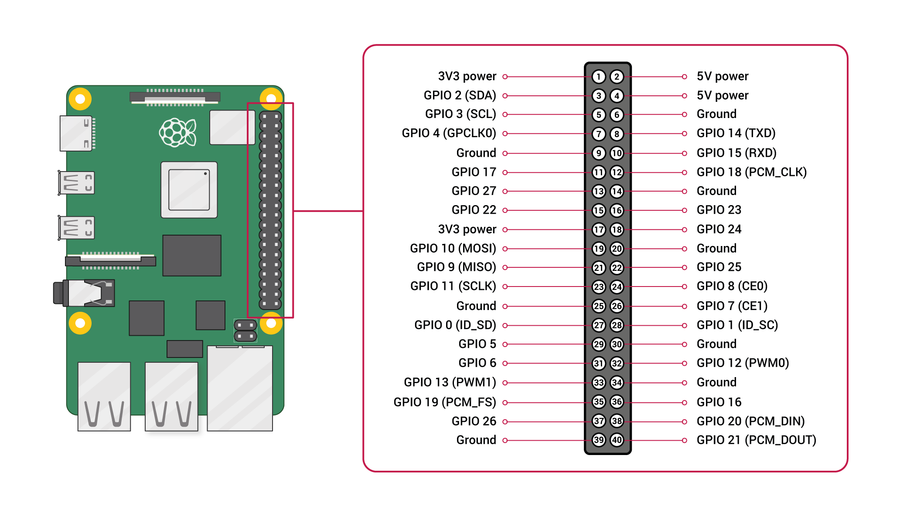
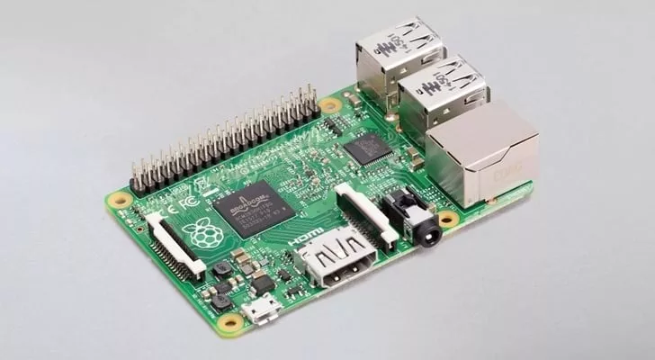

# Introduction {#INTRODUCTION}

## Hardware {#INTRODUCTION_HARDWARE}

### Raspberry Pi {#INTRODUCTION_HARDWARE_RASPBERRY_PI}

Raspberry Pi is a series of small single-board computers (SBCs) developed in the United Kingdom by the Raspberry Pi Foundation in association with Broadcom.
The Raspberry Pi project originally leaned toward the promotion of teaching basic computer science in schools.
The original model became more popular than anticipated, selling outside its target market for diverse uses such as robotics, home and industrial automation, and by computer and electronic hobbyists, because of its low cost, modularity, open design, and its adoption of the HDMI and USB standards.

The Raspberry Pi became the best-selling British computer in 2015, when it surpassed the ZX Spectrum in unit sales.

#### Raspberry Pi 1 {#INTRODUCTION_HARDWARE_RASPBERRY_PI_RASPBERRY_PI_1}

The first boards to be released were RaspBerry Pi Model A and B.
The model B was the more complex version, which was released Feb 2012, followed by model A in Feb 2013, which is simpler and cheaper.

Model 1B featured:
- a Broadcom SoC (BCM2835) containing a single core ARM1176JZF-S processor @700 Mhz, and a VideoCore IV graphics processor running at 250 MHz
- 512 Mb RAM (initially 256 Mb)
- 1 UART devices
- 1 SPI bus
- 2 I2C busses
- 2 I2S busses
- 2 USB 2.0 busses
- 1 ethernet port (100 Mpbs)
- 1 HDMI port
- 1 CSI port for camera's
- 1 DSI port for displays
- a composite video output
- a combined stereo audio / composite video jack (3.5mm)
- a micro USB power connector
- a full SD card slot
- a 26 pin header for GPIO connections
  - SPI bus
  - UART device
  - 5V, 3.3V and GND connections
  - I2C bus (the other is internal only)
  - I2S bus for extension towards HATs
  - 8 GPIO pins

Model 1A is similar, with the following differences:
- the ethernet port was removed
- one USB port was removed

This board was intentionally kept at credit card size, to make it sufficiently compact to be put on a desk or inside a small casing.
The Broadcom SoC, BCM2835 houses a single core ARM1176JZF-S processor, the video processor, as well as the a large part of the peripherals on the board.

Raspberry Pi 1A

Raspberry Pi 1B

For experimentation, from the start Raspberry Pi was equipped with a so-called GPIO connector, making it possible to connect other hardware. The first GPIO connector had 26 pins.

Original Raspberry Pi 1 GPIO pinout

In 2014, these boards were followed by model A+ and B+, which brought some improvements.

The main differences are:
- the 26 pin GPIO header was enlarged to 40 pins, making more signals available:
  - 17 instead of 8 GPIO pins
  - more ground pins
  - the internal I2C bus (for EEPROM readout) is added
- 4 instead of 2 USB 2.0 ports
- removed the separate RCA connector for composite video (se this signal is only present in the 3.5 mm jack connector)
- the SD card slot was changed to a micro SD slot

Model A+ was again a simpler and cheaper version:
- smaller PCB (all boards since model B+ will be 85 x 56 mm, the a+ model was 66 x 56 mm)
- the ethernet port was removed
- 3 of the USB ports were removed, leaving just 1 port

Raspberry Pi 1B+

As stated, the models A+ and B+ featured a 40 pin GPIO header, which was kept in all later versions of Raspberry Pi 2, 3, 4, 5 and partly Zero.

40 pin Raspberry Pi GPIO pinout

#### Raspberry Pi CM {#INTRODUCTION_HARDWARE_RASPBERRY_PI_RASPBERRY_PI_CM}

In parallel with model 1B+, the compute module (CM) was introduced in 2014.
The intention was to create a smaller form factor, dropping most external connectors, aiming at industrial usage.
All connectors are replaced with a DDR2 SO DIMM slot connector, to make it pluggable into a board.
With this it would be possible to create cheap compute systems putitng clusters of CM modules onto a single PCB.
The SD card slot is replaced by an on-board eMMC chip of 4 Gb.

Raspberry Pi CM

#### Raspberry Pi 2B {#INTRODUCTION_HARDWARE_RASPBERRY_PI_RASPBERRY_PI_2B}

With the introduction of model 2B in 2015, the SoC was replaced with a newer version, the BCM 2836, which was a major upgrade:
- the single core ARM1176JZF-S processor was replaced by a quad core Cortex-A7 processor, running at 900 Mhz, instead of the original 700 MHz for Raspberry Pi 1
- the memory was upgraded from 512 Mb to 1 Gb

There were intentions to create a model 2A, but due to the development of model 3, this was skipped.

Raspberry Pi 2B

#### Raspberry Pi Zero {#INTRODUCTION_HARDWARE_RASPBERRY_PI_RASPBERRY_PI_ZERO}

Also in 2015, the Raspberry Pi Zero was introduced, which was aimed at a much smaller form factor, and a 5$ price point.
The design is largely based on the Model 1A+, while dropping most of the connectors.
Also the GPIO pin header is left out, however it can still be mounted, as the holes are present.

Differences compare to the model 1A+ are:
- smaller PCB of 65 x 30 mm
- HDMI port is replaced by mini HDMI port
- USB port is replaced by micro USB port
- the DSI connector for the display was dropped

Raspberry Pi Zero

#### Raspberry Pi 3B {#INTRODUCTION_HARDWARE_RASPBERRY_PI_RASPBERRY_PI_3B}

In 2016, another major update was release, the model 3B. Like for model 2, there were plans for a model 3A, however it was never released.

The major differences between model 2B and model 3B are:
- The SoC was upgraded to BCM 2837, which features a Cortex A-53 based processor, running at 1.2 Ghz
- with the new SoC this also introduced the possibility for a 64 bit architecture
- Wifi b/g/n was added through BCM43438
- Bluetooth was added (version 4.2 BLE) BCM43438

Raspberry Pi 3B

#### Raspberry Pi CM3 {#INTRODUCTION_HARDWARE_RASPBERRY_PI_RASPBERRY_PI_CM3}

With the popularity of model 3B, it was decided to also release an updated Compute Module in 2017.

The model is basically a Model 3B with the same changes as the model 1B+ versus CM:
- all connectors are replaced with a DDR2 SO DIMM slot connector.
- the SD card slot is replaced by an on-board eMMC chip of 4 Gb
- however there was also a version that replaced the eMMC with a micro SD card slot to lower the price (CM3L)

Raspberry Pi CM3

#### Raspberry Pi Zero W {#INTRODUCTION_HARDWARE_RASPBERRY_PI_RASPBERRY_PI_ZERO_W}

With the popularity of model Zero, there was also a strong request for wireless connectivity on this model.
For this the model Zero W was released in 2017. The main characteristics are still the same as for model Zero:
- largely based on the Model 1A+, while dropping most of the connectors
- the GPIO pin header is left out, however it can still be mounted, as the holes are present
- Smaller PCB of 65 x 30 mm
- HDMI port is replaced by mini HDMI port
- USB port is replaced by micro USB port

Additions:
- Wifi b/g/n was added
- Bluetooth was added (version 4.2 BLE)

Raspberry Pi Zero W

#### Raspberry Pi 3B+ {#INTRODUCTION_HARDWARE_RASPBERRY_PI_RASPBERRY_PI_3B_}

In 2018, an upgrade to model 3B was released, with some improvements in various areas.

The major differences between model 3B and model 3B+ are:
- the SoC was upgraded to BCM2837B0
  - the CPU (Cortex A-57) clock was increased from 1.2 Ghz to 1.4 GHz
  - the video core clock was increased from 250 Mhz to 400 MHz
  - the SoC has a heat spreader making to make it possible to overclock the chip without heat issues
- the ethernet port was changed from 100 Mbps to 1 Gbps (however the maximum actual rate is around 300 Mbps due to the fact that it uses the same bridge as the USB channels)
- the ethernet port also supports PoE, which means it can be powered over ethernet. This does require a special PoE HAT however
- Wifi was upgraded to b/g/n/ac supporting both 2.4 Ghz and 5 GHz channels

Raspberry Pi 3B+

#### Raspberry Pi 3A+ {#INTRODUCTION_HARDWARE_RASPBERRY_PI_RASPBERRY_PI_3A_}

Also in 2018, finally a model A version was released again, the model 3A+. It is technically identical to model 3B+, with the following differences:
- the same PCB size as for the Model A+
- the memory size is decreased from 1Gb to 512 Mb
- no ethernet port
- 1 USB port instead of 4

Raspberry Pi 3A+

#### Raspberry Pi 4 {#INTRODUCTION_HARDWARE_RASPBERRY_PI_RASPBERRY_PI_4}

In 2019, three years after the popular model 3B was released, the next version, model 4B came onto the market.
This was again a major improvement.

Compared to the model 3B+ the differences are:
- a new SoC, the BCM 2711, which features:
  - a quad core Cortex A-72 running at 1.6 GHz
  - a new VideoCore VI graphics processor running at 500 MHz
  - an H.265 decoder up to 4kp60, and H.264 decoder up to 1080p80
  - an H.264 encoder up to 1080p30
  - introduction of a PCIe link to a.o. USB port for performance
- a choice of memory sizes from 1, 2, 4 and 8 Gb (although the 1Gb was only on the market for a short time) all utilizing LPDDR4 (as compared to LPDDR2 on Raspberry Pi 3 and earlier)
- support for two UHD (4K) micro HMDI ports (which technically both can have 4Kp60 display configuration, although in dual display configuration this goes down to 4Kp30 for each display)
- 2 USB 2.0 and 2 USB 3.0 ports (as compared to 4 USB 2.0 ports on model 3B+)
- full 1 Gbps ethernet using BCM54213PE chip due to introduction of a separate connection to the SoC
- support for 802.11b/g/n/ac WiFi 5
- support for Bluetooth 5.0 BLE
- power connector changed to USB-C

Raspberry Pi 4B

#### Raspberry Pi CM4 {#INTRODUCTION_HARDWARE_RASPBERRY_PI_RASPBERRY_PI_CM4}

As with model 3, also a model 4 CM was released in 2020.

The model is basically a Model 4B with the similar changes as the model 3B versus CM3:
- all connectors are replaced with a double barrel connector instead of the SO DIMM connector employed before
- the SD card slot is replaced by an on-board eMMC chip of 0 (CM4L), 8, 16 or 32 Gb
- there are versions with Wifi and Bluetooth support, with built-in or external antenna

Raspberry Pi CM4

#### Raspberry Pi 400 {#INTRODUCTION_HARDWARE_RASPBERRY_PI_RASPBERRY_PI_400}

For ease of use, a new form factor of model 4B was released in 2020, named Model 400.
This contains model 4B functionality built into a keyboard.

Compared to the model 4B the differences are:
- different form factor with all connectors on one side
- improved thermal performance allowing CPU clock to increase to 1.8 GHz
- one USB 2.0 and two USB 3.0 (one port less than model 4B)

Raspberry Pi 400

#### Raspberry Pi 5B {#INTRODUCTION_HARDWARE_RASPBERRY_PI_RASPBERRY_PI_5B}

After a lot of discussion whether there would be a follow up to the model 4B, in Oct 2023, model 5B was released.
Due to chip shortage tied to Covid, it was very scarce for a long time.
Model 5B is again a serious improvement to its predecessor.

Main difference with model 4B are:
- a new SoC, BCM 2712, which features:
  - a quad Arm Cortex-A76 processor at 2.4 GHz
  - a VideoCore VII processor at 800 MHz
- faster DDR4 memory (LPDDR4 3200 MHz to LPDDR4X 4267 Mhz)
- choice of 4 or 8 Gb memory (there was initially an option for 2Gb, however this was dropped)
- dual 4K@60p support (model 4B only supports one screen at 4K60p, or two at 4K@30p)
- USB 3.0 ports can now support full 5 Gpbs
- M.2 SSD support through HAT
- power button
- Real Time Clock (RTC)
- USB-C debug port
- separate south bridge chip (RP1) for more performance
- 3.5 mm audio jack is removed (no more analog audio, no composite video)
- PCIe connector (Gen 2)
- higher power consumption (27W compared to 15W)

Raspberry Pi 5B

