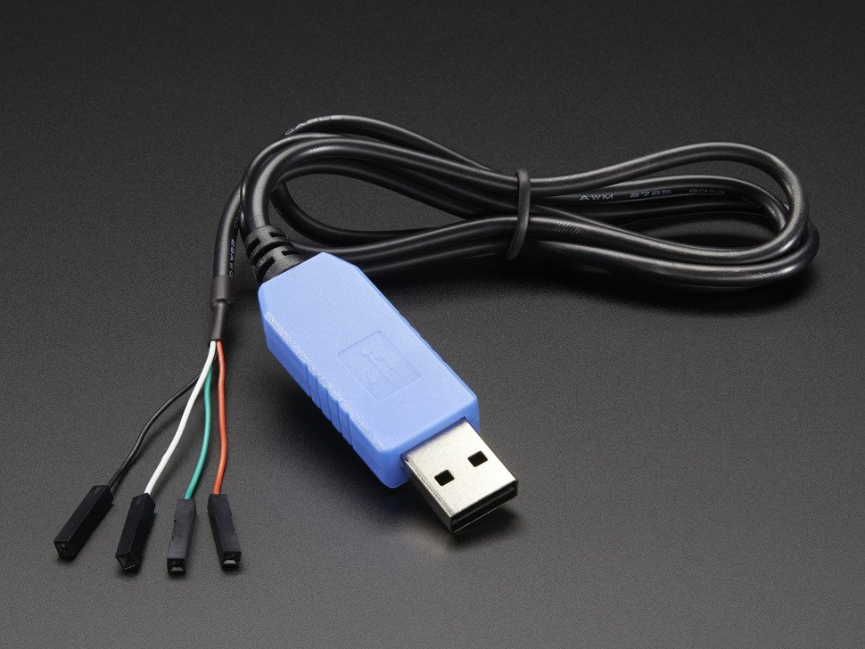
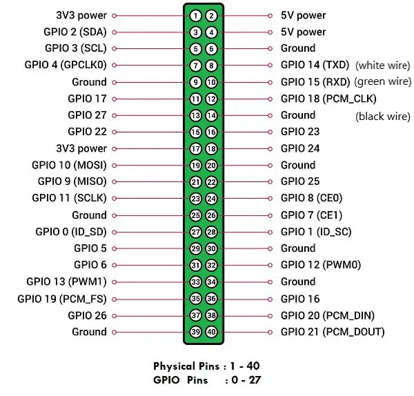
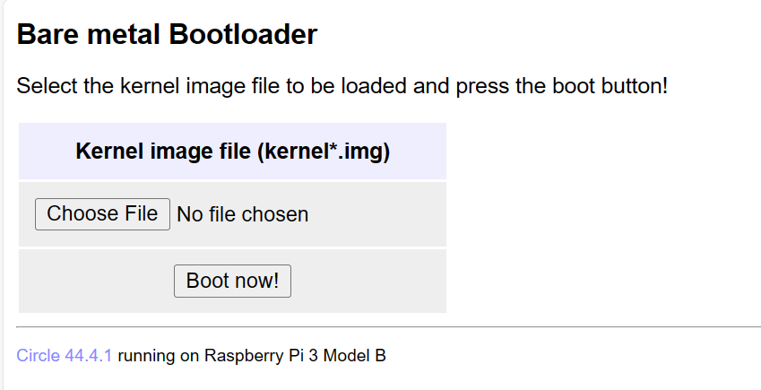
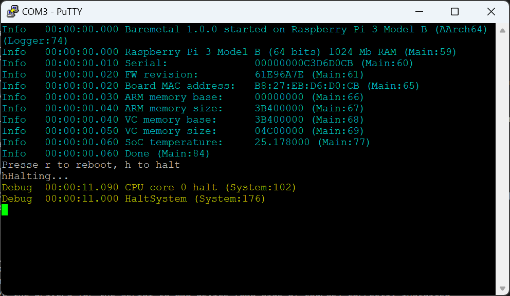
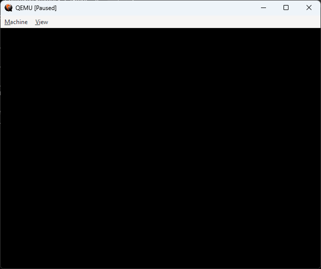

# Setting up for development

If we want to do development for an embedded board, a number of things need to be set up:

- [compiler toolchain](##Compiler-toolchain)
- [build environment](##Build-environment)
- [development environment](##Development-environment)
- [deployment mechanism](##Deployment-mechanism)
- [debugging](##Debugging)

## Compiler toolchain

In order to perform a cross-build (building on one machine to create code that runs on a different target machine), we will need a so-called toolchain.
This is the complete set of compilers, assemblers, linkers, etc. to build binaries for the target platform.

When building for a specific OS, we also need a sysroot, simple said a SDK, that contains all header files and libraries to compile and link with for the specific OS installation.
This requires all libraries needed to build the SW to be present in the sysroot, otherwise we clearly cannot build the SW.
However, since we're going build for baremetal, the only libraries we'll need is the compiler's set of libraries. So no sysroot is needed.

For the toolchain, we're going to choose the GNU toolchain for ARM64. It is possible to use Clang for this as well, but we'll not cover that here.

The current version as of writing this document is 13.2 rel 1.

### Windows

For building on Windows, download [this version](https://developer.arm.com/-/media/Files/downloads/gnu/13.2.rel1/binrel/arm-gnu-toolchain-13.2.rel1-mingw-w64-i686-aarch64-none-elf.zip?rev=01c03590412e49d495c78b9f979fd21c&hash=BC02BCAA3B72FF2472AAB83ECBE4F27C).
Be careful to use the aarch64 version (64 bit), for target none-elf (baremetal). Using the none-linux-gnu version will enable you to build against Linux, however that is not what we need.
Best way to do install on Windows is to create a directory with a short path, say `D:\Toolchains`, and place the unzipped files in a folder underneath this directory.
Then make sure to add the path to the compiler, etc. to the environment (PATH) at system level, so in this case `D:\Toolchains\arm-gnu-toolchain-13.2.Rel1-mingw-w64-i686-aarch64-none-elf\bin`:


In the lower pane, select Path and click Edit...


Click new and add the directory of the compilers, etc., in this case `D:\Toolchains\arm-gnu-toolchain-13.2.Rel1-mingw-w64-i686-aarch64-none-elf\bin`. Click OK

Click OK again to finalize changing the environment.

To test, open a command line prompt, and execute:
```bat
aarch64-none-elf-gcc --version
```

The command should execute without error, and print the version of the compiler:

```text
aarch64-none-elf-gcc (Arm GNU Toolchain 13.2.rel1 (Build arm-13.7)) 13.2.1 20231009
Copyright (C) 2023 Free Software Foundation, Inc.
This is free software; see the source for copying conditions.  There is NO
warranty; not even for MERCHANTABILITY or FITNESS FOR A PARTICULAR PURPOSE.
```

### Linux

For building on Linux, download [this version](https://developer.arm.com/-/media/Files/downloads/gnu/13.2.rel1/binrel/arm-gnu-toolchain-13.2.rel1-x86_64-aarch64-none-elf.tar.xz?rev=a05df3001fa34105838e6fba79ee1b23&hash=D63F63D13F01626D207019956E7122B5).
Be careful to use the aarch64 version (64 bit), for target none-elf (baremetal). Using the none-linux-gnu version will enable you to build against Linux, however that is not what we need.

The easiest way to install on Linux is as follows:

```bash
wget https://developer.arm.com/-/media/Files/downloads/gnu/13.2.rel1/binrel/arm-gnu-toolchain-13.2.rel1-x86_64-aarch64-none-elf.tar.xz
sudo mkdir -p /opt/toolchains
tar xvf arm-gnu-toolchain-13.2.rel1-x86_64-aarch64-none-elf.tar.xz
sudo mv arm-gnu-toolchain-13.2.Rel1-x86_64-aarch64-none-elf/ /opt/toolchains/
```

In order to add the path to your environment, edit `.bashrc`, and add the following line, for example at the end:

```text
export PATH=/opt/toolchains/arm-gnu-toolchain-13.2.Rel1-x86_64-aarch64-none-elf/bin:$PATH
```

To test, first log out and log in again, open a command line prompt, and execute:
```bat
aarch64-none-elf-gcc --version
```

The command should execute without error, and print the version of the compiler:

```text
aarch64-none-elf-gcc (Arm GNU Toolchain 13.2.rel1 (Build arm-13.7)) 13.2.1 20231009
Copyright (C) 2023 Free Software Foundation, Inc.
This is free software; see the source for copying conditions.  There is NO
warranty; not even for MERCHANTABILITY or FITNESS FOR A PARTICULAR PURPOSE.
```

## Build environment

In order to build, we will be using CMake, in combination with Ninja.

### CMake

#### Windows

When using Visual Studio 2019 or later, there will be a CMake version installed for you. For VS 2019, the location will normally be `C:\Program Files (x86)\Microsoft Visual Studio\2019\Community\Common7\IDE\CommonExtensions\Microsoft\CMake\CMake\bin`.

To test, open a command line prompt, and execute:
```bat
"C:\Program Files (x86)\Microsoft Visual Studio\2019\Community\Common7\IDE\CommonExtensions\Microsoft\CMake\CMake\bin\cmake.exe" --version
```

The command should execute without error, and print the version of the CMake:

```text
cmake version 3.20.21032501-MSVC_2

CMake suite maintained and supported by Kitware (kitware.com/cmake).
```

When not using Visual Studio, install CMake by downloading [here](https://cmake.org/download/#latest), by selecting Windows x64 Installer and install it. This will also give you a more recent version of CMake.
The latest stable release at the moment of writing this document is [3.27.8](https://github.com/Kitware/CMake/releases/download/v3.27.8/cmake-3.27.8-windows-x86_64.msi).


Click Next


Check "I accept the terms in the License Agreement", and click Next


Select "Add CMake to the system PATH for all users" or "Add CMake to the system PATH for the current user"

Click Next


Leave the installation path as is. Click Next


Click Install and approve installation


Click Finish

To test, open a command line prompt, and execute:
```bat
"C:\Program Files\CMake\bin\cmake.exe" --version
```

The command should execute without error, and print the version of the CMake:

```text
cmake version 3.27.8

CMake suite maintained and supported by Kitware (kitware.com/cmake).
```

#### Linux

On Linux (Debian), CMake can easily be installed using

```bash
sudo apt update
sudo apt install cmake
```

```text
Reading package lists... Done
Building dependency tree... Done
Reading state information... Done
Suggested packages:
  cmake-doc cmake-format elpa-cmake-mode
The following NEW packages will be installed:
  cmake
0 upgraded, 1 newly installed, 0 to remove and 0 not upgraded.
Need to get 0 B/8,692 kB of archives.
After this operation, 29.6 MB of additional disk space will be used.
Selecting previously unselected package cmake.
(Reading database ... 207262 files and directories currently installed.)
Preparing to unpack .../cmake_3.25.1-1_amd64.deb ...
Unpacking cmake (3.25.1-1) ...
Setting up cmake (3.25.1-1) ...
Processing triggers for man-db (2.11.2-2) ...
```

To test, open a command line prompt, and execute:
```bash
cmake --version
```

The command should execute without error, and print the version of the CMake:

```text
cmake version 3.25.1

CMake suite maintained and supported by Kitware (kitware.com/cmake).
```

### Ninja

To speed up building, often the Ninja build tool is used. This tool is also used by default by Visual Studio when performing CMake builds.

#### Windows

If Visual Studio 2019 is installed, you can find Ninja in `C:\Program Files (x86)\Microsoft Visual Studio\2019\Community\Common7\IDE\CommonExtensions\Microsoft\CMake\Ninja`.

To install Ninja build on your system separately, download it from [here](https://github.com/ninja-build/ninja/releases/download/v1.11.1/ninja-win.zip), and unpack the ZIP file. It will contain only one file, `ninja.exe`.
For example you can place this file in `C:\Program Files\Ninja` make sure to add it to your PATH environment variable.

To test, open a command line prompt, and execute:
```bat
"C:\Program Files\Ninja\ninja.exe" --version
```

The command should execute without error, and print the version of the Ninja:

```text
1.11.1
```

#### Linux

On Linux, your can install ninja by installing the `ninja-build` package:

```bash
sudo apt install ninja-build
```

```text
Reading package lists... Done
Building dependency tree... Done
Reading state information... Done
The following NEW packages will be installed:
  ninja-build
0 upgraded, 1 newly installed, 0 to remove and 3 not upgraded.
Need to get 0 B/136 kB of archives.
After this operation, 427 kB of additional disk space will be used.
Selecting previously unselected package ninja-build.
(Reading database ... 207877 files and directories currently installed.)
Preparing to unpack .../ninja-build_1.11.1-1_amd64.deb ...
Unpacking ninja-build (1.11.1-1) ...
Setting up ninja-build (1.11.1-1) ...
Processing triggers for man-db (2.11.2-2) ...
```

To test, open a command line prompt, and execute:
```bash
ninja --version
```

The command should execute without error, and print the version of the Ninja:

```text
1.11.1
```

## Development environment

As said, the development environment can be as simple as a text editor and running commands on the command prompt.
For Linux, we will use this approach. For Windows, we will be using Visual Studio, however we will also start with the command line, as using Visual Studio requires a bit more configuration. 

### Windows

The current choice for Visual Studio 2019 has to do with the fact that debugging on a remote target (Linux or baremetal) with Visual Studio 2022 does not work from within VS, due to a bug.

When installing Visual Studio 2019, at least make sure `Desktop development with C++` is checked as a feature. The feature `Linux development with C++` is not necessary.

Configuration of the project for Visual Studio is described later in [Setting up project structure](setting-up-project-structure.md).

Of course, a project can also be set up, and code written, using one of the many text editors available for Windows:

- Notepad
- Notepad++
- UltraEdit
- Sublime
- Emacs
- Visual Studio Code
- ...

### Linux

For Linux, the easiest way to build is on the command line. It is possible to use e.g. Visual Studio Code for this as well, but configuration for building and debugging is quite cumbersome, so will not be described here.
Make sure that you editor of choice is installed. Some logical choices may be:

- vi
- vim
- nano
- sublime
- geany
- joe
- gedit
- gnome-text-editor
- Visual Studio Code
- ...

Configuration of the project is described later in [Setting up a project for building and debugging](setting-up-a-project.md).

## Deployment mechanism

In order to deploy a baremetal application, we will need to follow a couple of steps:

- Compile sources and create an application (just a single one, as this is a baremetal system) as a .elf application
- Convert the application into a kernel image
- Place the image onto the target using one of the following methods:
  - Copy the image onto an SD card and start the system (see [Directly running on the target](###Directly-running-on-the-target)). The SD card will need to contain some other files for the system to start.
  - Create a network boot SD card, e.g. using [CircleNetboot](https://github.com/probonopd/CircleNetboot) and start the system. Then go to the website created by the netboot, select an image and upload it. This will reboot the system with your image. __This is my personal preference, as we don't need to rewrite the SD card every time__. The next time the system boots, it will start netboot again.
  - Run the image within QEMU. QEMU is an emulator that supports multiple platforms, including Raspberry Pi (the default QEMU supports up to rpi3 for now, but there is a [patch](https://github.com/0xMirasio/qemu-patch-raspberry4) (untested for now) to run as rpi4).
  __It is also possible to use QEMU with Odroid boards, this will be described later__ [Debugging](##Debugging). 
QEMU requires quite some options, which are not always straightforward. Also, QEMU can never fully emulate all HW on the board.

Converting the application into an image will be described later. It uses `aarch64-none-elf-objcopy` to convert the .elf file into a .img file.

For testing, I've added a pre-built demo application, which we'll get to later. The pre-built image is located in `tutorial/demo/windows/kernel8.img` and `tutorial/demo/linux/kernel8.img`. The difference is that one was built on Windows, the other on Linux.

### Attaching a serial console

For the demo you will need to attach a serial console

__Beware of the following!__

- make __VERY SURE__ to use a 3.3V serial to USB converter. Using the 5V version is likely to damage your board. For an example of a good adapter see [ADAFruit](https://www.adafruit.com/product/954). See below for the one I prefer, however there are more. Be careful about the pinning.
- attach the USB to serial device before powering on the board
- make sure to connect the serial to USB device to the __correct pins__ (normally, and in this case also, GPIO 14 is used for TxD, GPIO15 for RxD for either UART 0 or UART 1, UART 1 in this case)
- make sure you have the drivers for the serial to USB device (USB side of course) correctly installed on your host system
  - Most devices use a Prolific 2303 TA chip, support on Windows 11 is a bit tricky, you'll have to replace the driver for it to work well
- make sure you have a terminal application to communicate with the serial to USB device
  - [Putty](https://www.chiark.greenend.org.uk/~sgtatham/putty/latest.html) has built in support on Windows, or you can download Teraterm (be careful of the source though)
  - One Linux there are quite a few applications available, e.g. minicom
- make sure you have the correct device assigned (COMx on Windows /dev/ttyusbx on Linux) and the correct settings (115200N81, or 115200 baud, no stop bits, 8 data bits, 1 start bit)



#### Pinning for serial to USB

Please refer to the image below (the wiring color is common for most Prolific 2303 devices:


Do __NOT__ connect the red wire (+3.3V).

### Running from SD card

The SD card needs certain other files as well, so it's best to unzip the file `tutorial/demo/Netboot.zip`, copy the contents to the SD card, then copy `tutorial/demo/windows/kernel8.img` or `tutorial/demo/linux/kernel8.img` (the functionality is the same) over the existing one.
Please make sure to eject / sync your SD card first before removing it from the reader.

Put the SD card in your board, and attach a serial to USB device to the board. Then power on the board.

### Running using netboot

The SD card will be created from by unzipping the file `tutorial/demo/Netboot.zip`, and copying the contents to the SD card.
Please make sure to eject / sync your SD card first before removing it from the reader.

Put the SD card in your board, and attach a serial to USB device to the board. Also make sure the board is attached to the network. Then power on the board.
Then find out the IP address of the board, and navigate using a browser to http://\<IP address\>:8080/index.html



Click on `Choose File`, select the correct image (either version of kernel8.img), and click on `Boot now!`. The board will now restart and start your application.

### Running in QEMU

Using QEMU is quite straightforward. You will need to install QEMU however.

#### Installing QEMU

##### Windows

There are specific builds of QEMU provided by Stephan Weil, which can be downloaded [here](https://qemu.weilnetz.de/w64/)
The latest version at the moment of writing this document is 8.1.90 (<https://qemu.weilnetz.de/w64/qemu-w64-setup-20231125.exe>).

Simply run the executable, which will install QEMU.


Click OK


Click Next


Click I Agree


Click Next


Leave the installation path as is, click Install


Click Finish

QEMU is now installed in `C:\Program Files\qemu`

##### Linux

To install QEMU:

```bash
sudo apt install qemu-system-arm
```

```text
Reading package lists... Done
Building dependency tree... Done
Reading state information... Done
The following additional packages will be installed:
  ibverbs-providers ipxe-qemu libaio1 libcacard0 libcapstone4 libdaxctl1 libexecs0 libfdt1 libfmt9 libgfapi0 libgfrpc0 libgfxdr0 libglusterfs0 libibverbs1 libiscsi7 libndctl6 libpmem1 librados2 librbd1 librdmacm1 libslirp0
  libspice-server1 libssh-4 liburing2 libusbredirparser1 libvdeplug2 libvirglrenderer1 qemu-block-extra qemu-efi-aarch64 qemu-efi-arm qemu-system-common qemu-system-data qemu-system-gui qemu-utils
Suggested packages:
  samba vde2
The following NEW packages will be installed:
  ibverbs-providers ipxe-qemu libaio1 libcacard0 libcapstone4 libdaxctl1 libexecs0 libfdt1 libfmt9 libgfapi0 libgfrpc0 libgfxdr0 libglusterfs0 libibverbs1 libiscsi7 libndctl6 libpmem1 librados2 librbd1 librdmacm1 libslirp0
  libspice-server1 libssh-4 liburing2 libusbredirparser1 libvdeplug2 libvirglrenderer1 qemu-block-extra qemu-efi-aarch64 qemu-efi-arm qemu-system-arm qemu-system-common qemu-system-data qemu-system-gui qemu-utils
0 upgraded, 35 newly installed, 0 to remove and 0 not upgraded.
Need to get 39.6 MB of archives.
After this operation, 529 MB of additional disk space will be used.
Do you want to continue? [Y/n] y
...
```

#### Running the application in QEMU

##### Windows

Copy the demo image (`tutorial/demo/windows/kernel8.img`) (see [Deployment mechanism](##Deployment-mechanism)) to your working location, and in a terminal type:

```bat
"C:\Program Files\qemu\qemu-system-aarch64.exe" -M raspi3b -kernel kernel8.img -serial stdio -s
```

The kernel8.img file needs to be in the current location, otherwise point to the correct path. The output should be like:

For now, we have left out the `-S` option, which makes QEMU wait for a debugger to attach.

```text
(qemu:20420): Gtk-WARNING **: 17:43:56.753: Could not load a pixbuf from icon theme.
This may indicate that pixbuf loaders or the mime database could not be found.
Info   00:00:00.000 Baremetal 1.0.0 started on Raspberry Pi 3 Model B (AArch64) (Logger:74)
Info   00:00:00.000 Raspberry Pi 3 Model B (64 bits) 1024 Mb RAM (Main:59)
Info   00:00:00.000 Serial:              0000000000000000 (Main:60)
Info   00:00:00.000 FW revision:         000548E1 (Main:61)
Info   00:00:00.010 Board MAC address:   52:54:00:12:34:57 (Main:65)
Info   00:00:00.010 ARM memory base:     00000000 (Main:66)
Info   00:00:00.010 ARM memory size:     3C000000 (Main:67)
Info   00:00:00.010 VC memory base:      3C000000 (Main:68)
Info   00:00:00.010 VC memory size:      04000000 (Main:69)
Info   00:00:00.020 SoC temperature:     25.000000 (Main:77)
Info   00:00:00.020 Done (Main:84)
Press r to reboot, h to halt
hHalting...
Debug  00:01:53.000 CPU core 0 halt (System:102)
Debug  00:01:53.000 HaltSystem (System:176)
```

##### Linux

Copy the demo image (`tutorial/demo/linux/kernel8.img`) (see [Deployment mechanism](##Deployment-mechanism)) to e.g. your home directory, and in a terminal type:

```bash
qemu-system-aarch64 -M raspi3b -kernel kernel8.img -serial stdio -s
```

The kernel8.img file needs to be in the current location, otherwise point to the correct path. The output should be like:

For now, we have left out the -S option, which makes QEMU wait for a debugger to attach.

```
Info   00:00:00.000 Baremetal 1.0.0 started on Raspberry Pi 3 Model B (AArch64) (Logger:74)
Info   00:00:00.000 Raspberry Pi 3 Model B (64 bits) 1024 Mb RAM (Main:59)
Info   00:00:00.010 Serial:              0000000000000000 (Main:60)
Info   00:00:00.010 FW revision:         000548E1 (Main:61)
Info   00:00:00.010 Board MAC address:   52:54:00:12:34:57 (Main:65)
Info   00:00:00.020 ARM memory base:     00000000 (Main:66)
Info   00:00:00.020 ARM memory size:     3C000000 (Main:67)
Info   00:00:00.020 VC memory base:      3C000000 (Main:68)
Info   00:00:00.020 VC memory size:      04000000 (Main:69)
Info   00:00:00.030 SoC temperature:     25.000000 (Main:77)
Info   00:00:00.030 Done (Main:84)
Press r to reboot, h to halt
hHalting...
Debug  00:00:20.050 CPU core 0 halt (System:102)
Debug  00:00:20.050 HaltSystem (System:176)
```

### Run output

When starting up with e.g. Putty attached to the correct COM device, this is what youll see



The data may be different depending on the board you have, the serial number will always be different, but you can see certain board information is shown, in color.

## Debugging

Debugging is possible in one of two different ways:

- Using QEMU
- Using a FTDI JTAG adapter

Using the JTAG adapter is quite tricky, and currently only supported on Linux. If I find the time, I will add a decsription later.

### Debugging in QEMU

#### Start application in QEMU

##### Windows

Copy the demo image (`tutorial/demo/kernel8.img`) (see [Deployment mechanism](##Deployment-mechanism)) to your working location, and in a terminal type:

```bat
"C:\Program Files\qemu\qemu-system-aarch64.exe" -M raspi3b -kernel kernel8.img -serial stdio -s -S
```

The kernel8.img file needs to be in the current location, otherwise point to the correct path. The output should be like:

Here, we add the `-S` option, which makes QEMU wait for a debugger to attach.

##### Linux

Copy the demo image (`tutorial/demo/kernel8.img`) (see [Deployment mechanism](##Deployment-mechanism)) to e.g. your home directory, and in a terminal type:

```bash
qemu-system-aarch64 -M raspi3b -kernel kernel8.img -serial stdio -s -S
```

The kernel8.img file needs to be in the current location, otherwise point to the correct path. The output should be like:

Here, we add the `-S` option, which makes QEMU wait for a debugger to attach.

#### Starting the debugger

QEMU qill be waiting for the debugger to attach, with a screen similar to the one below.



##### Windows

Start gdb:

```bat
D:\Toolchains\arm-gnu-toolchain-13.2.Rel1-mingw-w64-i686-aarch64-none-elf\bin\aarch64-none-elf-gdb.exe
```

```text
GNU gdb (Arm GNU Toolchain 13.2.rel1 (Build arm-13.7)) 13.2.90.20231008-git
Copyright (C) 2023 Free Software Foundation, Inc.
License GPLv3+: GNU GPL version 3 or later <http://gnu.org/licenses/gpl.html>
This is free software: you are free to change and redistribute it.
There is NO WARRANTY, to the extent permitted by law.
Type "show copying" and "show warranty" for details.
This GDB was configured as "--host=i686-w64-mingw32 --target=aarch64-none-elf".
Type "show configuration" for configuration details.
For bug reporting instructions, please see:
<https://bugs.linaro.org/>.
Find the GDB manual and other documentation resources online at:
    <http://www.gnu.org/software/gdb/documentation/>.

For help, type "help".
Type "apropos word" to search for commands related to "word".
```

Connect to QEMU and load the symbols (make sure the path to the symbol file is correct, use forward slashes for path delimiter):

```bat
(gdb) target remote localhost:1234
Remote debugging using localhost:1234
warning: No executable has been specified and target does not support
determining executable automatically.  Try using the "file" command.
0x0000000000000000 in ?? ()
(gdb) demo.elf
Reading demo.elf...
```

Now you can use the normal GDB commands to debug the application:

```bat
(gdb) b main.cpp:55
Breakpoint 1 at 0x8080c: file demo/src/main.cpp, line 55.
(gdb) l
41      #include "baremetal/MachineInfo.h"
42      #include "baremetal/Random.h"
43      #include "baremetal/Serialization.h"
44      #include "baremetal/Timer.h"
45      #include "baremetal/UART0.h"
46
47      using namespace baremetal;
48
49      static UART0 &uart = GetUART0();
50
(gdb) l
51      LOG_MODULE("Main");
52
53      int main()
54      {
55          uart.Initialize();
56
57          auto &machineInfo = GetMachineInfo();
58
59          LOG_INFO("%s (64 bits) %d Mb RAM", machineInfo.GetName(), machineInfo.GetRAMSize());
60          LOG_INFO("Serial:              %016llx", machineInfo.GetSerial());
(gdb) c
Continuing.

Thread 1 hit Breakpoint 1, main () at /home/rene/repo/baremetal/code/applications/demo/src/main.cpp:55
55          uart.Initialize();
(gdb) n
57          auto &machineInfo = GetMachineInfo();
(gdb) n
59          LOG_INFO("%s (64 bits) %d Mb RAM", machineInfo.GetName(), machineInfo.GetRAMSize());
(gdb) kill
Kill the program being debugged? (y or n) y
[Inferior 1 (process 1) killed]
(gdb) quit
```

##### Linux

As the standard debugger from ARM does not work well due to a Python dependency, we need to install gdb-multiarch first:

```bash
sudo apt install gdb-multiarch
```

Start gdb:

```bash
gdb-multiarch
```

```text
GNU gdb (Debian 13.1-3) 13.1
Copyright (C) 2023 Free Software Foundation, Inc.
License GPLv3+: GNU GPL version 3 or later <http://gnu.org/licenses/gpl.html>
This is free software: you are free to change and redistribute it.
There is NO WARRANTY, to the extent permitted by law.
Type "show copying" and "show warranty" for details.
This GDB was configured as "x86_64-linux-gnu".
Type "show configuration" for configuration details.
For bug reporting instructions, please see:
<https://www.gnu.org/software/gdb/bugs/>.
Find the GDB manual and other documentation resources online at:
    <http://www.gnu.org/software/gdb/documentation/>.

For help, type "help".
Type "apropos word" to search for commands related to "word".
(gdb) target remote localhost:1234
Remote debugging using localhost:1234
warning: No executable has been specified and target does not support
determining executable automatically.  Try using the "file" command.
0x0000000000000000 in ?? ()

```

Connect to QEMU and load the symbols (make sure the path to the symbol file is correct):

```bash
(gdb) target remote localhost:1234
Remote debugging using localhost:1234
warning: No executable has been specified and target does not support
determining executable automatically.  Try using the "file" command.
0x0000000000000000 in ?? ()
(gdb) symbol-file demo.elf
Reading symbols from demo.elf...
```

Now you can use the normal GDB commands to debug the application:

```bash
(gdb) b main
Breakpoint 1 at 0x8080c: file /home/rene/repo/baremetal/code/applications/demo/src/main.cpp, line 55.
(gdb) l
41      #include "baremetal/MachineInfo.h"
42      #include "baremetal/Random.h"
43      #include "baremetal/Serialization.h"
44      #include "baremetal/Timer.h"
45      #include "baremetal/UART0.h"
46
47      using namespace baremetal;
48
49      static UART0 &uart = GetUART0();
50
(gdb) l
51      LOG_MODULE("Main");
52
53      int main()
54      {
55          uart.Initialize();
56
57          auto &machineInfo = GetMachineInfo();
58
59          LOG_INFO("%s (64 bits) %d Mb RAM", machineInfo.GetName(), machineInfo.GetRAMSize());
60          LOG_INFO("Serial:              %016llx", machineInfo.GetSerial());
(gdb) c
Continuing.

Thread 1 hit Breakpoint 1, main () at /home/rene/repo/baremetal/code/applications/demo/src/main.cpp:55
55          uart.Initialize();
(gdb) n
57          auto &machineInfo = GetMachineInfo();
(gdb) n
59          LOG_INFO("%s (64 bits) %d Mb RAM", machineInfo.GetName(), machineInfo.GetRAMSize());
(gdb) kill
Kill the program being debugged? (y or n) y
[Inferior 1 (process 1) killed]
(gdb) quit
```
