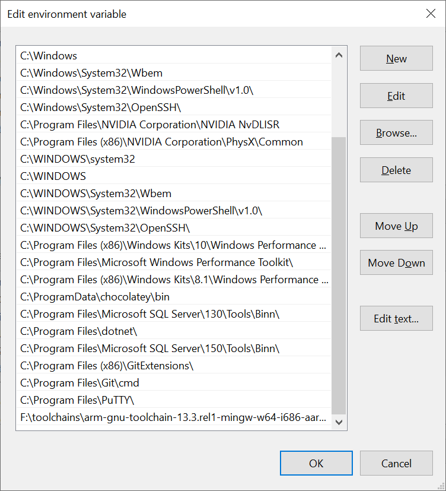
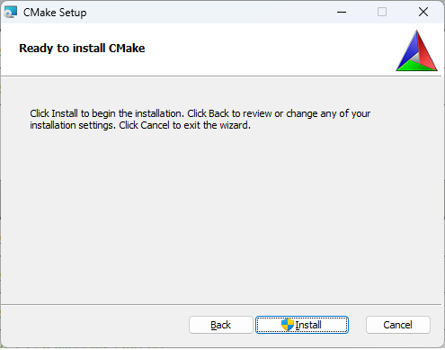

# Setting up for development

If we want to do development for an embedded board, a number of things need to be set up:

- compiler toolchain
- build environment
- development environment (could be a simple text editor up to a full IDE)
- deployment mechanism
- possibility to debug (inside an enumulator or directly on the target)
- configure project for building and debugging

## Compiler toolchain

In order to perform a cross-build (building on one machine to create code that runs on a different target machine), we will need a co-called toolchain.
This is the complete set of compilers, assemblers, linkers, etc. to build binaries for the target platform.

When building for a specific OS, we also need a sysroot, simple said an SDK, that contains all header files and libraries to link with for the specific OS installation.
This requires all libraries needed to build the SW to be present in the sysroot, otherwise we clearly cannot build the SW.
However, since we're going build for baremetal, the only sysroot we'll need is the compiler's set of libraries. So no sysroot is needed.

For the toolchain, we're going to choose the GNU toolchain for ARM64. It is possible to use Clang for this as well, but we'll not cover that here.

The current version as of writing this document is 13.2 rel 1.

### Windows

For building on Windows, download [this version](https://developer.arm.com/-/media/Files/downloads/gnu/13.2.rel1/binrel/arm-gnu-toolchain-13.2.rel1-mingw-w64-i686-aarch64-none-elf.zip?rev=01c03590412e49d495c78b9f979fd21c&hash=BC02BCAA3B72FF2472AAB83ECBE4F27C).
Be careful to use the aarch64 version (64 bit), for target non-elf (baremetal). Using the non-linux-gnu version will enable you ro build against Linux, however that is not what we need.
Best way to do install on Windows is to create a directory with a short path, say `D:\Toolchains`, and place the unzipped files underneath this directory.
Then make sure to add the path to the compiler, etc. to the environment (PATH) at system level, so in this case `D:\Toolchains\arm-gnu-toolchain-13.2.Rel1-mingw-w64-i686-aarch64-none-elf\bin`:


In the lower pane, select Path and click Edit...



Click new and add the directory of the compilers, etc., in this case `D:\Toolchains\arm-gnu-toolchain-13.2.Rel1-mingw-w64-i686-aarch64-none-elf\bin`. Click OK

Click OK again to finalize changing the environment.

To test, open a command line prompt, and execute:
```bat
aarch64-none-elf-gcc --version
```

The command should execute without error, and print the version of the compiler:

```text
aarch64-none-elf-gcc (Arm GNU Toolchain 13.2.rel1 (Build arm-13.7)) 13.2.1 20231009
Copyright (C) 2023 Free Software Foundation, Inc.
This is free software; see the source for copying conditions.  There is NO
warranty; not even for MERCHANTABILITY or FITNESS FOR A PARTICULAR PURPOSE.
```

### Linux

For building on Linux, download [this version](https://developer.arm.com/-/media/Files/downloads/gnu/13.2.rel1/binrel/arm-gnu-toolchain-13.2.rel1-x86_64-aarch64-none-elf.tar.xz?rev=a05df3001fa34105838e6fba79ee1b23&hash=D63F63D13F01626D207019956E7122B5).
Be careful to use the aarch64 version (64 bit), for target non-elf (baremetal). Using the non-linux-gnu version will enable you ro build against Linux, however that is not what we need.

The easiest way to install on Linux is as follows:

```bash
wget https://developer.arm.com/-/media/Files/downloads/gnu/13.2.rel1/binrel/arm-gnu-toolchain-13.2.rel1-x86_64-aarch64-none-elf.tar.xz
sudo mkdir -p /opt/toolchains
tar xvf arm-gnu-toolchain-13.2.rel1-x86_64-aarch64-none-elf.tar.xz
sudo mv arm-gnu-toolchain-13.2.Rel1-x86_64-aarch64-none-elf/ /opt/toolchains/
```

In order to add the path to your environment, edit .bashrc, and add the following line:

```text
export PATH=/opt/toolchains/arm-gnu-toolchain-13.2.Rel1-x86_64-aarch64-none-elf/bin:$PATH
```

To test, open a command line prompt, and execute:
```bat
aarch64-none-elf-gcc --version
```

The command should execute without error, and print the version of the compiler:

```text
aarch64-none-elf-gcc (Arm GNU Toolchain 13.2.rel1 (Build arm-13.7)) 13.2.1 20231009
Copyright (C) 2023 Free Software Foundation, Inc.
This is free software; see the source for copying conditions.  There is NO
warranty; not even for MERCHANTABILITY or FITNESS FOR A PARTICULAR PURPOSE.
```

## Build environment

In order to build, we will be using CMake.

### Windows

When using Visual Studio 2019 or later, there will be a CMake version installed for you. For VS 2019, the location will normally be `C:\Program Files (x86)\Microsoft Visual Studio\2019\Community\Common7\IDE\CommonExtensions\Microsoft\CMake\CMake\bin`.

To test, open a command line prompt, and execute:
```bat
"C:\Program Files (x86)\Microsoft Visual Studio\2019\Community\Common7\IDE\CommonExtensions\Microsoft\CMake\CMake\bin\cmake.exe" --version
```

The command should execute without error, and print the version of the CMake:

```text
cmake version 3.20.21032501-MSVC_2

CMake suite maintained and supported by Kitware (kitware.com/cmake).
```

When not using Visual Studio, install CMake by downloading [here](https://cmake.org/download/#latest), by selecting Windows x64 Installer and install it. This will also give you a more recent version of CMake.
The latest stable release at the moment of writing this document is [3.27.8](https://github.com/Kitware/CMake/releases/download/v3.27.8/cmake-3.27.8-windows-x86_64.msi).


Click Next


Check "I accept the terms in the License Agreement", and click Next


Select "Add CMake to the system PATH for all users" or "Add CMake to the system PATH for the current user"

Click Next


Leave the installation path as is. Click Next



Click Install and approve installation


Click Finish

To test, open a command line prompt, and execute:
```bat
"C:\Program Files\CMake\bin\cmake.exe" --version
```

The command should execute without error, and print the version of the CMake:

```text
cmake version 3.27.8

CMake suite maintained and supported by Kitware (kitware.com/cmake).
```

### Linux

On Linux (Debian), CMake can easily be installed using

```bash
sudo apt update
sudo apt install cmake
```

```text
Reading package lists... Done
Building dependency tree... Done
Reading state information... Done
Suggested packages:
  cmake-doc cmake-format elpa-cmake-mode
The following NEW packages will be installed:
  cmake
0 upgraded, 1 newly installed, 0 to remove and 0 not upgraded.
Need to get 0 B/8,692 kB of archives.
After this operation, 29.6 MB of additional disk space will be used.
Selecting previously unselected package cmake.
(Reading database ... 207262 files and directories currently installed.)
Preparing to unpack .../cmake_3.25.1-1_amd64.deb ...
Unpacking cmake (3.25.1-1) ...
Setting up cmake (3.25.1-1) ...
Processing triggers for man-db (2.11.2-2) ...
```

To test, open a command line prompt, and execute:
```bash
cmake --version
```

The command should execute without error, and print the version of the CMake:

```text
cmake version 3.25.1

CMake suite maintained and supported by Kitware (kitware.com/cmake).
```

## Development environment

As said, the development environment code be as simple as a text editor and running commands on the command prompt.
For Linux, we will use this approach. For Windows however, we will be using Visual Studio. 

### Windows

The current choice for Visual Studio 2019 has to do with the fact that debugging on a remote target (Linux or baremetal) does not work well from within VS, due to a bug.

When installing Visual Studio 2019, at least make sure `Desktop development with C++` is checked as a feature. The feature `Linux development with C++` does not necessarily need to be checked.

Configuration of the project for Visual Studio is described later in [Setting up a project for building and debugging](setting-up-a-project.md).

### Linux

For Linux, the easiest way to build is on the command line. It is possible to use e.g. Visual Studio Code for this as well, but configuration for building and debugging is quite cumbersome, so will not be described here.
Make sure that you editor of choice is installed. Some logical choices may be:

- vi
- vim
- nano
- gedit
- gnome-text-editor

Configuration of the project is described later in [Setting up a project for building and debugging](setting-up-a-project.md).

## Deployment mechanism

In order to deploy a baremetal application, we will need to follow a couple of steps:

- Compile sources and create an application (just a single one, as this is a baremetal system) as a .elf application
- Convert the application into a kernel image
- Place the image onto the target
  - Copy the image onto an SD card and start the system
  - Create a network boot SD card, e.g. using [CircleNetboot](https://github.com/probonopd/CircleNetboot) and start the system. Then go to the website created by the netboot, select an image and upload it. This will reboot the system with your image. __This is my personal preference, as we don't need to rewrite the SD card every time__
  - Run the image within QEMU. QEMU is an emulator that supports multiple platforms, including Raspberry Pi (the default QEMU supports up to rpi3 for now, but there is a [patch](https://github.com/0xMirasio/qemu-patch-raspberry4) (untested for now) to run as rpi4). __It is also possible to use QEMU with Odroid boards, this will be described later__ [Debugging](##Debugging).

Converting the application into an image will be described later. It uses `aarch64-none-elf-objcopy` to convert the .elf file into a .img file.

## Debugging

Debugging is possible in one of two different ways:

- Using QEMU
- Using a FTDI JTAG adapter

Using the JTAG adapter is quite tricky, and currently only supported on Linux. If I find the find, I will add a decsription later.

Using QEMU is quite straightforward. You will need to install QEMU however.

### Windows

There are specific builds of QEMU provided by Stephan Weil, which can be downloaded [here](https://qemu.weilnetz.de/w64/)
The latest version at the moment of writing this document is 8.1.90 (<https://qemu.weilnetz.de/w64/qemu-w64-setup-20231125.exe>).

Simply run the executable, which will install QEMU.


Click OK


Click Next


Click I Agree


Click Next


Leave the installation path as is, click Install


Click Finish

QEMU is now installed in `C:\Program Files\qemu

For testing, I've added a pre-built demo application, which we'll get to later. Copy this to your Linux system, e.g. in your home directory, and in a terminal type:

```bash
"C:\Program Files\qemu\qemu-system-aarch64.exe" -M raspi3b -kernel kernel8.img -serial stdio -s -S
```

The kernel8.img file needs to be in the current location, otherwise point to the correct path. The output should be like:

In the window menu, click on Machine -> Pause to unpause the application (it normally waits for a debugger to attach)

```
Info   00:00:00.000 Baremetal 1.0.0 started on Raspberry Pi 3 Model B (AArch64) (Logger:74)
Info   00:00:00.000 Raspberry Pi 3 Model B (64 bits) 1024 Mb RAM (Main:59)
Info   00:00:00.010 Serial:              0000000000000000 (Main:60)
Info   00:00:00.010 FW revision:         000548E1 (Main:61)
Info   00:00:00.010 Board MAC address:   52:54:00:12:34:57 (Main:65)
Info   00:00:00.020 ARM memory base:     00000000 (Main:66)
Info   00:00:00.020 ARM memory size:     3C000000 (Main:67)
Info   00:00:00.020 VC memory base:      3C000000 (Main:68)
Info   00:00:00.020 VC memory size:      04000000 (Main:69)
Info   00:00:00.030 SoC temperature:     25.000000 (Main:77)
Info   00:00:00.030 Done (Main:84)
Presse r to reboot, h to halt
hHalting...
Debug  00:00:20.050 CPU core 0 halt (System:102)
Debug  00:00:20.050 HaltSystem (System:176)
```

```text
(qemu:20420): Gtk-WARNING **: 17:43:56.753: Could not load a pixbuf from icon theme.
This may indicate that pixbuf loaders or the mime database could not be found.
Info   00:00:00.000 Baremetal 1.0.0 started on Raspberry Pi 3 Model B (AArch64) (Logger:74)
Info   00:00:00.000 Raspberry Pi 3 Model B (64 bits) 1024 Mb RAM (Main:59)
Info   00:00:00.000 Serial:              0000000000000000 (Main:60)
Info   00:00:00.000 FW revision:         000548E1 (Main:61)
Info   00:00:00.010 Board MAC address:   52:54:00:12:34:57 (Main:65)
Info   00:00:00.010 ARM memory base:     00000000 (Main:66)
Info   00:00:00.010 ARM memory size:     3C000000 (Main:67)
Info   00:00:00.010 VC memory base:      3C000000 (Main:68)
Info   00:00:00.010 VC memory size:      04000000 (Main:69)
Info   00:00:00.020 SoC temperature:     25.000000 (Main:77)
Info   00:00:00.020 Done (Main:84)
Presse r to reboot, h to halt
hHalting...
Debug  00:01:53.000 CPU core 0 halt (System:102)
Debug  00:01:53.000 HaltSystem (System:176)
```

### Linux

```bash
sudo apt install qemu-system-arm
```

```text
Reading package lists... Done
Building dependency tree... Done
Reading state information... Done
The following additional packages will be installed:
  ibverbs-providers ipxe-qemu libaio1 libcacard0 libcapstone4 libdaxctl1 libexecs0 libfdt1 libfmt9 libgfapi0 libgfrpc0 libgfxdr0 libglusterfs0 libibverbs1 libiscsi7 libndctl6 libpmem1 librados2 librbd1 librdmacm1 libslirp0
  libspice-server1 libssh-4 liburing2 libusbredirparser1 libvdeplug2 libvirglrenderer1 qemu-block-extra qemu-efi-aarch64 qemu-efi-arm qemu-system-common qemu-system-data qemu-system-gui qemu-utils
Suggested packages:
  samba vde2
The following NEW packages will be installed:
  ibverbs-providers ipxe-qemu libaio1 libcacard0 libcapstone4 libdaxctl1 libexecs0 libfdt1 libfmt9 libgfapi0 libgfrpc0 libgfxdr0 libglusterfs0 libibverbs1 libiscsi7 libndctl6 libpmem1 librados2 librbd1 librdmacm1 libslirp0
  libspice-server1 libssh-4 liburing2 libusbredirparser1 libvdeplug2 libvirglrenderer1 qemu-block-extra qemu-efi-aarch64 qemu-efi-arm qemu-system-arm qemu-system-common qemu-system-data qemu-system-gui qemu-utils
0 upgraded, 35 newly installed, 0 to remove and 0 not upgraded.
Need to get 39.6 MB of archives.
After this operation, 529 MB of additional disk space will be used.
Do you want to continue? [Y/n] y
...
```

For testing, I've added a pre-built demo application, which we'll get to later. Copy this to your Linux system, e.g. in your home directory, and in a terminal type:

```bash
qemu-system-aarch64 -M raspi3b -kernel kernel8.img -serial stdio -s -S
```

The kernel8.img file needs to be in the current location, otherwise point to the correct path. The output should be like:

In the window menu, click on Machine -> Pause to unpause the application (it normally waits for a debugger to attach)

```
Info   00:00:00.000 Baremetal 1.0.0 started on Raspberry Pi 3 Model B (AArch64) (Logger:74)
Info   00:00:00.000 Raspberry Pi 3 Model B (64 bits) 1024 Mb RAM (Main:59)
Info   00:00:00.010 Serial:              0000000000000000 (Main:60)
Info   00:00:00.010 FW revision:         000548E1 (Main:61)
Info   00:00:00.010 Board MAC address:   52:54:00:12:34:57 (Main:65)
Info   00:00:00.020 ARM memory base:     00000000 (Main:66)
Info   00:00:00.020 ARM memory size:     3C000000 (Main:67)
Info   00:00:00.020 VC memory base:      3C000000 (Main:68)
Info   00:00:00.020 VC memory size:      04000000 (Main:69)
Info   00:00:00.030 SoC temperature:     25.000000 (Main:77)
Info   00:00:00.030 Done (Main:84)
Presse r to reboot, h to halt
hHalting...
Debug  00:00:20.050 CPU core 0 halt (System:102)
Debug  00:00:20.050 HaltSystem (System:176)
```
