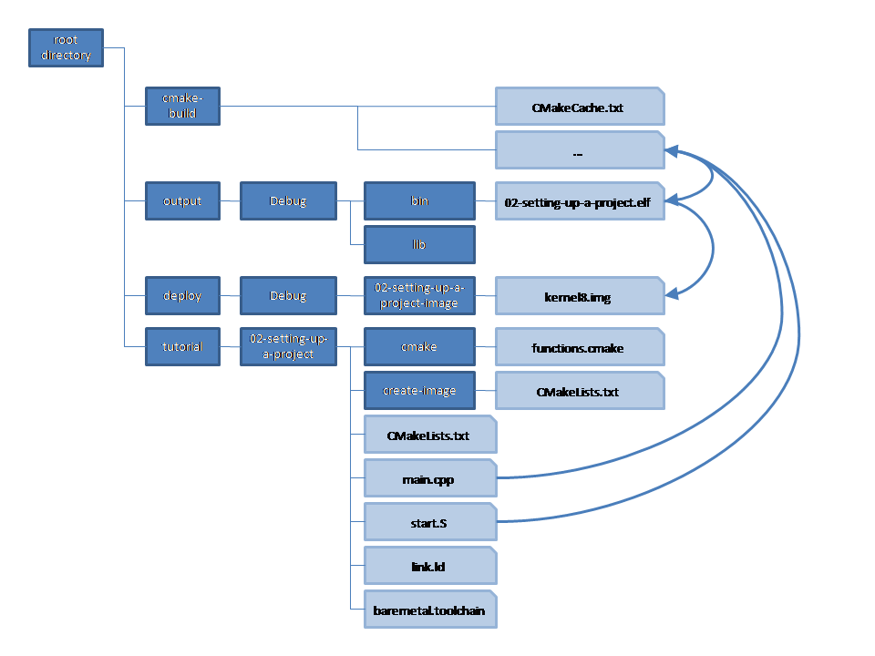
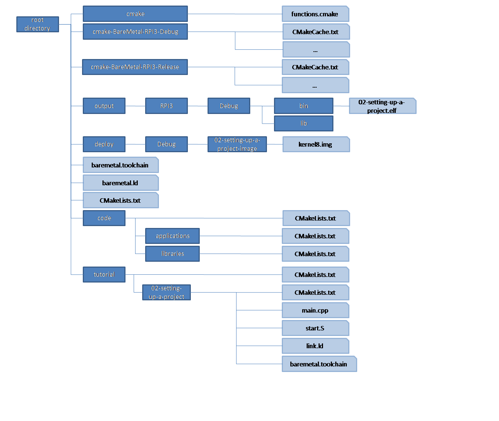

# Setting up project structure

In order to start larger scale development, as well as to use Visual Studio for CMake project development for baremetal platforms, it is wise to set up your project in a certain way.

To understand how to approach this, first a bit of information on how CMake projects are structured, and how Visual Studio integrates CMake projects.

## CMake project structure

When using `CMake`, there is a root `CMakeLists.txt`, that acts as the starting point for `CMake`. Normally, this is at the root directory of your project. In our case, for now, this is in tutorial/00-build.
Each directory that is part of the `CMake` structure, will have a `CMakeLists.txt` file.
When building, we normally build out of tree, as we did before. This means there is a specific directory, we used `cmake-build` before, that is used to store all intermediate files used and generated by CMake. These files could be makefiles generated by CMake, but also contain object files etc.
The third directory tree is the target binary tree, in our case `output`, where all libaries and executables will be stored.
This will normally hold executable files (.exe or .elf for example), as well as dynamic or shared libraries (.dll or .so files).
In our case, we will also store static libraries (.lib or .a) there.
For our specific case, we wish to create kernel images from executables, so we will add a fourth tree named `deploy`.



We will slightly change this structure, to allow for more projects to be built, and also to enable easy integration with Visual Studio.

- First of all, we'll create multiple build directories, e.g. one for debug builds, one for release builds.
- We will move the custom scripting folder to the project root directory
- We will move the toolchain file to the root directory
- We will create a new directory `code` at root level, with subdirectories `applications` and `libraries` underneath which we will add our applications and libraries.
For now, there will be no subdirectories, but we will add `CMakeLists.txt` files in each directory for preparation.
- We will leave the tutorial directory in place, and leave the 00-build directory as is (to ensure we can still build our previous project as before), but will also populate the tutorial directory with `CMakeLists.txt` to prepare for new tutorial projects.
- We will also add a CMakeLists.txt in the root directory



In order to explain how to populate the new structure, let's start setting up a new application named `demo`, which we will later extend.


### Root CMakeLists.txt

The root `CMakeLists.txt` is the starting point for CMake. 
It contains all global definitions and settings, such as the path to the custom CMake scripts, definition of base output directory, and later on also general compiler settings etc.
It is common practice to create a main project in this file, in order for the toolchain to be processed.

For now, we'll start with the following contents:

```cmake
cmake_minimum_required(VERSION 3.18)

message(STATUS "CMake ${CMAKE_VERSION}")

set(SCRIPTS_DIR "" CACHE STRING "CMake scripts path")

if ("${SCRIPTS_DIR}" STREQUAL "")
    set(SCRIPTS_DIR "${CMAKE_SOURCE_DIR}/cmake" CACHE STRING "CMake scripts path" FORCE)
endif()

list(APPEND CMAKE_MODULE_PATH ${SCRIPTS_DIR})

if("${CMAKE_BUILD_TYPE}" STREQUAL "")
    set(CMAKE_BUILD_TYPE Debug)
endif()
if(${CMAKE_BUILD_TYPE} STREQUAL "Debug")
    set(CONFIG_DIR Debug)
elseif(
    ${CMAKE_BUILD_TYPE} STREQUAL "Release" OR
    ${CMAKE_BUILD_TYPE} STREQUAL "MinSizeRel" OR 
    ${CMAKE_BUILD_TYPE} STREQUAL "RelWithDebInfo")
        set(CONFIG_DIR Release)
else()
    message(FATAL_ERROR "Invalid build type: " ${CMAKE_BUILD_TYPE})
endif()

set(DEPLOYMENT_DIR "${CMAKE_SOURCE_DIR}/deploy" CACHE STRING "Deployment directory")
set(OUTPUT_BASE_DIR "${CMAKE_SOURCE_DIR}/output" CACHE STRING "Output directory")
set(OUTPUT_BIN_DIR "${OUTPUT_BASE_DIR}/${CONFIG_DIR}/bin")
set(OUTPUT_LIB_DIR "${OUTPUT_BASE_DIR}/${CONFIG_DIR}/lib")

project(baremetal
    DESCRIPTION "Baremetal overall project")

add_subdirectory(code)

```

Explanation:
- As before we start with the minimum CMake version required
- We then print the current CMake version
- We define a cached variables for the script path, and set it to the cmake scripts directory. We then add this path to the `CMAKE_MODULE_PATH`.
- Different is the way we defined the directory for the build configuration. 
We set the `CMAKE_BUILD_TYPE` to Debug if it is not set, and then depending on the build configuration set the directory to either Debug (for Debug) or Release (for Release, MinSizeRel or RelWithDebInfo).
- We then define the variables for the common deployment directory `DEPLOYMENT_DIR` (for image files) and the common output directory OUTPUT_BASE_DIR` (for built libraries and executables). Both variables will also be stored in the cache.
- New is that we define two variable to hold the output library path `OUTPUT_LIB_DIR` and output executable path `OUTPUT_BIN_DIR`.
- Lastly, we include the `CMakeList.txt` file in the code directory.

### Intermediate directory CMakeLists.txt

The CMakeLists.txt files in the code, applications, and libraries directories simply print the current path, and then include the next level `CMakeLists.txt` files:

code:
```cmake
message(STATUS "\n**********************************************************************************\n")
message(STATUS "\n## In directory: ${CMAKE_CURRENT_SOURCE_DIR}")

add_subdirectory(applications)
add_subdirectory(libraries)
```

code/applications:
```cmake
message(STATUS "\n**********************************************************************************\n")
message(STATUS "\n## In directory: ${CMAKE_CURRENT_SOURCE_DIR}")

add_subdirectory(demo)
```

code/libraries:
```cmake
message(STATUS "\n**********************************************************************************\n")
message(STATUS "\n## In directory: ${CMAKE_CURRENT_SOURCE_DIR}")

```

In the end the demo project `CMakeLists.txt` file is included, which is a normal project file.

### Project CMakeLists.txt

The `CMakeLists.txt` file in `code/applications/demo` defines our application:

```cmake
project(demo
    DESCRIPTION "Demo application"
    LANGUAGES CXX ASM)

message(STATUS "\n**********************************************************************************\n")
message(STATUS "\n## In directory: ${CMAKE_CURRENT_SOURCE_DIR}")

message("\n** Setting up ${PROJECT_NAME} **\n")

include(functions)

set(PROJECT_TARGET_NAME ${PROJECT_NAME}.elf)

set(PROJECT_COMPILE_DEFINITIONS_CXX_PRIVATE )
set(PROJECT_COMPILE_DEFINITIONS_CXX_PUBLIC )

set(PROJECT_COMPILE_OPTIONS_CXX_PRIVATE
    -Wall -O2 -ffreestanding -nostdinc -nostdlib -nostartfiles
    )
set(PROJECT_COMPILE_OPTIONS_CXX_PUBLIC )

set(PROJECT_INCLUDE_DIRS_PRIVATE )
set(PROJECT_INCLUDE_DIRS_PUBLIC )

set(PROJECT_LINK_OPTIONS ${CMAKE_EXE_LINKER_FLAGS} -nostdlib -nostartfiles -T ${CMAKE_CURRENT_SOURCE_DIR}/link.ld)

set(PROJECT_DEPENDENCIES )

set(PROJECT_LIBS
    ${PROJECT_DEPENDENCIES}
    )
set(PROJECT_SOURCES
    ${CMAKE_CURRENT_SOURCE_DIR}/src/main.cpp
    )

set(PROJECT_INCLUDES_PUBLIC )
set(PROJECT_INCLUDES_PRIVATE )

if (CMAKE_HOST_UNIX)
    set(START_GROUP -Wl,--start-group)
    set(END_GROUP -Wl,--end-group)
endif()

add_executable(${PROJECT_NAME} ${PROJECT_SOURCES} ${PROJECT_INCLUDES_PUBLIC} ${PROJECT_INCLUDES_PRIVATE})

target_link_libraries(${PROJECT_NAME} ${START_GROUP} ${PROJECT_LIBS} ${END_GROUP})
target_include_directories(${PROJECT_NAME} PRIVATE ${PROJECT_INCLUDE_DIRS_PRIVATE})
target_include_directories(${PROJECT_NAME} PUBLIC  ${PROJECT_INCLUDE_DIRS_PUBLIC})
target_compile_definitions(${PROJECT_NAME} PRIVATE ${PROJECT_COMPILE_DEFINITIONS_CXX_PRIVATE})
target_compile_definitions(${PROJECT_NAME} PUBLIC  ${PROJECT_COMPILE_DEFINITIONS_CXX_PUBLIC})
target_compile_options(${PROJECT_NAME} PRIVATE ${PROJECT_COMPILE_OPTIONS_CXX_PRIVATE})
target_compile_options(${PROJECT_NAME} PUBLIC  ${PROJECT_COMPILE_OPTIONS_CXX_PUBLIC})

list_to_string(PROJECT_LINK_OPTIONS PROJECT_LINK_OPTIONS_STRING)
if (NOT "${PROJECT_LINK_OPTIONS_STRING}" STREQUAL "")
    set_target_properties(${PROJECT_NAME} PROPERTIES LINK_FLAGS "${PROJECT_LINK_OPTIONS_STRING}")
endif()
set_target_properties(${PROJECT_NAME} PROPERTIES OUTPUT_NAME ${PROJECT_TARGET_NAME})
set_target_properties(${PROJECT_NAME} PROPERTIES ARCHIVE_OUTPUT_DIRECTORY ${OUTPUT_LIB_DIR})
set_target_properties(${PROJECT_NAME} PROPERTIES RUNTIME_OUTPUT_DIRECTORY ${OUTPUT_BIN_DIR})

add_subdirectory(create-image)
```

As you can see, it does pretty much the same as the second part in our 00-build project.

- It defines the project, in this case `demo`. Notice that here we specify both C++ and assembly as source languages.
- We print the current directory, and also which project we're going to configure.
- Then we again specift the project target file, the compiler definitions, compiler options, include directories, and linker options.
- We specify which libraries we depend upon, and which libraries we link to.
- We then specify which source and header files are used for this application. Notice that the main.cpp is now in the src subdirectory. This keeps project files and source files separated.
- We define the executable, which files are used to build it, which libraries it links to, which include directories it used, while compiler definitions and options, we again use th same trick to specify the linker options, and then specify the executable name and directories.
- Notice that the directories now use the new variables `OUTPUT_LIB_DIR` and `OUTPUT_BIN_DIR`.
- And finally we include the `CMakeLists.txt` for the image creation project.

The `CMakeLists.txt` file in `code/applications/demo/createimage` defines the project to create the image:

```cmake
project(demo-image
    DESCRIPTION "Kernel image for demo RPI 64 bit bare metal")

message(STATUS "\n**********************************************************************************\n")
message(STATUS "\n## In directory: ${CMAKE_CURRENT_SOURCE_DIR}")

message("\n** Setting up ${PROJECT_NAME} **\n")

set(BAREMETAL_TARGET_KERNEL kernel8)
set(DEPENDENCY demo)
set(IMAGE_NAME ${BAREMETAL_TARGET_KERNEL}.img)

create_image(${PROJECT_NAME} ${IMAGE_NAME} ${DEPENDENCY})
```

Again this is very much like what we saw for `tutorial/00-build/create-image`. The only different is the dependency and the project name.

### Building

As now we have a common structure, it may be helpful to create some scripts to help us build.

#### Configuring CMake

We will create a script for Windows and for Linux to configure the build. They will be placed in the tools directory underneath the root directory:

##### Windows

tools/configure.bat:
```bat
@echo off
rmdir /s /q cmake-build
mkdir cmake-build
pushd cmake-build

cmake .. -G Ninja -DCMAKE_BUILD_TYPE:STRING="Debug" -DCMAKE_TOOLCHAIN_FILE:FILEPATH=../baremetal.toolchain

popd
```

Running the script:
```bat
tools\configure.bat
```

```text
-- CMake 3.27.8
-- TOOLCHAIN_ROOT           D:\toolchains\arm-gnu-toolchain-13.2.rel1-mingw-w64-i686-aarch64-none-elf
-- Processor                aarch64
-- Platform tuple           aarch64-none-elf
-- Assembler
-- C compiler               D:/toolchains/arm-gnu-toolchain-13.2.rel1-mingw-w64-i686-aarch64-none-elf/bin/aarch64-none-elf-gcc.exe
-- C++ compiler             D:/toolchains/arm-gnu-toolchain-13.2.rel1-mingw-w64-i686-aarch64-none-elf/bin/aarch64-none-elf-g++.exe
-- Archiver                 D:/toolchains/arm-gnu-toolchain-13.2.rel1-mingw-w64-i686-aarch64-none-elf/bin/aarch64-none-elf-ar.exe
-- Linker                   D:/toolchains/arm-gnu-toolchain-13.2.rel1-mingw-w64-i686-aarch64-none-elf/bin/aarch64-none-elf-ld.exe
-- ObjCopy                  D:/toolchains/arm-gnu-toolchain-13.2.rel1-mingw-w64-i686-aarch64-none-elf/bin/aarch64-none-elf-objcopy.exe
-- Std include path         D:\toolchains\arm-gnu-toolchain-13.2.rel1-mingw-w64-i686-aarch64-none-elf/lib/gcc/aarch64-none-elf/13.2.1/include
-- CMAKE_EXE_LINKER_FLAGS=
-- Adding to CMAKE_EXE_LINKER_FLAGS -LD:\toolchains\arm-gnu-toolchain-13.2.rel1-mingw-w64-i686-aarch64-none-elf/lib/gcc/aarch64-none-elf/13.2.1
-- TOOLCHAIN_ROOT           D:\toolchains\arm-gnu-toolchain-13.2.rel1-mingw-w64-i686-aarch64-none-elf
-- Processor                aarch64
-- Platform tuple           aarch64-none-elf
-- Assembler
-- C compiler               D:/toolchains/arm-gnu-toolchain-13.2.rel1-mingw-w64-i686-aarch64-none-elf/bin/aarch64-none-elf-gcc.exe
-- C++ compiler             D:/toolchains/arm-gnu-toolchain-13.2.rel1-mingw-w64-i686-aarch64-none-elf/bin/aarch64-none-elf-g++.exe
-- Archiver                 D:/toolchains/arm-gnu-toolchain-13.2.rel1-mingw-w64-i686-aarch64-none-elf/bin/aarch64-none-elf-ar.exe
-- Linker                   D:/toolchains/arm-gnu-toolchain-13.2.rel1-mingw-w64-i686-aarch64-none-elf/bin/aarch64-none-elf-ld.exe
-- ObjCopy                  D:/toolchains/arm-gnu-toolchain-13.2.rel1-mingw-w64-i686-aarch64-none-elf/bin/aarch64-none-elf-objcopy.exe
-- Std include path         D:\toolchains\arm-gnu-toolchain-13.2.rel1-mingw-w64-i686-aarch64-none-elf/lib/gcc/aarch64-none-elf/13.2.1/include
-- CMAKE_EXE_LINKER_FLAGS=   -LD:\toolchains\arm-gnu-toolchain-13.2.rel1-mingw-w64-i686-aarch64-none-elf/lib/gcc/aarch64-none-elf/13.2.1
-- The C compiler identification is GNU 13.2.1
-- The CXX compiler identification is GNU 13.2.1
--
**********************************************************************************

--
## In directory: D:/Projects/baremetal.github/code
--
**********************************************************************************

--
## In directory: D:/Projects/baremetal.github/code/applications
-- The ASM compiler identification is GNU
-- Found assembler: D:/Toolchains/arm-gnu-toolchain-13.2.Rel1-mingw-w64-i686-aarch64-none-elf/bin/aarch64-none-elf-gcc.exe
--
**********************************************************************************

--
## In directory: D:/Projects/baremetal.github/code/applications/demo

** Setting up demo **

--
**********************************************************************************

--
## In directory: D:/Projects/baremetal.github/code/applications/demo/create-image

** Setting up demo-image **

-- create_image demo-image kernel8.img demo
-- TARGET_NAME demo.elf
-- generate D:/Projects/baremetal.github/deploy/Debug/demo-image/kernel8.img from D:/Projects/baremetal.github/output/Debug/bin/demo
--
**********************************************************************************

--
## In directory: D:/Projects/baremetal.github/code/libraries
-- Configuring done (1.0s)
-- Generating done (0.0s)
-- Build files have been written to: D:/Projects/baremetal.github/cmake-build
```

##### Linux

tools/configure.sh:
```bash
rm -rf cmake-build/
mkdir cmake-build
pushd cmake-build

cmake .. -G Ninja -DCMAKE_BUILD_TYPE:STRING="Debug" -DCMAKE_TOOLCHAIN_FILE:FILEPATH=../baremetal.toolchain

popd
```

Running the script:
```bat
tools/configure.sh
```

```text
~/repo/baremetal.github/cmake-build ~/repo/baremetal.github
-- CMake 3.25.1
-- TOOLCHAIN_ROOT           /opt/toolchains/arm-gnu-toolchain-13.2.Rel1-x86_64-aarch64-none-elf
-- Processor                aarch64
-- Platform tuple           aarch64-none-elf
-- Assembler
-- C compiler               /opt/toolchains/arm-gnu-toolchain-13.2.Rel1-x86_64-aarch64-none-elf/bin/aarch64-none-elf-gcc
-- C++ compiler             /opt/toolchains/arm-gnu-toolchain-13.2.Rel1-x86_64-aarch64-none-elf/bin/aarch64-none-elf-g++
-- Archiver                 /opt/toolchains/arm-gnu-toolchain-13.2.Rel1-x86_64-aarch64-none-elf/bin/aarch64-none-elf-ar
-- Linker                   /opt/toolchains/arm-gnu-toolchain-13.2.Rel1-x86_64-aarch64-none-elf/bin/aarch64-none-elf-ld
-- ObjCopy                  /opt/toolchains/arm-gnu-toolchain-13.2.Rel1-x86_64-aarch64-none-elf/bin/aarch64-none-elf-objcopy
-- Std include path         /opt/toolchains/arm-gnu-toolchain-13.2.Rel1-x86_64-aarch64-none-elf/lib/gcc/aarch64-none-elf/13.2.1/include
-- CMAKE_EXE_LINKER_FLAGS=
-- Adding to CMAKE_EXE_LINKER_FLAGS -L/opt/toolchains/arm-gnu-toolchain-13.2.Rel1-x86_64-aarch64-none-elf/lib/gcc/aarch64-none-elf/13.2.1
-- TOOLCHAIN_ROOT           /opt/toolchains/arm-gnu-toolchain-13.2.Rel1-x86_64-aarch64-none-elf
-- Processor                aarch64
-- Platform tuple           aarch64-none-elf
-- Assembler
-- C compiler               /opt/toolchains/arm-gnu-toolchain-13.2.Rel1-x86_64-aarch64-none-elf/bin/aarch64-none-elf-gcc
-- C++ compiler             /opt/toolchains/arm-gnu-toolchain-13.2.Rel1-x86_64-aarch64-none-elf/bin/aarch64-none-elf-g++
-- Archiver                 /opt/toolchains/arm-gnu-toolchain-13.2.Rel1-x86_64-aarch64-none-elf/bin/aarch64-none-elf-ar
-- Linker                   /opt/toolchains/arm-gnu-toolchain-13.2.Rel1-x86_64-aarch64-none-elf/bin/aarch64-none-elf-ld
-- ObjCopy                  /opt/toolchains/arm-gnu-toolchain-13.2.Rel1-x86_64-aarch64-none-elf/bin/aarch64-none-elf-objcopy
-- Std include path         /opt/toolchains/arm-gnu-toolchain-13.2.Rel1-x86_64-aarch64-none-elf/lib/gcc/aarch64-none-elf/13.2.1/include
-- CMAKE_EXE_LINKER_FLAGS=   -L/opt/toolchains/arm-gnu-toolchain-13.2.Rel1-x86_64-aarch64-none-elf/lib/gcc/aarch64-none-elf/13.2.1
-- The C compiler identification is GNU 13.2.1
-- The CXX compiler identification is GNU 13.2.1
--
**********************************************************************************

--
## In directory: /home/rene/repo/baremetal.github/code
--
**********************************************************************************

--
## In directory: /home/rene/repo/baremetal.github/code/applications
-- The ASM compiler identification is GNU
-- Found assembler: /opt/toolchains/arm-gnu-toolchain-13.2.Rel1-x86_64-aarch64-none-elf/bin/aarch64-none-elf-gcc
--
**********************************************************************************

--
## In directory: /home/rene/repo/baremetal.github/code/applications/demo

** Setting up demo **

--
**********************************************************************************

--
## In directory: /home/rene/repo/baremetal.github/code/applications/demo/create-image

** Setting up demo-image **

-- create_image demo-image kernel8.img demo
-- TARGET_NAME demo.elf
-- generate /home/rene/repo/baremetal.github/deploy/Debug/demo-image/kernel8.img from /home/rene/repo/baremetal.github/output/Debug/bin/demo
--
**********************************************************************************

--
## In directory: /home/rene/repo/baremetal.github/code/libraries
-- Configuring done
-- Generating done
-- Build files have been written to: /home/rene/repo/baremetal.github/cmake-build
~/repo/baremetal.github
```

#### Building a specific target

##### Windows

tools/build-target.bat
```bat
cmake --build cmake-build --target %1
```

##### Linux

tools/build-target.sh
```bash
cmake --build cmake-build --target $1
```

#### Building a specific image

##### Windows

tools/build-image.bat
```bat
cmake --build cmake-build --target %1-image
```

##### Linux

tools/build-image.sh
```bash
cmake --build cmake-build --target $1-image
```

#### Building all targets

##### Windows

tools/build-all.bat
```bat
cmake --build cmake-build
```

Running the build:
```bat
tools\build-all.bat
```

```text
[3/3] Generating D:/Projects/baremetal.github/deploy/Debug/demo-image/kernel8.img
```

##### Linux

tools/build-all.sh
```bash
cmake --build cmake-build
```

Running the build:
```bash
tools/build-all.sh
```

```text
[3/3] Generating /home/rene/repo/baremetal.github/deploy/Debug/demo-image/kernel8.img
```

#### Starting QEMU

##### Windows

Start QEMU listening to UART0

tools/startQEMU-image-uart0.bat
```bat
call build-target %1
"c:\Program Files\qemu\qemu-system-aarch64.exe" -M raspi3b -kernel %CD%\deploy\Debug\%1-image\kernel8.img -serial stdio -s -S
```

Start QEMU listening to UART1

tools/startQEMU-image-uart1.bat
```bat
call build-target %1
"c:\Program Files\qemu\qemu-system-aarch64.exe" -M raspi3b -kernel %CD%\deploy\Debug\%1-image\kernel8.img -serial null -serial stdio -s -S
```

Explanation:
- We start QEMU here to emulate Raspberry Pi 3B
- We use the specified image for the kernel. 
- We either listen to the first serial or the second (the first is then set to null).
- We start a gdb server at port 1234
- We do not start the system immediately, but let it wait for gdb.

When starting QEMU on UART0:
```bat
tools\startQEMU-image-uart0.bat demo
```

```text
"c:\Program Files\qemu\qemu-system-aarch64.exe" -M raspi3b -kernel D:\Projects\baremetal.github\deploy\Debug\demo-image\kernel8.img -serial stdio -s -S

(qemu:9828): Gtk-WARNING **: 22:22:56.966: Could not load a pixbuf from icon theme.
This may indicate that pixbuf loaders or the mime database could not be found.
```

##### Linux

Start QEMU listening to UART0

tools/startQEMU-image-uart0.sh
```bash
rootdir=`pwd`
echo rootdir=$rootdir
$rootdir/tools/build-target.sh $1
qemu-system-aarch64 -M raspi3b -kernel $rootdir/deploy/Debug/$1-image/kernel8.img -serial stdio -s -S
```

Start QEMU listening to UART1

tools/startQEMU-image-uart1.sh
```bash
rootdir=`pwd`
echo rootdir=$rootdir
$rootdir/tools/build-target.sh $1
qemu-system-aarch64 -M raspi3b -kernel $rootdir/deploy/Debug/$1-image/kernel8.img -serial null -serial stdio -s -S
```

Explanation:
- We start QEMU here to emulate Raspberry Pi 3B
- We use the specified image for the kernel. 
- We either listen to the first serial or the second (the first is then set to null).
- We start a gdb server at port 1234
- We do not start the system immediately, but let it wait for gdb.

When starting QEMU on UART0:
```bash
tools/startQEMU-image-uart0.sh
```

```text
rootdir=/home/rene/repo/baremetal.github
```

#### Starting GDB

When starting GDB, we need a way to specify GDB to connect to our QEMU gdb server. We do that using a command file:

tools/gdb-commands.txt
```text
target remote localhost:1234
```

##### Windows

tools/startgdb.bat
```bat
D:\Toolchains\arm-gnu-toolchain-13.2.Rel1-mingw-w64-i686-aarch64-none-elf\bin\aarch64-none-elf-gdb.exe -x %CD%\tools\gdb-commands.txt -symbols=%CD%\output\Debug\bin\%1.elf
```

We specify the command file, and also the symbol file to load

Starting GDB:
```bat
tools\startgdb.bat demo
```

```text
D:\Toolchains\arm-gnu-toolchain-13.2.Rel1-mingw-w64-i686-aarch64-none-elf\bin\aarch64-none-elf-gdb.exe -x D:\Projects\baremetal.github\tools\commands.txt -symbols=D:\Projects\baremetal.github\output\Debug\bin\demo.elf
GNU gdb (Arm GNU Toolchain 13.2.rel1 (Build arm-13.7)) 13.2.90.20231008-git
Copyright (C) 2023 Free Software Foundation, Inc.
License GPLv3+: GNU GPL version 3 or later <http://gnu.org/licenses/gpl.html>
This is free software: you are free to change and redistribute it.
There is NO WARRANTY, to the extent permitted by law.
Type "show copying" and "show warranty" for details.
This GDB was configured as "--host=i686-w64-mingw32 --target=aarch64-none-elf".
Type "show configuration" for configuration details.
For bug reporting instructions, please see:
<https://bugs.linaro.org/>.
Find the GDB manual and other documentation resources online at:
    <http://www.gnu.org/software/gdb/documentation/>.

For help, type "help".
Type "apropos word" to search for commands related to "word"...
Reading symbols from D:\Projects\baremetal.github\output\Debug\bin\demo.elf...
warning: No executable has been specified and target does not support
determining executable automatically.  Try using the "file" command.
0x0000000000000000 in ?? ()
```

##### Linux

tools/startgdb.sh
```bash
rootdir=`pwd`
gdb-multiarch -x $rootdir/tools/gdb-commands.txt -symbols=$rootdir/output/Debug/bin/$1.elf
```

We specify the command file, and also the symbol file to load

Starting GDB:
```bat
tools/startgdb.sh demo
```

```text
GNU gdb (Debian 13.1-3) 13.1
Copyright (C) 2023 Free Software Foundation, Inc.
License GPLv3+: GNU GPL version 3 or later <http://gnu.org/licenses/gpl.html>
This is free software: you are free to change and redistribute it.
There is NO WARRANTY, to the extent permitted by law.
Type "show copying" and "show warranty" for details.
This GDB was configured as "x86_64-linux-gnu".
Type "show configuration" for configuration details.
For bug reporting instructions, please see:
<https://www.gnu.org/software/gdb/bugs/>.
Find the GDB manual and other documentation resources online at:
    <http://www.gnu.org/software/gdb/documentation/>.

For help, type "help".
Type "apropos word" to search for commands related to "word"...
Reading symbols from /home/rene/repo/baremetal.github/output/Debug/bin/demo.elf...
warning: No executable has been specified and target does not support
determining executable automatically.  Try using the "file" command.
0x0000000000000000 in ?? ()
```

## Visual Studio CMake integration

