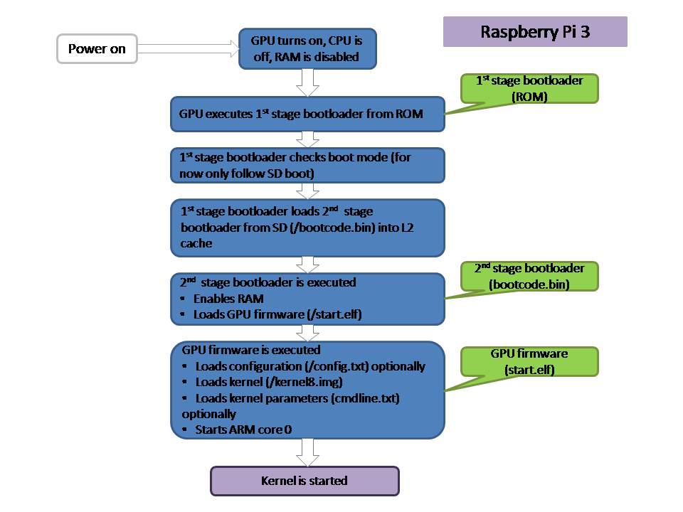
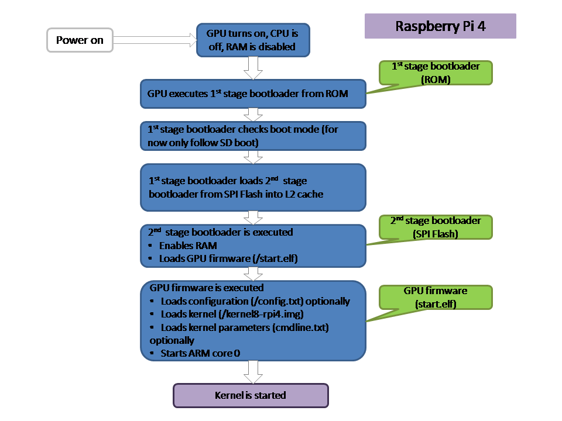

# System startup {#SYSTEM_STARTUP}

## Boot sequence for Raspberry Pi 3 {#SYSTEM_STARTUP_BOOT_SEQUENCE_FOR_RASPBERRY_PI_3}

See also [Boot sequence](https://www.raspberrypi.com/documentation/computers/raspberry-pi.html#boot-sequence)



__Raspberry Pi 3 boot sequence__

1. Raspberry Pi starts up in the GPU. At this point, RAM is disabled, and the CPU is off
2. The GPU runs startup code from ROM (inside SoC) and executes first stage bootloader
3. First stage bootloader check for boot modes (GPIO, SD, Flash, SPI, USB)
4. If GPIO boot enabled check GPIO pins for boot mode enable
5. If SD boot enabled, load `bootcode.bin` from the first SD card into level 2 cache, start second stage boot loader if possible
6. If SD boot enabled, load `bootcode.bin` from the second SD card into level 2 cache, start second stage boot loader if possible
7. If NAND / Flash boot enabled, load second stage bootloader from flash into level 2 cache, start second stage boot loader if possible
8. If SPI boot enabled, try to boot from SPI
9. If USB boot enabled, try to boot from a mass storage device, for each mass storage device, try to load `bootcode.bin`
10. If network boot enabled (through USB boot), try to boot from a mass storage of LAN951X (ethernet) device, for each device, try to perform DHCP / TFTP boot
11. The first stage bootloader loads `bootcode.bin` from the SD card and loads it into level 2 cache
12. Second stage bootloader is executed
13. Second stage bootloader loads the GPU firmware from `start.elf`
14. GPU firmware is executed
15. GPU firmware loads configuration parameters (optional) from `config.txt`, kernel image from `kernelxx.img` and kernel parameters from `cmdline.txt`.
16. The CPU is started and boots the kernel

Be aware that a large part of the bootup is performed by the GPU (bootcode.bin, start.elf), which has different assembly code than the CPU.

## Boot sequence for Raspberry Pi 4 / 5 {#SYSTEM_STARTUP_BOOT_SEQUENCE_FOR_RASPBERRY_PI_4__5}

See also [Boot flow](https://www.raspberrypi.com/documentation/computers/raspberry-pi.html#raspberry-pi-4-boot-flow)



__Raspberry Pi 4 boot sequence__


__Raspberry Pi 5 boot sequence__

1. Raspberry Pi starts up in the GPU. At this point, RAM is disabled, and the CPU is off
2. The GPU runs startup code from ROM (inside SoC) and executes first stage bootloader
3. First stage bootloader check for boot modes (GPIO, SD, Flash, SPI, USB)
4. If GPIO boot enabled check GPIO pins for boot mode enable
5. If SD boot enabled, load `recovery.bin` from the SD card into level 2 cache, and reflash the SPI flash
6. Load second stage bootloader from SPI flash, start second stage boot loader if possible
7. Try to load `recovery.bin` from USB boot device, and reflash the SPI flash
8. Initialize clocks and RAM
9. Read EEPROM configuration file
10. If PM_RSTS in configurations signals power off or wake on GPIO, sleep. This will wake us with a falling edge on GPIO (RPI 4) or the power button (RPI 5)
11. Check all boot modes in boot order configuration
    1. If Restart restart boot mode enumeration
    2. If Stop display error and wait forever
    3. If SD then load GPU firmware from `start.elf` from device, and start GPU firmware if possible
    4. If Network then load GPU firmware form `start.elf` from TFTP server, and start GPU firmware if possible
    5. If USB Master Storage Device then load GPU firmware form `start.elf` from device, and start GPU firmware if possible
    6. If NVME then load GPU firmware form `start.elf` from device, and start GPU firmware if possible
    4. If RPIBoot then boot from USB OTG boot
12. GPU firmware is executed
13. GPU firmware loads configuration parameters (optional) from `config.txt`, kernel image from `kernelxx.img` and kernel parameters from `cmdline.txt`.
14. The CPU is started and boots the kernel

For RPI 5, the GPU firmware is embedded into the kernel image, so the kernel image is loaded directly.

## config.txt {#SYSTEM_STARTUP_CONFIGTXT}

For 64 bit systems, the minimal contents of config.txt are similar to:

```text
#
# Enable 64-bit mode (AArch64)
#
# This file must be copied along with the generated kernel8[-rpi4].img
# onto a SDHC card with FAT file system, if 64-bit mode is used.
#
# This file also enables the possibility to use two displays with
# the Raspberry Pi 4 and selects the required mode for the USB host
# controller of the Compute Module 4.
#

arm_64bit=1

[pi02]
kernel=kernel8.img

[pi2]
kernel=kernel8.img

[pi3]
kernel=kernel8.img

[pi3+]
kernel=kernel8.img

[pi4]
armstub=armstub8-rpi4.bin
kernel=kernel8-rpi4.img
max_framebuffers=2

[cm4]
otg_mode=1
```

This does not yet contain the entries for RPI 5 (which would use `kernel__2712.img`)

kernel8.img is the default kernel to start for normal 64 bit Linux distributions.

For bare metal, the defaults are as follows:

| Board  | Architecture     | Image            |
|--------|------------------|------------------|
| RPI 1  | 32 bit (Arm)     | kernel.img       |
| RPI 2  | 32 bit (Arm)     | kernel7.img      |
| RPI 3  | 32 bit (Arm)     | kernel8-32.img   |
| RPI 3  | 64 bit (AArch64) | kernel8.img      |
| RPI 4  | 32 bit (Arm)     | kernel7l.img     |
| RPI 4  | 64 bit (AArch64) | kernel8-rpi4.img |
| RPI 5  | 64 bit (AArch64) | kernel_2712.img  |

Once the image is loaded, the GPU resets the ARM, which then starts executing. The start address depends on the architecture:

### CPU execution start address {#SYSTEM_STARTUP_CONFIGTXT_CPU_EXECUTION_START_ADDRESS}

| Architecture     | Start address |
|------------------|---------------|
| 32 bit (Arm)     | 0x8000        |
| 64 bit (AArch64) | 0x80000       |

This is due to the GPU placing a jump opcode at address 0x0000, which is the initial starting point.

Every code will use a defined starting address, which is loaded into memory at specific locations.
For Core 0, this is done by the firmware, for the other cores, we need to program the correct starting address in memory.

| Core | Start address location |
|------|------------------------|
| 0    | 000000D8               |
| 1    | 000000E0               |
| 2    | 000000E8               |
| 3    | 000000F0               |
